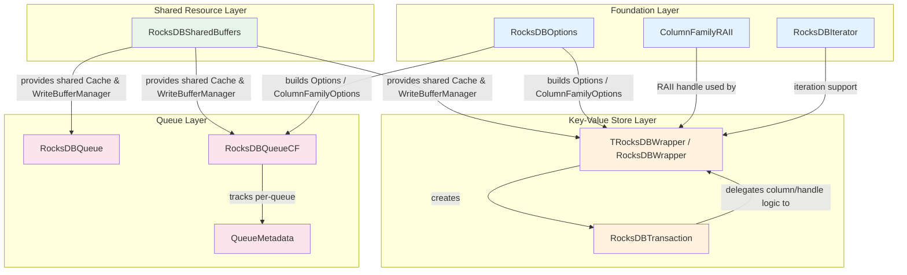
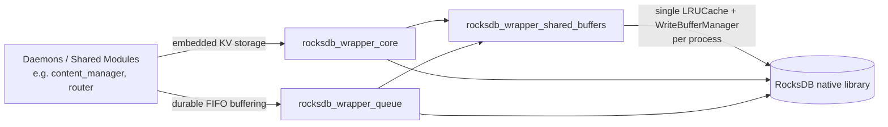

# RocksDB Wrapper Module

## 1. Purpose

The **RocksDB Wrapper** module is a C++ utility layer, part of the [Shared Modules Infrastructure](Shared_Modules_Infrastructure_(C++).md), that encapsulates all direct interaction with the [RocksDB](https://rocksdb.org/) embedded key-value store used throughout the Wazuh code base.

Its goals are to:

- Hide the verbosity and error-handling complexity of the native RocksDB C++ API behind a small, ergonomic surface (`put`, `get`, `delete_`, `seek`, transactions, column families).
- Provide **safe RAII semantics** for RocksDB resources (database handles, column family handles, transactions) so that callers cannot leak native pointers or forget to clean them up.
- Offer ready-to-use **persistent queue** abstractions (single-queue and multi-queue/column-family based) built on top of the key-value store, used wherever a durable FIFO structure is required (e.g., outbound message buffering).
- Allow multiple independent RocksDB instances in the same process to **share memory budgets** (write buffers and block cache) instead of each instance allocating its own, which would waste memory in daemons that open many small databases.

This module does not implement business logic; it is a low-level storage building block consumed by higher-level modules such as [content_manager](content_manager.md), [router](router.md), and other persistence-oriented components across the shared modules and Wazuh daemons that need embedded, crash-resilient local storage. It plays a role similar to [sqlite_wrapper](sqlite_wrapper.md) but is optimized for high-throughput key-value / queue-like access patterns rather than relational queries.

## 2. Architecture Overview

The module is composed of seven header files, each with a focused responsibility. They build on each other as follows:



### Consumer view



## 3. Sub-modules

This module is documented in three focused sub-module pages, grouped by responsibility:

| Sub-module | Description | Documentation |
|---|---|---|
| **Core Wrapper** | The main `TRocksDBWrapper`/`RocksDBWrapper` key-value API, transaction support (`RocksDBTransaction`), column-family RAII management (`ColumnFamilyRAII`), database tuning (`RocksDBOptions`), and prefix iteration (`RocksDBIterator`). | [rocksdb_wrapper_core.md](rocksdb_wrapper_core.md) |
| **Queue Abstractions** | Durable, RocksDB-backed FIFO queue implementations: the single-queue `RocksDBQueue` and the multi-queue, column-family-per-id `RocksDBQueueCF` (with its `QueueMetadata` bookkeeping struct). | [rocksdb_wrapper_queue.md](rocksdb_wrapper_queue.md) |
| **Shared Resource Management** | The `RocksDBSharedBuffers` singleton that centralizes the RocksDB `Cache` and `WriteBufferManager` so multiple wrapper/queue instances in the same process can share a bounded memory budget. | [rocksdb_wrapper_shared_buffers.md](rocksdb_wrapper_shared_buffers.md) |

## 4. Key Design Concepts

- **RAII everywhere**: Every native RocksDB resource (`DB`, `ColumnFamilyHandle`, `Transaction`, `Iterator`) is wrapped in a `unique_ptr`/`shared_ptr` with a custom deleter, guaranteeing correct cleanup order even in exception paths. This is most visible in `ColumnFamilyRAII` (see [Core Wrapper](rocksdb_wrapper_core.md)).
- **Automatic corruption recovery**: Both `TRocksDBWrapper` and the queue classes attempt `rocksdb::RepairDB` when `Open` fails with an I/O or corruption error, logging a warning instead of crashing the daemon.
- **Column-family based multi-tenancy**: Rather than opening many separate RocksDB database directories, the wrapper and `RocksDBQueueCF` use RocksDB **column families** to multiplex several logical stores/queues into a single database directory, reducing file-handle and memory overhead.
- **Templated engine selection**: `TRocksDBWrapper<T>` is templated on the underlying engine type (`rocksdb::DB` by default, or `rocksdb::TransactionDB`), allowing the same API surface to be used with or without transactional guarantees via `RocksDBTransaction`.
- **Shared memory budgets**: `RocksDBSharedBuffers` is an opt-in singleton (`useSharedBuffers` constructor flag) that lets many small RocksDB instances in the same process cap their combined memory usage instead of each allocating independent caches/buffers.

## 5. Relationship to Other Modules

- **[sqlite_wrapper](sqlite_wrapper.md)**: A sibling persistence abstraction within `shared_utils`, offering a relational/SQL-based alternative to this key-value store. Modules choose between the two based on whether they need relational querying (`sqlite_wrapper`) or high-throughput key-value/queue access (`rocksdb_wrapper`).
- **[content_manager](content_manager.md)** and **[router](router.md)**: Representative consumers within the Shared Modules Infrastructure that rely on embedded, crash-resilient local storage patterns similar to those provided here.
- **[threading_dispatch_queues](threading_dispatch_queues.md)**: Provides in-memory thread-safe queue primitives; the queue abstractions in this module (`RocksDBQueue`, `RocksDBQueueCF`) provide the *durable, disk-backed* counterpart for scenarios where queued data must survive process restarts.
- **[common_helpers](common_helpers.md)**: Supplies generic utilities (e.g., `stringHelper.h`'s `padString`/`split`, `loggerHelper.h`'s `logWarn`) that this module depends on for key padding and diagnostic logging.

## 6. Typical Usage Flow

```mermaid
sequenceDiagram
    participant Caller
    participant Wrapper as TRocksDBWrapper
    participant SharedBuf as RocksDBSharedBuffers
    participant RocksDB as RocksDB native DB

    Caller->>Wrapper: TRocksDBWrapper(path, useSharedBuffers=true)
    Wrapper->>SharedBuf: getReadCache() / getWriteBufferManager()
    SharedBuf-->>Wrapper: shared Cache & WriteBufferManager
    Wrapper->>RocksDB: DB::Open(options, columnDescriptors)
    RocksDB-->>Wrapper: db handle + column handles
    Caller->>Wrapper: put(key, value, column)
    Wrapper->>RocksDB: Put(...)
    Caller->>Wrapper: createTransaction()
    Wrapper-->>Caller: RocksDBTransaction
    Caller->>Caller: txn->put(...); txn->delete_(...)
    Caller->>Caller: txn->commit()
```

For detailed API references and code-level explanations, see the sub-module pages linked in Section 3.
