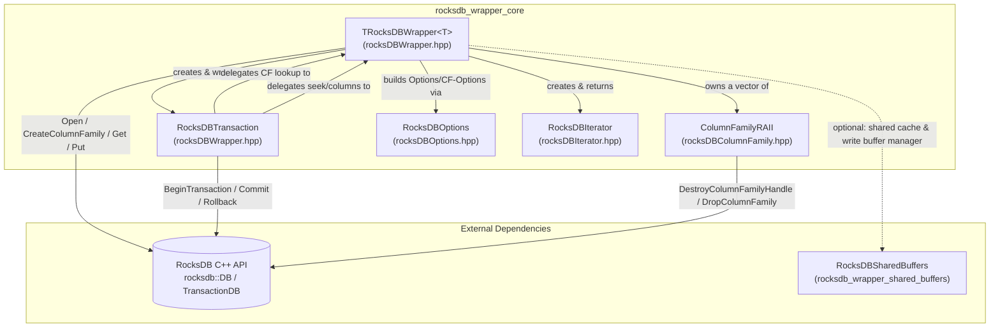
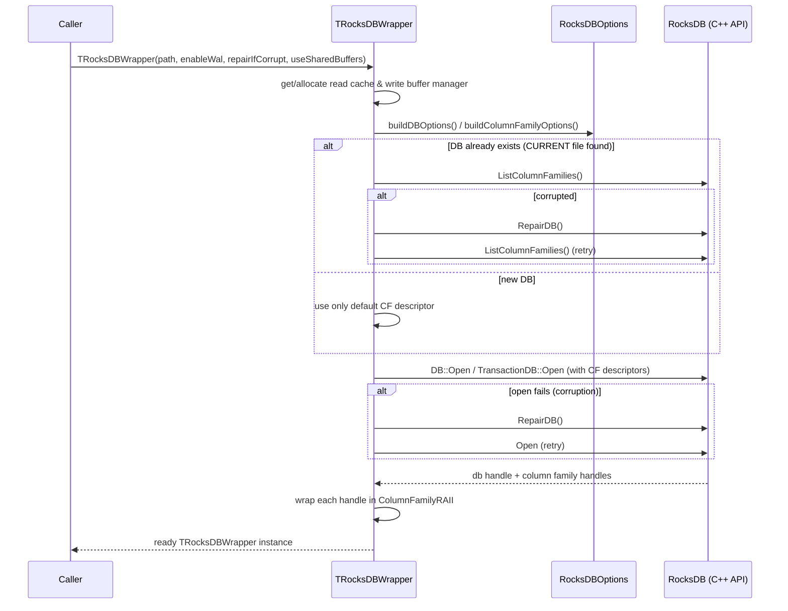

# RocksDB Wrapper Core

## 1. Introduction and Purpose

`rocksdb_wrapper_core` is the foundational C++ abstraction layer that Wazuh uses to interact with [RocksDB](https://rocksdb.org/), the embedded key-value store used throughout the agent and manager code base (FIM database, router persistence, content manager caches, vulnerability scanner data, etc.).

The module hides all the low-level RocksDB C++ API boilerplate — database/column-family lifecycle, options tuning, corruption repair, transactions, and iteration — behind a small, easy-to-use, exception-based C++ interface (`Utils::TRocksDBWrapper` / `Utils::RocksDBWrapper`).

Its main responsibilities are:

- **Database lifecycle management**: opening (and automatically repairing, if corrupted) a RocksDB or `TransactionDB` instance, including all of its column families.
- **Column family (CF) management**: creating, listing, checking existence of, and safely destroying column family handles via RAII.
- **CRUD operations**: `put`, `get`, `delete_`, `deleteAll`, on the default column family or any named column family.
- **Transactional operations**: providing an `IRocksDBWrapper`-compatible transaction object (`RocksDBTransaction`) that mirrors the same CRUD interface, with commit/rollback semantics.
- **Iteration**: exposing a STL-like iterator (`RocksDBIterator`) to traverse (optionally prefixed) key ranges of a column family.
- **Tuning**: centralizing all RocksDB `Options`, `ColumnFamilyOptions`, and `BlockBasedTableOptions` construction (`RocksDBOptions`), including integration with shared read caches and write buffer managers.

This module sits at the bottom of the `rocksdb_wrapper` family of utilities (part of the [Shared Modules Infrastructure (C++)](Shared_Modules_Infrastructure_(C++).md)). Higher-level components build on top of it instead of talking to the RocksDB C++ API directly:

- [rocksdb_wrapper_queue](rocksdb_wrapper_queue.md) — implements persistent FIFO/queue semantics (`RocksDBQueue`, `RocksDBQueueCF`) using `TRocksDBWrapper` as its storage engine.
- [rocksdb_wrapper_shared_buffers](rocksdb_wrapper_shared_buffers.md) — provides process-wide shared RocksDB read caches / write buffer managers that `TRocksDBWrapper` can opt into (`useSharedBuffers` constructor flag) to reduce memory footprint when many databases are opened in the same process.

## 2. Architecture Overview

The module is composed of four headers, each with a single, focused responsibility. `rocksDBWrapper.hpp` is the entry point and depends on the other three.



### Key design decisions

1. **Template on the underlying DB type (`T = rocksdb::DB`)**: `TRocksDBWrapper<T>` can be instantiated over either `rocksdb::DB` (plain database, no transactions) or `rocksdb::TransactionDB` (adds `createTransaction()`/`RocksDBTransaction` support). The type alias `Utils::RocksDBWrapper` defaults to `rocksdb::DB`.
2. **Common interface (`IRocksDBWrapper`)**: Both `TRocksDBWrapper` and `RocksDBTransaction` implement the same abstract interface (`put`, `get`, `delete_`, `commit`, `createColumn`, `columnExists`, `deleteAll`, `flush`, `getAllColumns`, `seek`). This lets calling code operate uniformly whether it holds a plain wrapper or an active transaction.
3. **RAII everywhere**: Column family handles (`ColumnFamilyRAII`) and RocksDB transactions are wrapped with custom deleters/destructors so that resources are always released deterministically, and transactions are automatically rolled back if not explicitly committed (exception-safety).
4. **Self-healing on corruption**: On open (or on `ListColumnFamilies`) failures caused by I/O errors or corruption, the wrapper automatically attempts `rocksdb::RepairDB` and retries, unless explicitly disabled via `repairIfCorrupt = false`.
5. **Centralized tuning (`RocksDBOptions`)**: All memory/performance related options (write buffer sizes, max open files, compaction levels, block cache) are defined in one place, making it easy to tune all Wazuh RocksDB consumers consistently.

## 3. Component Details

### 3.1 `TRocksDBWrapper<T>` (a.k.a. `Utils::RocksDBWrapper`)

The central class of the module. Responsibilities:

- **Construction**: `TRocksDBWrapper(dbPath, enableWal, repairIfCorrupt, useSharedBuffers)`
  - Chooses between a private LRU cache/write-buffer-manager or the process-wide shared ones from `RocksDBSharedBuffers` (see [rocksdb_wrapper_shared_buffers](rocksdb_wrapper_shared_buffers.md)).
  - Builds `rocksdb::Options` / `ColumnFamilyOptions` via `RocksDBOptions`.
  - Discovers existing column families on disk (`ListColumnFamilies`) or defaults to just the default CF for a brand-new database.
  - Opens the database with `rocksdb::DB::Open` or `rocksdb::TransactionDB::Open` depending on `T`, retrying once through `repairDB()` on corruption/I-O errors.
  - Wraps every resulting `ColumnFamilyHandle*` in a `ColumnFamilyRAII` kept in `m_columnsInstances`.
- **CRUD**: `put`, `get` (both `std::string` and `rocksdb::PinnableSlice` overloads), `delete_`, each with an optional `columnName` (defaults to RocksDB's default column family).
- **Column family management**: `createColumn`, `columnExists`, `getAllColumns`, plus multiple `deleteAll` overloads (whole DB, single column, or with a per-key callback for the caller to react to deleted entries — e.g., for cleanup bookkeeping).
- **Iteration**: `seek(key, columnName)`, `begin(columnName)`, `end()` produce `RocksDBIterator` instances for range scans.
- **Maintenance**: `compactDatabase()` / `compactDatabaseUsingBzip2()` trigger manual compaction; `flush()` forces all column families to disk; `getLastKeyValue()` retrieves the last key in a column.
- **Transactions**: `createTransaction()` returns a `std::unique_ptr<IRocksDBWrapper>` backed by a `RocksDBTransaction` (only meaningful when `T = rocksdb::TransactionDB`; otherwise the private `createTransaction(writeOptions)` helper throws).

### 3.2 `RocksDBTransaction`

Implements `IRocksDBWrapper` on top of a `rocksdb::Transaction`, obtained from a `TRocksDBWrapper<>*`.

- On construction, starts a transaction with WAL disabled and installs a custom destructor that automatically calls `Rollback()` if `commit()` was never invoked — guaranteeing no half-applied changes leak through exceptions.
- Mirrors `put`, `delete_`, `get` semantics of `TRocksDBWrapper`, but scoped to the transaction (delegating column-family handle resolution back to the owning wrapper via `m_dbWrapper->getColumnFamilyBasedOnName(...)`).
- `commit()` calls `rocksdb::Transaction::Commit()`, then triggers a `flush()` on the owning wrapper, and marks the transaction as committed (disarming the rollback-on-destroy safety net).
- `createColumn`, `columnExists`, `getAllColumns`, `seek`, and `deleteAll` are simply forwarded to the owning `TRocksDBWrapper`.
- `flush()` is intentionally unimplemented (`[[noreturn]]`) since flushing mid-transaction is not a supported operation in this design.

### 3.3 `ColumnFamilyRAII`

A minimal RAII wrapper around a `rocksdb::ColumnFamilyHandle*`:

- Stores a `shared_ptr<rocksdb::DB>` alongside the handle so the handle can be safely destroyed (`DestroyColumnFamilyHandle`) even if the wrapper outlives the immediate scope where it was created.
- Exposes `handle()` and an `operator->()` for ergonomic access to the underlying RocksDB API.
- `drop()` permanently deletes the column family from the database (`DropColumnFamily`), used by `deleteAll()` when removing non-default columns.

### 3.4 `RocksDBOptions`

A stateless utility class (all static methods) that centralizes construction of:

- `rocksdb::BlockBasedTableOptions` — wires in the shared/private block cache (`block_cache`).
- `rocksdb::ColumnFamilyOptions` — write buffer size, max write buffers, number of levels, and the table factory (block-based table using the above cache).
- `rocksdb::Options` (DB-wide) — write buffer manager, `create_if_missing`, logging retention/rotation (`keep_log_file_num`, `max_log_file_size`, `recycle_log_file_num`), `max_open_files`, `num_levels`, and the table factory.

Constants such as `ROCKSDB_WRITE_BUFFER_SIZE`, `ROCKSDB_MAX_OPEN_FILES`, `ROCKSDB_NUM_LEVELS`, and `ROCKSDB_BLOCK_CACHE_SIZE` define the default tuning profile applied uniformly across all Wazuh RocksDB instances that use this wrapper.

### 3.5 `RocksDBIterator`

A lightweight, copy/move-friendly wrapper around `std::shared_ptr<rocksdb::Iterator>` that provides an STL-like range interface:

- Constructed either positioned at the very first key (`SeekToFirst`) or bound to a `prefix` (`std::string_view`) to be later activated via `begin()` (`Seek(prefix)`).
- `operator++`, `operator!=`, and `operator*` (`std::pair<std::string, rocksdb::Slice>`) allow using the iterator directly in range-based `for` loops: `for (auto& [key, value] : wrapper.seek("myprefix")) { ... }`.
- The `!=` comparison implicitly enforces the prefix constraint: iteration stops as soon as the current key no longer starts with the configured prefix, effectively implementing prefix-scoped iteration without needing a RocksDB prefix extractor.
- A default-constructed `RocksDBIterator` acts as the canonical "end" sentinel, returned by both `TRocksDBWrapper::end()` and `RocksDBIterator::end()`.

## 4. Data Flow / Process Diagrams

### 4.1 Database initialization and column family discovery



### 4.2 Transactional write flow

```mermaid
sequenceDiagram
    participant Caller
    participant Wrapper as TRocksDBWrapper&lt;TransactionDB&gt;
    participant Txn as RocksDBTransaction
    participant RDB as RocksDB

    Caller->>Wrapper: createTransaction()
    Wrapper->>RDB: BeginTransaction(writeOptions)
    RDB-->>Wrapper: rocksdb::Transaction*
    Wrapper-->>Caller: unique_ptr<IRocksDBWrapper> (RocksDBTransaction)

    Caller->>Txn: put(key, value, column)
    Txn->>Wrapper: getColumnFamilyBasedOnName(column)
    Txn->>RDB: Transaction::Put(handle, key, value)

    Caller->>Txn: delete_(key2, column)
    Txn->>RDB: Transaction::Delete(handle, key2)

    alt Caller commits
        Caller->>Txn: commit()
        Txn->>RDB: Transaction::Commit()
        Txn->>Wrapper: flush()
    else Caller lets Txn go out of scope without commit (e.g., exception)
        Txn->>RDB: Transaction::Rollback() (automatic, via destructor)
    end
```

## 5. Usage Notes for Maintainers

- **Choosing `T`**: Use `Utils::RocksDBWrapper` (alias for `TRocksDBWrapper<rocksdb::DB>`) for simple key-value stores with no cross-key atomicity requirements. Instantiate `TRocksDBWrapper<rocksdb::TransactionDB>` directly when multi-key atomic commits are required (transactions are not supported on plain `rocksdb::DB`; attempting to call the private transaction-creation path on it throws `std::runtime_error`).
- **Shared buffers**: Pass `useSharedBuffers = true` when many independent `TRocksDBWrapper` instances are expected to coexist in the same process (e.g., per-agent or per-module databases) to bound total RocksDB memory usage via [rocksdb_wrapper_shared_buffers](rocksdb_wrapper_shared_buffers.md). Otherwise each instance allocates its own 16 MB read cache and 128 MB write buffer manager.
- **Error handling**: All failure paths raise `std::runtime_error` (or `std::invalid_argument` for programming errors such as empty keys/column names) rather than returning RocksDB status codes directly — callers should be prepared to catch and log these exceptions.
- **Consumers**: The higher-level [rocksdb_wrapper_queue](rocksdb_wrapper_queue.md) module builds `RocksDBQueue`/`RocksDBQueueCF` persistent queues directly on top of `TRocksDBWrapper`, reusing its column family and iteration primitives instead of talking to RocksDB directly. Any new persistent-storage component in the Wazuh code base should prefer building on `rocksdb_wrapper_core` rather than depending on the raw RocksDB API.
