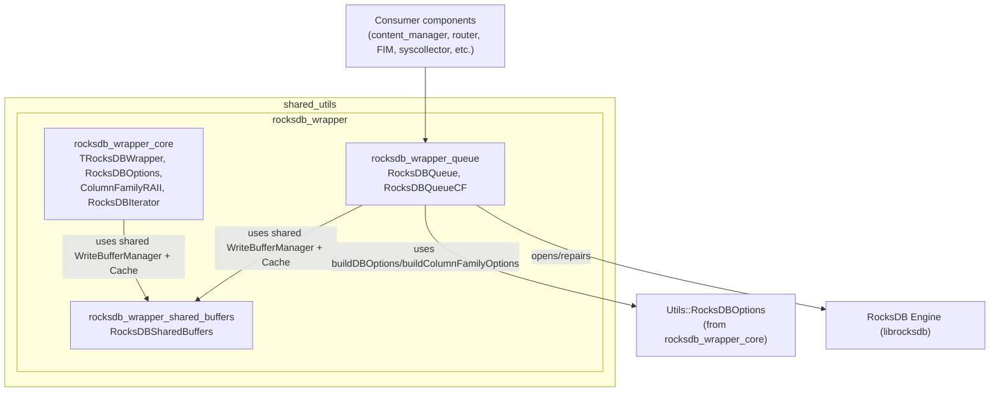
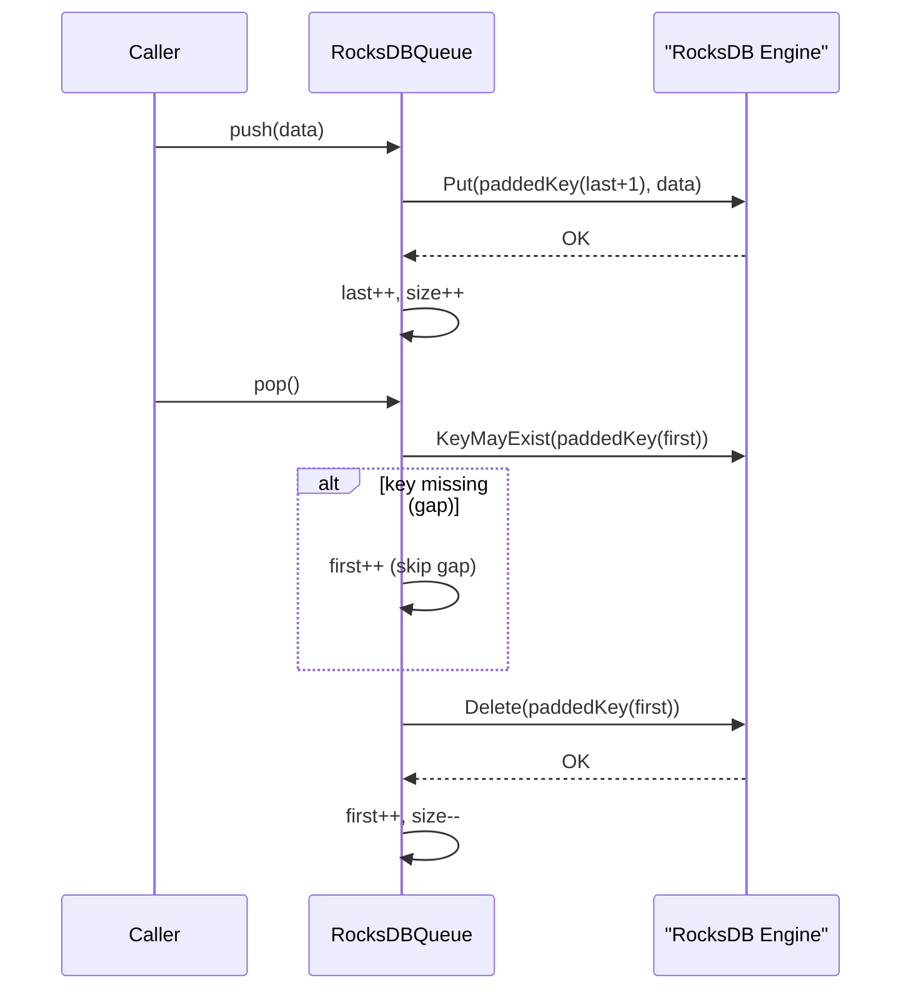
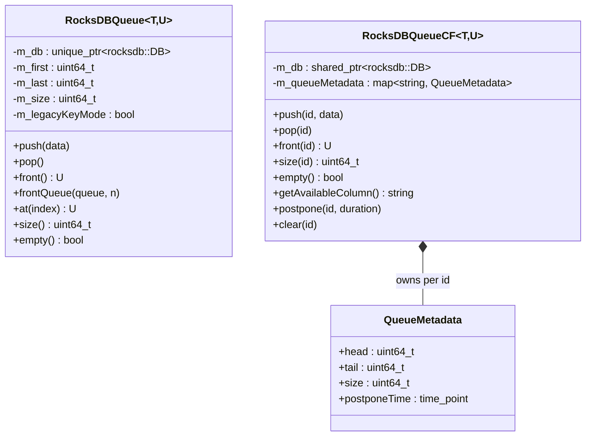

# RocksDB Wrapper Queue

## 1. Purpose

The `rocksdb_wrapper_queue` module provides **durable, disk-backed FIFO queue primitives** built on top of RocksDB. It is part of the broader [`shared_utils`](shared_utils.md) library used across Wazuh's C++ components (content manager, router, syscollector, FIM, etc.) whenever a component needs to buffer data reliably across process restarts without keeping everything in memory.

It sits alongside two sibling sub-modules of the parent `rocksdb_wrapper` module:

- **[`rocksdb_wrapper_core`](rocksdb_wrapper_core.md)** — generic RocksDB wrapper (`TRocksDBWrapper`, `RocksDBTransaction`, `ColumnFamilyRAII`, `RocksDBOptions`, `RocksDBIterator`) providing key/value CRUD, transactions and column-family management.
- **`rocksdb_wrapper_queue` (this module)** — FIFO queue abstractions built directly on the RocksDB C++ API (not on top of `TRocksDBWrapper`), specialized for enqueue/dequeue semantics.
- **[`rocksdb_wrapper_shared_buffers`](rocksdb_wrapper_shared_buffers.md)** — `RocksDBSharedBuffers`, a process-wide singleton that supplies a shared `WriteBufferManager` and block `Cache` so that multiple RocksDB instances (including the queues documented here) can share memory budgets instead of each allocating its own.

Two concrete queue flavors are provided:

| Class | File | Use case |
|---|---|---|
| `RocksDBQueue<T, U>` | `rocksDBQueue.hpp` | A single, simple FIFO queue per RocksDB database instance (one logical queue = one directory). |
| `RocksDBQueueCF<T, U>` | `rocksDBQueueCF.hpp` | Multiple independent named FIFO queues ("virtual column families", identified by a string `id`) multiplexed inside a **single** RocksDB database instance, with per-queue postponement/backoff support. |

Both are template classes parameterized by the value type stored (`T` for writes, `U` for reads — defaults to the same type), letting callers use RocksDB's implicit string/byte serialization or custom serializable types.

## 2. Architecture Overview



Both queue classes are self-contained: they open their own `rocksdb::DB` instance directly on the given path, applying repair-on-corruption logic, initializing an in-memory index of head/tail/size by scanning existing keys at startup, and exposing simple `push`/`pop`/`front`/`size` operations. They do **not** depend on `TRocksDBWrapper`; the RocksDB API is used directly. The only cross-module dependency is optional reuse of `RocksDBSharedBuffers` (memory sharing) and, for `RocksDBQueueCF`, the `Utils::RocksDBOptions` factory functions defined in `rocksdb_wrapper_core`.

### Key design principles

1. **Persistence & crash recovery**: On construction, the RocksDB store is opened; if RocksDB reports corruption or an I/O error, `rocksdb::RepairDB` is attempted automatically before giving up.
2. **Ordered keys via zero-padding**: Keys are numeric sequence counters encoded as zero-padded strings (`ROCKSDB_QUEUE_PADDING = 20` digits) so that RocksDB's natural lexicographic key ordering matches numeric/FIFO ordering. A **legacy key mode** is auto-detected (keys shorter than the padding width) to remain backward compatible with older, unpadded databases.
3. **Gap-tolerant dequeue**: Both queues tolerate "holes" in the key sequence (e.g., from partial failures) by scanning forward from the head index until an existing key is found, rather than assuming strict contiguity.
4. **Multi-queue multiplexing** (`RocksDBQueueCF` only): Rather than opening one RocksDB database per logical queue (expensive: file handles, memory, compaction threads), `RocksDBQueueCF` stores all queues in **one** database, prefixing keys with `"<id>_<sequence>"`. Per-queue metadata (`head`, `tail`, `size`, `postponeTime`) is tracked in an in-memory `std::map<std::string, QueueMetadata>`.
5. **Backoff / postponement** (`RocksDBQueueCF` only): Each named queue can be "postponed" for a duration, letting a scheduler skip queues that recently failed processing (e.g., rate-limited or errored subscribers) via `getAvailableColumn()` / `postpone()`.

## 3. Component Details

### 3.1 `RocksDBQueue<T, U>`

A single-queue wrapper around one RocksDB database directory.

**Construction (`RocksDBQueue(connectorName, useSharedBuffers)`)**
- If `useSharedBuffers` is `true`, obtains the shared `WriteBufferManager` and read `Cache` from `RocksDBSharedBuffers::getInstance()`; otherwise creates its own 16MB LRU cache and 128MB write-buffer manager.
- Configures `rocksdb::Options` (block-based table, `create_if_missing`, log rotation settings, 4 levels, 32MB write buffer × 4 buffers, 4 background jobs).
- Creates the target directory recursively, then opens the DB. On corruption/I-O error, attempts `RepairDB` and retries the open, logging a warning on success or throwing `std::runtime_error` on failure.
- Scans all existing keys with a full iterator pass to compute the initial `m_first` (head), `m_last` (tail), and `m_size`, and to detect **legacy key mode** (non-padded keys).

**Operations**

| Method | Behavior |
|---|---|
| `push(const T& data)` | Writes at key `paddedKey(m_last + 1)`; increments `m_last` and `m_size` on success. Throws on write failure (tail is *not* advanced on failure, avoiding inconsistency). |
| `pop()` | No-op if empty. Scans forward from `m_first` until an existing key is located (gap tolerance), deletes it, increments `m_first`, decrements `m_size`. Resets `m_first=1`/`m_last=0` when the queue becomes empty. |
| `front()` | Returns the value at the first existing key ≥ `m_first` without removing it. Throws if the queue is empty. |
| `frontQueue(std::queue<U>&, elementsQuantity)` | Bulk-reads up to `elementsQuantity` elements starting at `m_first` into the caller-supplied `std::queue`. Throws if fewer elements are available than requested. |
| `at(index)` | Random access — reads the element at offset `index` from the head (`m_first + index`). |
| `size()` / `empty()` | O(1) — backed by the in-memory `m_size` counter. |



### 3.2 `RocksDBQueueCF<T, U>` and `QueueMetadata`

Despite the "CF" (Column Family) naming, this class does **not** use RocksDB's native column family feature; instead it emulates multiple independent queues within a single default column family by **prefixing keys** with a queue identifier: `"<id>_<sequenceNumber>"`.

**`QueueMetadata` (private nested struct)**

```cpp
struct QueueMetadata {
    uint64_t head = 0;
    uint64_t tail = 0;
    uint64_t size = 0;
    std::chrono::time_point<std::chrono::system_clock> postponeTime;
};
```
One instance exists per active named queue (`id`), tracked in `m_queueMetadata` (`std::map<std::string, QueueMetadata>`).

**Construction (`RocksDBQueueCF(path, useSharedBuffers)`)**
- Builds a shared LRU read cache (`Utils::ROCKSDB_BLOCK_CACHE_SIZE`) and either a shared or dedicated `WriteBufferManager`.
- Delegates `rocksdb::Options` / `rocksdb::ColumnFamilyOptions` construction to `Utils::RocksDBOptions::buildDBOptions` / `buildColumnFamilyOptions` (from [`rocksdb_wrapper_core`](rocksdb_wrapper_core.md)), promoting configuration consistency across the wrapper family.
- Opens (and repairs, if necessary) the database, then calls `initializeQueueData()`.

**`initializeQueueData()`**: Iterates every key in the database, splits it on `_` into `(id, queueNumber)`, and rebuilds each queue's `head`/`tail`/`size` in `m_queueMetadata` — mirroring the single-queue recovery logic but for many logical queues at once.

**Operations**

| Method | Behavior |
|---|---|
| `push(id, data)` | Lazily creates `QueueMetadata` for unseen `id`. Writes at key `"<id>_<tail+1>"`; advances `tail`/`size` only on success. |
| `pop(id)` | Same gap-tolerant scan-and-delete algorithm as `RocksDBQueue::pop()`, scoped to the given `id`'s `head..tail` range. Erases the `QueueMetadata` entry entirely once its `size` reaches 0. |
| `front(id)` | Returns (without removing) the first existing element for `id`. |
| `size(id)` | O(1) lookup in `m_queueMetadata`; returns 0 for unknown ids. |
| `empty()` | Returns true only if **every** queue is currently postponed (i.e., no queue is immediately available) — checked against `std::chrono::system_clock::now()`. |
| `getAvailableColumn()` | Returns the id of the first non-postponed queue found — used by round-robin/multiplexing consumers to select which queue to service next. Throws if no queue is available. |
| `postpone(id, duration)` | Sets `postponeTime = now() + duration` for the given queue, temporarily excluding it from `getAvailableColumn()`/`empty()` consideration (e.g., back off a failing subscriber). |
| `clear(id)` | Deletes all keys for a specific queue `id` (or **every** queue if `id` is empty) and drops the corresponding `QueueMetadata` entries. |



## 4. Comparison: `RocksDBQueue` vs `RocksDBQueueCF`

| Aspect | `RocksDBQueue` | `RocksDBQueueCF` |
|---|---|---|
| RocksDB instances | One per queue (one directory per instance) | One shared instance for many named queues |
| Key format | `paddedKey(seq)` (20-digit zero-padded, or legacy unpadded) | `"<id>_<seq>"` (no fixed-width padding) |
| Multi-queue support | No — one logical queue per object | Yes — arbitrary number of `id`-scoped queues |
| Postponement / backoff | Not supported | `postpone()` / `getAvailableColumn()` |
| Random access | `at(index)`, `frontQueue()` bulk read | Not provided (single-item `front()` only) |
| Metadata storage | Scalar members (`m_first`, `m_last`, `m_size`) | `std::map<std::string, QueueMetadata>` |
| Legacy key compatibility | Explicit `m_legacyKeyMode` detection/handling | Not applicable (new key format) |

## 5. Error Handling & Recovery

Both classes share the same defensive pattern on construction:

1. Attempt `rocksdb::DB::Open`.
2. If the status indicates corruption or an I/O error, invoke `rocksdb::RepairDB` on the target path.
   - On repair failure → throw `std::runtime_error`.
   - On repair success → retry `DB::Open`; if it still fails, throw; otherwise log a warning (`logWarn`, tag `LOGGER_DEFAULT_TAG`) that the database was repaired.
3. Any other (non-corruption) open failure is a hard throw.

At runtime, `push`/`pop`/`front`/`at` surface RocksDB write/read failures as `std::runtime_error`, except for the expected `rocksdb::Status::NotFound()` case, which is treated as "key not present, keep scanning" rather than an error — this is what implements the gap-tolerant dequeue behavior.

## 6. Typical Usage Pattern

```cpp
// Single logical queue, own RocksDB instance:
RocksDBQueue<std::string> eventQueue("/var/ossec/queue/my_module");
eventQueue.push(R"({"event":"..."})");
auto next = eventQueue.front();
eventQueue.pop();

// Multiple named queues sharing one RocksDB instance,
// with shared memory buffers across the process:
RocksDBQueueCF<std::string> subscriberQueues("/var/ossec/queue/subscribers", /*useSharedBuffers=*/true);
subscriberQueues.push("subscriber_A", payload);
if (!subscriberQueues.empty())
{
    const auto& id = subscriberQueues.getAvailableColumn();
    auto value = subscriberQueues.front(id);
    // ... process value ...
    subscriberQueues.pop(id);
}
// On repeated failure for a subscriber, back off for 30 seconds:
subscriberQueues.postpone("subscriber_A", std::chrono::seconds(30));
```

## 7. Related Documentation

- [`rocksdb_wrapper_core`](rocksdb_wrapper_core.md) — generic key/value RocksDB wrapper, transactions, column families, and the `RocksDBOptions` factory helpers reused by `RocksDBQueueCF`.
- [`rocksdb_wrapper_shared_buffers`](rocksdb_wrapper_shared_buffers.md) — the shared `WriteBufferManager`/`Cache` singleton that both queue classes can opt into via `useSharedBuffers`.
- [`shared_utils`](shared_utils.md) — parent library grouping all Wazuh C++ shared utility modules (RocksDB wrappers, SQLite wrappers, threading/dispatch queues, socket helpers, etc.).
- [`Shared_Modules_Infrastructure_(C++)`](Shared_Modules_Infrastructure_(C++).md) — top-level module housing `shared_utils` alongside `content_manager`, `dbsync`, `router`, `rsync`, `indexer_connector`, and `keystore`, several of which rely on durable queueing for buffering data between producers and consumers.
