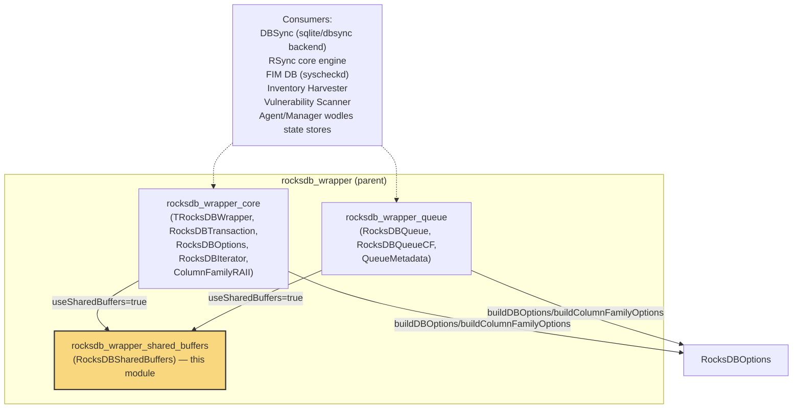
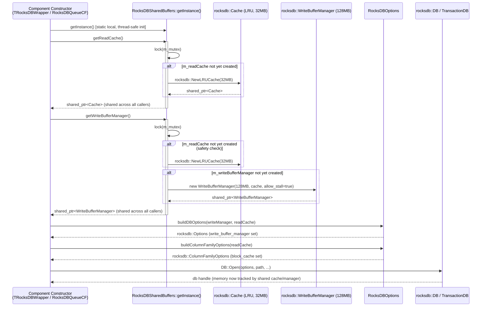
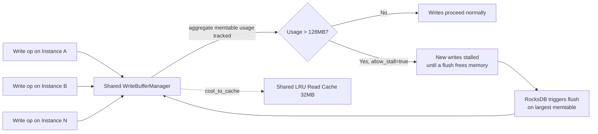
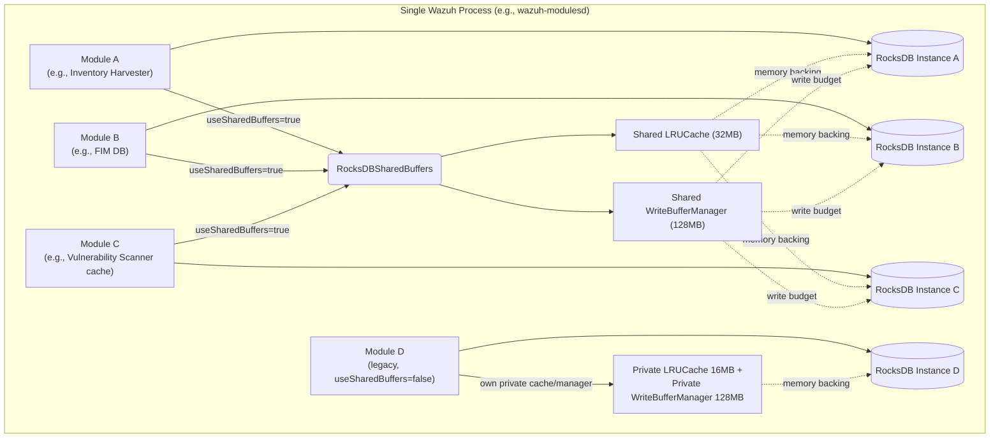

# RocksDB Wrapper — Shared Buffers

## Introduction

`RocksDBSharedBuffers` is a small but critical infrastructure component within the Wazuh **Shared Modules Utilities** library. It provides a process-wide, thread-safe singleton that centralizes the memory-management primitives used by every RocksDB-backed component in Wazuh (`TRocksDBWrapper`, `RocksDBQueueCF`, `RocksDBQueue`, DBSync, RSync, and any other module that persists data through embedded RocksDB instances).

Without this component, each RocksDB instance created in a Wazuh process (one per agent module, one per FIM database, one per inventory table, etc.) would allocate its **own** private write buffer and block/read cache. On systems that open many RocksDB databases concurrently (a common pattern in Wazuh daemons such as `wazuh-modulesd`, `wazuh-db`, or the Vulnerability Scanner), this leads to uncontrolled and duplicated memory consumption. `RocksDBSharedBuffers` solves this by exposing **one shared `rocksdb::Cache`** (read cache) and **one shared `rocksdb::WriteBufferManager`** (write memory budget) that all RocksDB wrapper instances can opt into, enforcing a single, predictable memory ceiling across the whole process.

This document describes the component's responsibilities, its position in the broader `rocksdb_wrapper` family, how it interacts with `TRocksDBWrapper` and `RocksDBQueueCF`, and the operational/lifecycle guarantees it provides.

---

## 1. Purpose & Core Functionality

| Aspect | Description |
|---|---|
| **Pattern** | Meyer's Singleton (thread-safe static local instance), lazily initialized. |
| **Managed resources** | `std::shared_ptr<rocksdb::Cache>` (LRU read cache) and `std::shared_ptr<rocksdb::WriteBufferManager>` (write memory budget with cost-to-cache accounting). |
| **Concurrency control** | Internal `std::mutex` guarding lazy creation of both resources. |
| **Memory limits** | `SHARED_BUFFER_SIZE` = 128 MB (write buffer budget), `SHARED_READ_CACHE_SIZE` = 32 MB (block cache). |
| **Opt-in model** | Consumers (`TRocksDBWrapper`, `RocksDBQueueCF`) accept a `useSharedBuffers` boolean flag at construction time; when `true`, they fetch the shared resources instead of allocating private ones. |
| **Stall-on-limit** | The shared `WriteBufferManager` is created with `allow_stall = true`, meaning that when the aggregated memtable memory usage across **all** databases opted into sharing exceeds 128 MB, RocksDB will throttle (stall) writes rather than let memory grow unbounded. |
| **Cost-to-cache** | The write buffer manager is wired to the same LRU cache (`m_readCache`) used for reads, so memtable memory usage is also accounted against the cache's capacity, giving RocksDB a unified view of memory pressure. |

### Why it matters
RocksDB's `WriteBufferManager` and `Cache` objects are explicitly designed by the upstream project to be **shared across multiple `DB` instances** in the same process to bound aggregate memory usage. Wazuh leverages this feature via `RocksDBSharedBuffers` so that:

- Agent/manager daemons that open dozens of small RocksDB databases (FIM, inventory, vulnerability data, queues) do not multiply memory usage linearly with the number of databases.
- Memory usage becomes bounded and predictable (~160 MB total for all opted-in instances, versus potentially hundreds of MB per instance otherwise).
- Backpressure (write stalling) is applied uniformly, protecting the process from OOM conditions under heavy write load.

---

## 2. Architecture

```mermaid
classDiagram
    class RocksDBSharedBuffers {
        <<singleton>>
        -mutex m_mutex
        -shared_ptr~WriteBufferManager~ m_writeBufferManager
        -shared_ptr~Cache~ m_readCache
        +getInstance() RocksDBSharedBuffers&
        +getReadCache() shared_ptr~Cache~
        +getWriteBufferManager() shared_ptr~WriteBufferManager~
        +SHARED_BUFFER_SIZE : size_t = 128MB
        +SHARED_READ_CACHE_SIZE : size_t = 32MB
    }

    class TRocksDBWrapper~T~ {
        -shared_ptr~T~ m_db
        -shared_ptr~Cache~ m_readCache
        -shared_ptr~WriteBufferManager~ m_writeManager
        +TRocksDBWrapper(dbPath, enableWal, repairIfCorrupt, useSharedBuffers)
        +put()
        +get()
        +delete_()
        +createTransaction()
    }

    class RocksDBQueueCF {
        -shared_ptr~DB~ m_db
        -shared_ptr~Cache~ m_readCache
        -shared_ptr~WriteBufferManager~ m_writeManager
        +RocksDBQueueCF(path, useSharedBuffers)
        +push()
        +pop()
        +front()
    }

    class RocksDBOptions {
        <<static utility>>
        +buildDBOptions(writeManager, readCache) Options
        +buildColumnFamilyOptions(readCache) ColumnFamilyOptions
    }

    TRocksDBWrapper --> RocksDBSharedBuffers : getInstance() when useSharedBuffers=true
    RocksDBQueueCF --> RocksDBSharedBuffers : getInstance() when useSharedBuffers=true
    TRocksDBWrapper --> RocksDBOptions : buildDBOptions / buildColumnFamilyOptions
    RocksDBQueueCF --> RocksDBOptions : buildDBOptions / buildColumnFamilyOptions
    RocksDBSharedBuffers ..> "rocksdb::Cache" : owns (shared)
    RocksDBSharedBuffers ..> "rocksdb::WriteBufferManager" : owns (shared)
```

### Key design points

1. **Lazy, thread-safe initialization**: Both `getReadCache()` and `getWriteBufferManager()` acquire `m_mutex` before checking/creating their respective `shared_ptr` members, so the first caller from any thread safely constructs the underlying RocksDB objects exactly once.
2. **Cache-before-manager ordering**: `getWriteBufferManager()` ensures the read cache exists *before* creating the `WriteBufferManager`, because the manager is constructed with a reference to the cache (`cost_to_cache` behavior) — this coupling is intentional so that memtable memory is also tracked against the shared cache's capacity.
3. **Process-lifetime ownership**: Because the singleton instance is a function-local `static`, its destructor runs at process teardown (after `main` exits), which is safe because `shared_ptr` reference counting ensures the underlying RocksDB `Cache`/`WriteBufferManager` are only destroyed once the last RocksDB instance holding a reference is also destroyed.
4. **No configuration surface**: The class intentionally hardcodes its size constants (`SHARED_BUFFER_SIZE`, `SHARED_READ_CACHE_SIZE`) as `constexpr` — this keeps the shared-memory contract simple and avoids the complexity of multiple consumers racing to configure sizes differently at runtime.

---

## 3. Position within the `rocksdb_wrapper` Module Family

`RocksDBSharedBuffers` is one of three sibling components inside the parent `rocksdb_wrapper` submodule of [Shared Modules Infrastructure (C++)](Shared_Modules_Infrastructure_(C++).md):



- **`rocksdb_wrapper_core`** (`TRocksDBWrapper`, `RocksDBTransaction`, `ColumnFamilyRAII`, `RocksDBOptions`, `RocksDBIterator`) — the generic key-value / column-family wrapper used across Wazuh for arbitrary persistent storage (e.g., DBSync SQLite-alternative backends, inventory caches).
- **`rocksdb_wrapper_queue`** (`RocksDBQueue`, `RocksDBQueueCF`, `QueueMetadata`) — persistent FIFO queue implementations built on top of RocksDB, used where in-memory queues would risk data loss across restarts (e.g., syscollector/FIM event queues).
- **`rocksdb_wrapper_shared_buffers`** (this module) — the cross-cutting memory-sharing facility consumed by *both* of the above.

Both `TRocksDBWrapper` (see constructor logic) and `RocksDBQueueCF` accept a `useSharedBuffers` flag; when set, they call `RocksDBSharedBuffers::getInstance().getReadCache()` / `getWriteBufferManager()` instead of allocating dedicated `rocksdb::NewLRUCache(...)` / `rocksdb::WriteBufferManager(...)` objects sized per-instance (typically 16 MB cache / 128 MB write buffer *per instance* when not shared).

For details on the sibling components, see:
- [rocksdb_wrapper_core.md](rocksdb_wrapper_core.md) *(TRocksDBWrapper, RocksDBOptions, ColumnFamilyRAII, RocksDBIterator)*
- [rocksdb_wrapper_queue.md](rocksdb_wrapper_queue.md) *(RocksDBQueue, RocksDBQueueCF)*
- [shared_utils.md](shared_utils.md) *(parent utilities module)*
- [Shared_Modules_Infrastructure_(C++).md](Shared_Modules_Infrastructure_(C++).md) *(top-level module)*

---

## 4. Data Flow — Resource Acquisition Lifecycle

The following sequence illustrates how a new RocksDB-backed component (e.g., a `TRocksDBWrapper` instance or a `RocksDBQueueCF` instance) obtains shared memory resources at construction time.



### Runtime memory-pressure flow



---

## 5. Component Interaction Diagram



---

## 6. API Reference

### `RocksDBSharedBuffers::getInstance()`
```cpp
static RocksDBSharedBuffers& getInstance();
```
Returns the single process-wide instance. Thread-safe due to C++11 guaranteed thread-safe static local initialization.

### `getReadCache()`
```cpp
std::shared_ptr<rocksdb::Cache> getReadCache();
```
Returns the shared 32 MB LRU block cache, creating it on first call. Safe to call concurrently from multiple threads/consumers.

### `getWriteBufferManager()`
```cpp
std::shared_ptr<rocksdb::WriteBufferManager> getWriteBufferManager();
```
Returns the shared 128 MB `WriteBufferManager`, creating both the write buffer manager and (if not already created) the read cache it costs against. The manager is configured with `allow_stall = true` so that write throughput is throttled rather than allowing unbounded memory growth once the aggregate memtable usage across all sharing instances exceeds the limit.

### Constants

| Constant | Value | Purpose |
|---|---|---|
| `SHARED_BUFFER_SIZE` | 128 MB | Aggregate memtable (write buffer) budget across all opted-in RocksDB instances. |
| `SHARED_READ_CACHE_SIZE` | 32 MB | Aggregate block cache budget for reads, also used as the cost-accounting target for the write buffer manager. |

---

## 7. Usage in Consumers

### `TRocksDBWrapper` (generic key-value store)
```cpp
explicit TRocksDBWrapper(std::string dbPath,
                          bool enableWal = true,
                          bool repairIfCorrupt = true,
                          bool useSharedBuffers = false)
{
    if (useSharedBuffers)
    {
        auto& sharedBuffers = RocksDBSharedBuffers::getInstance();
        m_readCache   = sharedBuffers.getReadCache();
        m_writeManager = sharedBuffers.getWriteBufferManager();
    }
    else
    {
        m_readCache    = rocksdb::NewLRUCache(16 * 1024 * 1024);
        m_writeManager = std::make_shared<rocksdb::WriteBufferManager>(128 * 1024 * 1024);
    }
    // ... build rocksdb::Options via RocksDBOptions::buildDBOptions(m_writeManager, m_readCache) ...
}
```

### `RocksDBQueueCF` (persistent multi-queue)
```cpp
explicit RocksDBQueueCF(const std::string& path, bool useSharedBuffers = false)
{
    m_readCache = rocksdb::NewLRUCache(Utils::ROCKSDB_BLOCK_CACHE_SIZE);
    if (useSharedBuffers)
    {
        auto& sharedBuffers = RocksDBSharedBuffers::getInstance();
        m_writeManager = sharedBuffers.getWriteBufferManager();
    }
    else
    {
        m_writeManager = std::make_shared<rocksdb::WriteBufferManager>(Utils::ROCKSDB_WRITE_BUFFER_MANAGER_SIZE);
    }
    // ... open rocksdb::DB with options built from m_writeManager / m_readCache ...
}
```

> **Note:** `RocksDBOptions::buildDBOptions()` and `RocksDBOptions::buildColumnFamilyOptions()` (from [rocksdb_wrapper_core](rocksdb_wrapper_core.md)) are the glue that actually wires the shared (or private) `Cache`/`WriteBufferManager` objects into the `rocksdb::Options` and `rocksdb::ColumnFamilyOptions` structures passed to `rocksdb::DB::Open` / `rocksdb::TransactionDB::Open`.

---

## 8. Operational Considerations

- **Opt-in, not automatic**: Existing call sites that do not pass `useSharedBuffers = true` continue to allocate private resources; this preserves backward compatibility for components not yet migrated to the shared model.
- **Single limit for the whole process**: Once multiple components opt in, the 128 MB / 32 MB limits are **shared**, not per-component. Teams enabling this flag for a new consumer should ensure the aggregate expected memory footprint of all shared consumers stays within these bounds, or consider whether the constants need to be revisited (currently hardcoded, requiring a source change to adjust).
- **Write stalling side effects**: Because `allow_stall = true`, high write throughput across many shared instances can cause increased write latency (stalls) instead of memory growth. This is a deliberate trade-off favoring memory safety over raw write throughput, appropriate for infrastructure/telemetry-style workloads.
- **No explicit shutdown/reset API**: The singleton's lifetime is tied to the process; there is no method to reset or resize the shared buffers at runtime. Restarting the process is currently the only way to reconfigure shared memory usage.
- **Thread safety**: All public methods are protected by `m_mutex`; RocksDB's own `Cache` and `WriteBufferManager` implementations are internally thread-safe once constructed, so no additional locking is required by consumers after retrieval.

---

## 9. Related Documentation

- [shared_utils.md](shared_utils.md) — parent module containing all C++ shared utilities (RocksDB wrapper family, SQLite wrapper, threading/dispatch queues, JSON utilities, etc.)
- [rocksdb_wrapper_core.md](rocksdb_wrapper_core.md) — `TRocksDBWrapper`, `RocksDBOptions`, `ColumnFamilyRAII`, `RocksDBIterator`, `RocksDBTransaction`
- [rocksdb_wrapper_queue.md](rocksdb_wrapper_queue.md) — `RocksDBQueue`, `RocksDBQueueCF`, `QueueMetadata`
- [dbsync.md](dbsync.md) — DBSync module, one of the primary consumers of the RocksDB wrapper family for change-data-capture style synchronization
- [Shared_Modules_Infrastructure_(C++).md](Shared_Modules_Infrastructure_(C++).md) — top-level module housing content manager, DBSync, indexer connector, keystore, router, RSync, and shared utilities
