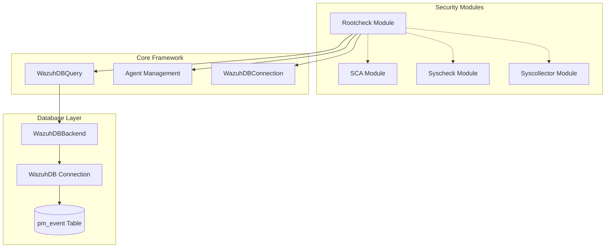
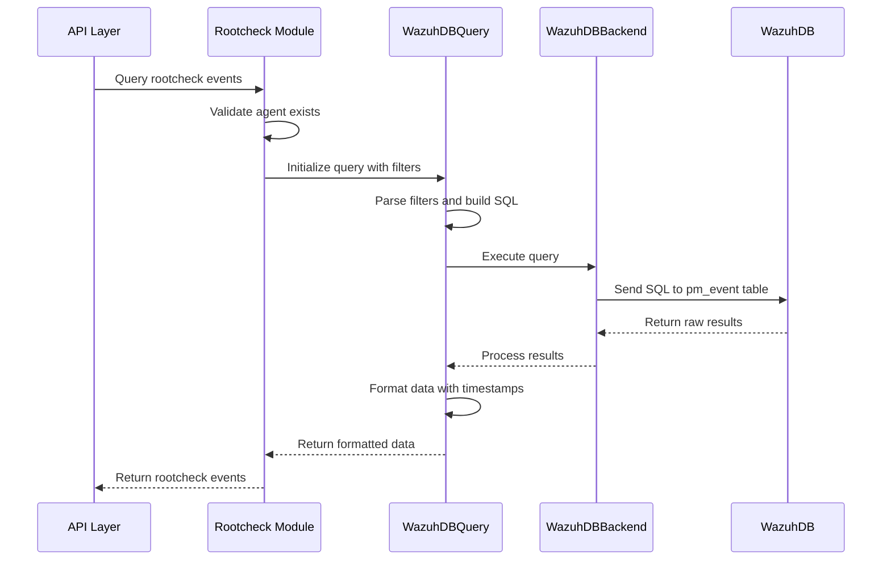
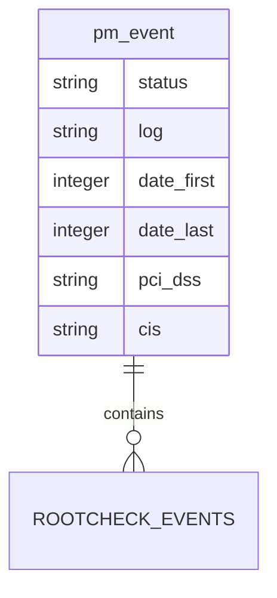
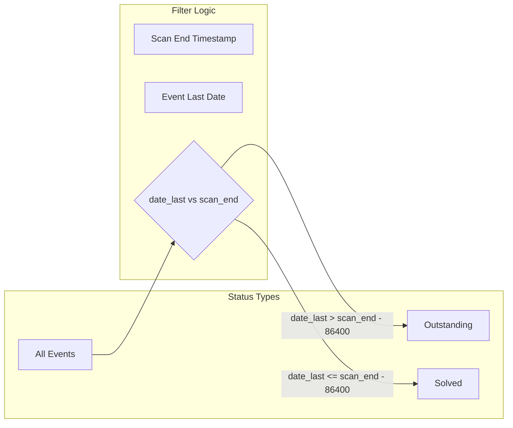

# Rootcheck Module Documentation

## Overview

The Rootcheck module is a specialized security component within the Wazuh framework that provides rootkit detection and system anomaly monitoring capabilities. It implements database query functionality for retrieving and managing rootcheck scan results, enabling security analysts to monitor system integrity and detect potential security threats.

## Architecture

The rootcheck module is part of the broader Security Modules ecosystem within Wazuh, working alongside other security components like SCA (Security Configuration Assessment), Syscheck (File Integrity Monitoring), and Syscollector.



## Core Components

### WazuhDBQueryRootcheck

The primary component that handles database queries for rootcheck events and scan results.

**Key Features:**
- Inherits from `WazuhDBQuery` for standardized database operations
- Manages rootcheck-specific field mappings and filters
- Handles status-based filtering (outstanding, solved, all)
- Provides date formatting and timestamp conversion
- Supports pagination, sorting, and search functionality

**Field Mappings:**
```python
fields = {
    'status': 'status',
    'log': 'log', 
    'date_first': 'date_first',
    'date_last': 'date_last',
    'pci_dss': 'pci_dss',
    'cis': 'cis'
}
```

### Utility Functions

#### last_scan(agent_id: str)
Retrieves the last rootcheck scan information for a specific agent, including start and end timestamps.

#### rootcheck_delete_agent(agent: str, wdb_conn: WazuhDBConnection)
Removes all rootcheck data for a specified agent from the database.

## Data Flow



## Database Schema

The rootcheck module primarily interacts with the `pm_event` table in the agent databases:



## Status Management

The module implements a sophisticated status filtering system:



## Integration Points

### Agent Management Integration
- Validates agent existence before processing queries
- Leverages [agent_management](agent_management.md) for agent information retrieval
- Integrates with agent lifecycle management

### Database Connectivity
- Utilizes [database_connectivity](database_connectivity.md) for WazuhDB connections
- Implements connection pooling and error handling
- Supports both synchronous and asynchronous operations

### Core Framework Integration
- Extends [core_framework](core_framework.md) WazuhDBQuery functionality
- Inherits standardized query processing and validation
- Implements framework-wide error handling patterns

## API Operations

### Query Rootcheck Events
```python
# Initialize rootcheck query
query = WazuhDBQueryRootcheck(
    agent_id="001",
    offset=0,
    limit=100,
    sort={"fields": ["date_last"], "order": "desc"},
    search={"value": "rootkit", "fields": ["log"]},
    select=["status", "log", "date_last"],
    query="status=outstanding",
    count=True,
    get_data=True,
    filters={"status": "outstanding"}
)

# Execute query
results = query.run()
```

### Get Last Scan Information
```python
# Get last scan details
scan_info = last_scan("001")
# Returns: {'start': '2024-01-15 10:30:00', 'end': '2024-01-15 10:45:00'}
```

### Delete Agent Rootcheck Data
```python
# Remove all rootcheck data for agent
with WazuhDBConnection() as wdb_conn:
    rootcheck_delete_agent("001", wdb_conn)
```

## Error Handling

The module implements comprehensive error handling:

- **WazuhException(1603)**: Invalid status filter values
- **WazuhResourceNotFound(1701)**: Agent does not exist
- **WazuhError(2007)**: Agent database not found
- **Connection errors**: Database connectivity issues

## Performance Considerations

### Query Optimization
- Implements efficient status filtering with UNION queries
- Uses indexed date fields for temporal filtering
- Supports pagination to handle large result sets

### Memory Management
- Processes results in configurable chunks
- Implements connection pooling for database access
- Provides lazy loading for large datasets

## Security Features

### Input Validation
- Validates agent IDs and filter parameters
- Sanitizes SQL query inputs
- Implements RBAC integration for access control

### Data Protection
- Filters sensitive information from logs
- Implements secure database connections
- Provides audit trail for data access

## Monitoring and Logging

The module integrates with the [logging_system](logging_system.md) for:
- Query performance monitoring
- Error tracking and alerting
- Audit logging for compliance
- Debug information for troubleshooting

## Configuration

### Default Settings
- Default sort field: `date_last`
- Default sort order: `DESC`
- Date format: `%Y-%m-%d %H:%M:%S`
- Maximum query limit: Inherited from framework settings

### Customization Options
- Field selection and filtering
- Custom sort criteria
- Search parameter configuration
- Status filter customization

## Related Modules

- **[SCA Module](sca.md)**: Security Configuration Assessment
- **[Syscheck Module](syscheck.md)**: File Integrity Monitoring  
- **[Syscollector Module](syscollector.md)**: System Information Collection
- **[Agent Management](agent_management.md)**: Agent lifecycle and information
- **[Database Connectivity](database_connectivity.md)**: Database connection management
- **[Core Framework](core_framework.md)**: Base framework functionality

## Best Practices

### Query Performance
1. Use specific date ranges to limit result sets
2. Implement appropriate pagination for large datasets
3. Utilize indexed fields in filter conditions
4. Cache frequently accessed scan information

### Error Handling
1. Always validate agent existence before queries
2. Implement proper connection cleanup
3. Handle database connectivity issues gracefully
4. Provide meaningful error messages to users

### Security
1. Validate all input parameters
2. Implement proper access controls
3. Log security-relevant operations
4. Sanitize data before database operations

## Future Enhancements

- Real-time rootcheck event streaming
- Enhanced correlation with other security modules
- Machine learning integration for anomaly detection
- Improved performance optimization for large-scale deployments