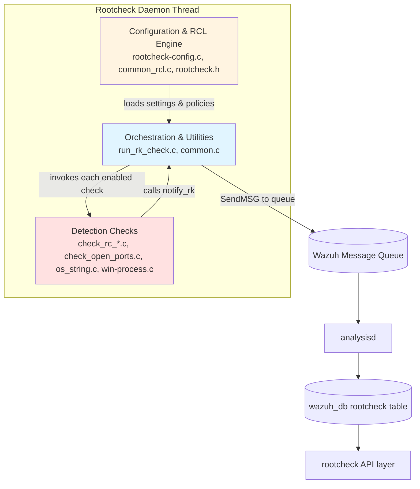
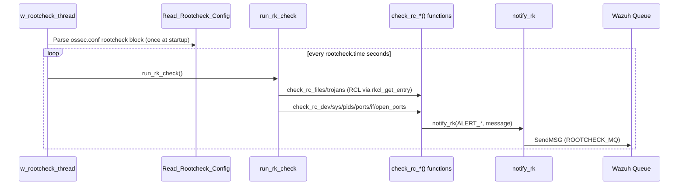

# Rootcheck Module

## 1. Purpose and Overview

**Rootcheck** is a legacy anomaly and rootkit-detection engine built into the Wazuh agent/manager native daemon codebase (`src/rootcheck/`). It performs a battery of host-based heuristics designed to reveal signs of kernel-level rootkits, hidden processes, hidden ports, suspicious file permissions, and policy violations defined through a simple domain-specific configuration language (RCL — Rootcheck Configuration Language).

Historically, Rootcheck was the precursor to the more modern SCA (Security Configuration Assessment) module, and it is still shipped for backward compatibility and legacy policy files (`system_audit`, `rootkit_files`, `rootkit_trojans`, etc.). It runs as a periodic background thread inside the `ossec-syscheckd` process (it shares the daemon with FIM/Syscheck) and reports findings to the alerting pipeline via the internal message queue.

Rootcheck is a pure C component with no direct network-facing interface; it is driven entirely by local configuration (`ossec.conf` / `rootcheck-config`) and communicates results by writing formatted messages to the Wazuh queue, which are then processed by `analysisd` and ultimately exposed through the Wazuh API and Wazuh DB (`wdb_rootcheck.c`) for querying by the [`rootcheck_module`](rootcheck_module.md) API layer.

## 2. Architecture Overview

Rootcheck consists of 14 source/header files that fall into three functional areas:

```mermaid
graph TB
    subgraph Rootcheck Daemon Thread
        ORCH[Orchestration & Utilities<br/>run_rk_check.c, common.c]
        CFG[Configuration & RCL Engine<br/>rootcheck-config.c, common_rcl.c, rootcheck.h]
        CHK[Detection Checks<br/>check_rc_*.c, check_open_ports.c, os_string.c, win-process.c]
    end

    CFG -->|loads settings & policies| ORCH
    ORCH -->|invokes each enabled check| CHK
    CHK -->|calls notify_rk| ORCH
    ORCH -->|SendMSG to queue| QUEUE[(Wazuh Message Queue)]
    QUEUE --> ANALYSISD[analysisd]
    ANALYSISD --> WDB[(wazuh_db rootcheck table)]
    WDB --> APIRC[rootcheck API layer]

    style ORCH fill:#e1f5ff
    style CFG fill:#fff4e1
    style CHK fill:#ffe1e1
```

### Sub-modules

| Sub-module | Description | Documentation |
|---|---|---|
| **Detection Checks** | The individual heuristics that scan the filesystem, network stack, and process table for anomalies (hidden ports, hidden PIDs, promiscuous interfaces, `/dev` and full filesystem scans). | [rootcheck_checks.md](rootcheck_checks.md) |
| **Configuration & RCL Engine** | XML configuration parsing (`Read_Rootcheck_Config`) and the RCL policy interpreter (`rkcl_get_entry`) used to evaluate `system_audit`/`windows_audit` policy files against files, registry keys, directories, and processes. | [rootcheck_config_rcl.md](rootcheck_config_rcl.md) |
| **Orchestration & Core Utilities** | The main scan loop/thread (`run_rk_check`), shared pattern-matching and file-existence helpers (`common.c`), binary string search (`os_string.c`), and the Windows process enumeration helper (`win-process.c`). | [rootcheck_core_utils.md](rootcheck_core_utils.md) |

## 3. High-Level Data / Control Flow

```mermaid
sequenceDiagram
    participant Thread as w_rootcheck_thread
    participant Cfg as Read_Rootcheck_Config
    participant Run as run_rk_check
    participant Checks as check_rc_*() functions
    participant Notify as notify_rk
    participant Queue as Wazuh Queue

    Thread->>Cfg: Parse ossec.conf rootcheck block (once at startup)
    loop every rootcheck.time seconds
        Thread->>Run: run_rk_check()
        Run->>Checks: check_rc_files/trojans (RCL via rkcl_get_entry)
        Run->>Checks: check_rc_dev/sys/pids/ports/if/open_ports
        Checks->>Notify: notify_rk(ALERT_*, message)
        Notify->>Queue: SendMSG (ROOTCHECK_MQ)
    end
```

Key orchestration facts:
- The thread entry point `w_rootcheck_thread` (in `run_rk_check.c`) is spawned by the Syscheck/FIM daemon process (see [syscheckd_core](syscheckd_core.md)) and loops based on `rootcheck.time` (configurable frequency, default 12 hours via `ROOTCHECK_WAIT`).
- Each check function increments error/anomaly counters and calls `notify_rk()`, which either prints to stdout (standalone/test mode) or sends a formatted message through `SendMSG`/`StartMQPredicated` to the local queue (`ROOTCHECK_MQ`) when running inside the HIDS context (`OSSECHIDS`).
- Results flow into `analysisd` decoders and are persisted by `wazuh_db` (see `wdb_rootcheck.c` in the [wazuh_db](wazuh_db.md) module), which backs the REST API endpoints implemented in [`rootcheck_module`](rootcheck_module.md) (`GET/PUT/DELETE /rootcheck`).

## 4. Relationship to Other System Modules

Rootcheck does not operate in isolation; it depends on and is consumed by several other documented modules:

- **[shared_lib](shared_lib.md)** — provides common OS abstraction helpers used throughout Rootcheck: file operations (`file_op.c`), string utilities (`string_op.c`), hashing, and the low-level messaging primitives (`mq_op.c`) used by `notify_rk`.
- **[os_regex](os_regex.md)** — the regex engine (`OS_Regex`, `OS_PRegex`) used by `common.c`, `common_rcl.c`, and `os_string.c` to match file names and binary content against RCL patterns.
- **[os_xml](os_xml.md)** *(part of shared/native daemons)* — used by `rootcheck-config.c` to parse the `<rootcheck>` XML block from `ossec.conf`.
- **[syscheckd_core](syscheckd_core.md)** — Rootcheck's scanning thread is hosted inside the same daemon process as Syscheck/FIM; `run_rk_check.c` directly includes `syscheck.h` and coordinates shutdown state (`fim_shutdown_process_on`) and restart triggers (`os_check_restart_rootcheck`).
- **[wazuh_db](wazuh_db.md)** — persists rootcheck findings (see `wdb_rootcheck.c`, `wdb_parse_rootcheck_*`) so they can be queried later.
- **[rootcheck_module](rootcheck_module.md)** (Python API layer) — exposes rootcheck scan results and control operations (`clear`, `get_last_scan`, `get_rootcheck_agent`) over the Wazuh REST API, ultimately reading from the same `wazuh_db` tables populated by this C daemon.
- **[Rootcheck_Config](Rootcheck_Config.md)** *(Configuration_Data_Structures module)* — defines the `rkconfig`/`_rkconfig` and `_checks` C structs (`rootcheck-config.h`) that back the global `rootcheck` variable used throughout this module.

## 5. Platform Considerations

Several checks are POSIX-only and are stubbed out (no-op) on Windows, while others (`win-process.c`, Windows audit/malware/app checks referenced in `rootcheck.h`) are Windows-specific:

| Check | Linux/Unix | Windows |
|---|---|---|
| `check_rc_dev` | Full implementation | No-op stub |
| `check_rc_if` | Full implementation (promiscuous mode via `ioctl`) | No-op stub |
| `check_rc_pids` | Full implementation (`kill`/`getsid`/`getpgid`/`/proc`) | No-op stub |
| `check_rc_ports` / `check_open_ports` | Full implementation (`netstat` + `bind`/`connect`) | No-op stub |
| `check_rc_sys` | Full filesystem scan, `/dev`, `/proc` skip logic | Adapted paths (`C:\`, `WINDOWS`, `Program Files`) |
| `os_get_process_list` / `os_win32_setdebugpriv` | N/A | Full implementation (Toolhelp32 snapshot) |

## 6. Summary of Core Components by File

| File | Responsibility |
|---|---|
| `check_open_ports.c` | Brute-force TCP/UDP loopback connect scan (0–65535) to detect open ports independent of `netstat`. |
| `check_rc_dev.c` | Recursively inspects `/dev` for unexpected regular files (a classic rootkit hiding spot). |
| `check_rc_if.c` | Detects network interfaces running in promiscuous mode and cross-checks against `ifconfig` output. |
| `check_rc_pids.c` | Detects hidden processes by comparing `kill()`, `getsid()`, `getpgid()`, and `/proc` visibility. |
| `check_rc_ports.c` | Detects hidden/rootkit-obscured ports by comparing raw socket `bind()` results against `netstat`. |
| `check_rc_readproc.c` | Helper used by `check_rc_pids` to determine if a "hidden" PID is actually a kernel thread visible under `/proc/<pid>/task`. |
| `check_rc_sys.c` | Full/partial filesystem walk checking for known rootkit signature files, world-writable files, and dir entry-count mismatches. |
| `common.c` | Shared primitives: pattern matching (`pt_matches`), negate-pattern detection, file/dir existence checks, process list matching. |
| `common_rcl.c` | RCL (Rootcheck Configuration Language) file parser and evaluator (`rkcl_get_entry`) — the audit-policy engine. |
| `os_string.c` | Scans binaries for embedded ASCII strings matching a regex (`os_string`), similar to `strings | grep`. |
| `rootcheck-config.c` | Parses the `<rootcheck>` XML configuration block into the global `rootcheck` struct. |
| `rootcheck.h` | Central header declaring the `rkconfig` struct, alert-type constants, and all check function prototypes. |
| `run_rk_check.c` | Orchestrates a full scan pass, manages the background thread, and implements `notify_rk` for alert dispatch. |
| `win-process.c` | Windows-only process enumeration (via Toolhelp32) used by Windows audit/malware/app checks. |

## 7. Further Reading

- [rootcheck_checks.md](rootcheck_checks.md) — Detection Checks sub-module
- [rootcheck_config_rcl.md](rootcheck_config_rcl.md) — Configuration & RCL Engine sub-module
- [rootcheck_core_utils.md](rootcheck_core_utils.md) — Orchestration & Core Utilities sub-module
- [syscheckd_core.md](syscheckd_core.md) — Host daemon that hosts the Rootcheck thread
- [rootcheck_module.md](rootcheck_module.md) — REST API layer exposing Rootcheck results
- [wazuh_db.md](wazuh_db.md) — Persistence layer for scan results
- [shared_lib.md](shared_lib.md) — Common C utility library used throughout
- [os_regex.md](os_regex.md) — Regex engine used for pattern matching
- [Rootcheck_Config.md](Rootcheck_Config.md) — Configuration data structures (`rkconfig`)
