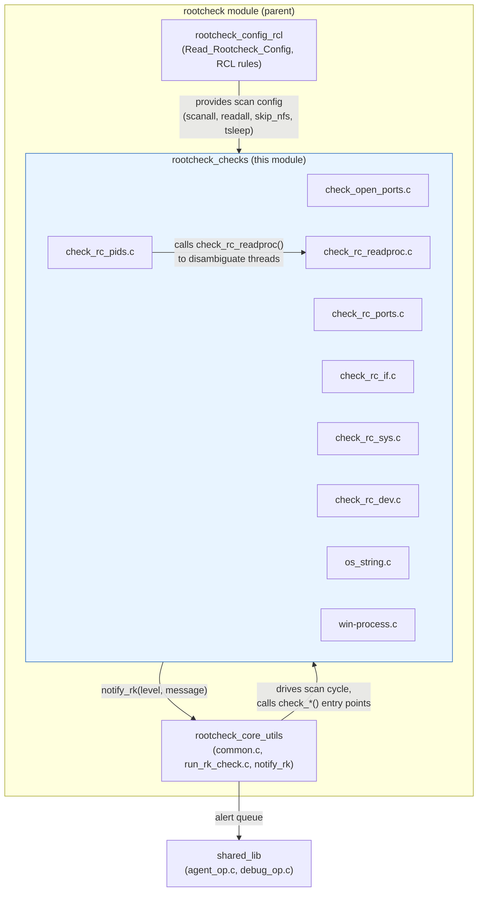
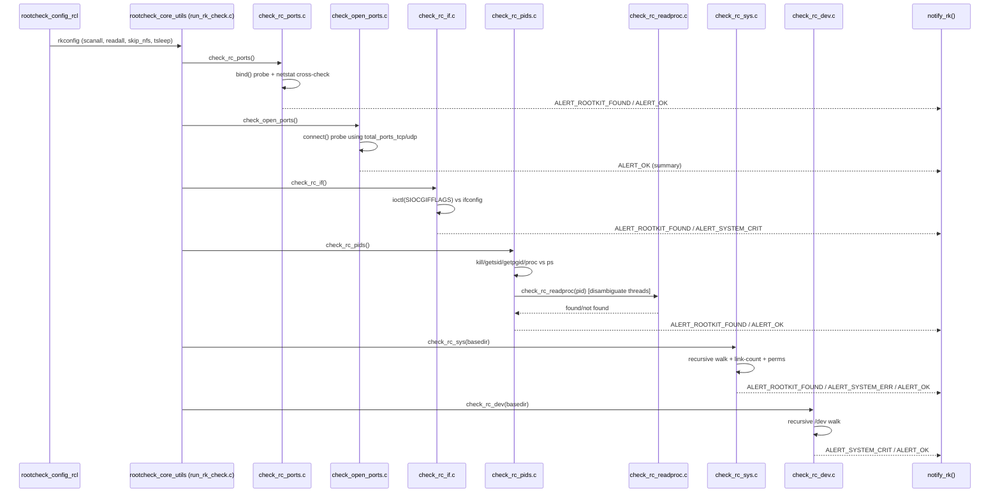

# Rootcheck Checks Module

## Introduction

The **`rootcheck_checks`** module is the platform-specific detection engine at the heart of Wazuh's Rootcheck component. It implements the individual, low-level probes that inspect a running Unix/Linux or Windows host for signs of rootkits, kernel-level tampering, and other integrity anomalies. Rootcheck compares multiple, independent views of the same operating-system state (e.g., "what does `kill()` say a process is?" vs. "what does `/proc` say?") and raises an alert whenever those views disagree — a classic technique for detecting hidden processes, ports, and files installed by kernel-level rootkits.

This module belongs to the broader **`rootcheck`** subsystem (part of the [Agent & Manager Native Daemons (C)](Agent_%26_Manager_Native_Daemons_%28C%29.md) family) and is a sibling of `rootcheck_config_rcl` (RCL policy engine) and `rootcheck_core_utils` (shared scan orchestration helpers). It is compiled into both the standalone `rootcheck` daemon context and, historically, embedded (`OSSECHIDS`) into the Syscheck/agent binary.

## Purpose and Scope

The module answers one core question for each subsystem it covers: **"Is what the kernel/OS reports consistent across independent APIs?"** Each check file targets a specific OS resource:

| Check | File | Detects |
|---|---|---|
| Open ports | `check_open_ports.c` | Ports responding to `connect()` that are unexpectedly open |
| Hidden ports | `check_rc_ports.c` | Ports bound successfully (i.e., not already in use) but *not* reported by `netstat` |
| Promiscuous interfaces | `check_rc_if.c` | Network interfaces in promiscuous mode (packet sniffers) not shown by `ifconfig` |
| Hidden processes | `check_rc_pids.c` | Processes visible via `kill()`, `getsid()`, `getpgid()`, or `/proc` but not via `ps` (and vice-versa) |
| `/proc` cross-check helper | `check_rc_readproc.c` | Confirms whether a PID is a kernel thread not enumerated under `/proc/<pid>` |
| Filesystem anomalies | `check_rc_sys.c` | World-writable/executable files, SUID files, directory link-count mismatches, hidden files |
| Hidden device files | `check_rc_dev.c` | Unexpected regular files planted inside `/dev` |
| Trojaned binary detection | `os_string.c` | Extracts ASCII strings from binaries and regex-matches them against known trojan signatures |
| Windows process enumeration | `win-process.c` | Enumerates Windows processes with `SeDebugPrivilege` for full process-list visibility |

All detection results are reported through the shared `notify_rk()` callback (declared in `rootcheck.h`, implemented in `rootcheck_core_utils` / `run_rk_check.c`), which routes alerts with severities such as `ALERT_OK`, `ALERT_SYSTEM_ERR`, `ALERT_SYSTEM_CRIT`, and `ALERT_ROOTKIT_FOUND`.

## Architecture Overview

### Relationship to Sibling Modules

- **[rootcheck_config_rcl](rootcheck_config_rcl.md)** — Parses `<rootcheck>` configuration blocks and RCL (Rootcheck Language) policy files (`Read_Rootcheck_Config`, `common_rcl.c`), producing the `rkconfig` structure (`rootcheck-config.h`) that governs whether/how the checks in this module run (e.g., `scanall`, `readall`, `skip_nfs`, `notify`, `tsleep`).
- **rootcheck_core_utils** — Provides `check_rc_dev`/`check_rc_sys`/etc. orchestration glue (`common.c`) and the real-time status logger (`run_rk_check.c::log_realtime_status_rk`), plus the shared `notify_rk()` alerting function these checks invoke.
- **[Wazuh_Modules_Daemon_(C)](Wazuh_Modules_Daemon_%28C%29.md)** (`wm_sca.c` — SCA module) — a conceptually related but functionally distinct component; SCA performs policy-based configuration auditing, whereas `rootcheck_checks` performs live-system cross-validation detection.
- **[Configuration_Data_Structures_(C_Headers)](Configuration_Data_Structures_%28C_Headers%29.md)** — `rootcheck-config.h` defines `_rkconfig`/`rkconfig` and `_checks`, consumed by this module via the global `rootcheck` struct.
- **[Shared_Modules_Infrastructure_(C++)](Shared_Modules_Infrastructure_%28C%2B%2B%29.md)** and **shared_lib** (`src/shared`) — supply cross-platform helpers used throughout: `is_file`, `isfile_ondir`, `wopendir`, `check_ignore`, `IsNFS`, `skipFS`, debug logging macros (`mtdebug1`, `mterror`), and `OS_PRegex`.
- **[Syscheck___FIM_Daemon_(C_C++)](Syscheck___FIM_Daemon_%28C_C%2B%2B%29.md)** — Historically, Rootcheck ran embedded inside the Syscheck/agent daemon (guarded by the `OSSECHIDS` macro), sharing the sleep-throttling behavior (`rootcheck.tsleep`) to avoid resource spikes during a scan.

## Component Details

### 1. Open Port Scanning — `check_open_ports.c`

Actively probes all 65,536 TCP and UDP ports by attempting a real `connect()` (loopback, `INADDR_LOOPBACK`) for any port previously found "in use" (flagged in `total_ports_tcp[]`/`total_ports_udp[]`, populated by `check_rc_ports.c`). Successfully connecting ports are accumulated into a human-readable open-ports summary string and reported once via `ALERT_OK`.

- **Key functions:** `connect_to_port()` (internal), `try_to_access_ports()` (internal), `check_open_ports()` (public entry point)
- **Platform:** POSIX only (`#ifndef WIN32`, guarded further by `#ifndef OSSECHIDS`)

### 2. Hidden Port Detection — `check_rc_ports.c`

The core rootkit-port detector. For every port (0–65535) and both protocols, it attempts to `bind()` locally:
- If the `bind()` **fails**, the port is considered "in use" by some process (recorded into `total_ports_tcp`/`total_ports_udp`, consumed by `check_open_ports.c`).
- The module then cross-checks that same port against `netstat` output (`run_netstat()`). If `netstat` does **not** report a port that our own `bind()` probe found in-use, and this holds true after a brief sleep-and-retest (to eliminate race conditions), Rootcheck raises `ALERT_ROOTKIT_FOUND` — a strong signal of a hidden network listener (LKM-based rootkit) or a trojaned `netstat` binary.
- Requires `netstat` to be present (`is_program_available("netstat")`); otherwise the check is skipped with `ALERT_SYSTEM_ERR`.

### 3. Promiscuous Interface Detection — `check_rc_if.c`

Uses `ioctl(SIOCGIFCONF)`/`ioctl(SIOCGIFFLAGS)` to enumerate network interfaces and detect the `IFF_PROMISC` flag (indicating a packet sniffer). Cross-validates against `ifconfig | grep PROMISC` output — if the kernel-level flag is set but `ifconfig` doesn't report it, this indicates a compromised `ifconfig` binary or kernel rootkit (`ALERT_ROOTKIT_FOUND`); if both agree, it's flagged as `ALERT_SYSTEM_CRIT` (still suspicious, but self-consistent).

### 4. Hidden Process Detection — `check_rc_pids.c`

The most complex check in the module. For each candidate PID up to `MAX_PID`, it independently probes process existence via:
1. `kill(pid, 0)` — signal delivery test
2. `getsid(pid)` — session ID lookup
3. `getpgid(pid)` — process group lookup
4. `/proc/<pid>` presence, via three different filesystem APIs (`proc_stat`, `proc_read`, `proc_opendir`)
5. `ps -p <pid>` — presence in the process-list utility's output

If all these mechanisms disagree (e.g., `kill()` sees the process but `ps` does not), the discrepancy is re-verified after a short delay (`rootcheck.tsleep`, throttled via `select()`/`Sleep()`), to rule out a process that simply exited between the first and second checks. If the disagreement persists, `check_rc_readproc()` is consulted (see below) to rule out kernel threads (which legitimately don't appear under `/proc`). A confirmed mismatch raises `ALERT_ROOTKIT_FOUND`; excessive mismatches (>15) short-circuit the scan with `ALERT_SYSTEM_CRIT` to avoid alert flooding.

### 5. `/proc` Thread Disambiguation — `check_rc_readproc.c`

A helper invoked exclusively by `check_rc_pids.c`. Recursively walks `/proc/<pid>/task/<tid>` to determine if a given ID is actually a **thread** (LWP) of another process rather than a genuinely hidden PID, preventing false positives on multi-threaded processes.

### 6. Filesystem Anomaly Scanning — `check_rc_sys.c`

Performs a recursive filesystem walk (default: key system directories like `/bin`, `/sbin`, `/etc`, `/dev`; optionally the entire filesystem via `rootcheck.scanall`). For every file/directory encountered it:
- Compares `readdir()`-visible entries against `lstat()` results to detect **directory link-count mismatches** (a classic sign of hidden files within a directory — the reported hard-link count won't match the actual number of subdirectories found).
- Detects **world-writable + executable** files (`_wx` list) and **world-writable** files (`_ww` list), and flags root-owned world-writable files as critical.
- Records **SUID** files (`_suid` list) for review.
- Optionally reads full file contents and compares byte counts against `stat()`-reported size (`do_read` mode) to catch size-spoofing rootkits.
- Cross-references filenames against a known rootkit signature database (`rk_sys_file[]`/`rk_sys_name[]`, populated by the RCL config module).
- Skips NFS mounts (`IsNFS`) and filesystems with unreliable link-count semantics (`skipFS`, e.g., btrfs) when configured to do so.
- Results are logged to `rootcheck-rw-rw-rw-.txt`, `rootcheck-rwxrwxrwx.txt`, and `rootcheck-suid-files.txt` for administrator review.

### 7. Hidden Device File Detection — `check_rc_dev.c`

Recursively scans `/dev`, flagging any **regular file** (as opposed to device nodes) found there as `ALERT_SYSTEM_CRIT`, since legitimate device directories should contain only device special files, not arbitrary data. Maintains an ignore-list of known-benign non-device files (`MAKEDEV`, `.udev*`, Solaris device-management lock files, etc.) plus full-path exclusions (e.g., `shm/sysconfig`).

### 8. Trojaned Binary String Scanning — `os_string.c`

An embedded/adapted version of BSD's classic `strings(1)` utility. Extracts printable ASCII strings (minimum length `STR_MINLEN`) from a binary file — with special handling of `a.out`/COFF executable headers (`EXEC`/`aouthdr` typedefs, `N_TXTOFF`/`N_BADMAG` macros for locating the text/data segment) — and regex-matches (`OS_PRegex`) each string against a supplied pattern. Used by the RCL policy engine to detect known rootkit/trojan signature strings embedded in system binaries.

### 9. Windows Process Enumeration — `win-process.c`

The Windows counterpart to the POSIX process-hiding checks. Because standard Windows APIs (`CreateToolhelp32Snapshot`, `Process32First/Next`) require elevated privilege to see all processes, this component:
1. Acquires a thread token and impersonates self if needed (`ImpersonateSelf`).
2. Enables `SeDebugPrivilege` via `os_win32_setdebugpriv()` (a documented low-level Windows technique).
3. Snapshots the full process list (`TH32CS_SNAPPROCESS`) and, for each process, a module snapshot (`TH32CS_SNAPMODULE`) to resolve the full executable path.
4. Builds an `OSList` of `Proc_Info` structures (`p_name`, `p_path`) for downstream comparison/consistency checks.
5. Restores privilege state afterward.

## Data Flow / Scan Sequence

## Key Design Patterns

- **Cross-source consistency checking**: Every check queries the *same* fact (does this port/process/file exist?) through at least two independent OS interfaces and treats disagreement as a signal of tampering.
- **Race-condition mitigation**: Before declaring a finding, most checks re-verify after a short, configurable delay (`rootcheck.tsleep`) to filter out normal process/port churn.
- **Throttling for low system impact**: `select()`-based (POSIX) or `Sleep()`-based (Windows) micro-pauses prevent the scan from monopolizing the CPU during expensive brute-force checks (e.g., full 65535-port scans, full-PID-space walks).
- **Fail-safe alert flooding control**: Hard caps on repeated findings (`_errors > 15` for PIDs, `_errors > 20` for ports) escalate to a single `ALERT_SYSTEM_CRIT` summary rather than emitting hundreds of individual alerts.
- **Platform conditional compilation**: POSIX-specific checks are guarded by `#ifndef WIN32` with Windows stub no-ops; `win-process.c` is the inverse, guarded by `#ifdef WIN32`.

## Configuration & Control Flow

This module does not parse configuration itself; it consumes the global `rootcheck` struct (type `rkconfig`, defined in `rootcheck-config.h` — see [Configuration_Data_Structures_(C_Headers)](Configuration_Data_Structures_%28C_Headers%29.md) → **Rootcheck_Config**) populated by `rootcheck_config_rcl`. Relevant fields consumed here include:

| Field | Used by | Effect |
|---|---|---|
| `scanall` | `check_rc_sys.c` | Scan entire filesystem vs. a fixed set of key directories |
| `readall` | `check_rc_sys.c` | Read full file contents to verify size, not just `stat()` |
| `skip_nfs` | `check_rc_sys.c` | Skip NFS-mounted directories |
| `tsleep` | `check_rc_pids.c`, `check_rc_ports.c` (via `#ifdef OSSECHIDS`) | Delay before re-verifying a suspected anomaly |
| `notify` | `check_rc_sys.c` | Whether to write detail files (`rootcheck-*.txt`) or only queue alerts |

## Related Documentation

- [rootcheck_config_rcl](rootcheck_config_rcl.md) — RCL policy engine and configuration parsing that drives this module's checks
- [Configuration_Data_Structures_(C_Headers)](Configuration_Data_Structures_%28C_Headers%29.md) — `rootcheck-config.h` (`rkconfig`, `_checks`) definitions
- [Agent_&_Manager_Native_Daemons_(C)](Agent_%26_Manager_Native_Daemons_%28C%29.md) — parent grouping including `remoted`, `monitord`, `os_auth`, and `shared_lib`
- [Syscheck___FIM_Daemon_(C_C++)](Syscheck___FIM_Daemon_%28C_C%2B%2B%29.md) — historical host process for embedded Rootcheck execution
- [Wazuh_Modules_Daemon_(C)](Wazuh_Modules_Daemon_%28C%29.md) — `wm_sca.c` (Security Configuration Assessment), a related but distinct policy-based auditing module
- [rootcheck_module](rootcheck_module.md) (API/framework layer) — REST API and Python-level exposure of Rootcheck scan results (`GET /rootcheck`, `WazuhDBQueryRootcheck`)
