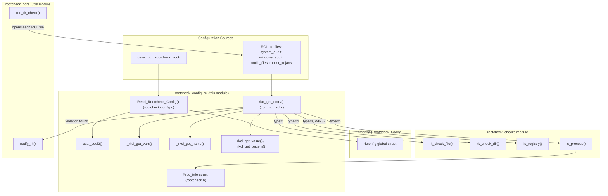
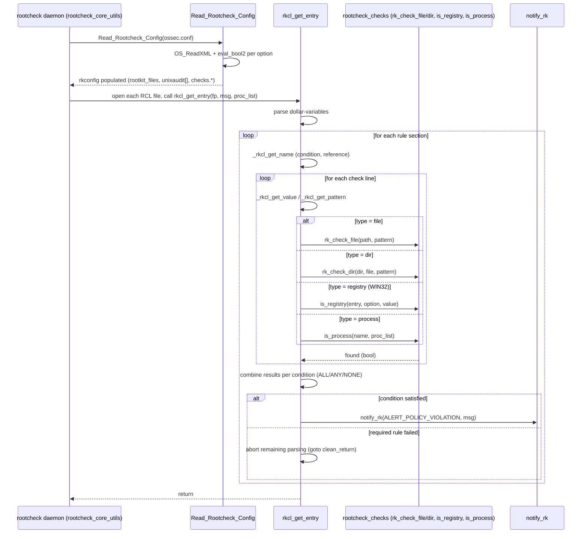
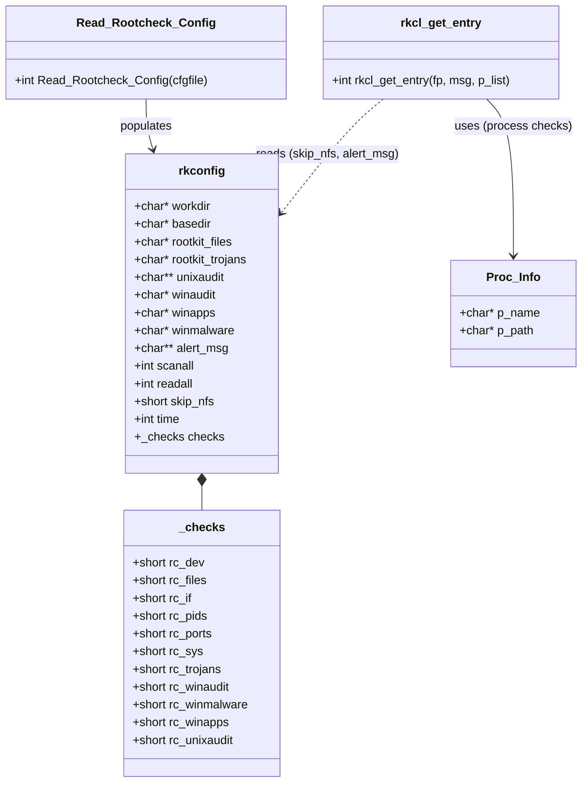
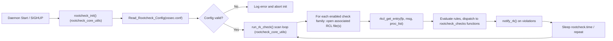

# Rootcheck Config & RCL Engine (`rootcheck_config_rcl`)

## Introduction

The `rootcheck_config_rcl` module is the **configuration loader and RCL (Rootcheck Configuration Language) parsing engine** for the Wazuh Rootcheck component. It is a small but critical piece of the native `rootcheck` daemon subsystem (see [rootcheck_checks](rootcheck_checks.md) and [rootcheck_core_utils](rootcheck_core_utils.md)) responsible for:

1. Reading the `<rootcheck>` block from `ossec.conf` and populating the global `rkconfig` structure (`Read_Rootcheck_Config`).
2. Parsing the `.txt` RCL rule files (system audit, Windows audit, malware/trojan signature files, etc.) that describe *what* to check and the pass/fail logic that must be applied to raise a policy-violation alert (`rkcl_get_entry` in `common_rcl.c`).
3. Exposing the shared `Proc_Info` data type used while checking whether a monitored process is currently running.

This module sits between the raw XML/text configuration files on disk and the actual check-execution logic implemented in [rootcheck_checks](rootcheck_checks.md) (`check_rc_*` functions). It has no network or database responsibilities — it is a pure configuration/parsing layer invoked once at rootcheck startup (and on `SIGHUP`/reload) to build the in-memory rule set that the scanning engine will later evaluate.

---

## Purpose and Core Functionality

| Responsibility | Function / Component |
|---|---|
| Load rootcheck XML config into `rkconfig` | `Read_Rootcheck_Config` (`rootcheck-config.c`) |
| Convert `yes`/`no` XML string values into booleans | `eval_bool2` (internal helper) |
| Parse `.txt` RCL policy files line-by-line | `rkcl_get_entry` (`common_rcl.c`) |
| Resolve `$variable` substitution inside RCL files | `_rkcl_get_vars` (internal helper) |
| Parse `[name] [condition] [reference]` RCL section headers | `_rkcl_get_name` (internal helper) |
| Parse `f:`, `r:`, `p:`, `d:` typed check values and negation (`!`) | `_rkcl_get_value` / `_rkcl_get_pattern` (internal helpers) |
| Dispatch individual checks to file/dir/registry/process handlers | `rk_check_file`, `rk_check_dir`, `is_registry`, `is_process` (implemented in [rootcheck_checks](rootcheck_checks.md)) |
| Shared process-info structure used by process checks | `Proc_Info` / `_Proc_Info` (`rootcheck.h`) |

### Configuration data model

The module operates on the `rkconfig` structure (defined in [Rootcheck_Config](Rootcheck_Config.md), part of `Configuration_Data_Structures_(C_Headers)`), which aggregates:

- Scan behavior flags (`scanall`, `readall`, `skip_nfs`, `time`/frequency, `notify` target — queue or syslog).
- Paths to RCL rule files (`rootkit_files`, `rootkit_trojans`, `unixaudit[]`, `winaudit`, `winapps`, `winmalware`).
- The nested `_checks` struct toggling each individual check family (`rc_dev`, `rc_files`, `rc_if`, `rc_pids`, `rc_ports`, `rc_sys`, `rc_trojans`, and platform-specific `rc_winaudit`/`rc_winmalware`/`rc_winapps` or `rc_unixaudit`).
- A transient `alert_msg[]` array used to accumulate messages that will be logged when a policy violation is detected.

---

## Architecture Overview



---

## Component Details

### `Read_Rootcheck_Config` (`src/rootcheck/rootcheck-config.c`)

Entry point invoked during rootcheck initialization (called from `rootcheck_init`, part of [rootcheck_core_utils](rootcheck_core_utils.md)). It:

1. Opens and parses the given `ossec.conf`-style XML file with `OS_ReadXML` ([os_xml module](Agent_%26_Manager_Native_Daemons_(C).md)).
2. Verifies the `<rootcheck>` root element exists; aborts with an error otherwise.
3. Reads scalar options (`scanall`, `readall`, `work_directory`, `base_directory`, per-check `yes`/`no` toggles) using `OS_GetOneContentforElement`, converting boolean text via the local helper `eval_bool2`.
4. Reads list-type options (`system_audit` → `unixaudit[]`) via `OS_GetContents`.
5. On agent builds (`OSSECHIDS` not defined at daemon side — note the inverted guard) reads the scan `frequency` and stores it in `rootcheck.time`.
6. Populates the platform-specific check flags (`checks.rc_winaudit/rc_winmalware/rc_winapps` on Windows vs. `checks.rc_unixaudit` elsewhere).
7. Cleans up the XML tree and returns `0` on success or `OS_INVALID`/`-1` on error.

The resulting `rkconfig` global (declared `extern rkconfig rootcheck;` in `rootcheck.h`) is subsequently consumed by every `check_rc_*` function in [rootcheck_checks](rootcheck_checks.md) and by the main scan loop `run_rk_check()` in [rootcheck_core_utils](rootcheck_core_utils.md).

### `rkcl_get_entry` and helpers (`src/rootcheck/common_rcl.c`)

This is the RCL (Rootcheck Configuration Language) interpreter shared by both the Unix/Windows audit checks and the rootkit file/trojan signature checks. RCL files use a simple line-oriented format:

```
$var1=/some/path;
[Rule name] [all] [CIS Reference 1.1]
f:$var1/file.txt;
!r:HKEY_LOCAL_MACHINE\...:value -> pattern;
d:$var1 -> filename -> pattern;
p:some_process_name;
```

Processing flow:

1. **Variable pass** — `_rkcl_get_vars` reads all `$name=value;` declarations at the top of the file into an `OSStore` map.
2. **Section header parsing** — `_rkcl_get_name` extracts the `[name] [condition] [reference]` triplet from lines like `[Rule name] [all] [CIS 1.1]`, mapping the condition text to bitmask flags: `RKCL_COND_ALL`, `RKCL_COND_ANY`, `RKCL_COND_NON` (none), optionally combined with `RKCL_COND_REQ` (required) or flagged `RKCL_COND_INV` on invalid input.
3. **Value line parsing** — `_rkcl_get_value` extracts the check type prefix (`f` file, `r` registry, `p` process, `d` directory) and the value string, honoring an optional leading `!` negation. `_rkcl_get_pattern` extracts the `-> pattern` (and nested `-> filename -> pattern` for directory checks) suffix used for content matching.
4. **Dispatch** — Depending on `type`, the parsed value is delegated to the appropriate low-level checker function implemented in [rootcheck_checks](rootcheck_checks.md):
   - `RKCL_TYPE_FILE` → `rk_check_file()`
   - `RKCL_TYPE_DIR` → `rk_check_dir()` (supports comma-separated multi-directory values and NFS skip logic via `rootcheck.skip_nfs`)
   - `RKCL_TYPE_REGISTRY` (Windows only) → `is_registry()`
   - `RKCL_TYPE_PROCESS` → `is_process()`, which walks a process list built from `Proc_Info` entries.
5. **Condition evaluation** — results of each value line are combined according to the rule's condition (`ALL`, `ANY`, `NONE`), tracking early-exit states (`g_found = -1` / `not_found = -1`) to short-circuit evaluation.
6. **Alerting** — when a rule's aggregate condition is satisfied, `notify_rk(ALERT_POLICY_VIOLATION, msg)` (in [rootcheck_core_utils](rootcheck_core_utils.md)) is invoked once per accumulated message in `rootcheck.alert_msg[]`, optionally including the CIS/reference tag. If the rule condition includes `RKCL_COND_REQ` and it is not satisfied, parsing of the remaining file is aborted (`goto clean_return`), since subsequent rules are considered dependent on it.
7. The function loops reading subsequent `[name] [condition] [reference]` sections until EOF, then frees the variable store and any pending name buffer.

### `Proc_Info` (`src/rootcheck/rootcheck.h`)

A minimal data holder used by `os_get_process_list()` / `is_process()` (in [rootcheck_checks](rootcheck_checks.md)) to represent a running process:

```c
typedef struct _Proc_Info {
    char *p_name;
    char *p_path;
} Proc_Info;
```

It decouples the RCL process-check logic in this module from the OS-specific process enumeration implementation.

---

## Data Flow: RCL Rule Evaluation



---

## Component Interaction Diagram



---

## Position in the Overall System

`rootcheck_config_rcl` is a child module of `rootcheck` inside **Agent & Manager Native Daemons (C)**, alongside two sibling modules:

- **[rootcheck_checks](rootcheck_checks.md)** — implements the actual low-level checkers (`check_rc_dev`, `check_rc_if`, `check_rc_pids`, `check_rc_ports`, `check_rc_sys`, `check_rc_readproc`, `os_string`, Windows process listing) that `rkcl_get_entry` dispatches into.
- **[rootcheck_core_utils](rootcheck_core_utils.md)** — implements the daemon's scan loop (`run_rk_check`), queue/syslog notification (`notify_rk`), and common filesystem helpers used across checks.

At a broader level, this module is invoked from the native `rootcheck` scanning thread which runs inside the agent/manager process (see [Agent & Manager Native Daemons (C)](Agent_%26_Manager_Native_Daemons_(C).md) root module). Its output — rootcheck alerts — is ultimately picked up by:

- The **wazuh_modules / logcollector / analysisd pipeline** for alert generation.
- The **Framework rootcheck API layer** ([rootcheck_module](rootcheck_module.md) in the API & Management Framework), which exposes historical rootcheck scan results (`WazuhDBQueryRootcheck`, `get_last_scan`, `get_rootcheck_agent`) stored via `wdb` — a separate consumer path that reads from `wazuh-db` rather than from this parsing module directly.
- The `rootcheck-config.c`/`common_rcl.c` files are compiled as part of the same binary as [rootcheck_checks](rootcheck_checks.md) and [rootcheck_core_utils](rootcheck_core_utils.md); together they form the complete native `rootcheck` daemon component.

Configuration structures consumed here (`rkconfig`, `_checks`) are defined in **[Rootcheck_Config](Rootcheck_Config.md)** under `Configuration_Data_Structures_(C_Headers)`, which this module directly populates at startup.

---

## Process Flow: Rootcheck Startup & Reload



---

## Key Design Notes

- **Guarded by `OSSECHIDS`**: `Read_Rootcheck_Config` is compiled only when `OSSECHIDS` is *not* defined (`#ifndef OSSECHIDS`), meaning this is the **agent/manager-side native daemon** implementation, distinct from any server-side (`OSSECHIDS`) analysis path.
- **Memory ownership**: `_rkcl_get_name` and RCL parsing routines allocate strings via `strdup`/`os_strdup` that the caller (`rkcl_get_entry`) is responsible for freeing at each loop iteration and at `clean_return`.
- **NFS-aware directory checks**: `rk_check_dir` calls are skipped when `IsNFS(dir)` is true and `rootcheck.skip_nfs` is enabled, avoiding expensive/unsafe scans of network filesystems.
- **Windows environment variable expansion**: On Windows builds, file/registry values are expanded via `ExpandEnvironmentStrings` and prefixed with the resolved `%WINDIR%`-derived root directory (`_rkcl_getrootdir`).
- **Extensibility**: Adding a new RCL value type only requires extending the `RKCL_TYPE_*` enum and the dispatch `if/else` chain in `rkcl_get_entry`; the variable/name/pattern parsing helpers are type-agnostic.
