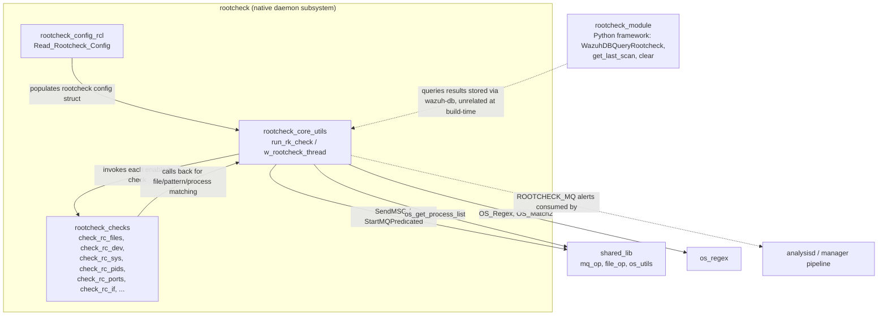
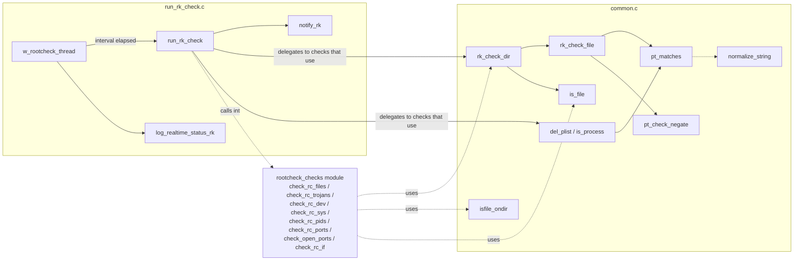
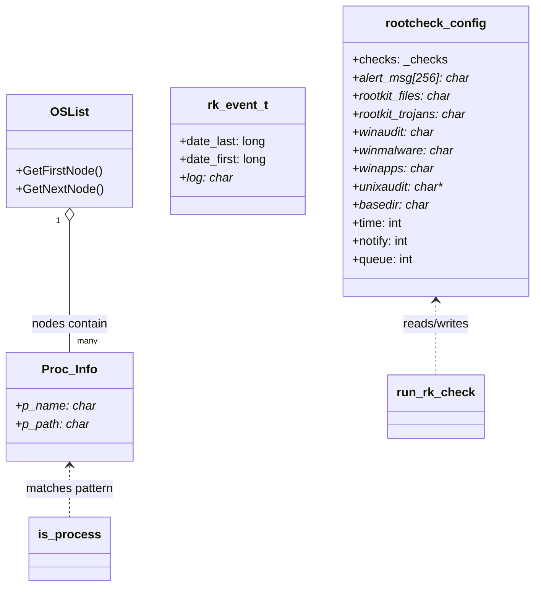
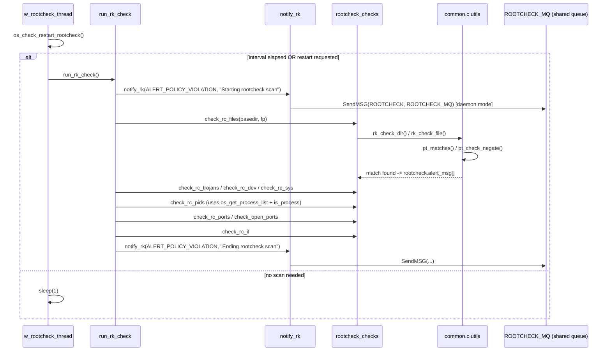
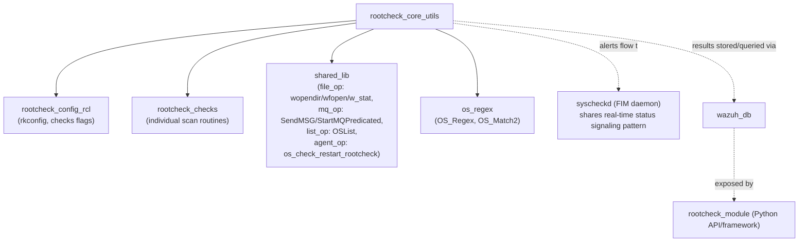

# Rootcheck Core Utils

## Introduction

`rootcheck_core_utils` is the operational core of the Wazuh **Rootcheck** engine, the legacy agent/manager subsystem that performs signature-based rootkit, hidden-process, and system-anomaly detection. This module supplies two complementary layers of functionality:

1. **Generic scanning utilities** (`src/rootcheck/common.c`) — reusable primitives for recursively walking directories, matching file content against patterns (with negation and regex support), verifying file existence through multiple system calls (to defeat rootkit hooking), and inspecting the process list for hidden or suspicious processes.
2. **Scan orchestration & lifecycle** (`src/rootcheck/run_rk_check.c`) — the top-level driver (`run_rk_check`) that sequences all individual Rootcheck checks, the background thread (`w_rootcheck_thread`) that schedules periodic scans, and status/alert notification logic (`notify_rk`, `log_realtime_status_rk`).

Together these files form the "engine room" of Rootcheck: they do not implement any individual check themselves (those live in the sibling `rootcheck_checks` module) but provide the shared infrastructure that every check depends on and the control loop that ties them together into a single scan cycle.

---

## Role in the System

Rootcheck is one of the native C daemons/subsystems bundled into the agent and manager processes (see `Agent_&_Manager_Native_Daemons_(C)`). It is a sibling of `rootcheck_checks` (the individual detection routines) and `rootcheck_config_rcl` (configuration loading and RCL rule parsing). `rootcheck_core_utils` sits between these two: it is invoked by the configuration/lifecycle layer to start a scan, and it in turn invokes the individual checks, using its own utility functions to perform the low level file/pattern/process comparisons that the checks need.

Notes on the diagram:
- `rootcheck_config_rcl` and `rootcheck_checks` are sibling modules under the same parent `rootcheck` — see [rootcheck_config_rcl.md](rootcheck_config_rcl.md) and [rootcheck_checks.md](rootcheck_checks.md).
- The Python-side `rootcheck_module` (`framework/wazuh/rootcheck.py`, `framework/wazuh/core/rootcheck.py`, API controllers) exposes historical Rootcheck scan results stored in `wazuh-db` through the REST API; it does not call this C code directly, but consumes data this module (indirectly, via alerts and wazuh-db) helps produce. See [rootcheck_module.md](rootcheck_module.md) for that side.
- Alerts generated here are sent to the `ROOTCHECK_MQ` queue, consumed downstream by the analysis engine, similar to how other native daemons publish events (see [shared_lib.md](shared_lib.md) for the generic queue plumbing used).

---

## Component Overview

### `src/rootcheck/common.c`

| Function | Purpose |
|---|---|
| `rk_check_dir` | Recursively scans a directory tree (following the `wopendir`/`readdir` shared helpers) looking for files matching a name pattern (plain glob via `OS_Match2` or regex via `r:` prefix using `OS_Regex`), and applies the content pattern check to any match. |
| `rk_check_file` | Reads a file's content line by line and evaluates whether the configured pattern (which may be a single expression, a full-negate expression, or a comma-separated file list) matches. Generates a de-duplicated alert message in `rootcheck.alert_msg` when a match (or failed negation) is found. |
| `pt_check_negate` | Determines whether an entire pattern expression is composed solely of negated (`!`) sub-expressions joined by `&&`, which changes the alerting semantics in `rk_check_file`. |
| `pt_matches` | The pattern-matching engine: supports `=:` (case-insensitive equality), `r:` (regex via `OS_Regex`), `<:`/`>:` (lexicographic comparison), plain equality (with Windows environment variable expansion), negation (`!`) and `&&` conjunctions. |
| `normalize_string` | Trims leading/trailing whitespace and tabs from a string in place. |
| `isfile_ondir` | Checks whether a given filename exists as a direct entry of a directory using `readdir` (used to detect discrepancies between `stat`-based and `readdir`-based file visibility — a classic rootkit-hiding detection technique). |
| `is_file` | Multi-method file/directory existence check (`wopendir`, `errno==ENOTDIR`, `w_stat`, `waccess`, `wfopen`) designed to catch rootkits that selectively hide files from some system calls but not others. |
| `del_plist` / `is_process` | Manage and query an `OSList` of `Proc_Info` (see [shared_lib.md](shared_lib.md) `OSList`) built from `os_get_process_list()`, used to detect hidden/suspicious processes by pattern-matching their path against configured signatures. |

### `src/rootcheck/run_rk_check.c`

| Function | Purpose |
|---|---|
| `notify_rk` | Central alert/notification sink. In standalone/CLI mode it prints `[OK]`/`[ERR]`/`[INFO]`/`[FAILED]` to stdout; in daemon mode (`OSSECHIDS`) it forwards policy-violation messages to the `ROOTCHECK_MQ` queue via `SendMSG`, reconnecting through `StartMQPredicated` on failure. |
| `run_rk_check` | The main scan driver. Resolves the scan base directory, resets internal counters, and sequentially invokes (when enabled in configuration) each check from `rootcheck_checks`: rootkit file signatures, trojan binary signatures, Windows audit/malware/apps checks (Windows only) or Unix audit checks (POSIX only), `/dev` filesystem anomalies, full filesystem scan, process list check, port checks (`check_rc_ports` + `check_open_ports`), and network interface promiscuous-mode check (`check_rc_if`). Emits start/end policy-violation notifications and timing information. |
| `w_rootcheck_thread` | The background thread entry point (Windows `DWORD WINAPI` / POSIX `void*`) that loops forever, checking `os_check_restart_rootcheck()` and the configured scan interval (`rootcheck.time`) to decide when to trigger `run_rk_check()`, coordinating with the FIM/syscheck real-time monitoring status via `log_realtime_status_rk`. |
| `log_realtime_status_rk` | Simple state machine (`stop` → `run` → `pause` → `run`) that logs human-readable transitions ("Starting/Pausing/Resuming rootcheck real-time monitoring") exactly once per transition, avoiding log spam on every loop iteration. |

---

## Architecture Diagram

---

## Data Structures

The module operates on data types defined in the sibling headers/config modules:

- `rootcheck_config` / `rkconfig` (`_rkconfig`, `_checks`) from [Rootcheck_Config.md](Rootcheck_Config.md) (`src/config/rootcheck-config.h`) — holds enabled/disabled flags for each check type (`checks.rc_files`, `checks.rc_dev`, etc.), file paths (`rootkit_files`, `rootkit_trojans`, `winaudit`, ...), the scan `time` interval, `notify` mode, and the `alert_msg[256]` de-duplication buffer.
- `Proc_Info` (`src/rootcheck/rootcheck.h`) — a simple `{ p_name, p_path }` pair representing one entry of the process list built by `os_get_process_list()` and consumed by `is_process`/`del_plist`.
- `rk_event_t` (`src/headers/rootcheck_op.h`) — a generic `{ date_last, date_first, log }` record used elsewhere in the Rootcheck pipeline (e.g., server-side event correlation) to track recurrence of the same alert; not directly instantiated in these two files but part of the same data domain.
- `OSList` / `OSListNode` (shared list implementation, see [shared_lib.md](shared_lib.md)) — the generic list container that stores `Proc_Info` entries.

---

## Process Flow: A Full Rootcheck Scan

---

## Key Behavioral Details

### Anti-rootkit file detection technique
`is_file()` and `isfile_ondir()` deliberately use *multiple independent OS mechanisms* (`opendir`/`readdir`, `stat`, `access`, `fopen`) to check for the same file. A discrepancy between these results (e.g., `stat` fails but `fopen` succeeds, or `readdir` doesn't list a file that `stat` confirms exists) is a strong indicator of rootkit-based system-call hooking, which is the foundational technique of the whole Rootcheck detection engine.

### Pattern language (`pt_matches`)
The pattern mini-language supported by `pt_matches` is shared across all Rootcheck checks (files, processes, registry, etc.):

| Prefix | Meaning |
|---|---|
| `=:` | Case-insensitive string equality (default when no prefix given) |
| `r:` | Regex match via `OS_Regex` |
| `<:` | String is lexicographically less than pattern |
| `>:` | String is lexicographically greater than pattern |
| `!` (leading) | Negates the sub-expression |
| ` && ` (separator) | Logical AND of multiple sub-expressions |

`pt_check_negate` pre-scans a pattern to see if *all* sub-expressions are negated, which changes the alerting logic in `rk_check_file` from "alert if a line matches" to "alert if no line in the file causes the negation to fail" (i.e., "alert if the bad condition is absent everywhere").

### Alert de-duplication
Both `rk_check_file` and `is_process` write into the shared `rootcheck.alert_msg[256]` array and explicitly check for an existing identical message before appending, preventing duplicate alerts for the same file/process within a single scan pass.

### Dual execution mode
`notify_rk` supports two mutually exclusive output modes controlled by `rootcheck.notify`:
- **CLI/standalone mode** — prints directly to stdout with `[OK]`/`[ERR]`/`[INFO]`/`[FAILED]` prefixes (used by the Rootcheck test tool / manual invocation).
- **Daemon (`QUEUE`) mode** — routes messages through the shared message queue infrastructure (`SendMSG`/`StartMQPredicated`) to be picked up by the analysis engine, with automatic queue-reconnection on failure.

---

## Dependencies

- **[rootcheck_config_rcl.md](rootcheck_config_rcl.md)** — supplies the `rkconfig`/`_checks` structures that gate which checks `run_rk_check` executes, and the RCL rule parser that populates `rootcheck_files`/`rootcheck_trojans` content.
- **[rootcheck_checks.md](rootcheck_checks.md)** — the individual check implementations (`check_rc_files`, `check_rc_dev`, `check_rc_sys`, `check_rc_pids`, `check_rc_ports`, `check_open_ports`, `check_rc_if`, Windows-specific checks) that are orchestrated by `run_rk_check` and that call back into `common.c`'s `rk_check_dir`/`rk_check_file`/`is_file`/`isfile_ondir` utilities.
- **[shared_lib.md](shared_lib.md)** — generic cross-daemon utilities: file operations (`wopendir`, `wfopen`, `w_stat`, `waccess`), the message queue client (`SendMSG`, `StartMQPredicated`), the generic `OSList` container, and `os_check_restart_rootcheck` (agent restart signaling).
- **`os_regex`** — regex engine (`OS_Regex`) and glob-style matcher (`OS_Match2`) used for both filename and pattern matching.
- **[rootcheck_module.md](rootcheck_module.md)** — the unrelated-at-compile-time but functionally connected Python/REST API layer (`framework/wazuh/rootcheck.py`, `WazuhDBQueryRootcheck`) that surfaces the scan results (persisted via `wazuh-db`) that this module's alerts ultimately populate.
- **`wazuh_db`** — the storage/query backend where Rootcheck findings are persisted after being emitted through the alert pipeline (not called directly by this module, but the downstream consumer of its output via analysisd).

---

## Summary

`rootcheck_core_utils` is a small but foundational pair of files that (1) implement the low-level, rootkit-resistant file/pattern/process matching primitives reused by every Rootcheck check, and (2) drive the top-level scan lifecycle — from periodic thread scheduling, through sequential invocation of each check, to alert emission and real-time status logging. It has no external API of its own; its value lies entirely in being the shared substrate that the configuration layer (`rootcheck_config_rcl`) and the individual checks (`rootcheck_checks`) build upon to deliver a complete Rootcheck scan.
