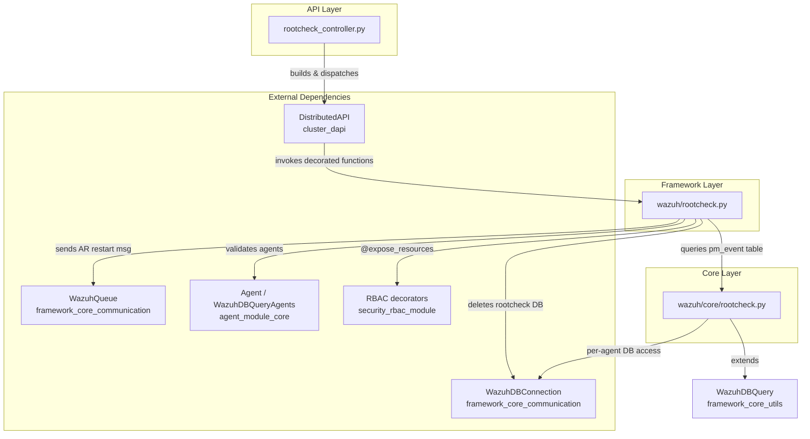
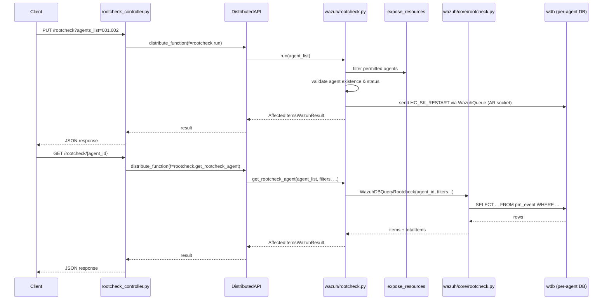
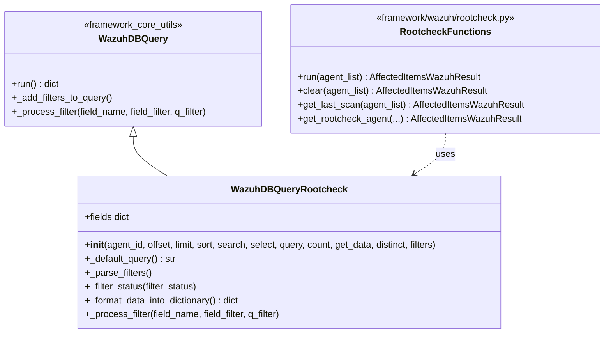

# Rootcheck Module

## 1. Introduction and Purpose

The **Rootcheck module** exposes and manages the results of the Wazuh agent's *rootcheck* scans — a policy/host-based detection feature that inspects agents for signs of rootkits, hidden processes, suspicious file permissions, and other system anomalies. This module is responsible for the **management-side (server/API) plane** of rootcheck: it does **not** perform the actual scanning (that is done by the native `rootcheck` daemon on the agent, see [Agent_&_Manager_Native_Daemons_(C)_module.md](Agent_&_Manager_Native_Daemons_(C)_module.md)), but instead provides the mechanisms to:

- **Trigger** rootcheck scans on one or more agents.
- **Query** historical rootcheck findings (events) stored in the agent's local Wazuh DB.
- **Retrieve** the timestamps of the last scan performed.
- **Clear** (delete) the rootcheck results database for an agent.

The module is a thin, three-layer vertical slice of the broader Wazuh API/Framework stack (see [API_&_Management_Framework_(Python)_module.md](API_&_Management_Framework_(Python)_module.md) for the parent context), following the same architecture pattern used by sibling modules such as `syscheck_module` and `sca_module`.

## 2. Architecture Overview

The module follows Wazuh's standard **Controller → Framework Logic → Core DB Query** layering, spread across exactly three files:

| Layer | File | Responsibility |
|---|---|---|
| API Controller | `api/api/controllers/rootcheck_controller.py` | Exposes REST endpoints, builds `DistributedAPI` requests, and returns HTTP responses. |
| Framework (Business Logic) | `framework/wazuh/rootcheck.py` | Implements RBAC-protected operations (`run`, `clear`, `get_last_scan`, `get_rootcheck_agent`), coordinates with agents, queues, and the DB layer. |
| Core (Data Access) | `framework/wazuh/core/rootcheck.py` | Defines the `WazuhDBQueryRootcheck` SQL query builder and low-level helpers (`last_scan`, `rootcheck_delete_agent`) that talk directly to `wdb`. |

### 2.1 Request/Response Flow

## 3. Core Components

Since this module consists of only three tightly-coupled files with a linear dependency chain (Controller → Logic → Core Query), it is documented as a **single cohesive unit** rather than split into sub-modules.

### 3.1 API Controller — `rootcheck_controller.py`

Defines the four REST endpoint handlers, all `async` and all delegating to `DistributedAPI` for cluster-aware, RBAC-checked execution:

| Function | HTTP Verb (typical) | Delegates to | Purpose |
|---|---|---|---|
| `put_rootcheck(agents_list, pretty, wait_for_complete)` | `PUT /rootcheck` | `wazuh.rootcheck.run` | Starts a rootcheck scan on the given agents (or all, via `*`). |
| `delete_rootcheck(agent_id, pretty, wait_for_complete)` | `DELETE /rootcheck/{agent_id}` | `wazuh.rootcheck.clear` | Clears rootcheck results for a single agent. |
| `get_rootcheck_agent(agent_id, offset, limit, sort, search, select, q, distinct, status, pci_dss, cis, ...)` | `GET /rootcheck/{agent_id}` | `wazuh.rootcheck.get_rootcheck_agent` | Lists rootcheck findings/events with pagination, filtering (status, PCI-DSS, CIS) and search. |
| `get_last_scan_agent(agent_id, pretty, wait_for_complete)` | `GET /rootcheck/{agent_id}/last_scan` | `wazuh.rootcheck.get_last_scan` | Returns the start/end timestamp of the most recent scan. |

All handlers follow the same pattern:
1. Build `f_kwargs` from request parameters (using `remove_nones_to_dict`).
2. Instantiate `DistributedAPI` with `request_type='distributed_master'`, the RBAC policies from the token context, and the target function.
3. `await dapi.distribute_function()` and `raise_if_exc()` to surface any remote/worker errors.
4. Wrap the result in `json_response`.

This pattern is shared across virtually every controller in the framework — see [API_&_Management_Framework_(Python)_api_core_infrastructure_request_utils.md](API_&_Management_Framework_(Python)_api_core_infrastructure_request_utils.md) for the shared parameter-parsing utilities (`parse_api_param`) and [cluster_dapi.md](cluster_dapi.md) for how `DistributedAPI` fans requests out across a cluster.

### 3.2 Framework Logic — `wazuh/rootcheck.py`

Implements the business logic, each function decorated with `@expose_resources` from the RBAC subsystem (see [security_rbac_module.md](security_rbac_module.md)) to enforce per-agent permission checks declared as `resources=["agent:id:{agent_list}"]`.

| Function | RBAC Action | Behavior |
|---|---|---|
| `run(agent_list)` | `rootcheck:run` | Validates agents exist and are `active`; for eligible agents, sends the `HC_SK_RESTART` active-response command via a `WazuhQueue` connected to the `AR_SOCKET`. Non-existent agents → `WazuhResourceNotFound(1701)`; non-active agents → `WazuhError(1707)` (both excluded from failure reporting per `post_proc_kwargs`). |
| `clear(agent_list)` | `rootcheck:clear` | For each valid agent, calls `rootcheck_delete_agent()` (core layer) via a shared `WazuhDBConnection` to issue a `rootcheck delete` command against the agent's DB. |
| `get_last_scan(agent_list)` | `rootcheck:read` | Delegates directly to the core `last_scan()` helper for a single agent and wraps the dict result. |
| `get_rootcheck_agent(agent_list, offset, limit, sort, search, select, filters, q, distinct)` | `rootcheck:read` | Opens a `WazuhDBQueryRootcheck` context manager scoped to the single target agent and executes the query, returning `items` and `totalItems`. |

All functions return an `AffectedItemsWazuhResult` (see [framework_core_utils.md](framework_core_utils.md)) — the standard Wazuh envelope that separates affected vs. failed items and carries informational messages.

Key external collaborators:
- **`Agent` / `WazuhDBQueryAgents`** (`framework/wazuh/core/agent.py`) — used to validate agent existence and to filter agents by connection status before issuing scan commands. See [agent_module_core.md](agent_module_core.md).
- **`WazuhQueue`** (`framework/wazuh/core/wazuh_queue.py`) — a thin Unix-domain-socket client used to publish the rootcheck active-response restart command. See [framework_core_communication.md](framework_core_communication.md).
- **`WazuhDBConnection`** (`framework/wazuh/core/wdb.py`) — general-purpose connection to the `wdb` daemon socket used for the `clear` operation. See [framework_core_communication.md](framework_core_communication.md).
- **`get_rbac_filters` / `expose_resources`** — RBAC integration; see [security_rbac_module.md](security_rbac_module.md).

### 3.3 Core Data Access — `wazuh/core/rootcheck.py`

#### `WazuhDBQueryRootcheck(WazuhDBQuery)`

A specialization of the generic `WazuhDBQuery` builder (base class defined in `framework/wazuh/core/utils.py`, documented in [framework_core_utils.md](framework_core_utils.md)) targeted at the agent-local `pm_event` table (the SQLite table where the agent's `wdb` process persists rootcheck findings).

Notable overrides:
- **`fields`** — maps API-facing field names (`status`, `log`, `date_first`, `date_last`, `pci_dss`, `cis`) to DB columns.
- **`__init__`** — validates the agent exists (`Agent(agent_id).get_basic_information()`) and constructs a per-agent `WazuhDBBackend`, since each agent has its own logical rootcheck event table accessed through `wdb`.
- **`_default_query`** — supports `SELECT` vs `SELECT DISTINCT`.
- **`_parse_filters` / `_filter_status`** — implements special handling for the `status` filter (`all`, `outstanding`, `solved`), which requires a derived `UNION` query comparing `date_last` against the timestamp of the last "Ending rootcheck scan." event — encoding the domain concept that a finding is "solved" once a scan completes without reporting it again.
- **`_format_data_into_dictionary`** — converts raw Unix timestamps in `date_first`/`date_last` into formatted date strings.
- **`_process_filter`** — routes `status` filtering to `_filter_status`; delegates everything else to the base class.

#### `last_scan(agent_id)`

Standalone helper (not a class method) that issues two raw SQL queries against the agent's `pm_event` table via `WazuhDBConnection`:
1. `MAX(date_last)` where `log = 'Ending rootcheck scan.'` → scan **end** time.
2. `MAX(date_last)` where `log = 'Starting rootcheck scan.'` → scan **start** time.

Returns `{'start': ..., 'end': ...}`, nulling out `end` if it's inconsistent with `start` (i.e., an incomplete/interrupted scan).

#### `rootcheck_delete_agent(agent, wdb_conn)`

Sends the `agent {id} rootcheck delete` command through an existing `WazuhDBConnection`, instructing `wdb` to purge the rootcheck event history for that agent.

## 4. Data Model: `pm_event` Table

Every query in this module ultimately targets the `pm_event` table maintained per-agent inside `wdb`. Key fields surfaced through the API:

| Field | Meaning |
|---|---|
| `status` | Computed field: `outstanding` (still present) or `solved` (no longer detected in latest scan). |
| `log` | Free-text description of the finding (or scan lifecycle marker, e.g. `Starting rootcheck scan.`). |
| `date_first` | Timestamp the finding was first observed. |
| `date_last` | Timestamp the finding was last observed (or scan lifecycle event time). |
| `pci_dss` | Related PCI-DSS compliance requirement(s), if mapped. |
| `cis` | Related CIS benchmark requirement(s), if mapped. |

## 5. Integration Points with Other Modules

- **Agent lifecycle** — All operations are scoped to specific agent IDs and depend on [agent_module_core.md](agent_module_core.md) for agent existence/status validation via the `Agent` class and `WazuhDBQueryAgents`.
- **RBAC / Security** — Every exposed function is protected by `@expose_resources`; see [security_rbac_module.md](security_rbac_module.md) for the permission model (`rootcheck:run`, `rootcheck:clear`, `rootcheck:read`).
- **Distributed API / Clustering** — The controller layer never calls framework functions directly; it always routes through `DistributedAPI`, allowing rootcheck operations to be transparently distributed to the correct cluster node holding the agent's connection. See [cluster_dapi.md](cluster_dapi.md) and [cluster_high_level_api.md](cluster_high_level_api.md).
- **Communication Layer** — `WazuhQueue` (active-response socket) and `WazuhDBConnection` (wdb socket) are both part of the shared [framework_core_communication.md](framework_core_communication.md) module.
- **Native Rootcheck Daemon** — The actual scanning logic executed on the agent lives in the C codebase under `src/rootcheck/` (see [Agent_&_Manager_Native_Daemons_(C)_module.md](Agent_&_Manager_Native_Daemons_(C)_module.md), sub-module `rootcheck`), and the low-level DB writer lives in [wazuh_db_module.md](wazuh_db_module.md) (`wdb_parser.c` rootcheck save/delete commands, `wdb_rootcheck.c`).
- **Experimental Controller** — `clear_rootcheck_database` in `experimental_controller.py` provides an alternate/legacy entry point to clear rootcheck data; see [experimental_controller.md](experimental_controller.md).
- **Similar Sibling Modules** — `syscheck_module` and `sca_module` follow an almost identical Controller/Logic/Core-Query pattern and can be used as a reference for extending this module.

## 6. Error Handling Summary

| Error Code | Meaning | Raised From |
|---|---|---|
| `1701` | Agent does not exist | `run`, `clear` (via `WazuhResourceNotFound`) |
| `1707` | Agent is not active (ineligible for scan) | `run` |
| `1603` | Invalid `status` filter value | `WazuhDBQueryRootcheck._filter_status` |

## 7. Summary

The Rootcheck module is a minimal, well-isolated vertical slice that demonstrates the canonical Wazuh API pattern: a stateless async controller, an RBAC-guarded framework function layer, and a specialized `WazuhDBQuery` subclass for data access — all coordinating through shared infrastructure (`DistributedAPI`, `WazuhQueue`, `WazuhDBConnection`) documented in their respective sibling modules.
