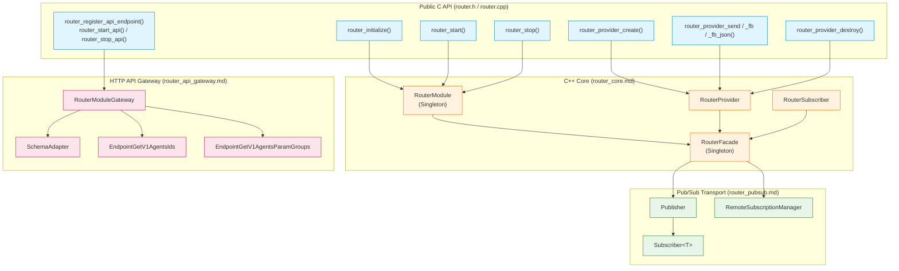
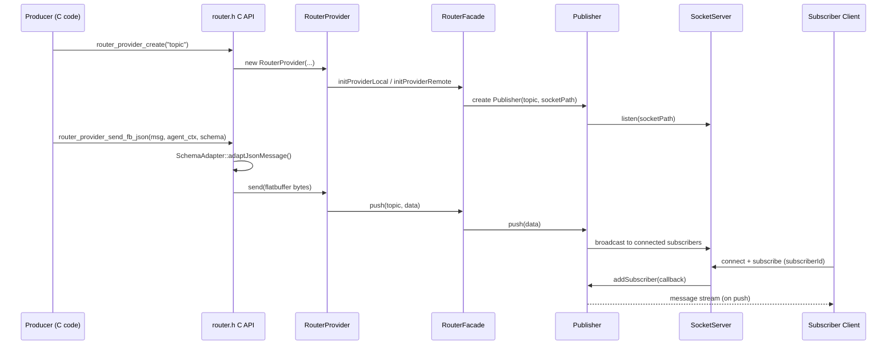

# Router Module

## 1. Purpose

The **Router** module (`src/shared_modules/router`) is a shared C++ infrastructure component of Wazuh that implements a lightweight, in-process/inter-process **publish–subscribe message bus**. It allows different Wazuh daemons and modules (e.g. `wazuh-modulesd`, agent data providers, synchronization engines) to:

- **Publish** data (raw bytes, JSON, or FlatBuffers-encoded messages) to named topics ("providers"), either locally (same process) or remotely (across process boundaries via Unix domain sockets).
- **Subscribe** to those topics to receive a stream of messages, again either locally or remotely.
- Expose a minimal **HTTP-over-Unix-socket API gateway** that other Wazuh components (currently `wazuh-db`) can plug into, so that external tools can query internal state (e.g. list of agent IDs, agent groups) through a well-known REST-like interface.

It is consumed by other modules such as the [Syscollector module](syscollector_module_native_daemon.md), the FIM/Syscheck daemon, and interacts conceptually with the [Wazuh Engine's own Router](Router_orchestrator.md) (a related but implementation-independent C++ router lives inside the Engine). This shared module is the **transport-level router** used by legacy/native Wazuh daemons to move data between OS processes, distinct from the Engine's in-process event-dispatching router.

## 2. Architecture Overview

The module is built around a **Facade pattern** (`RouterFacade`) that centralizes provider/subscriber lifecycle management, and a thin **C API** (`router.h` / `router.cpp`) that exposes this functionality to C code (most Wazuh daemons are written in C).

### Key Design Points

- **Singletons**: `RouterModule` and `RouterFacade` are implemented using the shared `Singleton<T>` utility (from [shared_utils](shared_utils.md)) to guarantee a single routing context per process.
- **Local vs. Remote routing**: Providers/subscribers can be *local* (in-process function callbacks) or *remote* (communicating through Unix domain sockets via `SocketServer`/`SocketClient` from [shared_utils](shared_utils.md)).
- **FlatBuffers integration**: The router can accept JSON messages and transparently convert them into FlatBuffers-encoded binary buffers using known schemas (`syscollector_deltas`, `syscheck_deltas`, `rsync`), enabling efficient, schema-validated transport to downstream consumers.
- **Embedded HTTP server**: Using `cpp-httplib`, the router can expose a Unix-socket-based HTTP API and dispatch requests to registered module handlers (currently only `wazuh-db`), implementing a mini API gateway pattern.

## 3. Data Flow

## 4. Sub-Module Documentation

The Router module is organized into three cohesive areas, each documented in detail in its own file:

| Sub-module | Description | Documentation |
|---|---|---|
| **Router Core** | Public C API (`router.h`), module lifecycle (`RouterModule`), the orchestrating `RouterFacade`, and the `ServerInstance`/HTTP bootstrap logic in `router.cpp`. | [router_core.md](router_core.md) |
| **Router Pub/Sub Transport** | The `Publisher`/`Subscriber<T>` primitives that implement the actual message broadcast mechanism, plus `RemoteSubscriptionManager` for cross-process provider registration. | [router_pubsub.md](router_pubsub.md) |
| **Router HTTP API Gateway** | The embedded HTTP-over-Unix-socket server integration (`RouterModuleGateway`), the agent-context/FlatBuffers JSON `SchemaAdapter`, and the concrete `wazuh-db` REST endpoints. | [router_api_gateway.md](router_api_gateway.md) |

## 5. Relationship to Other Modules

- **[shared_utils.md](shared_utils.md)** — provides the generic building blocks used throughout the router: `Singleton`, socket networking primitives (`SocketServer`, `SocketClient`, `EpollWrapper`), the `Observer`/`Subscriber`/`Provider` design-pattern templates, `FilterMsgDispatcher`, `reflectiveJson` (used by the HTTP endpoints for JSON serialization) and the SQLite wrapper used by the API gateway.
- **[Router_orchestrator.md](Router_orchestrator.md)** — the Wazuh Engine has its own, conceptually related but implementation-independent `Router`/`Orchestrator` for dispatching decoded events through policies. The shared `router` module documented here is the lower-level *transport* used to move raw/FlatBuffers data between OS processes (e.g., from `wazuh-modulesd` to the Engine), whereas the Engine's router handles *in-process* event dispatching to security policies.
- **syscollector / FIM native daemons** act as **producers**, using `router_provider_create` / `router_provider_send_fb_json` to publish inventory deltas and sync state to the router, which forwards them to the Engine or other subscribers.
- **wazuh-db** is the only module currently plugged into the HTTP API Gateway, exposing agent IDs and agent group information over the router's embedded HTTP server.

## 6. Typical Usage Pattern (C Daemon Perspective)

1. Call `router_initialize(logCallback)` once at process startup.
2. Call `router_start()` to initialize the socket that listens for remote providers/subscribers.
3. Call `router_provider_create("my-topic", isLocal)` to obtain a `ROUTER_PROVIDER_HANDLE`.
4. Use `router_provider_send`, `router_provider_send_fb`, or `router_provider_send_fb_json` to publish data.
5. On shutdown, call `router_provider_destroy(handle)` and `router_stop()`.

For the HTTP API Gateway:
1. Call `router_register_api_endpoint(module, socketPath, method, endpoint, callbackPre, callbackPost)` for each REST route.
2. Call `router_start_api(socketPath)` to spin up the embedded HTTP server thread.
3. Call `router_stop_api(socketPath)` to gracefully stop it.
