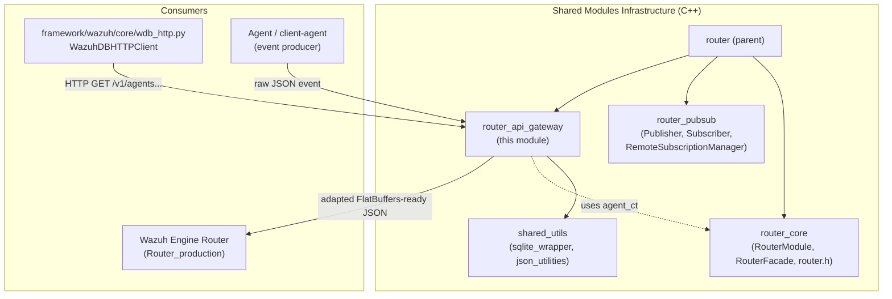
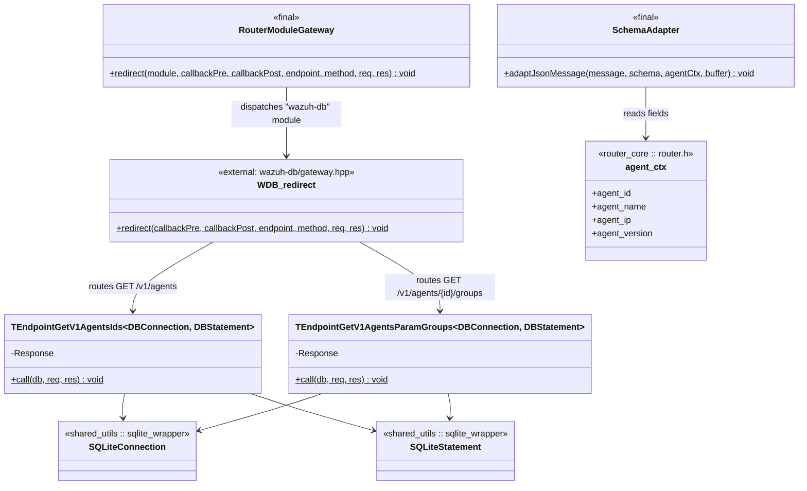
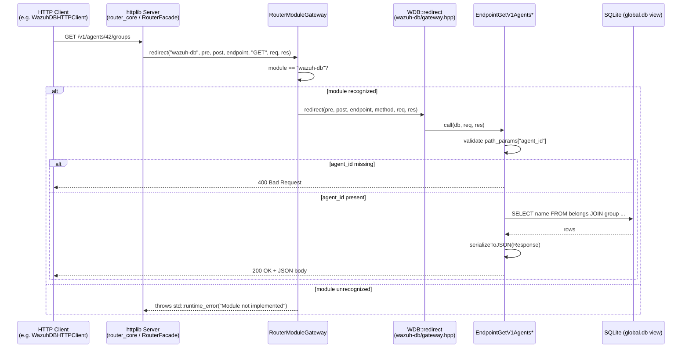
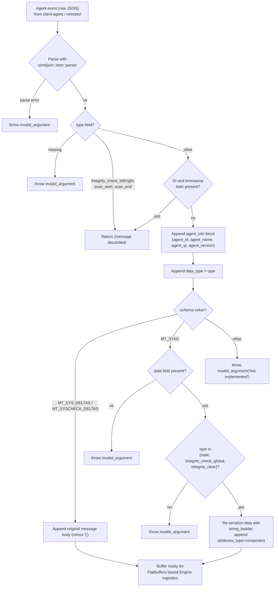

# Router API Gateway

## Introduction

The **Router API Gateway** is a small but critical sub-component of the Wazuh **Router** shared module
(`src/shared_modules/router`). It exposes a lightweight, embedded HTTP interface that allows other Wazuh
processes and modules to query router-owned resources — most notably a read-only view of the agents
registry (`global.db`) — without going through the full `wazuh-db` socket protocol, and it provides the
message-format adaptation logic (`SchemaAdapter`) that converts agent-originated JSON events into the
FlatBuffers-parseable structure required by the Wazuh Engine ingestion pipeline.

In short, this module answers two questions:

1. **"How do other processes reach router-managed data over HTTP?"** — via `RouterModuleGateway`, which
   dispatches incoming HTTP requests to the correct backend module (currently `wazuh-db`) and its
   registered endpoint handlers (`EndpointGetV1AgentsIds`, `EndpointGetV1AgentsParamGroups`).
2. **"How is an agent's raw JSON message converted into the binary-friendly format the Engine expects?"**
   — via `SchemaAdapter::adaptJsonMessage`, which rewrites agent messages (system deltas, syscheck deltas,
   and sync messages) into a normalized envelope containing agent context plus a `data_type` discriminator.

This module is a child of the [`router`](router.md) shared module and a sibling of
[`router_core`](router_core.md) and [`router_pubsub`](router_pubsub.md).

---

## Position in the System

Related documentation:
- [router.md](router.md) — parent module overview
- [router_core.md](router_core.md) — `RouterModule`, `RouterFacade`, `agent_ctx` (`router.h`)
- [router_pubsub.md](router_pubsub.md) — Publisher/Subscriber infrastructure that this gateway complements
- [shared_utils.md](shared_utils.md) — `sqlite_wrapper` and `json_utilities` building blocks reused here
- [framework_core_communication_wdb.md](framework_core_communication_wdb.md) — Python client
  (`WazuhDBHTTPClient`) that consumes the HTTP endpoints exposed by this gateway
- [Router.md](Router.md) — Wazuh Engine's own `Router` component that ultimately ingests the
  FlatBuffers-adapted messages produced by `SchemaAdapter`

---

## Core Components

| Component | File | Responsibility |
|---|---|---|
| `RouterModuleGateway` | `src/shared_modules/router/src/routerModuleGateway.hpp` | Static dispatcher that routes an incoming HTTP request to the correct backend module implementation (currently only `wazuh-db`). |
| `SchemaAdapter` | `src/shared_modules/router/src/schemaAdapter.hpp` | Converts agent-format JSON messages into a FlatBuffers-parseable envelope enriched with agent context. |
| `EndpointGetV1AgentsIds` (template `TEndpointGetV1AgentsIds`) | `src/shared_modules/router/src/wazuh-db/endpointGetV1AgentsIds.hpp` | HTTP endpoint handler returning the list of registered agent IDs (`GET /v1/agents`, conceptually). |
| `EndpointGetV1AgentsParamGroups` (template `TEndpointGetV1AgentsParamGroups`) | `src/shared_modules/router/src/wazuh-db/endpointGetV1AgentsParamGroups.hpp` | HTTP endpoint handler returning the groups assigned to a specific agent (`GET /v1/agents/{agent_id}/groups`). |

### 1. `RouterModuleGateway`

A `final` class with a single static method, `redirect()`, acting as a **facade / strategy dispatcher**
between the generic HTTP server layer (built on `cpp-httplib`) and module-specific handlers. It receives:

- `module` — the target backend name (e.g. `"wazuh-db"`)
- `callbackPre` / `callbackPost` — opaque callback pointers forwarded to the module implementation
  (allowing the module to hook pre/post processing without the gateway needing to know their signatures)
- `endpoint` and `method` — the requested HTTP path and verb
- `req` / `res` — the `httplib::Request` / `httplib::Response` objects

If `module == "wazuh-db"`, the call is forwarded to `WDB::redirect(...)` (declared in
`wazuh-db/gateway.hpp`, outside this module's tracked core components but part of the same
`wazuh-db/` subfolder). Any other module name results in a `std::runtime_error("Module not implemented")`,
making the class trivially extensible: new backend modules are added by extending this `if/else` chain
(or, in future refactors, a registration map).

### 2. `SchemaAdapter`

`SchemaAdapter::adaptJsonMessage()` is the single public entry point. It is designed for **high-frequency,
low-allocation** use on the hot path of event ingestion:

- Uses a `thread_local simdjson::dom::parser` to avoid parser re-allocation and to remain thread-safe
  without locks.
- Accepts a `std::string_view` message to avoid unnecessary copies.
- Writes its output directly into a caller-supplied `std::string& buffer` (append-only), avoiding an
  intermediate JSON object construction.

**Behavior by message type field (`type`):**

| `type` value | Action |
|---|---|
| `integrity_check_left`, `integrity_check_right`, `scan_start`, `scan_end` | Discarded (function returns without modifying `buffer`) |
| Any type when both `ID` and `timestamp` fields are present | Discarded (duplicate/legacy message shape) |
| Otherwise | Message is wrapped with an `agent_info` block (`agent_id`, `agent_name`, `agent_ip`, `agent_version`) and a `data_type` field |

**Behavior by `schema` parameter (`msg_type`, defined in `router.h`, see [router_core.md](router_core.md)):**
- `MT_SYS_DELTAS` / `MT_SYSCHECK_DELTAS`: the original message body (minus its opening `{`) is appended
  as-is after the agent/data_type header — these schemas already carry a compatible flat structure.
- `MT_SYNC`: the `data` and `component` fields are extracted; for `type` values `state`,
  `integrity_check_global`, or `integrity_clear`, a nested `data.attributes_type` object is built
  using `simdjson::internal::string_builder` to re-serialize the parsed `data` object. Any other `type`
  under `MT_SYNC` throws `std::invalid_argument`.
- Any other schema value throws `std::invalid_argument("Not implemented")`.

This function is the bridge between the **agent event format** (as received by `client-agent` /
`remoted`, see [remoted.md](remoted.md) and [agent_module.md](agent_module.md)) and the **Engine's
FlatBuffers ingestion format** consumed downstream by the Wazuh Engine [Router](Router.md) and
[Store](Store.md)/[builder](engine_builder.md) subsystems.

### 3. `EndpointGetV1AgentsIds`

A template class (`TEndpointGetV1AgentsIds<DBConnection, DBStatement>`, defaulted to
`SQLite::Connection` / `SQLite::Statement` from [sqlite_wrapper](sqlite_wrapper.md)) exposing a single
static `call(db, req, res)` method:

- Executes `SELECT id FROM agent WHERE id > 0` against the provided SQLite connection (the router's local
  copy/view of `global.db`).
- Collects results into a `Response` struct (`{ agentIds: vector<int64_t> }`) marked `REFLECTABLE`
  (see [json_utilities.md](json_utilities.md) for the reflection/serialization mechanism).
- Serializes the response to JSON via `serializeToJSON()` and sets it as the HTTP response body.

The templating on `DBConnection`/`DBStatement` exists purely for **unit-testability** — tests can inject
mock connection/statement types while production code uses the alias `EndpointGetV1AgentsIds =
TEndpointGetV1AgentsIds<>`.

### 4. `EndpointGetV1AgentsParamGroups`

Structurally identical to `EndpointGetV1AgentsIds`, but:

- Requires a path parameter `agent_id` (via `httplib::Request::path_params`). If missing, responds with
  HTTP `400` and logs via `logMessage(modules_log_level_t::LOG_INFO, ...)`.
- Executes a joined query:
  `SELECT name FROM belongs JOIN group ON id = id_group WHERE id_agent = ? ORDER BY priority`
- Returns `{ agent_groups: vector<string> }` as JSON, ordered by group priority — mirroring the semantics
  of `wdb_global_get_agent_group` used elsewhere in the framework (see
  [agent_module_core.md](agent_module_core.md) and [security_rbac_module.md](security_rbac_module.md) for
  related group-priority concepts).

---

## Architecture Diagram

---

## Process Flow 1 — HTTP Request Routing

## Process Flow 2 — Agent Message Schema Adaptation

---

## Error Handling

| Component | Failure Mode | Result |
|---|---|---|
| `RouterModuleGateway::redirect` | Unknown `module` argument | `std::runtime_error("Module not implemented")` |
| `SchemaAdapter::adaptJsonMessage` | `agentCtx == nullptr` | `std::invalid_argument("Agent context is null")` |
| `SchemaAdapter::adaptJsonMessage` | Malformed JSON | `std::invalid_argument("Failed to parse the indexer response ...")` |
| `SchemaAdapter::adaptJsonMessage` | Missing `type` field | `std::invalid_argument("No 'type' object in message: ...")` |
| `SchemaAdapter::adaptJsonMessage` | `MT_SYNC` without `data` field | `std::invalid_argument("No 'data' object in MT_SYNC message: ...")` |
| `SchemaAdapter::adaptJsonMessage` | Unsupported `type` under `MT_SYNC`, or unsupported `schema` | `std::invalid_argument` |
| `EndpointGetV1AgentsParamGroups::call` | Missing `agent_id` path parameter | HTTP `400`, log message, plain-text body |

All thrown exceptions from `RouterModuleGateway` and `SchemaAdapter` are expected to be caught by the
enclosing HTTP server layer (in [router_core](router_core.md) / `RouterFacade`) and translated into
appropriate HTTP error responses or dropped/queued messages, depending on the call site.

---

## Extensibility

- **Adding a new backend module to the gateway:** extend `RouterModuleGateway::redirect` with an
  additional `else if (module.compare("new-module") == 0)` branch that forwards to the new module's own
  `redirect`-style entry point. Because `callbackPre`/`callbackPost` are passed as opaque `void*`, each
  module retains full control over its own callback signatures.
- **Adding a new `wazuh-db` HTTP endpoint:** create a new `TEndpointGetV1...` template class following the
  same pattern (templated on `DBConnection`/`DBStatement` for testability, a private `REFLECTABLE`
  `Response` struct, and a static `call(db, req, res)` method), then register its route inside
  `wazuh-db/gateway.hpp` (outside this module's tracked files).
- **Adding a new `msg_type` to `SchemaAdapter`:** extend the `schema` dispatch (`if (schema == ...)`
  chain) inside `adaptJsonMessage`, following the existing pattern of appending pre-built JSON fragments
  to `buffer`.

---

## Dependencies Summary

| Dependency | Used By | Purpose |
|---|---|---|
| `cpp-httplib` (`external/cpp-httplib/httplib.h`) | `RouterModuleGateway`, both endpoints | HTTP request/response types |
| `simdjson` | `SchemaAdapter` | High-performance JSON parsing/serialization |
| [`sqlite_wrapper`](sqlite_wrapper.md) (`sqlite3Wrapper.hpp`) | Both endpoints | Templated SQLite connection/statement abstraction |
| [`json_utilities`](json_utilities.md) (`reflectiveJson.hpp`) | Both endpoints | `REFLECTABLE`/`MAKE_FIELD` reflection-based JSON serialization |
| [`router_core`](router_core.md) (`router.h`) | `SchemaAdapter` | `agent_ctx` structure and `msg_type` enum |
| `logging_helper.h` ([`common_helpers`](common_helpers.md)) | `EndpointGetV1AgentsParamGroups` | `logMessage` / `modules_log_level_t` |
| `wazuh-db/gateway.hpp` (untracked in this module) | `RouterModuleGateway` | Actual `wazuh-db` module dispatch target |

This module intentionally has **no outbound network or process dependencies** of its own — it is a thin,
synchronous adaptation and routing layer that plugs into the broader [router](router.md) and
[router_core](router_core.md) infrastructure, and into the SQLite-backed agent registry maintained by
the [wazuh_db](wazuh_db.md) daemon family.
