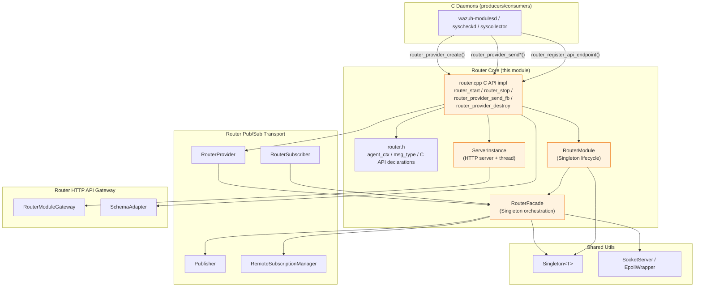
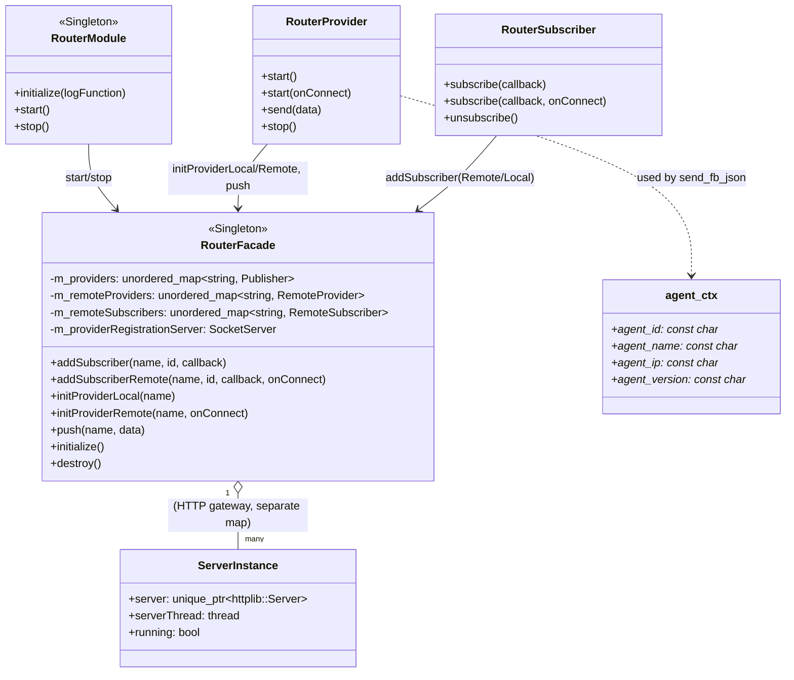
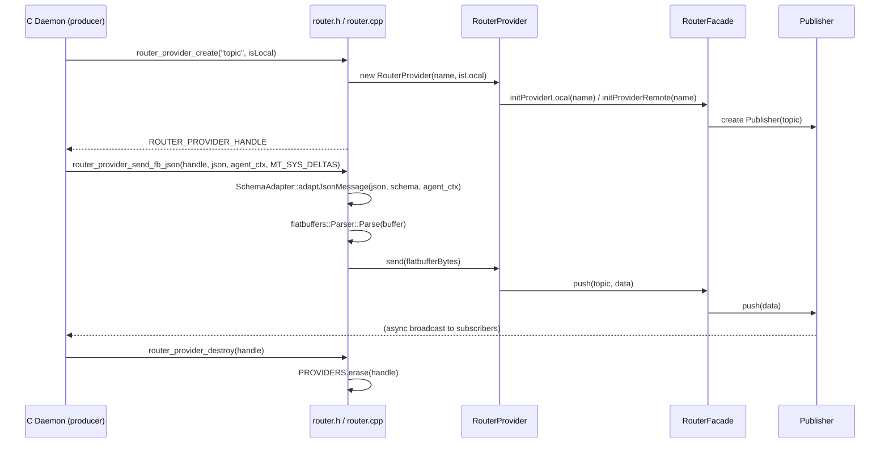
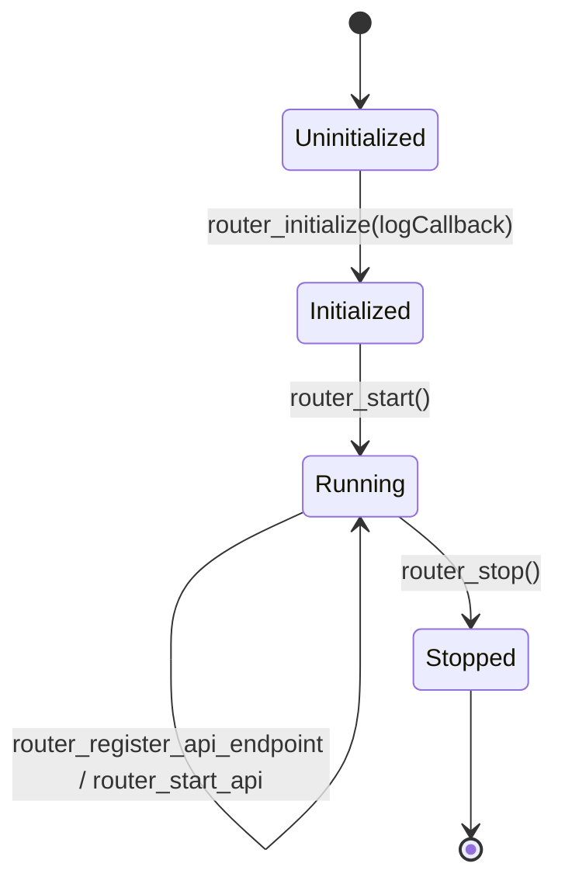
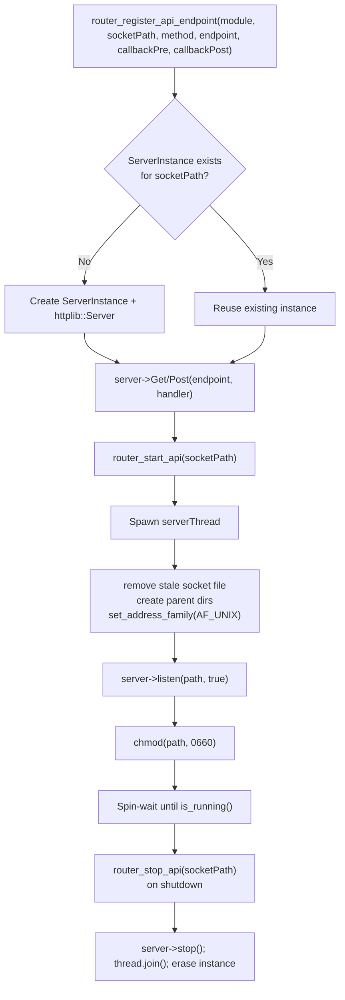

# Router Core

## Introduction

**Router Core** is the foundational layer of the Wazuh shared **Router** module (`src/shared_modules/router`). It provides:

- The **public C API** (`router.h` / `router.cpp`) that every native Wazuh daemon (written in C) uses to initialize the router, create/destroy message providers, send data (raw, FlatBuffers, or JSON-to-FlatBuffers), and manage an embedded HTTP-over-Unix-socket API gateway.
- The **module lifecycle singleton** `RouterModule`, which bootstraps and tears down the router's internal socket-listening infrastructure for the whole process.
- The **orchestration facade** `RouterFacade`, a singleton that owns the registries of local/remote providers and subscribers, and routes all provider/subscriber operations to the correct underlying transport primitives.
- The **`ServerInstance`** helper struct and related free functions in `router.cpp` that implement the embedded `cpp-httplib`-based HTTP server used by the [Router HTTP API Gateway](router_api_gateway.md) sub-module.

Router Core is the **entry point and control plane** of the larger [Router](router.md) module; it does not itself implement message broadcasting (delegated to [Router Pub/Sub Transport](router_pubsub.md)) nor the HTTP endpoint business logic (delegated to [Router HTTP API Gateway](router_api_gateway.md)). Instead, it wires these pieces together and exposes them through a stable C ABI so that daemons such as `wazuh-modulesd`, the FIM/Syscheck daemon, and Syscollector can integrate with the router without needing to link against C++ symbols directly.

## Purpose and Responsibilities

| Responsibility | Component |
|---|---|
| Expose a C-linkage API (`extern "C"`) for provider/subscriber lifecycle and message sending | `router.h`, `router.cpp` |
| Initialize/destroy the process-wide router logging callback and socket infrastructure | `RouterModule` |
| Track and coordinate all local/remote providers and subscribers | `RouterFacade` |
| Convert JSON payloads into FlatBuffers messages using known schemas (`syscollector_deltas`, `rsync`, `syscheck_deltas`) | `router.cpp` (via `SchemaAdapter`, see [Router HTTP API Gateway](router_api_gateway.md)) |
| Manage the embedded HTTP server(s) used for the REST API gateway (start/stop/registration) | `ServerInstance`, `router_register_api_endpoint`, `router_start_api`, `router_stop_api` |
| Provide the `agent_ctx` / `msg_type` data contracts shared across the C API | `router.h::agent_ctx` |

Router Core deliberately contains **no actual message-delivery logic** — pushing/broadcasting data to subscribers is delegated to `Publisher`/`Subscriber<T>` (see [Router Pub/Sub Transport](router_pubsub.md)), and HTTP request dispatching/business logic is delegated to `RouterModuleGateway` (see [Router HTTP API Gateway](router_api_gateway.md)). Router Core's job is to be the **stable façade and lifecycle manager** that other Wazuh code depends on.

## Architecture Overview



## Core Components

### `agent_ctx` (`router.h`)

A plain data structure carrying agent identification metadata used when converting JSON messages into FlatBuffers via `router_provider_send_fb_json`:

```c
struct agent_ctx
{
    const char* agent_id;
    const char* agent_name;
    const char* agent_ip;
    const char* agent_version;
};
```

It is paired with the `msg_type` enum (`MT_INVALID`, `MT_SYS_DELTAS`, `MT_SYNC`, `MT_SYSCHECK_DELTAS`), which selects the FlatBuffers schema used to encode the message (Syscollector deltas, rsync/state-sync messages, or Syscheck/FIM deltas respectively). Together they form the contract between C producers (native daemons) and the router's JSON→FlatBuffers conversion pipeline (`SchemaAdapter`, documented in [Router HTTP API Gateway](router_api_gateway.md)).

`router.h` also declares the full **C ABI surface**:

- Lifecycle: `router_initialize`, `router_start`, `router_stop`
- Providers: `router_provider_create`, `router_provider_send`, `router_provider_send_fb`, `router_provider_send_fb_json`, `router_provider_destroy`
- HTTP Gateway: `router_register_api_endpoint`, `router_start_api`, `router_stop_api`
- Corresponding function-pointer `typedef`s (e.g. `router_initialize_func`) for daemons that dynamically load the router shared library (`libwazuh-router`) via `dlopen`/`GetProcAddress`.

### `RouterModule` (`routerModule.hpp`)

```cpp
class RouterModule final : public Singleton<RouterModule>
{
public:
    static void initialize(const std::function<void(const modules_log_level_t, const std::string&)>& logFunction);
    void start();
    void stop();
};
```

`RouterModule` is a thin `Singleton<T>` (see the `design_patterns` group in [shared_lib.md](shared_lib.md) / shared utilities) responsible only for:

- **`initialize(logFunction)`** — stores the process-wide logging callback (`GS_LOG_FUNCTION`) used by every other router component to emit log messages back to the host daemon's logging subsystem.
- **`start()`** — delegates to `RouterFacade::instance().initialize()`, which stands up the socket that listens for remote provider/subscriber registrations.
- **`stop()`** — delegates to `RouterFacade::instance().destroy()`, cleanly tearing down all subscribers and closing the registration socket.

Because it is a singleton, exactly one `RouterModule` instance (and therefore one router context) exists per OS process, matching the one-router-per-daemon deployment model.

### `RouterFacade` (`routerFacade.hpp`)

```cpp
class RouterFacade final : public Singleton<RouterFacade>
{
public:
    void addSubscriber(name, subscriberId, callback);
    void addSubscriberRemote(name, subscriberId, callback, onConnect = {});
    void removeSubscriberLocal(name, subscriberId);
    void removeSubscriberRemote(name, subscriberId);

    void initProviderRemote(name, onConnect = {});
    void removeProviderRemote(name);
    void initProviderLocal(name);
    void removeProviderLocal(name);
    void push(name, data);

    void initialize();
    void destroy();
private:
    std::unordered_map<std::string, std::unique_ptr<Publisher>> m_providers;
    std::shared_mutex m_providersMutex;
    std::unique_ptr<SocketServer<Socket<OSPrimitives>, EpollWrapper>> m_providerRegistrationServer;
    std::unordered_map<std::string, std::shared_ptr<RemoteSubscriber>> m_remoteSubscribers;
    std::unordered_map<std::string, std::shared_ptr<RemoteProvider>> m_remoteProviders;
    std::mutex m_remoteSubscribersMutex;
    std::mutex m_remoteProvidersMutex;
};
```

`RouterFacade` is the **central orchestration point** for all pub/sub activity in the router. It is a `Singleton<RouterFacade>` (guaranteeing one shared registry per process) and exposes two categories of operations:

1. **Local operations** — for providers/subscribers living in the *same process* (e.g. a module publishing directly to another module linked into the same daemon). These are backed by an in-memory `Publisher` map (`m_providers`), protected by a `std::shared_mutex` to allow concurrent pushes while serializing structural changes (add/remove provider).
2. **Remote operations** — for providers/subscribers that communicate across process boundaries via Unix domain sockets. These use `RemoteProvider`/`RemoteSubscriber` wrappers (see [Router Pub/Sub Transport](router_pubsub.md)) and a dedicated `m_providerRegistrationServer` (a `SocketServer<Socket<OSPrimitives>, EpollWrapper>`, both generic networking primitives) that listens for incoming remote registration requests.

`initialize()` starts the registration server; `destroy()` stops it and clears all provider/subscriber maps, effectively shutting down the router's transport layer for the process.

### `router.cpp` — C API Implementation and HTTP Bootstrap

`router.cpp` is the **glue file** that implements every function declared in `router.h`, wiring the C API to the C++ singletons above and to the [Router Pub/Sub Transport](router_pubsub.md) (`RouterProvider`, `RouterSubscriber`) and [Router HTTP API Gateway](router_api_gateway.md) (`RouterModuleGateway`, `SchemaAdapter`) sub-modules. Notable elements:

#### `ServerInstance` struct

```cpp
struct ServerInstance final
{
    std::unique_ptr<httplib::Server> server;
    std::thread serverThread;
    bool running{false};
};
```

Represents one embedded HTTP server bound to a specific Unix-socket path. A global map `G_HTTPINSTANCES` (`std::map<std::string, std::shared_ptr<ServerInstance>>`) tracks every server instance keyed by socket path, allowing multiple modules (e.g. `wazuh-db`) to register their own independent HTTP endpoints/sockets through the same router infrastructure.

#### `router_start()` / `router_stop()`

Thin `extern "C"` wrappers that call `RouterModule::instance().start()` / `.stop()` inside a `try/catch`, translating C++ exceptions into a simple integer return code (`0` success, `-1` failure) suitable for consumption by C callers. This is the standard **error-translation boundary** pattern used throughout the file: all C++ exceptions are caught at the API surface and converted to return codes plus log messages (`logMessage`).

#### `router_provider_send_fb()`

Sends a raw JSON `message` to a provider after validating it against a caller-supplied FlatBuffers `schema` string:

1. Parses the `schema` with `flatbuffers::Parser` (with `skip_unexpected_fields_in_json` and the Wazuh-specific `zero_on_float_to_int` option enabled).
2. Parses the JSON `message` against that schema, producing an in-memory FlatBuffers binary buffer.
3. Looks up the target provider by `handle` in the global `PROVIDERS` map (protected by `PROVIDERS_MUTEX`, a `std::shared_mutex`) and calls `RouterProvider::send()`, which ultimately calls `RouterFacade::instance().push(topic, data)`.

This is distinct from `router_provider_send_fb_json`, which uses **pre-compiled, cached** schema parsers (`initSchemaParsers()` / `parserMap`) keyed by `msg_type`, plus the `agent_ctx`-aware `SchemaAdapter::adaptJsonMessage()` transformation — the latter is optimized for the hot path used by native daemons (Syscollector, FIM) sending high-volume delta/sync messages.

#### `router_provider_destroy()`

Removes a provider from the global `PROVIDERS` registry under an exclusive lock on `PROVIDERS_MUTEX`. Note that this only removes the *handle-to-provider* mapping in `router.cpp`; the underlying `RouterProvider` destructor (via `shared_ptr` refcounting) is responsible for calling `RouterFacade::instance().removeProviderLocal/Remote()` to fully unregister from the facade.

#### HTTP Gateway Bootstrap (`router_register_api_endpoint`, `router_start_api`, `router_stop_api`)

These three functions manage the lifecycle of the `ServerInstance` objects:

- `router_register_api_endpoint` — lazily creates a `ServerInstance` for a given `socketPath` if one doesn't exist yet, then registers a `GET` or `POST` handler on the embedded `httplib::Server` that delegates to `RouterModuleGateway::redirect(...)` (see [Router HTTP API Gateway](router_api_gateway.md)), timing and logging every request.
- `router_start_api` — spawns the server's background thread, binds it to the Unix socket (removing any stale socket file first, creating parent directories, setting `AF_UNIX` address family), installs a global exception handler (returns HTTP 500 on unhandled exceptions), sets restrictive file permissions (`chmod 0660`) on the socket, and spin-waits until `httplib::Server::is_running()` becomes true.
- `router_stop_api` — stops the `httplib::Server`, joins its thread, and erases the `ServerInstance` from `G_HTTPINSTANCES`.

## Component Relationships



## Data & Control Flow

### Provider Creation and Message Send (C Daemon Perspective)



### Router Lifecycle



### HTTP API Gateway Bootstrap



## Concurrency Considerations

| Component | Synchronization Mechanism | Notes |
|---|---|---|
| `RouterFacade` | `std::shared_mutex m_providersMutex`, `std::mutex m_remoteSubscribersMutex`, `std::mutex m_remoteProvidersMutex` | Local provider pushes/reads use a shared (read-preferring) lock; remote provider/subscriber maps use exclusive mutexes since remote registration is comparatively rare. |
| `router.cpp` global `PROVIDERS` map | `std::shared_mutex PROVIDERS_MUTEX` | `router_provider_send*` functions take a shared lock (concurrent sends allowed); `router_provider_create`/`router_provider_destroy` take an exclusive lock. |
| `router.cpp` global `G_HTTPINSTANCES` map | Implicit (single-threaded registration expected at startup) | Each `ServerInstance` has its own dedicated `serverThread`; request handling is delegated to `httplib::Server`'s internal thread pool (`CPPHTTPLIB_THREAD_POOL_COUNT`). |
| Schema parsing (`router_provider_send_fb_json`) | `thread_local` parser map and buffer | Avoids lock contention entirely by giving every calling thread its own cached `flatbuffers::Parser` instances (one per `msg_type`), at the cost of one-time per-thread schema compilation. |

Both `RouterModule` and `RouterFacade` are `Singleton<T>` instances (see the `design_patterns` group referenced from [shared_lib.md](shared_lib.md)), guaranteeing exactly one routing context and one provider/subscriber registry per process.

## Integration with the Rest of the System

- **Upstream callers**: Any native Wazuh daemon (C) that needs to publish or expose data through the router links against the router shared library and calls the `router_*` C functions declared in `router.h`. Concretely, [Syscollector's native daemon](syscollector_module_native_daemon.md) and the Syscheck/FIM daemon ([Syscheck___FIM_Daemon_(C_C++)](Syscheck___FIM_Daemon_(C_C++).md)) use `router_provider_create` + `router_provider_send_fb_json` to publish inventory/FIM deltas.
- **Downstream dependencies**:
  - [Router Pub/Sub Transport](router_pubsub.md) — supplies `Publisher`, `Subscriber<T>`, `RemoteSubscriptionManager`, `RouterProvider`, and `RouterSubscriber`, which `RouterFacade` and `router.cpp` orchestrate.
  - [Router HTTP API Gateway](router_api_gateway.md) — supplies `RouterModuleGateway::redirect()` (the actual HTTP request dispatch logic) and `SchemaAdapter::adaptJsonMessage()` (JSON→FlatBuffers conversion with agent-context enrichment), both invoked from `router.cpp`.
  - Generic networking/utility primitives (`SocketServer`, `EpollWrapper`, `Singleton<T>`) — documented as part of the broader shared utilities layer used across [Shared_Modules_Infrastructure_(C++)](Shared_Modules_Infrastructure_(C++).md).
- **Consumers**: The [Wazuh Engine](Wazuh_Engine_Core_(C++).md) and `wazuh-db` are the primary consumers on the subscriber/API side — the Engine subscribes to topics such as Syscollector deltas and rsync/sync messages, while `wazuh-db` is the only module currently registered against the HTTP API Gateway (exposing agent IDs and agent-group endpoints).

## Related Documentation

- [router.md](router.md) — Parent module overview: purpose, high-level architecture, and links to all Router sub-modules.
- [router_pubsub.md](router_pubsub.md) — `Publisher`/`Subscriber<T>` message-broadcast primitives and `RemoteSubscriptionManager`, used internally by `RouterFacade`.
- [router_api_gateway.md](router_api_gateway.md) — `RouterModuleGateway`, `SchemaAdapter`, and the concrete `wazuh-db` REST endpoints invoked from the HTTP bootstrap logic in this module.
- [Router.md](Router.md) — The conceptually related, but implementation-independent, **Wazuh Engine Router** (`router::Orchestrator`) that performs in-process event dispatching to security policies; not to be confused with this transport-level router.
- [shared_lib.md](shared_lib.md) — Generic C utility layer used across native daemons that consume this module's C API.
- [Shared_Modules_Infrastructure_(C++).md](Shared_Modules_Infrastructure_(C++).md) — Parent grouping of shared C++ infrastructure modules (`dbsync`, `rsync`, `content_manager`, `router`, `keystore`, `indexer_connector`).
