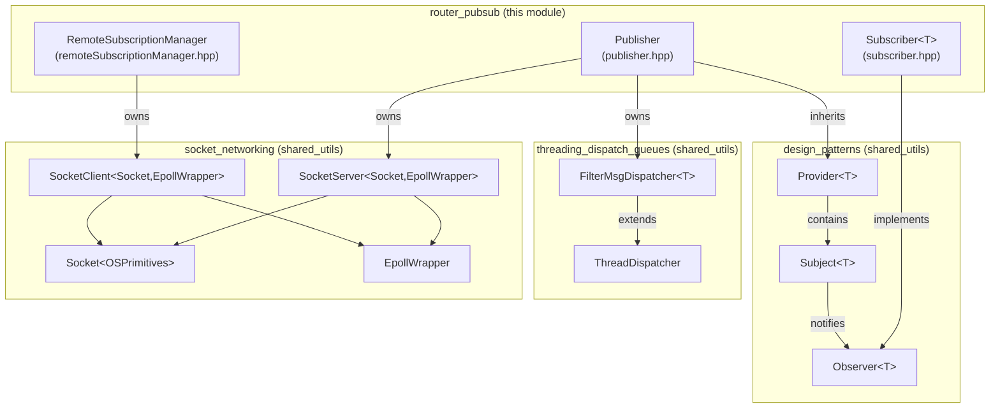
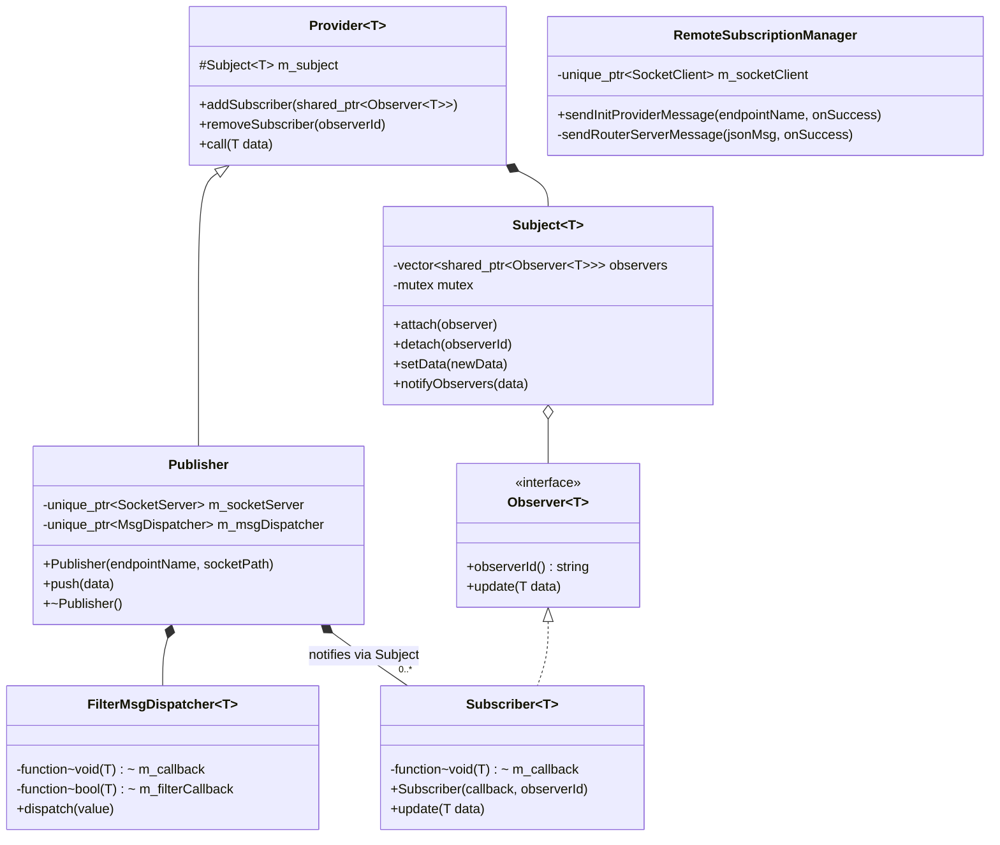
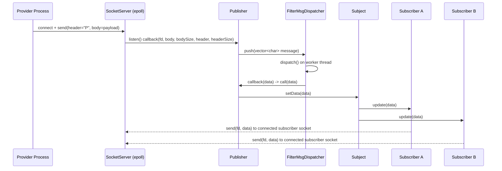
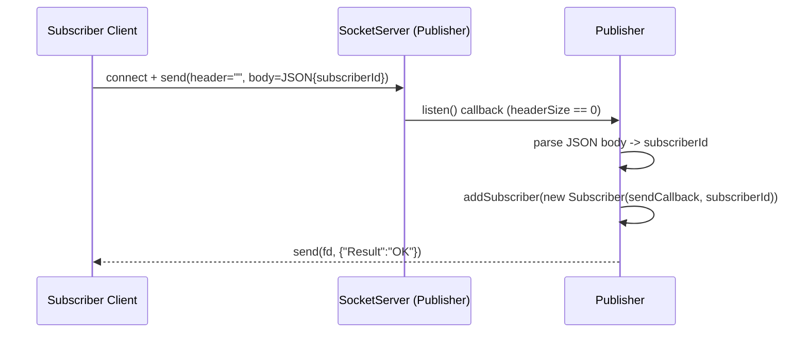
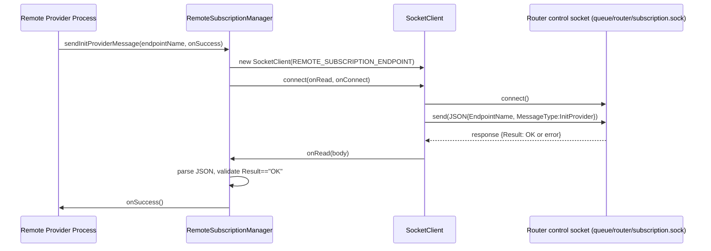
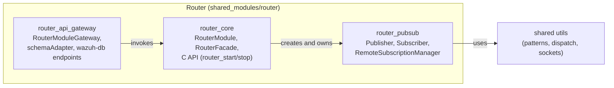

# Router Pub/Sub

## Introduction

The **Router Pub/Sub** module implements the local publish/subscribe primitives that power Wazuh's internal message **Router** (see [router_core.md](router_core.md)). It provides the building blocks that let a *provider* (a Unix-domain server socket) broadcast data to any number of *subscribers* (local clients or, indirectly, remote nodes), and the client-side helper that registers a remote provider with the router's control channel.

This module is intentionally small and generic: it does not know anything about agents, events, or business data — it only knows how to accept socket connections, distinguish between "publisher" and "subscriber" peers, dispatch messages on a thread pool, and notify a list of observers. All domain-specific behavior (endpoint naming, remote provider/subscriber bookkeeping, HTTP-based control API) lives in the sibling modules described in the [Relationship to Other Modules](#relationship-to-other-modules) section.

## Purpose and Core Functionality

| Component | File | Responsibility |
|---|---|---|
| `Publisher` | `src/shared_modules/router/src/publisher.hpp` | Owns a Unix-domain **socket server**. Accepts both provider (`P`) and subscriber connections on the same endpoint, forwards provider payloads through a filtering/dispatch thread pool, and fans them out to all attached subscribers. |
| `Subscriber` | `src/shared_modules/router/src/subscriber.hpp` | Thin wrapper around a user-supplied callback that implements the generic `Observer<T>` interface, so it can be attached to a `Publisher`'s internal `Subject`. |
| `RemoteSubscriptionManager` | `src/shared_modules/router/src/remoteSubscriptionManager.hpp` | Client-side helper used by remote (cross-process) subscribers/providers to register themselves with the Router's control socket (`queue/router/subscription.sock`) via a JSON handshake. |

Together these three classes implement a **local, socket-based, one-to-many broadcast channel** with the following characteristics:

- **Transport**: Unix domain sockets, framed with header/body pairs (see `socket_networking` primitives in [shared_lib.md](shared_lib.md)).
- **Concurrency**: Incoming provider messages are pushed into a `FilterMsgDispatcher` (single worker thread by default) to decouple the socket I/O thread from subscriber notification.
- **Fan-out**: Implemented via the generic `Subject<T>`/`Observer<T>` (`Provider<T>`/`Subscriber<T>`) pattern from the shared utilities layer.
- **Peer discrimination**: A `Publisher` distinguishes providers from subscribers by inspecting the message header — an empty header + JSON body means "subscriber registration", a header equal to `"P"` means "provider data push".

## Architecture

### Component Diagram



### Class Relationships



## Data Flow

### Publisher Lifecycle and Message Fan-out



### Subscriber Registration Flow



### Remote Provider Registration (Client Side)



## Relationship to Other Modules

The `router_pubsub` classes are consumed and orchestrated by neighboring modules within the Router subsystem (parent: `Shared_Modules_Infrastructure_(C++)`, see [router.md](router.md)):

- **[router_core.md](router_core.md)** — `RouterModule`, `RouterFacade`, and the C API (`router_start`, `router_stop`, `router_provider_send_fb`, ...) own the lifecycle of `Publisher` instances (one per registered provider name, stored in `RouterFacade::m_providers`) and use `addSubscriber` / `removeSubscriber` to wire up local consumers. `RouterFacade` also owns the server that accepts `RemoteSubscriptionManager` registration messages sent over `queue/router/subscription.sock`.
- **[router_api_gateway.md](router_api_gateway.md)** — `RouterModuleGateway` and `schemaAdapter.hpp` expose an HTTP-based control surface (used by `wazuh-db` endpoints such as `endpointGetV1AgentsIds`) that ultimately calls into `RouterFacade`, which in turn drives the `Publisher`/`Subscriber` objects documented here.
- **[shared_lib.md](shared_lib.md)** (design patterns, threading/dispatch queues, socket networking) — supplies the generic, reusable primitives this module builds on:
  - `Provider<T>` / `Subject<T>` / `Observer<T>` (Observer pattern) — see `design_patterns`.
  - `FilterMsgDispatcher<T>` / `ThreadDispatcher` — see `threading_dispatch_queues`.
  - `SocketServer`, `SocketClient`, `Socket<OSPrimitives>`, `EpollWrapper` — see `socket_networking`.
- **Engine Router** (`Wazuh_Engine_Core_(C++)` → `Router` submodule, e.g. `router/include/router/orchestrator.hpp`) implements a conceptually similar (but independently developed) router/tester/environment abstraction used for policy evaluation inside the engine daemon. It shares terminology only — see [engine_router.md](engine_router.md) if cross-referencing.

## Key Design Details

### Peer discrimination on a single socket

`Publisher` accepts connections from both providers and subscribers on the *same* Unix socket endpoint (`socketPath + endpointName`). The `listen()` callback receives an optional header alongside the body:

- `headerSize > 0` **and** `header == "P"` → the payload is a provider data push; it is forwarded to `m_msgDispatcher->push(...)`.
- `headerSize == 0` → the payload is a subscriber registration JSON (`{"subscriberId": "..."}`); a new `Subscriber` is created whose callback writes any subsequently published data back to that peer's file descriptor via `socketServer->send(fd, ...)`.

### Decoupling I/O from fan-out

Provider messages are not dispatched to subscribers directly on the epoll I/O thread. Instead they are pushed into a `FilterMsgDispatcher` (built on `ThreadDispatcher`) configured with `PUBLISHER_DISPATCH_THREAD_COUNT = 1` worker thread. This keeps the socket event loop responsive while still guaranteeing in-order delivery per publisher (single worker thread ⇒ FIFO processing).

### Observer pattern reuse

`Publisher` extends `Provider<const std::vector<char>&>` from the shared utilities, and `Subscriber<T>` extends `Observer<T>`. This means the actual fan-out logic (thread-safe attach/detach/notify over a `std::vector` protected by a mutex) is fully reused from the generic `Subject<T>` implementation — `router_pubsub` only supplies the socket-specific glue (how subscribers are created and what their callback does).

### Remote registration handshake

`RemoteSubscriptionManager` is a minimal client used by out-of-process providers to tell the Router (via `RouterFacade`'s registration server) that a new named provider now exists. It performs a single JSON round trip:

```json
// Request
{ "EndpointName": "<name>", "MessageType": "InitProvider" }

// Response
{ "Result": "OK" }
```

On success, the caller's `onSuccess` callback is invoked; any transport or protocol error is logged to `stderr` (paths marked `LCOV_EXCL_*` are defensive/error branches not covered by unit tests).

## Module Placement within Router



## Summary

`router_pubsub` is the low-level pub/sub engine of Wazuh's Router: a small, dependency-light layer combining Unix-domain sockets, a background dispatch thread, and the generic Observer pattern to deliver provider data to any number of local subscribers, plus a lightweight client (`RemoteSubscriptionManager`) for remote provider registration. It has no external consumers outside the Router subsystem — all higher-level behavior (naming, HTTP control, agent/event semantics) is layered on top by [router_core.md](router_core.md) and [router_api_gateway.md](router_api_gateway.md).
