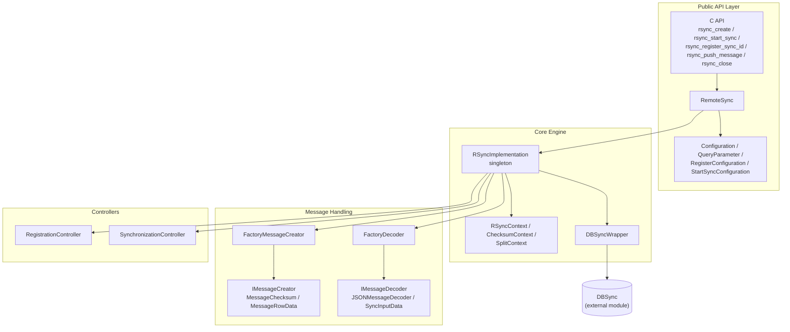
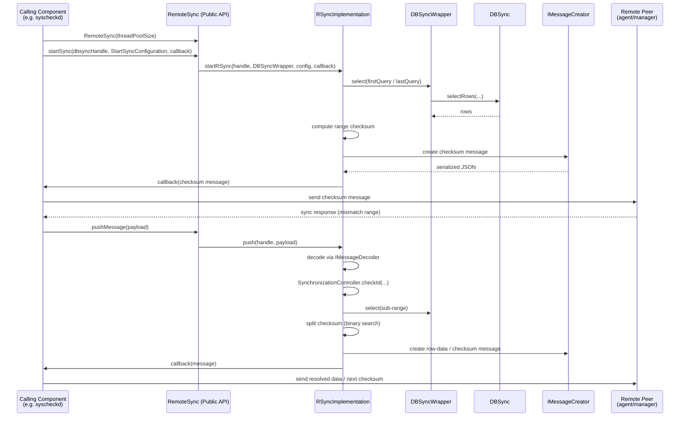

# RSync (Remote Sync) Module

## 1. Introduction & Purpose

**RSync** is a C++ shared library within Wazuh's [Shared Modules Infrastructure](shared_modules_infrastructure.md) that implements a generic, checksum-based **data integrity synchronization protocol**. It is the mechanism that lets a Wazuh agent (or manager) efficiently detect and reconcile differences between a local dataset (stored via [DBSync](dbsync.md)) and a remote peer, without transmitting the full dataset on every synchronization cycle.

Conceptually, RSync implements a **Merkle-tree-like binary search over checksums**: a dataset range is checksummed as a whole; if the remote peer reports a mismatch, the range is split into two halves, each re-checksummed, and the process recurses until the differing rows are isolated and only those rows are transmitted. This drastically reduces network/IPC traffic for large tables (e.g., FIM file inventories, syscollector inventories) that are mostly unchanged between scans.

RSync is consumed by native C/C++ daemons and modules such as:
- **Syscheck/FIM** ([Syscheck FIM Daemon](syscheckd.md)) — synchronizing file/registry inventories between agent and manager.
- **Wazuh Modules Daemon** ([Wazuh Modules Daemon (C)](wazuh_modules_daemon.md)) — syscollector and other inventory sync flows.
- Any component that stores data via **DBSync** and needs to keep a remote copy consistent.

It does **not** implement networking itself — it produces/consumes JSON-based sync messages and delegates actual transport to the calling component (e.g., via the agent-manager secure channel).

## 2. Architecture Overview

RSync is organized into four cooperating layers:

| Layer | Responsibility | Documentation |
|---|---|---|
| **Public API** | Exposes the `RemoteSync` C++ class and a stable C ABI (`rsync.h`/`rsync.cpp`) so both C++ and C callers can create sync instances, start synchronization, register message IDs, and push incoming sync data. Includes fluent `Builder`-pattern configuration classes used to describe queries and table metadata. | [rsync_public_api.md](rsync_public_api.md) |
| **Core Engine** | `RSyncImplementation`, the internal singleton that owns all active sync handles/contexts, runs the checksum binary-search algorithm, and talks to the stored data through `DBSyncWrapper`. | [rsync_core_engine.md](rsync_core_engine.md) |
| **Message Handling** | Factories and interfaces (`IMessageCreator`, `IMessageDecoder`) that serialize outgoing checksum/row-data sync messages and decode incoming synchronization requests (currently JSON-encoded). | [rsync_message_handling.md](rsync_message_handling.md) |
| **Controllers** | Small stateful helpers used by the Core Engine: `RegistrationController` (tracks which components are registered on which handle) and `SynchronizationController` (guards against out-of-order/duplicate sync IDs per table). | [rsync_controllers.md](rsync_controllers.md) |

## 3. High-Level Synchronization Flow

Key behaviors visible in this flow:
- **Handles** (`RSYNC_HANDLE`) identify an independent synchronization context, each backed by its own thread pool (`MsgDispatcher`) for asynchronous message processing.
- **`registerSyncID`** lets a caller bind a specific message-header id to a `(DBSyncWrapper, configuration)` pair, so multiple tables/components can share one `RemoteSync` handle while being routed independently.
- **`pushMessage`** is the entry point for data coming from the peer; it is decoded, validated against expected sync ids, and drives further checksum splitting or data transmission.
- The **binary search** over checksums (`ChecksumContext`/`SplitContext`) is what keeps synchronization messages small — only mismatching sub-ranges are further split and eventually sent as row data.

## 4. Relationship to Other Modules

- **[DBSync](dbsync.md)**: RSync never accesses storage directly. All row/range queries go through `DBSyncWrapper`, which forwards to DBSync's `selectRows` API. RSync assumes the caller has already loaded/maintained the dataset in DBSync.
- **[Shared Utilities](shared_utils.md)**: RSync builds on generic utility components from `shared_modules/utils`, notably:
  - `Utils::Builder<T>` (fluent configuration pattern) — see `design_patterns` sub-module.
  - `Utils::MsgDispatcher` (thread-pooled async dispatch queue) — see `threading_dispatch_queues` sub-module.
  - `loggerHelper.h` for logging integration and `cjsonSmartDeleter.hpp` for safe C-JSON memory management.
- **[Syscheckd (FIM)](syscheckd.md)** and **[Wazuh Modules Daemon](wazuh_modules_daemon.md)**: primary consumers of RSync's C API for synchronizing file/registry and inventory data between agent and manager.
- **[Router](router.md)** / **[wazuh_db](wazuh_db.md)**: related but independent synchronization/transport mechanisms in the broader Wazuh architecture; RSync is specifically the checksum-diffing protocol layer, whereas these modules handle message routing and persistent storage respectively.

## 5. Sub-module Documentation

- **[RSync Public API](rsync_public_api.md)** — `RemoteSync` class, configuration builders (`Configuration`, `QueryParameter`, `RegisterConfiguration`, `StartSyncConfiguration`), and the C ABI entry points.
- **[RSync Core Engine](rsync_core_engine.md)** — `RSyncImplementation` singleton, context/handle lifecycle, checksum binary-search algorithm, and `DBSyncWrapper`.
- **[RSync Message Handling](rsync_message_handling.md)** — message creator/decoder factories and interfaces used to build outgoing sync messages and parse incoming ones.
- **[RSync Controllers](rsync_controllers.md)** — `RegistrationController` and `SynchronizationController`, the small stateful guards that keep multi-component/multi-handle synchronization consistent.
