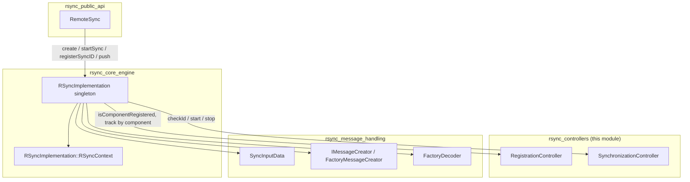
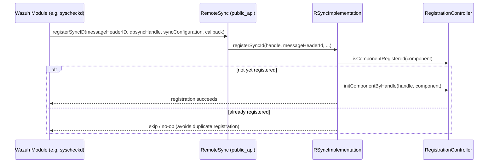
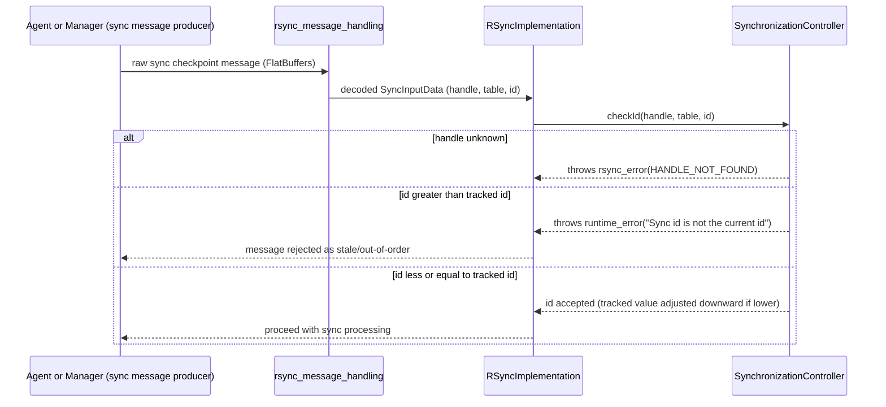
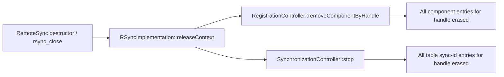
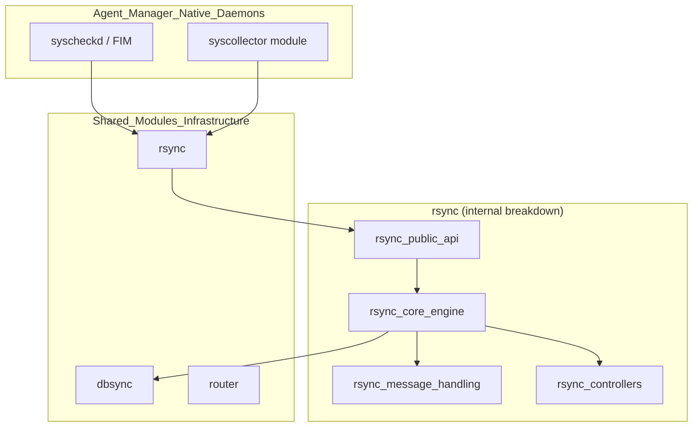

# RSync Controllers

## Introduction

The **rsync_controllers** module is a small but critical part of the Wazuh RSync shared library (`src/shared_modules/rsync`). It provides two thread-safe, in-memory *controller* classes that track the lifecycle and synchronization state of the components that use the RSync engine to keep local (agent) and remote (manager) databases consistent:

- **`RegistrationController`** — keeps track of which logical *components* (e.g., `syscheck`, `fim_registry`, `syscollector-processes`) are currently registered against a given RSync handle, preventing duplicate registration and enabling cleanup when a synchronization context is released.
- **`SynchronizationController`** — keeps track of the *synchronization sequence id* (`sync id`) per handle/table pair, guarding against out-of-order or stale synchronization messages being applied to the database.

These controllers are internal implementation details used by [`RSyncImplementation`](rsync_core_engine.md) (the core RSync engine) and are not exposed directly through the public C/C++ API (see [`rsync_public_api`](rsync_public_api.md)). They exist purely to provide safe, concurrent bookkeeping so that the higher-level synchronization logic can reason about "has this component already registered?" and "is this the message I was expecting, or a stale/duplicate one?".

This document describes their responsibilities, internal design, and how they interact with the rest of the RSync module.

---

## Module Purpose & Core Functionality

| Component | Responsibility |
|---|---|
| `RegistrationController` | Maps a *component name* (`std::string`) to an `RSYNC_HANDLE`. Used to detect whether a component has already registered a sync configuration on a handle, and to purge all registrations tied to a handle when that handle is closed. |
| `SynchronizationController` | Maps `(RSYNC_HANDLE, table name)` pairs to the last known synchronization sequence id (`int32_t`). Used to validate that a sync-checkpoint message being processed corresponds to the current (non-stale) synchronization round for that table. |

Both controllers are designed as **pure in-memory state trackers** with no I/O, no persistence, and no external dependencies beyond standard C++ containers and synchronization primitives. Their entire contract is:

1. Thread-safety under concurrent access (multiple worker threads processing sync messages/callbacks simultaneously).
2. O(1) / O(log n) lookups keyed by handle and/or component/table name.
3. Deterministic cleanup semantics tied to the lifecycle of an `RSYNC_HANDLE`.

### RegistrationController API

- `initComponentByHandle(handle, component)` — registers/overwrites the handle associated with a component name.
- `removeComponentByHandle(handle)` — removes **all** component entries that reference the given handle (used when a `RemoteSync` instance / handle is destroyed).
- `isComponentRegistered(component)` — read-only check (uses a shared/read lock) to determine if a component already has an active registration.

Internally it uses a `std::map<std::string, RSYNC_HANDLE>` guarded by a `std::shared_timed_mutex`, allowing multiple concurrent readers (`isComponentRegistered`) while serializing writers (`initComponentByHandle`, `removeComponentByHandle`).

### SynchronizationController API

- `start(handle, table, value)` — initializes/resets the tracked sync id for a given handle+table.
- `stop(handle)` — removes all tracked table entries for a handle (called when synchronization for that handle ends or the handle is released).
- `clear()` — wipes all tracked state (used in teardown/testing scenarios).
- `checkId(handle, table, value)` — validates an incoming sync id against the currently tracked id:
  - If the handle is unknown, throws `rsync_error{HANDLE_NOT_FOUND}`.
  - If the incoming `value` is **lower** than the tracked value, it *lowers* the tracked value (accepting the older checkpoint as the new baseline — used to reconcile range-based re-synchronization).
  - If the incoming `value` is **higher** than the tracked value, it throws a `std::runtime_error` — this is the mechanism used to detect and reject stale/duplicate synchronization traffic.

Internally it uses `std::unordered_map<RSYNC_HANDLE, std::unordered_map<std::string, int32_t>>` guarded by a plain `std::mutex` (since accesses are typically short read-modify-write critical sections rather than long read-heavy operations).

---

## Architecture & Component Relationships

The `rsync_controllers` classes are consumed exclusively by `RSyncImplementation`, the singleton engine that backs the public `RemoteSync` façade class. They do not call into any other rsync submodule themselves — they are leaf/utility classes.



### Relationship to sibling rsync submodules

- [`rsync_public_api`](rsync_public_api.md) — the `RemoteSync` C++ facade and the C ABI (`rsync_create`, `rsync_start_sync`, `rsync_register_sync_id`, `rsync_close`, etc.) that external Wazuh components (`dbsync`, `syscheckd`, `wazuh_modules/syscollector`) use. All calls are forwarded to `RSyncImplementation`.
- [`rsync_core_engine`](rsync_core_engine.md) — `RSyncImplementation` and `DBSyncWrapper` implement the actual checksum computation, range splitting, and dispatch of synchronization messages. This is the sole consumer of both controllers described here.
- [`rsync_message_handling`](rsync_message_handling.md) — `SyncInputData`, `IMessageCreator`, and the decoder factory classes parse/build the FlatBuffers-based wire messages exchanged between agent and manager. `SynchronizationController::checkId` is invoked with the sync id extracted from these decoded messages.

---

## Data Flow

### Component Registration Flow



### Synchronization Id Validation Flow



### Handle Lifecycle & Cleanup



---

## Component Interaction Summary

| Interaction | Direction | Purpose |
|---|---|---|
| `RSyncImplementation::registerSyncId` → `RegistrationController::isComponentRegistered` / `initComponentByHandle` | Engine → Controller | Prevent duplicate component registration on the same handle |
| `RSyncImplementation::releaseContext` → `RegistrationController::removeComponentByHandle` | Engine → Controller | Clean up component tracking when a sync context/handle is destroyed |
| `RSyncImplementation` (checksum/range processing) → `SynchronizationController::start` | Engine → Controller | Seed the initial expected sync id for a table when a sync round begins |
| `RSyncImplementation` (checkpoint message processing) → `SynchronizationController::checkId` | Engine → Controller | Validate incoming sync ids, rejecting stale/duplicated messages |
| `RSyncImplementation::releaseContext` / teardown → `SynchronizationController::stop` / `clear` | Engine → Controller | Remove per-handle tracked table state |

---

## Concurrency & Thread-Safety Design

Both controllers are designed to be safely shared across the multiple worker threads spawned by the `MsgDispatcher` thread pool used inside `RSyncImplementation::RSyncContext`:

- **`RegistrationController`** uses a `std::shared_timed_mutex`:
  - Read-only queries (`isComponentRegistered`) take a `std::shared_lock`, allowing concurrent reads.
  - Mutating operations (`initComponentByHandle`, `removeComponentByHandle`) take an exclusive `std::lock_guard`.
- **`SynchronizationController`** uses a single `std::mutex` since every operation (including `checkId`) both reads and potentially mutates the tracked id, so there is no benefit from a reader/writer lock here.

Both classes are declared `final` and have trivial/defaulted constructors and destructors, reinforcing that they hold no resources beyond in-memory maps and are cheap to construct as members of the `RSyncImplementation` singleton.

---

## Error Handling

`SynchronizationController::checkId` is the only method in this module that raises exceptions as part of its normal contract:

- `rsync_error{HANDLE_NOT_FOUND}` — a strongly-typed exception defined in the RSync module (`rsync_exception.h`) used throughout the engine to signal invalid/unknown handles. This propagates up through `RSyncImplementation` and is ultimately caught at the C ABI boundary in functions like `rsync_close` (see below) or the equivalent sync-processing entry points, which convert it into an integer error code and log a message via `log_message`.
- `std::runtime_error("Sync id is not the current id")` — signals a stale or out-of-order synchronization checkpoint; also logged via `logDebug2` with the `RSYNC_LOG_TAG` before being thrown, aiding diagnosis of synchronization desync issues between agent and manager.

Example of the exception-to-return-code pattern at the ABI boundary (illustrative, from `rsync_close`):

```cpp
EXPORTED int rsync_close(const RSYNC_HANDLE handle)
{
    std::string message;
    auto retVal {0};
    try
    {
        RSyncImplementation::instance().releaseContext(handle);
    }
    catch (...)
    {
        message += "RSYNC invalid context handle.";
        retVal = -1;
    }
    log_message(message);
    return retVal;
}
```

---

## Placement in the Overall Wazuh Architecture

The RSync library (and therefore `rsync_controllers`) is part of the **Shared Modules Infrastructure (C++)** area of the codebase, alongside `dbsync`, `router`, and the general `shared_utils` helpers. It is linked into both agent-side daemons (e.g., `syscheckd`, `wazuh_modules/syscollector`) and manager-side components that need to reconcile local SQLite state (via `dbsync`) with data received from/sent to the other end of the agent-manager channel.



For details on the neighboring submodules referenced above, see:
- [`rsync_public_api.md`](rsync_public_api.md) — the `RemoteSync` class and C API surface.
- [`rsync_core_engine.md`](rsync_core_engine.md) — `RSyncImplementation`, `DBSyncWrapper`, and checksum/range logic.
- [`rsync_message_handling.md`](rsync_message_handling.md) — message creation/decoding (`IMessageCreator`, `FactoryDecoder`, `SyncInputData`).
- [`dbsync.md`](dbsync.md) — the database synchronization engine that RSync coordinates against.
- [`shared_utils.md`](shared_utils.md) — general-purpose C++ utilities (logging, locking primitives) used throughout, including `loggerHelper.h`'s `logDebug2` used by `SynchronizationController`.

---

## Summary

`rsync_controllers` provides two focused, thread-safe bookkeeping classes — `RegistrationController` and `SynchronizationController` — that the RSync engine (`RSyncImplementation`) relies on to:

1. Avoid duplicate component registrations per synchronization handle.
2. Detect and reject stale or out-of-order synchronization checkpoint messages per table, per handle.

Because these classes have no external dependencies and a minimal, well-defined API, they are easy to reason about and test in isolation, while providing essential correctness guarantees for the broader RSync synchronization protocol used across Wazuh agent/manager communication.
