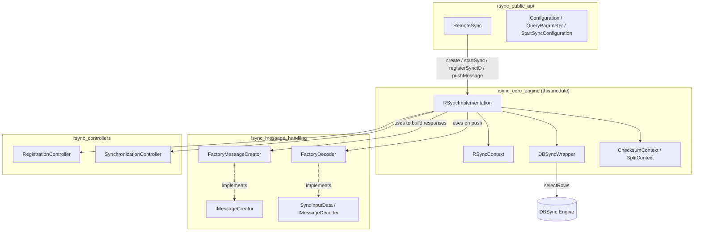
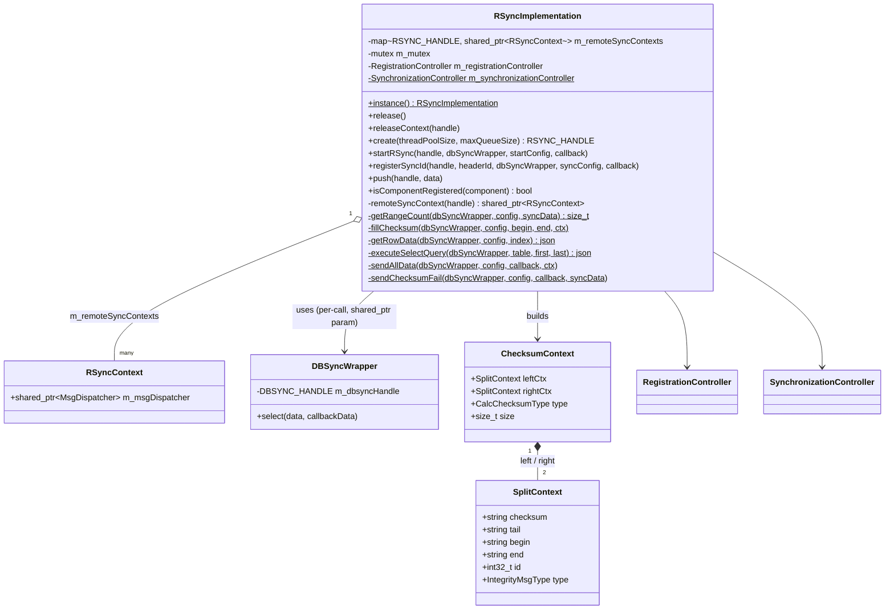
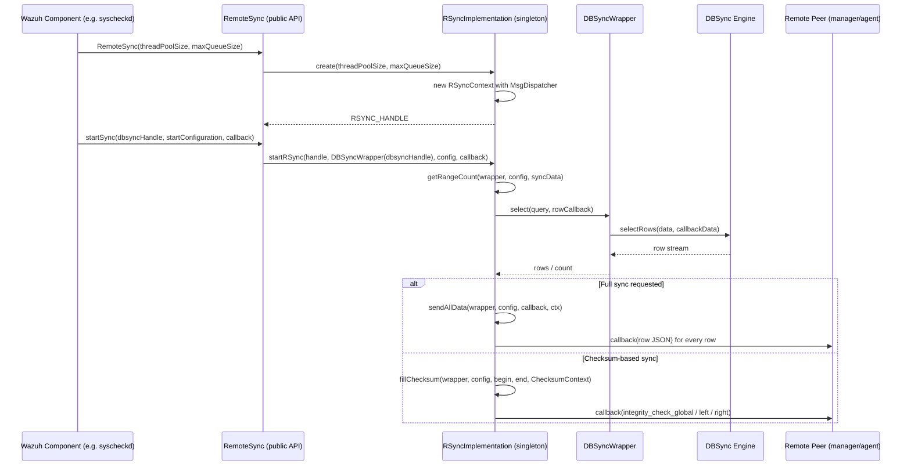
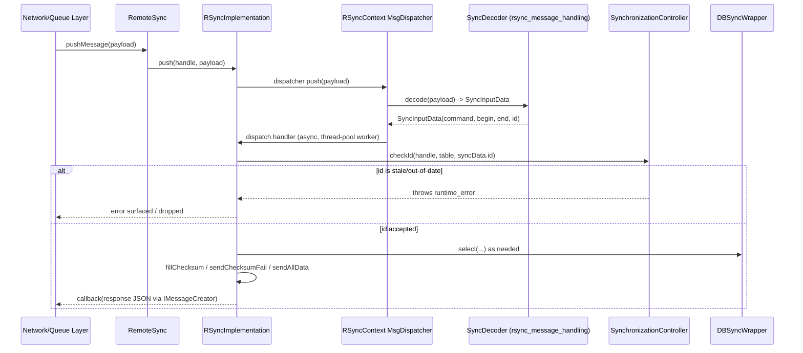
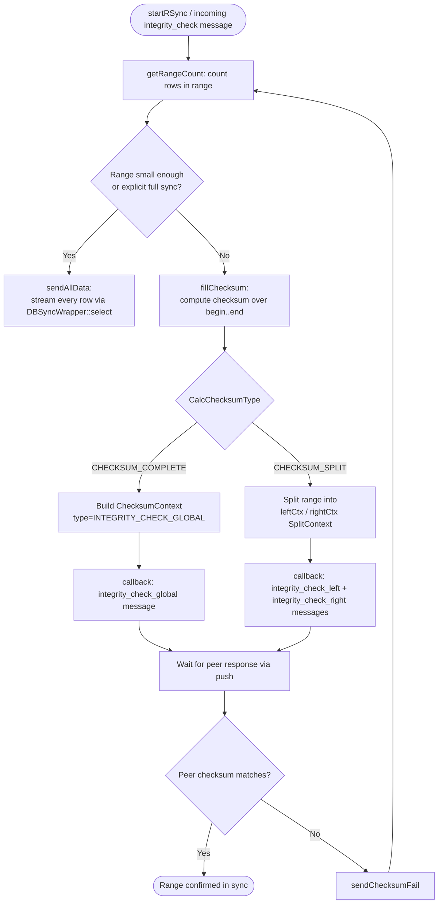
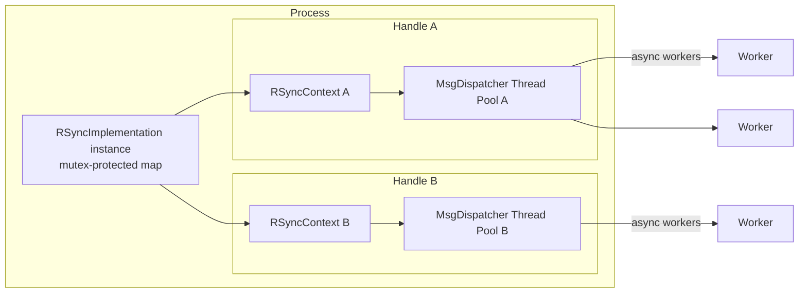

# RSync Core Engine

## Introduction

The **RSync Core Engine** is the internal execution heart of the Wazuh `rsync` shared module (`src/shared_modules/rsync`). While the [rsync_public_api](rsync_public_api.md) exposes the C/C++ facade (`RemoteSync`, `RSync::create`, `RSync::startSync`, etc.) that other Wazuh components (agent, manager, cluster) use to synchronize databases, the Core Engine is where the actual synchronization logic — checksum calculation, range splitting, message dispatching and integrity-check bookkeeping — is implemented.

The engine is centered around two collaborating classes:

- **`RSyncImplementation`** — a process-wide singleton that owns every active synchronization context, drives the checksum/split algorithm over a database snapshot (via `DBSyncWrapper`), and dispatches asynchronous work through a thread-pooled message dispatcher.
- **`DBSyncWrapper`** — a thin adapter around the [DBSync](dbsync_public_api.md) engine (`DBSYNC_HANDLE`) that isolates `RSyncImplementation` from the concrete DBSync API, primarily exposing row-selection queries needed to compute checksums and to stream data during synchronization.

This document describes the internal architecture, data structures, and control/data flow of the Core Engine, and shows how it relates to the neighboring RSync sub-modules and to DBSync.

## Position in the RSync / Shared Modules Ecosystem

The RSync module is organized into three cooperating layers. The Core Engine is the middle layer that the other two depend on:



- The public API layer (`RemoteSync`) is documented in [rsync_public_api.md](rsync_public_api.md).
- Message encoding/decoding abstractions (`IMessageCreator`, `SyncInputData`, factory classes) are documented in [rsync_message_handling.md](rsync_message_handling.md).
- The lightweight per-component/per-sync bookkeeping helpers (`RegistrationController`, `SynchronizationController`) are documented in [rsync_controllers.md](rsync_controllers.md).
- The underlying storage/query engine (`DBSyncTxn`, `IDbEngine`, SQLite backend) belongs to the [dbsync module](dbsync_public_api.md); `DBSyncWrapper` is the sole entry point the Core Engine uses to reach it.
- Generic asynchronous dispatch utilities (`MsgDispatcher`, thread-safe queues) come from [shared_utils](shared_utils.md) (`threading_dispatch_queues`).

## Core Responsibilities

1. **Lifecycle management of synchronization instances.** Each call to `RSync::create()` (public API) allocates an opaque `RSYNC_HANDLE` mapped internally to an `RSyncContext`, which owns a dedicated `MsgDispatcher` thread pool.
2. **Checksum computation and range splitting.** Implements the classic rsync-style integrity algorithm: compute a checksum over a full range of rows; if a mismatch is reported by the remote peer, the range is recursively split in half (`INTEGRITY_CHECK_LEFT` / `INTEGRITY_CHECK_RIGHT`) until minimal diverging ranges are identified.
3. **Data streaming.** When full synchronization is required, `sendAllData` iterates rows through `DBSyncWrapper::select` and forwards each row to the manager/agent counterpart via the result callback.
4. **Message dispatch.** Incoming raw byte buffers (`push`) are decoded into `SyncInputData` and routed asynchronously through `MsgDispatcher`, decoupling network/queue I/O from CPU-bound checksum work.
5. **Component & sync-id bookkeeping.** Delegates to `RegistrationController` (has a component already registered a sync context?) and `SynchronizationController` (is a given sync id from a peer's message still the "current" one for a table?) to avoid duplicate/racing synchronizations.

## Key Data Structures

### `RSyncImplementation` (Singleton)



Key points:
- `RSyncImplementation` is a **meyers singleton** (`instance()`), ensuring a single global registry of contexts across the process, regardless of how many `RemoteSync` C++ objects exist.
- `RSyncContext` is a private nested class whose sole purpose is to own a `shared_ptr<MsgDispatcher>` — the thread pool + queue used to process pushed messages asynchronously.
- `IntegrityMsgType` defines the four wire-level integrity message kinds (`integrity_check_left`, `integrity_check_right`, `integrity_check_global`, `integrity_clear`), mapped through the static `IntegrityCommands` table.
- `SplitContext` captures one "half" of a checksum comparison (its `begin`/`end` row-index boundaries, `checksum`, `tail` marker, correlation `id`, and which `IntegrityMsgType` it represents).
- `ChecksumContext` bundles the left/right `SplitContext` plus whether the checksum covers the **complete** range (`CHECKSUM_COMPLETE`) or a **split** sub-range (`CHECKSUM_SPLIT`), along with the total row `size`.

### `DBSyncWrapper`

A minimal, virtual (mockable) adapter:

```cpp
class DBSyncWrapper {
    DBSYNC_HANDLE m_dbsyncHandle;
public:
    explicit DBSyncWrapper(DBSYNC_HANDLE dbsyncHandle);
    virtual void select(nlohmann::json& data, ResultCallbackData callbackData);
    virtual ~DBSyncWrapper() = default;
};
```

It exists specifically to:
- Decouple `RSyncImplementation` from the concrete `DBSync` class (see [dbsync_public_api.md](dbsync_public_api.md)), enabling unit testing via mocks/fakes.
- Provide the single operation the Core Engine actually needs from DBSync during synchronization: `selectRows` (row streaming with a callback), wrapped as `select`.

## Relationship to the Public API and Message Handling Layers

`RemoteSync` (public API, see [rsync_public_api.md](rsync_public_api.md)) is a thin, stable-ABI wrapper that forwards every operation straight into `RSyncImplementation::instance()`:

| `RemoteSync` method | Delegates to `RSyncImplementation` |
|---|---|
| Constructor (`threadPoolSize`, `maxQueueSize`) | `create(...)` → allocates `RSYNC_HANDLE` + `RSyncContext` |
| `startSync(dbsyncHandle, startConfiguration, callbackData)` | `startRSync(handle, DBSyncWrapper, config, callback)` |
| `registerSyncID(messageHeaderID, dbsyncHandle, syncConfiguration, callbackData)` | `registerSyncId(handle, headerId, DBSyncWrapper, config, callback)` |
| `pushMessage(payload)` | `push(handle, data)` |
| Destructor | `releaseContext(handle)` |

Incoming binary messages pushed via `push()` are decoded using the [`rsync_message_handling`](rsync_message_handling.md) layer: `SyncInputData` is the plain-old-data structure produced by a `FactoryDecoder`-created decoder (`command`, `begin`, `end`, `id`), and outgoing responses are produced by classes implementing `IMessageCreator` (obtained through `FactoryMessageCreator`). The `MsgDispatcher` alias in `RSyncImplementation` is explicitly parameterized with `SyncInputData` as its decoded type and `SyncDecoder` as its decoding strategy.

## Sequence: Starting a Synchronization



## Sequence: Handling an Incoming Integrity Message (`push`)



## Checksum & Range-Splitting Algorithm (Data Flow)

The core integrity algorithm mirrors classic `rsync` divide-and-conquer checksumming:



- `getRangeCount` queries `DBSyncWrapper` to know how many rows fall in a `[begin, end]` range, guiding whether to split further or send raw data.
- `fillChecksum` populates a `ChecksumContext`, computing checksums for either the complete range or two sub-ranges (`leftCtx`/`rightCtx`), each tagged with the appropriate `IntegrityMsgType`.
- `executeSelectQuery` / `getRowData` are helper query builders that translate JSON sync configuration + range boundaries into DBSync-compatible select statements executed through `DBSyncWrapper::select`.
- `sendChecksumFail` is invoked when a previously sent checksum did not match on the peer side, triggering a retry/reset cycle (often leading back into `getRangeCount`/`fillChecksum` with narrower bounds).

## Concurrency Model



- `m_mutex` guards `m_remoteSyncContexts`, protecting concurrent `create`/`releaseContext`/`remoteSyncContext` lookups from multiple threads (e.g., different Wazuh modules each holding their own `RemoteSync` instance).
- Each `RSYNC_HANDLE` gets an **independent** thread pool (`MsgDispatcher`), sized by `threadPoolSize` at creation time — this isolates the async processing of one component's synchronization traffic from another's, and bounds memory via `maxQueueSize` (falling back to synchronous processing if the queue is full, per `DBSyncTxn`/`MsgDispatcher` semantics documented in [shared_utils](shared_utils.md)).
- `RegistrationController` and `SynchronizationController` use `shared_timed_mutex`/`mutex` respectively to allow safe concurrent reads (`isComponentRegistered`) while serializing writes (`initComponentByHandle`, `start`/`stop`/`checkId`).

## Error Handling

- `SynchronizationController::checkId` throws `rsync_error{HANDLE_NOT_FOUND}` when a handle has no active synchronization state, and a generic `std::runtime_error` when an incoming sync id is stale relative to the currently tracked id for a table — both are propagated up through `RSyncImplementation` to the caller/dispatcher, ultimately surfaced (or logged, via `logDebug2(RSYNC_LOG_TAG, ...)`) to the invoking Wazuh component.
- `DBSyncWrapper` methods are `virtual`, allowing the engine's unit tests to substitute mock wrappers that simulate DBSync failures without a real database.

## Extension Points & Testability

- **Mocking `DBSyncWrapper`**: because `select()` is virtual, tests can inject a fake wrapper to drive `RSyncImplementation`'s checksum/split logic deterministically.
- **Pluggable message codecs**: `SyncInputData` decoding and outbound message creation are abstracted behind `IMessageDecoder`/`IMessageCreator` (see [rsync_message_handling.md](rsync_message_handling.md)), allowing the wire format to evolve without touching `RSyncImplementation`'s control flow.
- **Independent controllers**: `RegistrationController` and `SynchronizationController` are standalone, dependency-free classes (see [rsync_controllers.md](rsync_controllers.md)) that could be tested or reused in isolation from the full engine.

## Related Documentation

- [rsync_public_api.md](rsync_public_api.md) — the `RemoteSync` C++ facade and C API (`rsync_close`, `rsync_initialize_full_log_function`) exposed to the rest of Wazuh.
- [rsync_message_handling.md](rsync_message_handling.md) — message creator/decoder abstractions and their factories.
- [rsync_controllers.md](rsync_controllers.md) — `RegistrationController` and `SynchronizationController` internals.
- [dbsync_public_api.md](dbsync_public_api.md) / [dbsync_core_implementation.md](dbsync_core_implementation.md) — the underlying database synchronization engine consumed via `DBSyncWrapper`.
- [shared_utils.md](shared_utils.md) — generic dispatch/queue primitives (`MsgDispatcher`, thread-safe queues) reused by the Core Engine.
