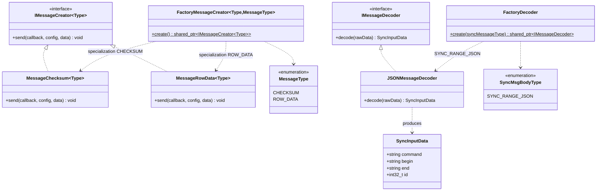
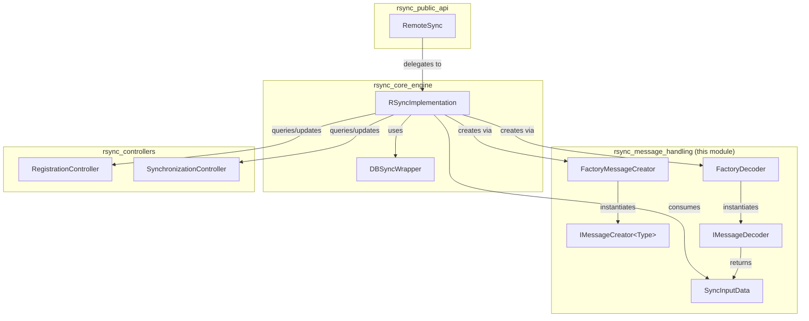
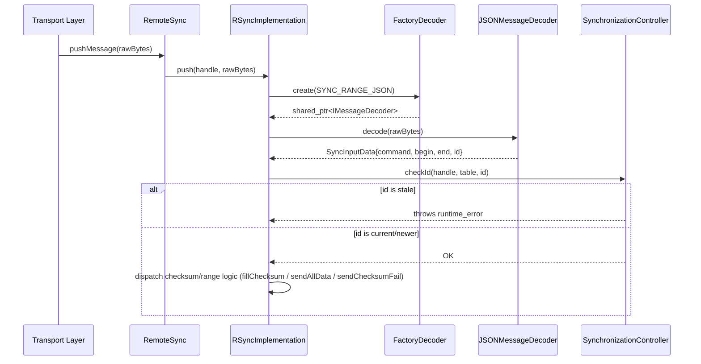

# RSync Message Handling

## Introduction

The **RSync Message Handling** module is a small but pivotal abstraction layer inside the `rsync` module of the Wazuh Shared Modules Infrastructure. It defines the **contracts and factories** used to (a) *create* outbound synchronization messages that are sent from an agent/manager to its peer, and (b) *decode* inbound synchronization messages that are received over the wire.

By isolating message construction/decoding behind interfaces (`IMessageCreator`, `IMessageDecoder`) and factories (`FactoryMessageCreator`, `FactoryDecoder`), the RSync engine (`RSyncImplementation`) can remain agnostic of the concrete wire format used for a given synchronization type (checksum message vs. row-data message) or encoding (currently JSON). This makes it straightforward to add new message shapes or new serialization formats without touching the core synchronization logic.

This module is a leaf/utility component of the broader `rsync` module, which itself lives under the [Shared_Modules_Infrastructure_(C++)](Shared_Modules_Infrastructure_(C++).md) domain, alongside [dbsync](dbsync.md), [router](router.md), and [shared_utils](shared_utils.md).

## Purpose and Core Functionality

| Responsibility | Component |
|---|---|
| Define the abstract contract for producing/sending a sync message of a given data `Type` | `IMessageCreator<Type>` |
| Represent the parsed fields of an incoming sync message (command, range boundaries, sync id) | `SyncInputData` |
| Define the abstract contract for decoding a raw byte buffer into a `SyncInputData` | `IMessageDecoder` |
| Select and instantiate the correct message-creation strategy at compile time (Checksum vs. Row Data) | `FactoryMessageCreator<Type, MessageType>` |
| Select and instantiate the correct message-decoding strategy at runtime (currently JSON only) | `FactoryDecoder` |

These abstractions exist so that the rest of the RSync engine can:
1. Ask a factory for "a checksum message creator" or "a row-data message creator" without knowing the concrete class.
2. Ask a factory for "a JSON decoder" (or, in the future, another wire format) without knowing the concrete class.
3. Extend the system with new message kinds or encodings by adding a new template specialization / enum branch, following the Open/Closed Principle.

## Architecture

### Class Diagram



> Note: `MessageChecksum` and `MessageRowData` currently throw `NOT_SPECIALIZED_FUNCTION` in their `send()` implementation. They exist as the extension points for future/alternate message-emission strategies; today, message emission for checksums and row data is primarily driven directly by `RSyncImplementation` static helpers (`fillChecksum`, `sendAllData`, `sendChecksumFail`), while these factory-created objects provide the pluggable seam for that logic to migrate into.

### Component Relationships within the `rsync` Module



## Key Components

### `IMessageCreator<Type>` (`imessageCreator.h`)
A pure-virtual template interface with a single method:

```cpp
virtual void send(const ResultCallback callback, const nlohmann::json& config, const Type& data) = 0;
```

It abstracts *how* a piece of synchronization data (`Type`, generally a `SyncInputData` or similar context) is turned into an outbound message and dispatched through a `ResultCallback`. Concrete strategies are selected via `FactoryMessageCreator`.

### `MessageType` enum and `FactoryMessageCreator<Type, MessageType>` (`messageCreatorFactory.h`)
A compile-time factory implemented through template specialization:

- `MessageType::CHECKSUM` → produces a `MessageChecksum<Type>`
- `MessageType::ROW_DATA` → produces a `MessageRowData<Type>`
- Any other/unspecialized combination → throws `rsync_error{FACTORY_INSTANTATION}`

This pattern lets calling code write `FactoryMessageCreator<MyType, MessageType::CHECKSUM>::create()` and get back a `shared_ptr<IMessageCreator<MyType>>`, with the compiler enforcing that only known combinations compile without hitting the generic (failing) template.

### `SyncInputData` (`imessageDecoder.h`)
A simple POD-like struct capturing the parsed contents of an inbound synchronization request:

| Field | Meaning |
|---|---|
| `command` | The sync command/verb (e.g., request type) |
| `begin` | Start of the requested checksum/data range |
| `end` | End of the requested checksum/data range |
| `id` | Numeric synchronization id, checked by `SynchronizationController` to detect stale/duplicate requests |

### `IMessageDecoder` (`imessageDecoder.h`)
A pure-virtual interface with:

```cpp
virtual SyncInputData decode(const std::vector<unsigned char>& rawData) = 0;
```

It converts a raw byte buffer (as received from the transport layer, e.g., a Unix socket message pushed via `RemoteSync::pushMessage`) into a structured `SyncInputData`.

### `SyncMsgBodyType` enum and `FactoryDecoder` (`messageDecoderFactory.h`)
A runtime factory (a plain `if`/return rather than template specialization, since the decoder type is chosen dynamically):

- `SyncMsgBodyType::SYNC_RANGE_JSON` → returns a `shared_ptr<JSONMessageDecoder>`
- Any other value → returns a null `shared_ptr<IMessageDecoder>`

### `JSONMessageDecoder` (`messageDecoderJSON.h`, concrete implementation)
Implements `IMessageDecoder::decode`. It parses a space-delimited raw string of the form:

```
<prefix> <command> <json-payload>
```

extracting `command` from the first two tokens, and then parsing the remaining JSON payload for `begin`, `end` (which may be strings or numbers — normalized to strings), and `id`.

### `MessageChecksum<Type>` / `MessageRowData<Type>` (concrete `IMessageCreator` implementations)
Currently placeholder/extension-point implementations that throw `rsync_error{NOT_SPECIALIZED_FUNCTION}` when `send()` is invoked, signaling that specialized behavior must be provided by future concrete overrides or that the calling code should use the static helper methods on `RSyncImplementation` instead.

## Data Flow

### Decoding an Incoming Sync Message



### Creating/Selecting an Outbound Message Strategy

```mermaid
sequenceDiagram
    participant RI as RSyncImplementation
    participant FMC as FactoryMessageCreator
    participant MC as IMessageCreator<Type>

    RI->>FMC: FactoryMessageCreator<Type, MessageType::CHECKSUM>::create()
    FMC-->>RI: shared_ptr<MessageChecksum<Type>>
    RI->>MC: send(callback, config, data)
    Note over MC: Currently throws NOT_SPECIALIZED_FUNCTION;<br/>reserved extension point for future strategies.
```

## Relationship to `rsync_core_engine`

The message handling abstractions are consumed almost exclusively by `RSyncImplementation` (see the sibling `rsync_core_engine` sub-module), which:

- Uses `FactoryDecoder::create(SyncMsgBodyType::SYNC_RANGE_JSON)` to obtain a decoder and turn raw pushed bytes into a `SyncInputData`.
- Uses the decoded `SyncInputData.id` together with the `SynchronizationController` to validate that a sync request is not stale.
- Uses `DBSyncWrapper` (from `rsync_core_engine`) to query the underlying database for checksum/row data that would ultimately be shaped into outbound messages, conceptually corresponding to the `IMessageCreator` role even though the current implementation performs this inline rather than through `FactoryMessageCreator` instances.

## Relationship to `rsync_controllers`

- `RegistrationController` tracks which components have an active RSync handle; it is consulted before a decoded `SyncInputData` request is acted upon, to make sure the target component is currently registered.
- `SynchronizationController` uses the `id` field of `SyncInputData` to enforce monotonic/idempotent synchronization progress per table, preventing regressions or duplicate processing when messages arrive out of order.

## Relationship to `rsync_public_api`

The externally exposed `RemoteSync` class (declared in `rsync.hpp`) is the entry point used by other Wazuh daemons/modules (e.g., Syscollector, FIM) to push raw synchronization messages (`pushMessage`) and register callbacks. Internally, `RemoteSync` delegates directly to `RSyncImplementation::push`, which in turn relies on this module's `FactoryDecoder`/`IMessageDecoder` to interpret those messages.

## Extensibility Guide

To add a **new outbound message strategy**:
1. Implement a new class derived from `IMessageCreator<Type>`.
2. Add a new value to the `MessageType` enum.
3. Add a new template specialization of `FactoryMessageCreator<Type, NewMessageType>` that returns `make_shared<YourNewClass<Type>>()`.

To add a **new inbound message encoding** (e.g., a binary protocol instead of JSON):
1. Implement a new class derived from `IMessageDecoder`.
2. Add a new value to the `SyncMsgBodyType` enum.
3. Add a branch in `FactoryDecoder::create` returning `make_shared<YourNewDecoder>()` for the new enum value.

This design keeps `RSyncImplementation` free of format-specific parsing/serialization logic, confining that complexity to this module.

## Error Handling

- `FactoryMessageCreator` (unspecialized/default template) throws `rsync_error{FACTORY_INSTANTATION}` if instantiated with an unsupported `Type`/`MessageType` combination — this is primarily a compile-time safety net since specializations are chosen statically.
- `MessageChecksum<Type>::send` and `MessageRowData<Type>::send` throw `rsync_error{NOT_SPECIALIZED_FUNCTION}`, explicitly marking these as not-yet-implemented extension points.
- `FactoryDecoder::create` returns a **null** `shared_ptr<IMessageDecoder>` for unrecognized `SyncMsgBodyType` values rather than throwing, so callers must check the returned pointer before use.
- `JSONMessageDecoder::decode` relies on `nlohmann::json::parse`, which will throw a `nlohmann::json::parse_error` (or related exception) if the payload following the command token is not valid JSON, or `json::at()` throwing `out_of_range` if required fields (`begin`, `end`, `id`) are missing.

## Related Documentation

- `rsync_core_engine` — `RSyncImplementation`, `DBSyncWrapper`, and the overall synchronization engine that consumes this module.
- `rsync_controllers` — `RegistrationController` and `SynchronizationController`, which coordinate component registration and per-table sync-id validation using data produced by this module.
- [dbsync](dbsync.md) — the database synchronization engine queried by `DBSyncWrapper` to build checksum/row-data payloads.
- [Shared_Modules_Infrastructure_(C++)](Shared_Modules_Infrastructure_(C++).md) — parent domain containing `rsync`, `dbsync`, `router`, and `shared_utils`.
