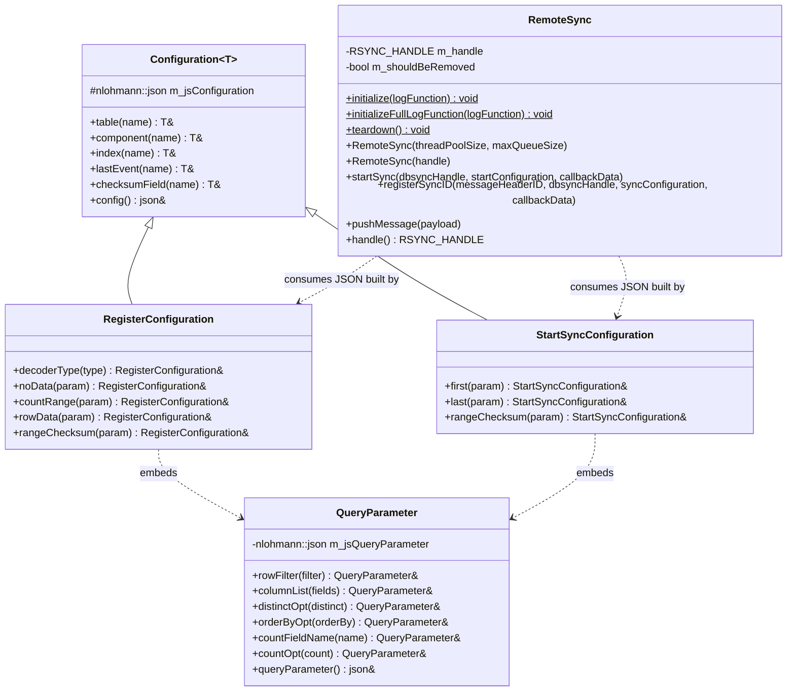
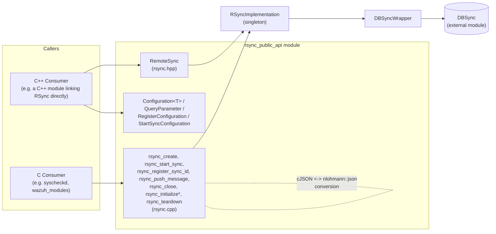
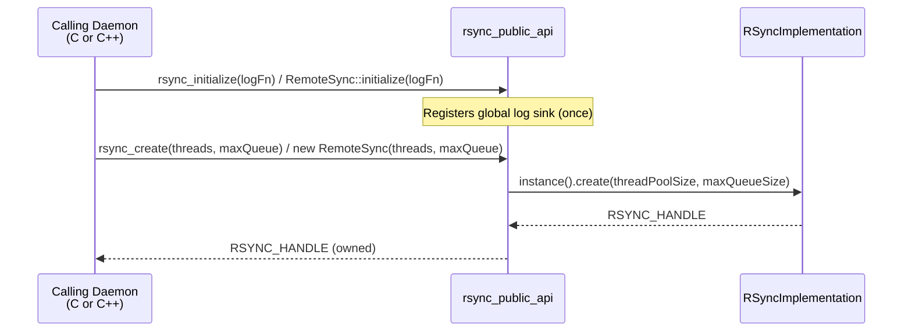
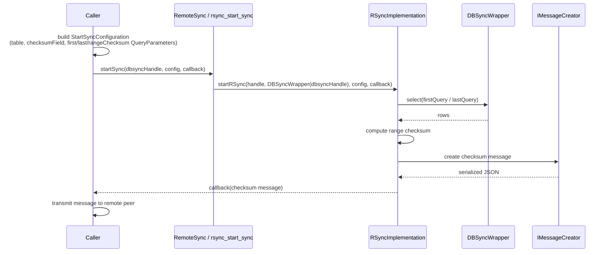
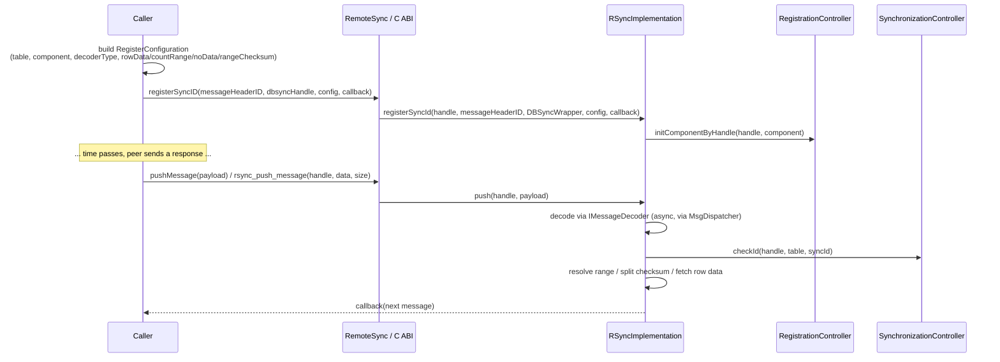
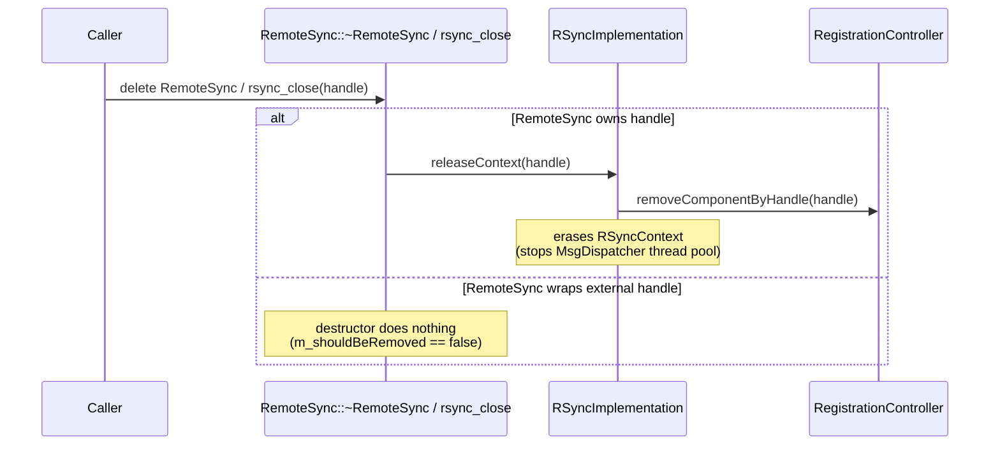
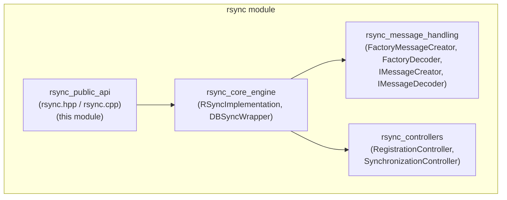

# RSync Public API

## Introduction

The **rsync_public_api** module is the outward-facing surface of Wazuh's **RSync** (Remote Sync) shared library — a C++ component that implements a generic, checksum-based data-integrity synchronization protocol used to reconcile a local dataset (managed via [DBSync](dbsync_public_api.md)) with a remote peer (typically the counterpart agent/manager side of the Wazuh secure channel).

This module exposes exactly what external callers (both C++ and C consumers) need in order to use RSync, without any knowledge of the internal checksum binary-search engine:

- The **`RemoteSync`** C++ class — the primary handle-owning object used to initialize the library, start a synchronization session, register additional sync IDs, and push incoming peer data into the engine.
- A family of **fluent configuration builders** — `Configuration<T>` (CRTP base), `QueryParameter`, `RegisterConfiguration`, and `StartSyncConfiguration` — used to build the JSON payloads that describe *which table*, *which columns*, and *which query bounds* a synchronization operation should use, without hand-rolling JSON.
- The **C ABI** entry points defined in `rsync.cpp` (`rsync_create`, `rsync_start_sync`, `rsync_register_sync_id`, `rsync_push_message`, `rsync_close`, `rsync_initialize`, `rsync_initialize_full_log_function`, `rsync_teardown`) that let pure-C callers (most Wazuh native daemons) drive the same functionality as `RemoteSync`.

All heavy lifting — the actual checksum binary-search algorithm, handle/context bookkeeping, and message (de)serialization — is delegated to sibling internal sub-modules documented separately:

- **[RSync Core Engine](rsync_core_engine.md)** — `RSyncImplementation` (singleton), `RSyncContext`/`ChecksumContext`/`SplitContext`, and `DBSyncWrapper`.
- **[RSync Message Handling](rsync_message_handling.md)** — `FactoryMessageCreator`/`IMessageCreator` and `FactoryDecoder`/`IMessageDecoder`/`SyncInputData`.
- **[RSync Controllers](rsync_controllers.md)** — `RegistrationController` and `SynchronizationController`.

This document focuses solely on the **public contract**: what a consumer includes, links against, and calls.

---

## 1. Purpose and Core Functionality

RSync solves the problem of *"how do two copies of a dataset — one local (in DBSync), one held by a remote peer — converge to the same state without re-transmitting everything every time?"* The public API's responsibilities are:

1. **Library lifecycle** — one-time initialization of the logging subsystem (`RemoteSync::initialize` / `initializeFullLogFunction`) and global teardown (`RemoteSync::teardown`).
2. **Handle management (public surface)** — creating an independent synchronization context (`RemoteSync` constructor with a thread-pool size and max queue size), or wrapping an externally-owned `RSYNC_HANDLE` (secondary constructor), mirroring the pattern used by [DBSync's public API](dbsync_public_api.md).
3. **Starting a synchronization cycle** — `startSync()` associates a `DBSyncWrapper`-wrapped DBSync handle with a `StartSyncConfiguration` and a result callback, kicking off the first checksum computation over a table range.
4. **Multi-component/table registration** — `registerSyncID()` binds a specific message-header ID to a `(DBSyncWrapper, RegisterConfiguration)` pair so multiple tables can share one `RemoteSync` handle while their sync traffic is routed independently.
5. **Feeding peer responses back in** — `pushMessage()` is the single entry point for data arriving from the remote peer; it is queued for asynchronous processing by the internal engine.
6. **Declarative query/config building** — the `Configuration<T>`/`QueryParameter`/`RegisterConfiguration`/`StartSyncConfiguration` builder classes let callers describe table name, component name, index, checksum field, row filters, column lists, and query bounds fluently and safely (leveraging the generic `Utils::Builder<T>` CRTP pattern from [Shared Utils](shared_lib.md)).
7. **C ABI parity** — every capability above is also available as a plain C function so non-C++ daemons (the majority of Wazuh's native code, e.g. `syscheckd`, `wazuh_modules`) can use RSync without any C++ exposure crossing the ABI boundary.

### Non-Goals

This module does **not** implement the checksum binary-search algorithm, the actual storage queries, or JSON message parsing/creation — those live in the Core Engine, Message Handling, and Controllers sub-modules. It also performs no FIM/Syscollector-specific logic; it is a generic synchronization primitive.

---

## 2. Architecture

### 2.1 Component Overview

`Configuration<T>` and `QueryParameter` both extend `Utils::Builder<T>` — the fluent CRTP builder pattern documented in [Shared Utils — design_patterns](shared_lib.md) — so every setter returns `T&`, enabling method chaining (e.g. `RegisterConfiguration().table("fim_entry").component("fim").rowData(param)`).

### 2.2 C vs C++ Surface

Both surfaces converge on the internal singleton `RSyncImplementation::instance()` (see [RSync Core Engine](rsync_core_engine.md)). The C functions additionally perform `cJSON` ↔ `nlohmann::json` marshalling (via `cJSON_PrintUnformatted`/`nlohmann::json::parse` and `CJsonSmartFree`) and translate C++ exceptions into integer return codes plus a log message, so pure-C callers never have to deal with C++ exceptions crossing the ABI boundary.

### 2.3 Handle Model

- `RSYNC_HANDLE` identifies an independent synchronization context (internally an `RSyncContext` holding a dedicated `MsgDispatcher` thread pool — see [RSync Core Engine](rsync_core_engine.md)).
- The `RemoteSync` C++ class can either:
  - **Own** a handle — created via the primary constructor `RemoteSync(threadPoolSize, maxQueueSize)`, which calls `RSyncImplementation::instance().create(...)`; the destructor releases the context (`m_shouldBeRemoved = true`).
  - **Wrap** an externally-owned handle — via the secondary constructor `RemoteSync(RSYNC_HANDLE handle)`, used internally when the C API already owns the handle's lifetime (`m_shouldBeRemoved = false`), so the destructor does *not* release it.
- On the C side, `rsync_create` returns a raw `RSYNC_HANDLE` that the caller must eventually pass to `rsync_close` to release its context via `RSyncImplementation::instance().releaseContext(handle)`.

---

## 3. Core Components Reference

### 3.1 `RemoteSync` (`rsync.hpp` / `rsync.cpp`)

| Member | Description |
|---|---|
| `static void initialize(logFunction)` | Registers a simple `std::function<void(const std::string&)>` log sink. Idempotent — only the first call takes effect (`if (!gs_logFunction)`). |
| `static void initializeFullLogFunction(logFunction)` | Registers a richer, `printf`-style log callback (level, tag, file, line, function, message, `va_list`) via `Log::assignLogFunction`, used by the internal `logDebug2`/etc. macros (see `RSYNC_LOG_TAG`). |
| `static void teardown()` | Calls `RSyncImplementation::instance().release()`, releasing **all** active handles/contexts process-wide. Intended for full library shutdown. |
| `RemoteSync(threadPoolSize, maxQueueSize)` | Creates a **new** synchronization context; `threadPoolSize` defaults to `std::thread::hardware_concurrency()`, `maxQueueSize` defaults to `UNLIMITED_QUEUE_SIZE`. Owns the resulting handle. |
| `RemoteSync(RSYNC_HANDLE handle)` | Wraps an existing handle without taking ownership (used by the C API layer). |
| `~RemoteSync()` | Releases the context via `RSyncImplementation::instance().releaseContext(m_handle)` **only if** the instance owns the handle; exceptions from release are logged, not propagated. |
| `void startSync(dbsyncHandle, startConfiguration, callbackData)` | Wraps `dbsyncHandle` in a `DBSyncWrapper` and calls `RSyncImplementation::instance().startRSync(...)`, kicking off the initial checksum computation/first sync message for the configured table/range. |
| `void registerSyncID(messageHeaderID, dbsyncHandle, syncConfiguration, callbackData)` | Wraps `dbsyncHandle` and calls `RSyncImplementation::instance().registerSyncId(...)`, associating `messageHeaderID` with this table/component so future `pushMessage` calls carrying that ID are routed correctly. |
| `void pushMessage(payload)` | Forwards `payload` (a `std::vector<uint8_t>`) to `RSyncImplementation::instance().push(m_handle, payload)` for asynchronous decoding and processing. |
| `RSYNC_HANDLE handle()` | Accessor for the underlying handle, e.g. to pass to other RSync-aware APIs. |

`SyncCallbackData` is defined as `const std::function<void(const std::string&)>` — the callback invoked by the engine whenever it needs to emit an outgoing sync message (checksum request, row data, etc.) that the caller must transmit to the remote peer.

### 3.2 Configuration Builders (`rsync.hpp` / `rsync.cpp`)

All builder classes produce/mutate an internal `nlohmann::json` object (`m_jsConfiguration` / `m_jsQueryParameter`) and return a reference to themselves (`T&`) from every setter, enabling fluent chaining. They never talk to the engine directly — the resulting JSON is simply passed into `RemoteSync::startSync` / `registerSyncID` (C++) or `rsync_start_sync` / `rsync_register_sync_id` (C, as a `cJSON*`).

#### `Configuration<T>` (CRTP base, templated on the derived type)

| Method | Effect on JSON |
|---|---|
| `table(name)` | Sets `"table"` |
| `component(name)` | Sets `"component"` |
| `index(name)` | Sets `"index"` |
| `lastEvent(name)` | Sets `"last_event"` |
| `checksumField(name)` | Sets `"checksum_field"` |
| `config()` | Returns the built `nlohmann::json&` |

#### `QueryParameter`

Represents one query's bounds/options (used to build `first`/`last`/`range_checksum`/`no_data`/`row_data`/`count_range` sub-objects):

| Method | JSON key set |
|---|---|
| `rowFilter(filter)` | `row_filter` |
| `columnList(fields)` | `column_list` |
| `distinctOpt(distinct)` | `distinct_opt` |
| `orderByOpt(orderBy)` | `order_by_opt` |
| `countFieldName(name)` | `count_field_name` |
| `countOpt(count)` | `count_opt` |

#### `RegisterConfiguration` (extends `Configuration<RegisterConfiguration>`)

Used with `registerSyncID` / `rsync_register_sync_id` to declare how a specific message-header ID's incoming sync requests should be resolved against the local dataset:

| Method | JSON key set (embeds a `QueryParameter`) |
|---|---|
| `decoderType(type)` | `decoder_type` |
| `noData(param)` | `no_data_query_json` |
| `countRange(param)` | `count_range_query_json` |
| `rowData(param)` | `row_data_query_json` |
| `rangeChecksum(param)` | `range_checksum_query_json` |

#### `StartSyncConfiguration` (extends `Configuration<StartSyncConfiguration>`)

Used with `startSync` / `rsync_start_sync` to describe the initial checksum computation for a table range:

| Method | JSON key set (embeds a `QueryParameter`) |
|---|---|
| `first(param)` | `first_query` |
| `last(param)` | `last_query` |
| `rangeChecksum(param)` | `range_checksum_query_json` |

### 3.3 C ABI (`rsync.cpp`)

| Function | Purpose | Notes |
|---|---|---|
| `rsync_initialize(log_fnc_t)` | Registers the simple log callback (wraps into `RemoteSync::initialize`). | |
| `rsync_initialize_full_log_function(full_log_fnc_t)` | Registers the rich `printf`-style log callback. | Documented core component of this module. |
| `rsync_teardown()` | Releases all handles/contexts (`RSyncImplementation::instance().release()`). | |
| `rsync_create(thread_pool_size, maxQueueSize)` | Creates a new `RSYNC_HANDLE`. Returns `nullptr` and logs on failure. | |
| `rsync_start_sync(handle, dbsync_handle, start_configuration, callback_data)` | C entry point equivalent to `RemoteSync::startSync`. Validates parameters, converts `cJSON*` → `nlohmann::json`, wraps `callback_data.callback` in a lambda. | Returns `0` on success, `-1` on error. |
| `rsync_register_sync_id(handle, message_header_id, dbsync_handle, sync_configuration, callback_data)` | C entry point equivalent to `RemoteSync::registerSyncID`. | Returns `0`/`-1`. |
| `rsync_push_message(handle, payload, size)` | C entry point equivalent to `RemoteSync::pushMessage`; copies the raw buffer into a `std::vector<unsigned char>`. | Returns `0`/`-1`. |
| `rsync_close(handle)` | Releases a single handle's context via `RSyncImplementation::instance().releaseContext(handle)`. | Documented core component of this module. Returns `0` on success, `-1` if the handle is invalid. |

`sync_callback_data_t` (the C callback struct, `{ callback, user_data }`) and `log_fnc_t`/`full_log_fnc_t` are the plain-C function-pointer types shared with the rest of Wazuh's C codebase (see [Wazuh Modules Daemon (C)](Wazuh_Modules_Daemon_(C).md) and [Agent & Manager Native Daemons (C)](Agent_&_Manager_Native_Daemons_(C).md) for typical callers).

---

## 4. Data / Control Flow

### 4.1 Library Initialization & Handle Creation

### 4.2 Starting a Synchronization Cycle

### 4.3 Registering a Sync ID and Receiving Peer Data

### 4.4 Handle/Context Teardown

---

## 5. Consumers Across the Codebase

| Consumer | How it uses `rsync_public_api` | Reference |
|---|---|---|
| Syscheck/FIM daemon | Synchronizes file/registry inventory checksums between agent and manager using `RemoteSync`/C ABI over table ranges backed by DBSync | [Syscheck FIM Daemon](Syscheck___FIM_Daemon_(C_C++).md) |
| Wazuh Modules Daemon (syscollector, etc.) | Uses the C ABI (`rsync_create`, `rsync_start_sync`, `rsync_push_message`) to keep inventory tables in sync with the manager | [Wazuh Modules Daemon (C)](Wazuh_Modules_Daemon_(C).md) |
| Any DBSync-backed scanner needing cluster-wide consistency | Builds `StartSyncConfiguration`/`RegisterConfiguration` around its DBSync table and drives synchronization through `RemoteSync` | [DBSync Public API](dbsync_public_api.md) |

For the generic utility types leveraged by this module (the `Builder<T>` CRTP pattern, thread-pooled `MsgDispatcher`, `CJsonSmartDeleter`, `loggerHelper.h`), see [Shared Library (`src/shared/`)](shared_lib.md) — note that RSync itself is a C++ shared module (`src/shared_modules/`) but reuses several generic primitives conceptually mirrored there and in `src/shared_modules/utils`.

---

## 6. Module Placement in the RSync Subsystem

`rsync_public_api` is one of four sibling sub-modules that together make up the `rsync` module (part of [Shared_Modules_Infrastructure_(C++)](Shared_Modules_Infrastructure_(C++).md)):

- **[RSync Core Engine](rsync_core_engine.md)** — Implements `RSyncImplementation` (the singleton orchestrating handles/contexts, checksum binary-search algorithm) and `DBSyncWrapper` (thin adapter forwarding `select()` calls to `DBSync::selectRows`).
- **[RSync Message Handling](rsync_message_handling.md)** — Implements the factories/interfaces used to serialize outgoing checksum/row-data messages and decode incoming JSON sync requests.
- **[RSync Controllers](rsync_controllers.md)** — Implements `RegistrationController` (tracks which components are registered per handle) and `SynchronizationController` (guards against stale/out-of-order sync IDs per table).

Callers should only ever interact with the classes/functions documented here (`RemoteSync`, the `Configuration`/`QueryParameter` builders, and the `rsync_*` C functions); the other three sub-modules are internal implementation details not intended for direct external use.

---

## 7. Design Notes

- **Symmetry with DBSync's public API**: RSync's public surface deliberately mirrors [DBSync's](dbsync_public_api.md) handle-ownership model (owning vs. wrapping constructors) and dual C/C++ ABI approach, since the two libraries are almost always used together (RSync synchronizes what DBSync stores).
- **Builder pattern for configuration**: Rather than requiring callers to hand-build `nlohmann::json`/`cJSON` payloads, the `Configuration<T>`/`QueryParameter` hierarchy provides compile-time-checked, chainable setters — reducing the risk of malformed sync configuration JSON.
- **Idempotent initialization**: `RemoteSync::initialize` only takes effect the first time it is called (`if (!gs_logFunction)`), so multiple modules can safely call it without overriding each other's log sink.
- **Exception-safe C boundary**: Every `rsync_*` C function wraps its internal logic in a `try/catch`, converting any thrown `rsync_error`/exception into a `-1` return value plus a logged message — no C++ exception ever escapes into calling C code.
- **Ownership-aware destruction**: `RemoteSync`'s destructor only releases the underlying `RSYNC_HANDLE` if the instance created it (`m_shouldBeRemoved`), preventing a C API-owned handle from being prematurely destroyed by a temporary C++ wrapper.
