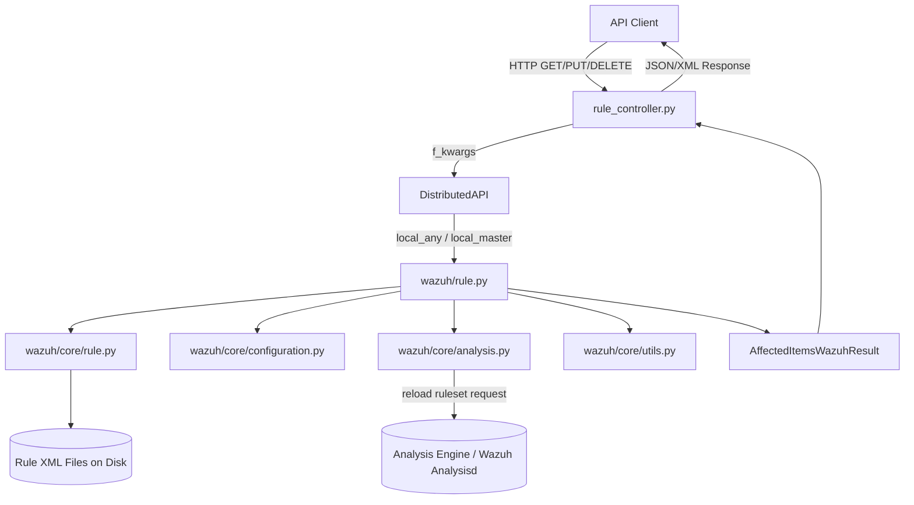
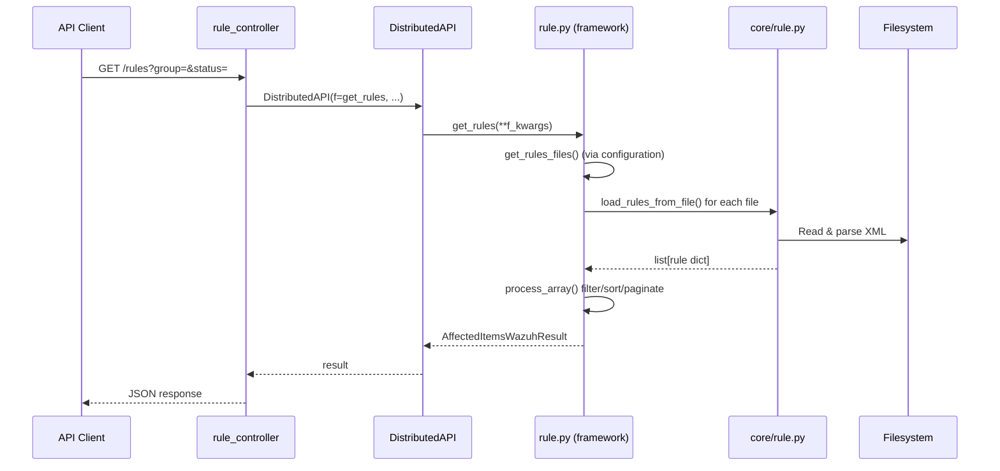
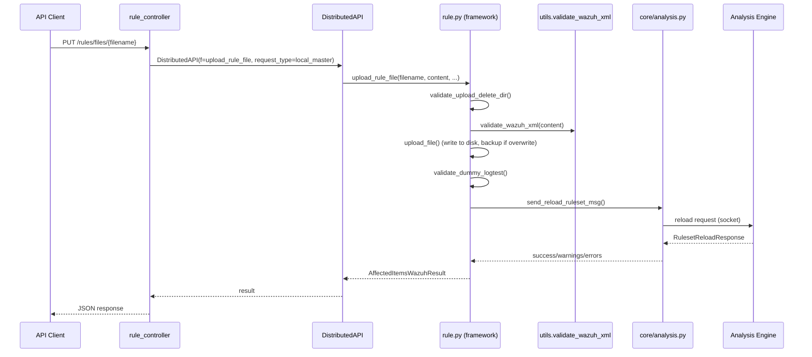

# Rule Module

## 1. Introduction and Purpose

The **Rule Module** is the Wazuh sub-system responsible for managing **detection rules** — the XML-based definitions that the Wazuh analysis engine uses to correlate and classify events raised by decoders. This module exposes the full CRUD lifecycle of rule files through the Wazuh REST API and provides the underlying business logic for:

- Listing and filtering rules currently loaded by the manager (by ID, group, level, status, compliance framework, MITRE technique, etc.).
- Listing physical rule files configured in `ossec.conf` (`<ruleset>` section).
- Reading, uploading (creating/overwriting) and deleting individual rule XML files.
- Extracting aggregate metadata from the rule set, such as all rule **groups** in use or all values used for a given **compliance requirement** (PCI DSS, GDPR, HIPAA, NIST 800-53, GPG13, TSC, MITRE).

The module sits at the intersection of the **API layer** (HTTP request handling, RBAC enforcement, response formatting) and the **framework core layer** (XML parsing, filesystem access, and communication with the Wazuh analysis engine to reload the ruleset after changes).

## 2. Architecture Overview

The Rule Module follows the standard two-tier pattern shared by most Wazuh API "resource" modules:

1. **Controller tier** (`api/api/controllers/rule_controller.py`) — an async, framework-facing (Connexion/aiohttp) layer that parses HTTP parameters, builds keyword arguments, and dispatches the actual work through the **Distributed API (DAPI)** so that the request can be transparently routed to the master node or any node in a cluster.
2. **Framework tier** (`framework/wazuh/rule.py` + `framework/wazuh/core/rule.py`) — the business logic layer that:
   - Reads the `ossec.conf` ruleset configuration to discover which XML files hold rules (`get_rules_files`).
   - Parses each rule XML file into an in-memory list of rule dictionaries (`load_rules_from_file` in the core module).
   - Applies filtering, search, sorting, and pagination (`process_array` utility, shared across all Wazuh framework modules).
   - Handles rule file uploads/deletions, including XML validation and requesting the analysis engine to reload the ruleset.

### Request Flow (Read Path)

### Request Flow (Write Path — Upload)

## 3. Core Components

Since the Rule Module is a compact, single-purpose module (2 Python files delivering both the API and business-logic layers), it is documented as a single logical unit rather than split into further sub-modules. Detailed component documentation is available in:

- **[rule_module_details.md](rule_module_details.md)** — In-depth description of the controller endpoints, the framework functions, the core parsing/status utilities, and their interactions.

## 4. Relationship to Other Modules

The Rule Module reuses and depends on infrastructure provided by several sibling modules documented elsewhere in this wiki:

| Dependency | Purpose | Reference |
|---|---|---|
| Distributed API (`DistributedAPI`, cluster routing) | Routes rule requests to the master node (`local_master`) or any node (`local_any`) in a cluster deployment | [cluster_dapi.md](cluster_dapi.md) |
| RBAC decorators (`expose_resources`) | Enforces per-resource permissions (`rules:read`, `rules:update`, `rules:delete`) | [security_rbac_module.md](security_rbac_module.md) |
| `framework_core_utils` (`process_array`, `safe_move`, `validate_wazuh_xml`, `upload_file`, `full_copy`, `to_relative_path`, `AffectedItemsWazuhResult`) | Shared filtering/pagination, file-system safety helpers, and standard result container used across all Wazuh resource modules | [framework_core_utils.md](framework_core_utils.md) |
| `framework/wazuh/core/configuration.py` (`get_ossec_conf`) | Reads the `<ruleset>` section of `ossec.conf` to discover configured rule directories/files | [framework_core_utils.md](framework_core_utils.md) |
| `framework/wazuh/core/analysis.py` (`send_reload_ruleset_msg`, `RulesetReloadResponse`) | Notifies the Wazuh analysis engine (analysisd) to reload the ruleset after a file is added/updated/deleted | [engine_module.md](engine_module.md) |
| `framework/wazuh/core/logtest.py` (`validate_dummy_logtest`) | Validates newly uploaded rule content by running it through a logtest dry-run before it is committed | [manager_module.md](manager_module.md) |
| API core infrastructure (authentication, middlewares, URI parsing, validators) | Provides the surrounding FastAPI/Connexion application, request validation and response encoding used by `rule_controller.py` | [api_core_infrastructure.md](api_core_infrastructure.md) |
| Decoder Module | Sibling module with a near-identical architecture (files, status, groups) applied to decoders instead of rules | [decoder_module.md](decoder_module.md) |
| CDB List Module | Another sibling "file resource" module (CDB lists) sharing the same upload/delete/reload pattern | [cdb_list_module.md](cdb_list_module.md) |

## 5. Key Design Notes

- **Stateless parsing**: Rules are not stored in a database; every read request re-parses the relevant XML files from disk (`load_rules_from_file`), guaranteeing the API always reflects the current on-disk configuration.
- **Requirement extraction as derived data**: Compliance requirement values (PCI DSS, GDPR, etc.) and rule groups are not stored separately — they are derived on-the-fly by scanning all loaded rules (`get_groups`, `get_requirement`).
- **Safety on write operations**: `upload_rule_file` creates a `.backup` copy before overwriting, validates the XML syntactically and validates it through a dummy logtest run; if either check fails, the operation is rolled back via `safe_move`.
- **Cluster-awareness**: Read operations (`get_rules`, `get_rules_groups`, `get_rules_requirement`) use `request_type='local_any'` (may run on any node), while write operations (`get_file` via `local_master`, `put_file`, `delete_file`) require `request_type='local_master'` since rule files are managed centrally by the master node.
- **Ruleset reload feedback**: The `RulesetReloadResponse` helper (in `framework/wazuh/core/analysis.py`) standardizes how the analysis engine's reload response (success/warnings/errors) is translated into API-level results or exceptions.
