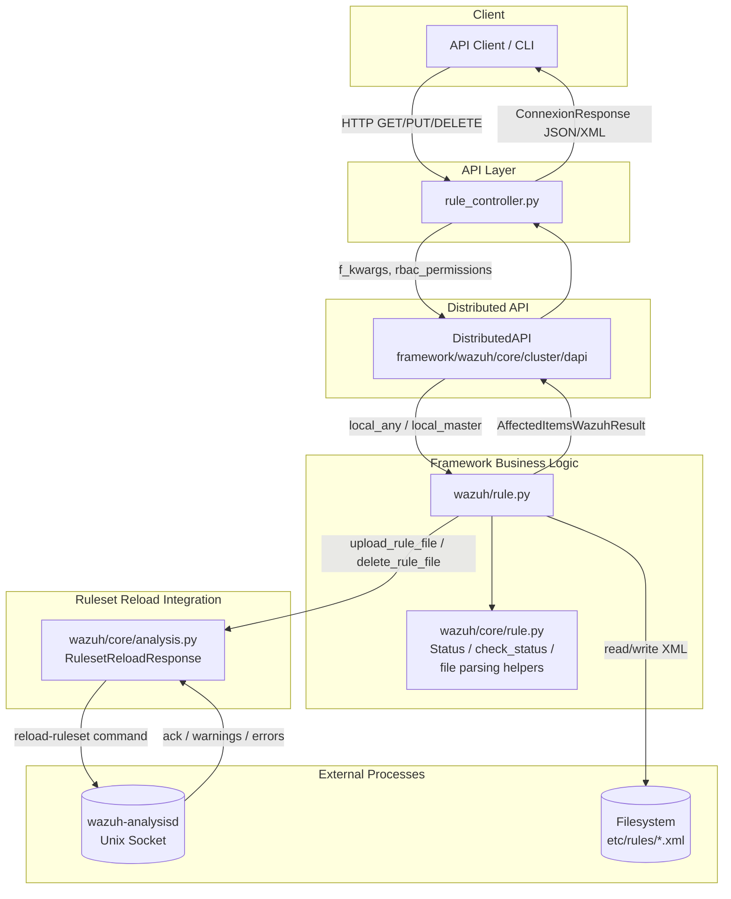
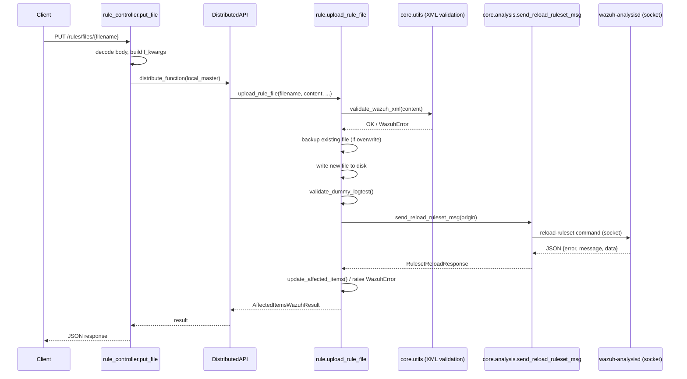
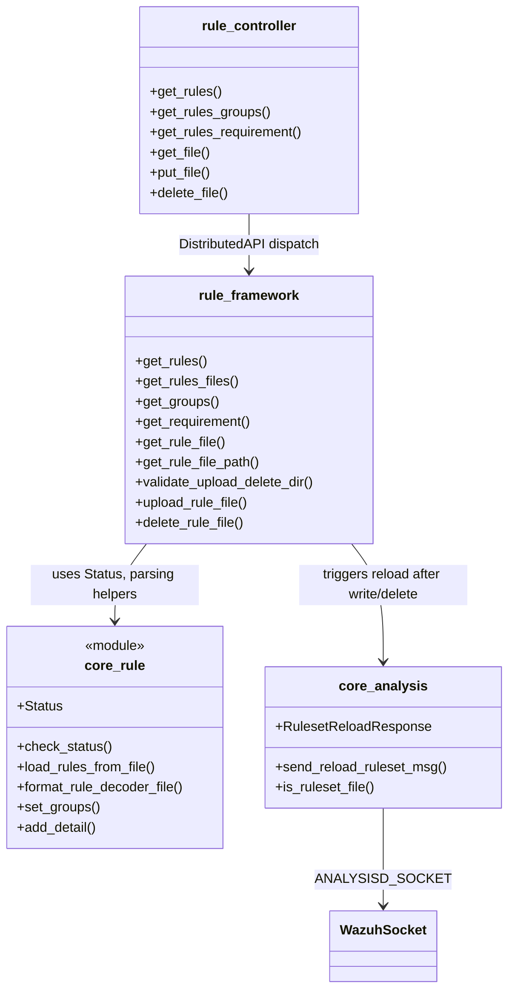

# Rule Module Details

## 1. Introduction and Purpose

The **Rule Module Details** module is the core sub-system responsible for managing **Wazuh detection rules** through the Wazuh API and framework layers. It provides the full lifecycle management of rule files (XML documents that define how Wazuh's analysis engine classifies and alerts on security events):

- **Listing & querying** rules, rule groups, and compliance requirements (PCI DSS, GDPR, HIPAA, NIST 800-53, GPG13, TSC, MITRE ATT&CK).
- **Reading** raw or parsed rule file content.
- **Uploading** (creating/overwriting) custom rule files with XML validation.
- **Deleting** custom rule files.
- **Reloading** the ruleset in the Analysis daemon (`wazuh-analysisd`) so that changes take effect immediately, without a full manager restart.

This module sits at the intersection of the **API layer** (HTTP request handling) and the **Core Framework layer** (business logic, file I/O, and inter-process communication with the analysis engine). It is a child module of the broader `rule_module` and is a sibling to other entity-management modules such as [decoder_module](decoder_module.md) and [cdb_list_module](cdb_list_module.md), which follow a very similar architectural pattern.

## 2. Architecture Overview

The module follows the standard Wazuh API request flow: an HTTP request hits a **Controller** function, which builds arguments and delegates execution to the **Distributed API (DAPI)**, which in turn invokes a **Framework function**. Framework functions apply business rules, validate input, perform file operations, and — when persistent state changes — notify `wazuh-analysisd` to reload the in-memory ruleset via a **Unix domain socket**.

### Request Flow (Upload Example)

## 3. Sub-Modules

The module is organized into three cohesive sub-modules, each documented in detail in its own file:

| Sub-Module | Responsibility | Documentation |
|---|---|---|
| **Rule API Controller** | Exposes HTTP endpoints (`GET`, `PUT`, `DELETE`) for rules, groups, requirements, and rule files. Translates HTTP parameters into framework calls via the Distributed API. | [rule_module_details_api_controller.md](rule_module_details_api_controller.md) |
| **Rule Business Logic (Core)** | Implements rule listing/filtering, group/requirement aggregation, rule file parsing (XML → dict), upload/delete validation, and status enumeration. | [rule_module_details_business_logic.md](rule_module_details_business_logic.md) |
| **Ruleset Reload & Analysis Integration** | Encapsulates communication with `wazuh-analysisd` to hot-reload the ruleset after file changes, parsing success/warning/error responses. | [rule_module_details_reload_integration.md](rule_module_details_reload_integration.md) |

## 4. High-Level Functionality per Sub-Module

### 4.1 Rule API Controller
Provides the async controller functions registered against the OpenAPI specification: `get_rules`, `get_rules_groups`, `get_rules_requirement`, `get_file`, `put_file`, and `delete_file`. Each function normalizes query parameters (pagination, sorting, searching), forwards them to the `DistributedAPI`, and formats the JSON/XML response. See [rule_module_details_api_controller.md](rule_module_details_api_controller.md) for details.

### 4.2 Rule Business Logic (Core)
Implements the actual rule management logic in `framework/wazuh/rule.py` and shared utilities in `framework/wazuh/core/rule.py`:
- Loading and parsing rule XML files into structured dictionaries (including MITRE, compliance groups, and dynamic fields).
- Filtering/sorting/pagination via `process_array`.
- Validating upload/delete target directories (`validate_upload_delete_dir`) to prevent tampering with default ruleset paths.
- Managing rule file backups during overwrite operations.

See [rule_module_details_business_logic.md](rule_module_details_business_logic.md).

### 4.3 Ruleset Reload & Analysis Integration
Implements `RulesetReloadResponse` and `send_reload_ruleset_msg` in `framework/wazuh/core/analysis.py`, which send a `reload-ruleset` command to `wazuh-analysisd` over a Unix socket after any rule file is created, updated, or deleted — ensuring changes are applied without restarting the manager.

See [rule_module_details_reload_integration.md](rule_module_details_reload_integration.md).

## 5. Component Relationships

## 6. How This Module Fits Into the Overall System

- **Upstream callers**: The API core infrastructure (middleware, authentication, RBAC) routes authenticated, permission-checked HTTP requests to `rule_controller`. RBAC permissions are attached via `@expose_resources` decorators in the framework layer (see [security_rbac_module](security_rbac_module.md)).
- **Cluster distribution**: All framework calls are wrapped by `DistributedAPI` (see [cluster_dapi](cluster_dapi.md)), which decides whether the request should run locally, on the master, or be forwarded across the cluster (`local_any` for reads, `local_master` for writes, since only the master node's ruleset is the source of truth).
- **Downstream effects**: Successful uploads/deletes notify `wazuh-analysisd` so detection rules are applied live, without requiring a manager restart.
- **Shared utilities**: Leverages generic helpers from [framework_core_utils](framework_core_utils.md) (`process_array`, `safe_move`, `validate_wazuh_xml`, `upload_file`, `full_copy`) and [framework_core_communication](framework_core_communication.md) (`WazuhSocket`) for file management and socket I/O.
- **Sibling modules**: Architecturally identical to [decoder_module](decoder_module.md) and [cdb_list_module](cdb_list_module.md), which manage decoders and CDB lists respectively using the same controller → framework → filesystem pattern.
- **Cluster propagation**: Master-side rule changes are synchronized to worker nodes through the cluster's file integrity/synchronization mechanism (see [cluster_master](cluster_master.md) and [cluster_worker](cluster_worker.md)).

## 7. Key Design Notes

- **Read operations** (`get_rules`, `get_rules_groups`, `get_rules_requirement`, `get_file`) are dispatched as `local_any`, meaning any node (master or worker) can serve them from its local ruleset copy.
- **Write operations** (`put_file`, `delete_file`) are dispatched as `local_master`, ensuring rule changes are only made on the master node, which then propagates the updated ruleset to workers.
- **Safety mechanisms** during upload include: XML schema validation, automatic backup-and-restore on failure, and a "dummy logtest" validation pass (`validate_dummy_logtest`) that ensures the analysis engine can actually load the new rule before committing the change permanently.
- **Directory restrictions**: `validate_upload_delete_dir` prevents users from uploading/deleting files inside the default, read-only ruleset directories (`RULES_PATH`), forcing custom content into `USER_RULES_PATH`.
