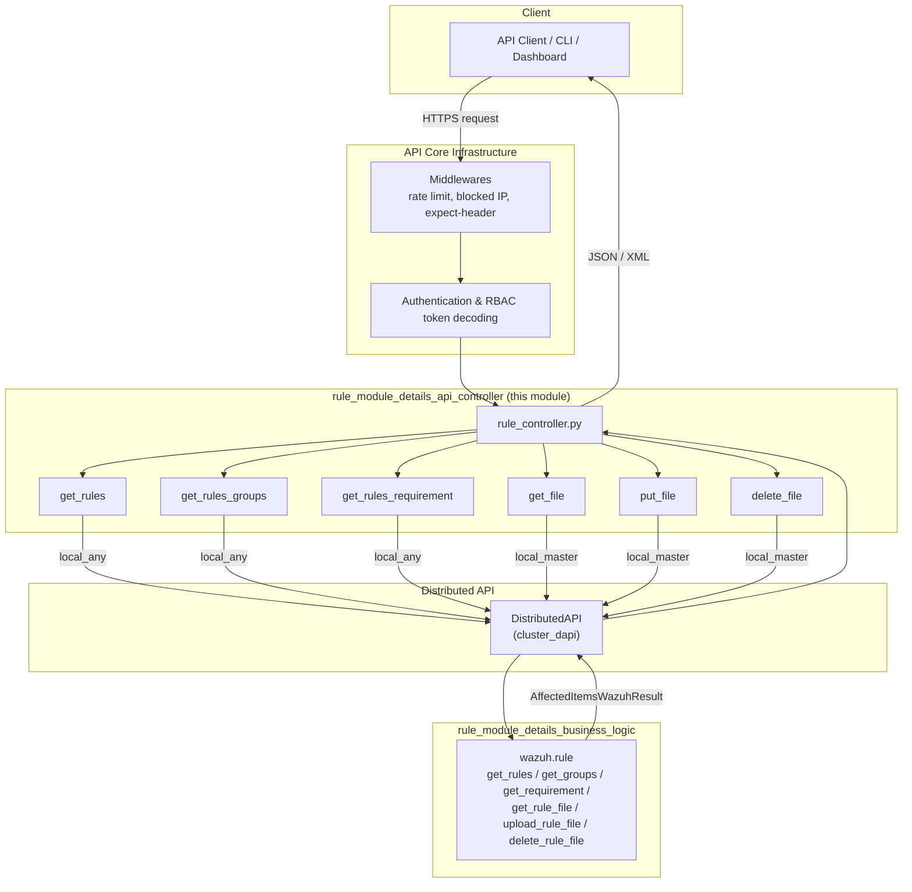
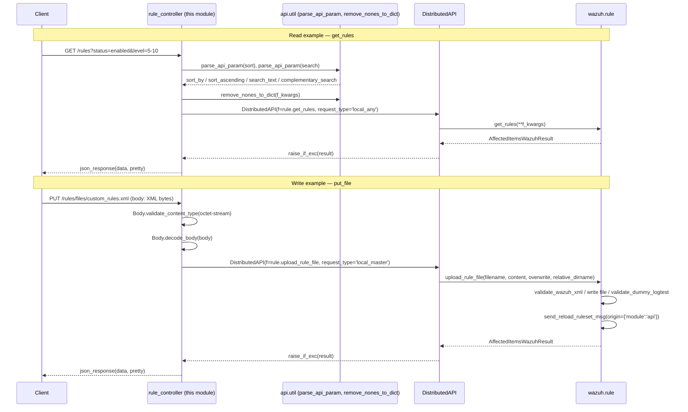
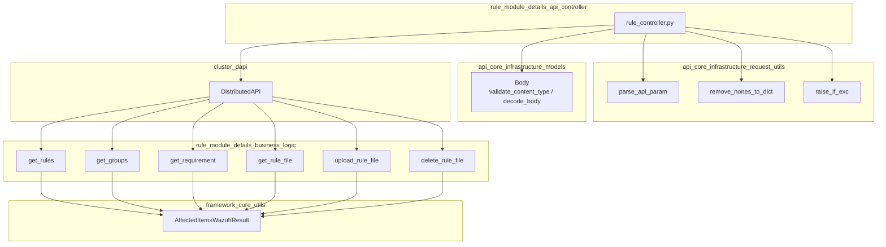

# Rule Module Details — API Controller

## 1. Introduction

The **Rule Module Details API Controller** is the HTTP-facing entry point for all Wazuh detection-rule management operations. It is implemented entirely in `api/api/controllers/rule_controller.py` and exposes the async request handlers that Connexion (the OpenAPI/Swagger routing framework used by the Wazuh API) invokes for every `/rules*` endpoint.

Like all controllers in the Wazuh API, this module is a **thin orchestration layer**: it does not implement any rule business logic itself. Instead, each function:

1. Normalizes incoming HTTP parameters (query strings, path parameters, and — for uploads — the raw request body) into a keyword-argument dictionary (`f_kwargs`).
2. Strips `None` values via `remove_nones_to_dict` so the framework layer only receives explicitly supplied filters.
3. Wraps the target framework function (from `wazuh.rule`) in a `DistributedAPI` (DAPI) descriptor, specifying whether the call should run on any node (`local_any`, for reads) or exclusively on the master (`local_master`, for writes).
4. Awaits `dapi.distribute_function()`, unwraps exceptions with `raise_if_exc`, and converts the resulting `AffectedItemsWazuhResult` (or raw file bytes) into a `ConnexionResponse`.

This module is a child of [rule_module_details](rule_module_details.md), which documents the module as a whole (architecture, request-flow sequence diagrams, and how the controller relates to its sibling sub-modules). It is architecturally identical to peer controllers such as those found in [decoder_module](decoder_module.md) and [cdb_list_module](cdb_list_module.md), which manage decoders and CDB lists using the same controller → framework → filesystem pattern.

## 2. Purpose and Core Functionality

The controller exposes six endpoints covering the full read/write lifecycle of Wazuh rules:

| Function | HTTP Semantics | Purpose |
|---|---|---|
| `get_rules` | `GET /rules` | List/filter rule *definitions* (parsed rule entries) by ID, group, level, status, compliance mapping (PCI DSS, GDPR, GPG13, HIPAA, NIST 800-53, TSC), or MITRE technique. |
| `get_rules_groups` | `GET /rules/groups` | List all distinct rule group names configured across the ruleset. |
| `get_rules_requirement` | `GET /rules/requirement/{requirement}` | List all values used for a given compliance requirement across all rules. |
| `get_file` | `GET /rules/files/{filename}` | Retrieve the raw XML or parsed JSON content of a specific rule file. |
| `put_file` | `PUT /rules/files/{filename}` | Upload (create or, with `overwrite=true`, replace) a custom rule file. |
| `delete_file` | `DELETE /rules/files/{filename}` | Delete a custom rule file. |

All six functions are declared `async` and return `ConnexionResponse`, following the standard signature pattern used throughout the Wazuh API controllers layer (see [api_core_infrastructure](api_core_infrastructure.md) for the shared middleware/auth/logging pipeline that wraps every controller call).

## 3. Architecture



## 4. Component Details

### 4.1 `get_rules`

Lists parsed rule definitions with rich filtering and pagination support.

- **Parameters accepted**: `rule_ids`, `offset`, `limit`, `select`, `sort`, `search`, `q`, `status`, `group`, `level`, `filename`, `relative_dirname`, `pci_dss`, `gdpr`, `gpg13`, `hipaa`, `tsc`, `mitre`, `distinct`, plus the `nist-800-53` query param (read directly via `request.query_params.get('nist-800-53', None)` because the hyphen is not a valid Python identifier).
- **Sort/search normalization**: uses `parse_api_param` (from [api_core_infrastructure_request_utils](api_core_infrastructure_request_utils.md)) to translate the raw `sort`/`search` query strings into `sort_by`/`sort_ascending` and `search_text`/`complementary_search` kwargs. Default sort field is `id`.
- **DAPI dispatch**: `request_type='local_any'` — any cluster node can answer, since rule definitions are read-only, locally available data.
- **Backing framework call**: `wazuh.rule.get_rules` (see [rule_module_details_business_logic](rule_module_details_business_logic.md)).

### 4.2 `get_rules_groups`

Returns the distinct set of rule group names present across the loaded ruleset.

- **Parameters**: standard pagination/sort/search (`offset`, `limit`, `sort`, `search`). Default sort field is an empty string (no explicit default column).
- **DAPI dispatch**: `local_any`.
- **Backing framework call**: `wazuh.rule.get_groups`.

### 4.3 `get_rules_requirement`

Returns all distinct values configured for a given compliance requirement (e.g., all `pci_dss` codes referenced by any rule).

- **Parameter transformation**: the `requirement` path parameter uses hyphens in the OpenAPI spec (e.g., `pci-dss`) but the framework layer expects underscores, so the controller performs `requirement.replace('-', '_')` before dispatch.
- **DAPI dispatch**: `local_any`.
- **Backing framework call**: `wazuh.rule.get_requirement`.

### 4.4 `get_file`

Retrieves the content of a single rule file, in either raw XML or parsed JSON form.

- **Parameters**: `filename`, `relative_dirname`, `raw` (boolean flag controlling output format).
- **Response handling — dual content type**: unlike the other read endpoints, this function inspects the type of `data` returned by the DAPI:
  - If `data` is an `AffectedItemsWazuhResult` (i.e., `raw=False`), the standard `json_response` helper is used.
  - Otherwise (raw mode), the function builds a `ConnexionResponse` directly with `body=data["message"]` and `content_type=XML_CONTENT_TYPE`, streaming the rule file's XML content unmodified.
- **DAPI dispatch**: `request_type='local_master'` — rule file reads are pinned to the master to guarantee the canonical, most up-to-date ruleset copy is served (relevant since only the master accepts writes).
- **Backing framework call**: `wazuh.rule.get_rule_file` (see code excerpt below).

```python
def get_rule_file(filename: str = None, raw: bool = False,
                  relative_dirname: str = None) -> Union[str, AffectedItemsWazuhResult]:
    ...
    full_path = get_rule_file_path(filename, relative_dirname)
    ...
    with open(full_path, encoding='utf-8') as file:
        content = file.read()
    if raw:
        result = content
    else:
        result.affected_items.append(xmltodict.parse(f'<root>{content}</root>')['root'])
        result.total_affected_items = 1
    return result
```

### 4.5 `put_file`

Uploads a new rule file or overwrites an existing one.

- **Body handling**: validates that the request `Content-Type` is `application/octet-stream` via `Body.validate_content_type`, then decodes the raw `bytes` body to UTF-8 text using `Body.decode_body` (raising API error codes `1911`/`1912` on decoding failures).
- **Parameters**: `filename`, `overwrite` (boolean), `relative_dirname`.
- **DAPI dispatch**: `request_type='local_master'` — write operations must be pinned to the master node, which is the single source of truth for the ruleset; the change is later propagated to worker nodes via the cluster's file synchronization mechanism (see [cluster_master](cluster_master.md) / [cluster_worker](cluster_worker.md)).
- **Backing framework call**: `wazuh.rule.upload_rule_file`, which performs directory validation, XML schema validation, optional backup-on-overwrite, disk write, a "dummy logtest" validation pass, and finally triggers a ruleset reload in `wazuh-analysisd` via `send_reload_ruleset_msg` (see [rule_module_details_reload_integration](rule_module_details_reload_integration.md)).

```python
def upload_rule_file(filename: str, content: str, relative_dirname: str = None,
                     overwrite: bool = False) -> AffectedItemsWazuhResult:
    ...
    validate_wazuh_xml(content)
    ...
    upload_file(content, to_relative_path(full_path))
    validate_dummy_logtest()
    socket_response = send_reload_ruleset_msg(origin={'module': 'api'})
    socket_response.update_affected_items(results=result, error_code=1212)
    ...
```

### 4.6 `delete_file`

Deletes a custom rule file from disk.

- **Parameters**: `filename`, `relative_dirname`.
- **DAPI dispatch**: `request_type='local_master'` — deletions, like uploads, are only permitted on the master.
- **Backing framework call**: `wazuh.rule.delete_rule_file`, which also triggers a ruleset reload after removing the file so `wazuh-analysisd` immediately drops the deleted rules.

## 5. Request/Response Flow

The sequence below illustrates the canonical execution pipeline shared by all six controller functions, using `get_rules` (a read) and `put_file` (a write) as representative examples.



## 6. Component Interaction



## 7. DAPI Routing Summary

| Function | `request_type` | Rationale |
|---|---|---|
| `get_rules` | `local_any` | Read-only; any node's local ruleset copy is authoritative for reads. |
| `get_rules_groups` | `local_any` | Read-only aggregation over local rule definitions. |
| `get_rules_requirement` | `local_any` | Read-only aggregation over local rule definitions. |
| `get_file` | `local_master` | Ensures the canonical rule file content (post any recent write) is served. |
| `put_file` | `local_master` | Writes must occur on the master; workers receive the change via cluster sync. |
| `delete_file` | `local_master` | Deletions must occur on the master for the same reason as uploads. |

This mirrors the general design principle documented in the parent module [rule_module_details](rule_module_details.md): reads are distributed-friendly (`local_any`), while writes are centralized on the master (`local_master`) to preserve a single source of truth for the ruleset before cluster-wide propagation.

## 8. How This Component Fits Into the Overall System

- **Upstream**: HTTP requests reach this controller only after passing through the shared middleware stack (`CheckBlockedIP`, `CheckRateLimitsMiddleware`, `CheckExpectHeaderMiddleware`) and authentication/RBAC token decoding, all documented in [api_core_infrastructure](api_core_infrastructure.md) and its children (`api_core_infrastructure_middleware`, `api_core_infrastructure_auth_config`).
- **Sideways**: Query parameter parsing (`parse_api_param`), value cleanup (`remove_nones_to_dict`), and exception unwrapping (`raise_if_exc`) are shared utilities from [api_core_infrastructure_request_utils](api_core_infrastructure_request_utils.md); request body validation/decoding uses the `Body` model from [api_core_infrastructure_models](api_core_infrastructure_models.md).
- **Downstream**: Every controller function delegates to `wazuh.rule` functions documented in [rule_module_details_business_logic](rule_module_details_business_logic.md), which in turn may trigger a live ruleset reload in `wazuh-analysisd`, documented in [rule_module_details_reload_integration](rule_module_details_reload_integration.md).
- **Cross-cluster execution**: All dispatch is mediated by `DistributedAPI`, documented in [cluster_dapi](cluster_dapi.md), which decides whether a request executes locally, on the master, or across the cluster based on the `request_type` argument set by this controller.
- **RBAC enforcement**: This controller does not enforce permissions itself; it merely forwards `request.context['token_info']['rbac_policies']` to the DAPI, which applies policies defined in [security_rbac_module](security_rbac_module.md) against the specific rule files/IDs being accessed.
- **Sibling controllers**: Structurally identical to the decoder and CDB-list controllers in [decoder_module](decoder_module.md) and [cdb_list_module](cdb_list_module.md) — all three follow the same "list / get file / put file / delete file" pattern for managing XML-based ruleset content.

## 9. Key Design Notes

- **Thin controller pattern**: no business logic, XML parsing, or filesystem access occurs in this file; it exists purely to translate HTTP semantics into DAPI calls.
- **Consistent parameter normalization**: every list endpoint applies the same `parse_api_param(sort/search)` + `remove_nones_to_dict` idiom, ensuring uniform pagination/sorting/searching semantics across `get_rules`, `get_rules_groups`, and `get_rules_requirement`.
- **Dual-format file retrieval**: `get_file` is the only function in this module that produces two distinct response shapes (JSON `AffectedItemsWazuhResult` vs. raw XML `ConnexionResponse`), driven entirely by the `raw` query parameter and the return type of the framework call.
- **Write/read split via `request_type`**: enforces that only the master node can mutate ruleset files, which is essential for keeping the cluster's authoritative rule state consistent (see [cluster_master](cluster_master.md)).
- **Field name translation**: `get_rules_requirement` demonstrates a small but important adapter responsibility of the controller layer — bridging REST-friendly path segments (hyphenated) with Python-friendly framework parameter names (underscored).
