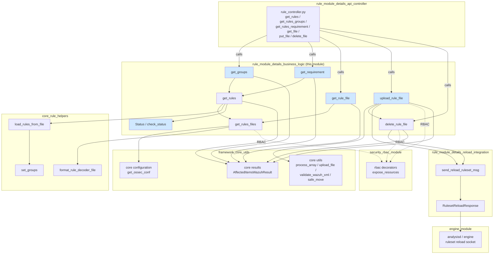
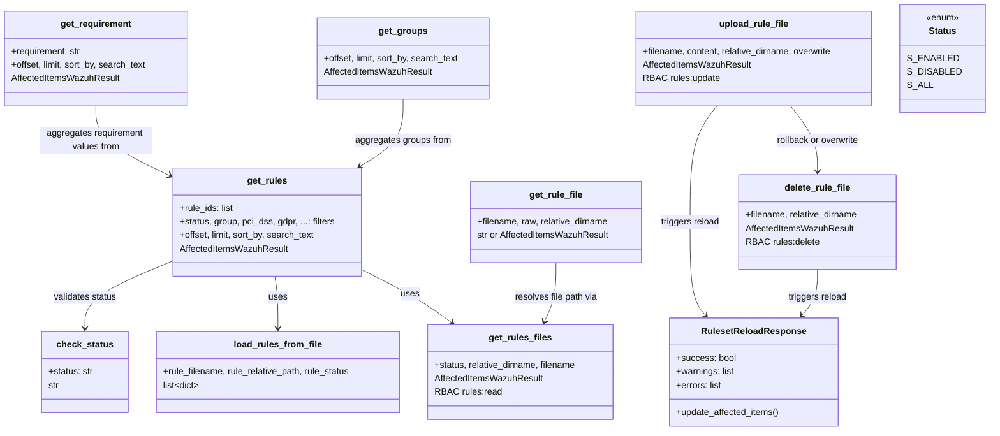
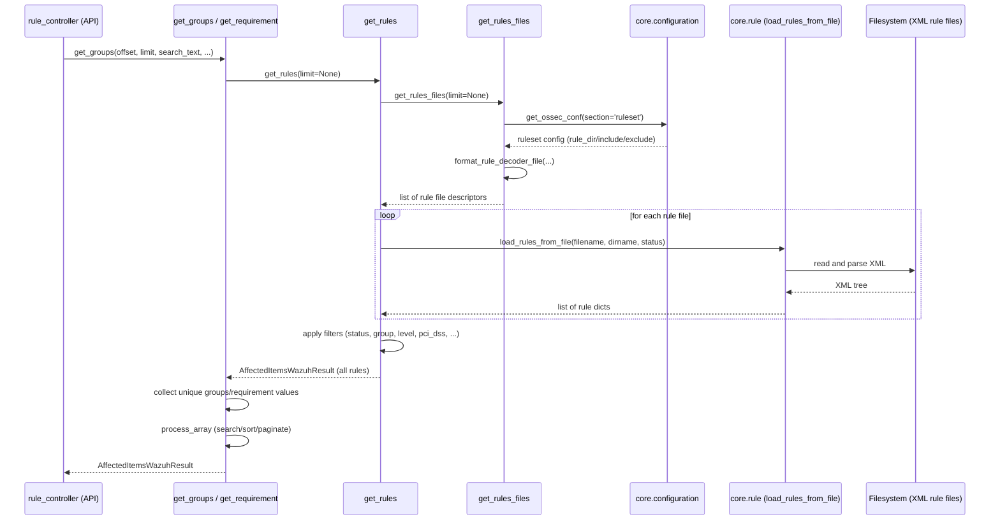
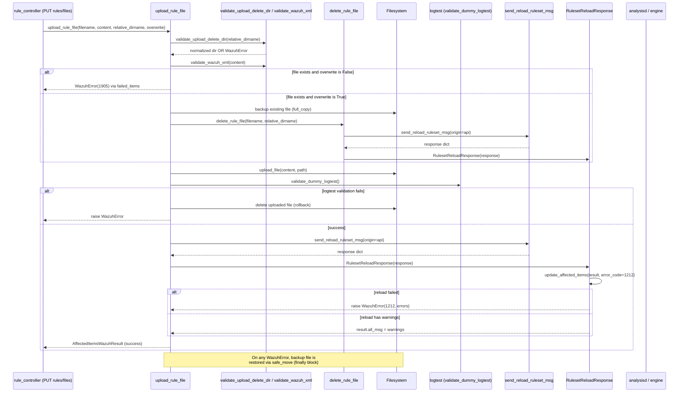
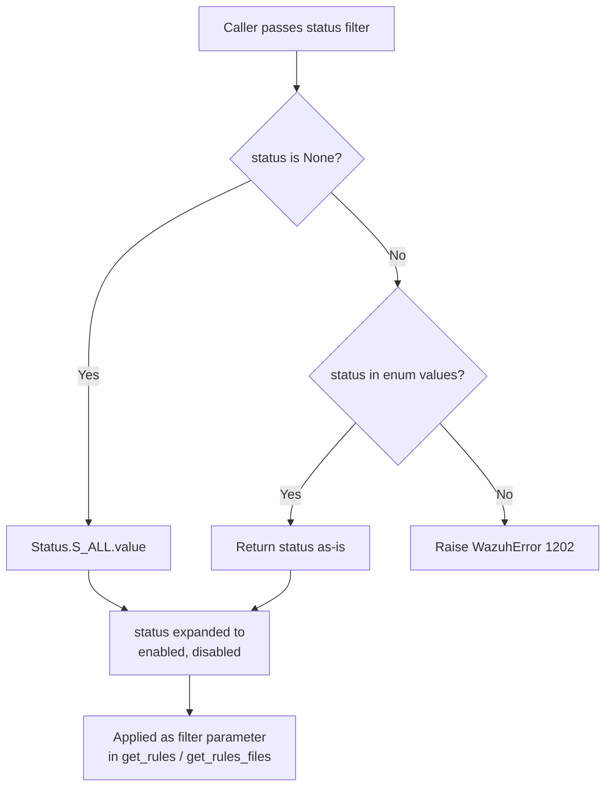
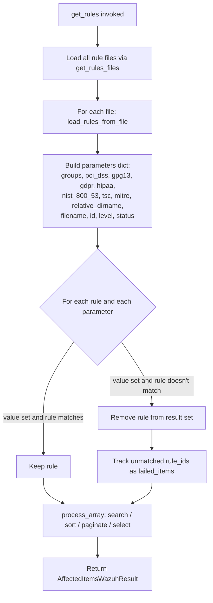

# Rule Module — Business Logic

## Introduction

The **Rule Module Business Logic** component is the core service layer of the Wazuh Rules subsystem. It sits between the REST API layer (`rule_module_details_api_controller`) and the low-level Wazuh manager filesystem/configuration, implementing all the operations needed to **discover, filter, read, upload, and delete detection rule files**, as well as to enumerate the **groups** and **compliance/requirement tags** (PCI-DSS, GDPR, HIPAA, NIST 800-53, GPG13, TSC, MITRE) referenced by those rules.

This module is intentionally free of HTTP/transport concerns — it exposes plain Python functions that operate on `AffectedItemsWazuhResult` objects, following the standard Wazuh framework convention. It is consumed directly by the API controller module and indirectly relies on the ruleset-reload integration module to notify the analysis engine (`wazuh-analysisd` / engine) whenever rule files change on disk.

This document describes:
1. The module's purpose and core functionality
2. Its internal architecture and component relationships
3. How it fits into the overall Wazuh Rule Module and the broader system

---

## 1. Purpose & Scope

| Concern | In scope | Out of scope |
|---|---|---|
| Parsing rule XML files from disk | ✅ | — |
| Filtering/searching/sorting rule metadata | ✅ | — |
| Aggregating groups & compliance requirements across rules | ✅ | — |
| Reading raw or JSON-parsed rule file content | ✅ | — |
| Validating and uploading new/updated rule files | ✅ | — |
| Deleting rule files (delegated, but orchestrated here) | ✅ | — |
| RBAC / resource authorization | Delegated to `@expose_resources` decorator | Implemented in `security_rbac_module` |
| HTTP request/response handling | ❌ | Handled by `rule_module_details_api_controller` |
| Notifying analysisd/engine of ruleset changes | Triggered from here | Implemented in `rule_module_details_reload_integration` |
| Low-level XML parsing / rule dict construction | Delegated to `framework/wazuh/core/rule.py` helpers | — |

---

## 2. Core Components

| Component | File | Responsibility |
|---|---|---|
| `get_groups` | `framework/wazuh/rule.py` | Aggregates the unique set of **groups** referenced across all loaded rules. |
| `get_requirement` | `framework/wazuh/rule.py` | Aggregates the unique set of values for a given **compliance requirement** (e.g. `pci_dss`, `gdpr`) across all rules. |
| `get_rule_file` | `framework/wazuh/rule.py` | Reads a rule file from disk and returns either raw XML text or a parsed JSON/dict representation. |
| `upload_rule_file` | `framework/wazuh/rule.py` | Validates and persists a new or updated rule XML file, with backup/rollback support, and triggers a ruleset reload. |
| `get_rules` *(supporting)* | `framework/wazuh/rule.py` | Loads and filters all rule definitions (used internally by `get_groups`/`get_requirement`). |
| `get_rules_files` *(supporting)* | `framework/wazuh/rule.py` | Resolves the set of rule files declared in `ossec.conf` (`ruleset` section). |
| `delete_rule_file` *(supporting)* | `framework/wazuh/rule.py` | Removes a rule file and triggers ruleset reload; called internally by `upload_rule_file` on rollback/overwrite. |
| `Status` | `framework/wazuh/core/rule.py` | Enum of valid rule statuses: `enabled`, `disabled`, `all`. |
| `check_status` | `framework/wazuh/core/rule.py` | Validates/normalizes a status string against the `Status` enum. |
| `load_rules_from_file` *(core helper)* | `framework/wazuh/core/rule.py` | Parses a rule XML file into a list of rule dictionaries (id, level, groups, requirements, details). |
| `format_rule_decoder_file` *(core helper)* | `framework/wazuh/core/rule.py` | Resolves `rule_dir`/`rule_include`/`rule_exclude` ruleset configuration into concrete file entries. |

> Note: `get_rules`, `get_rules_files`, and `delete_rule_file` live in the same source file as the four designated core components and are documented here because `get_groups`, `get_requirement`, and `upload_rule_file` depend on them directly.

---

## 3. Architecture Overview

For details on the API layer that consumes this module, see [rule_module_details_api_controller.md](rule_module_details_api_controller.md).
For details on the ruleset reload notification mechanism, see [rule_module_details_reload_integration.md](rule_module_details_reload_integration.md).
For details on generic result/query utilities, see [framework_core_utils.md](framework_core_utils.md).
For RBAC resource authorization, see [security_rbac_module.md](security_rbac_module.md).

---

## 4. Component Relationships

---

## 5. Data Flow

### 5.1 Reading rule groups / requirements

### 5.2 Uploading a rule file

---

## 6. Process Flow — Status & Filtering Logic

---

## 7. Key Design Notes

- **Stateless, file-driven design**: There is no persistent rule database; every call to `get_rules` re-reads and re-parses XML files declared in `ossec.conf`'s `ruleset` section. This guarantees consistency with the on-disk state but means `get_groups`/`get_requirement` are O(n) over all rule files on every invocation.
- **`AffectedItemsWazuhResult` as the universal return type**: All public functions return this structure (see [framework_core_utils.md](framework_core_utils.md) for its full definition in `framework/wazuh/core/results.py`), enabling uniform `affected_items` / `failed_items` reporting to the API layer and consistent error aggregation.
- **RBAC integration via decorator**: `get_rules_files`, `upload_rule_file`, and `delete_rule_file` are wrapped with `@expose_resources` (from `framework/wazuh/rbac/decorators.py`, part of [security_rbac_module.md](security_rbac_module.md)), which filters/authorizes the requested resources (`rule:file:{filename}`, `*:*:*`) before the function body executes.
- **Safe upload semantics**: `upload_rule_file` implements a backup-validate-commit-rollback pattern:
  1. Validate target directory and XML content.
  2. If overwriting, back up the existing file (`full_copy`) and delete the old one.
  3. Write new content (`upload_file`).
  4. Validate the new ruleset via a dummy logtest call (`validate_dummy_logtest`) — this catches syntactically valid-but-semantically-broken rules before they reach production.
  5. Trigger a ruleset reload message to the analysis engine.
  6. On any failure at any step, the original file is restored from backup (`safe_move` in the `finally` block).
- **Ruleset reload coupling**: Both `upload_rule_file` and `delete_rule_file` call `send_reload_ruleset_msg` (defined in `framework/wazuh/core/analysis.py`) and interpret the result via `RulesetReloadResponse`. This class lives conceptually in the sibling module [rule_module_details_reload_integration.md](rule_module_details_reload_integration.md) — see that document for the full mechanics of the reload socket protocol.
- **Compliance requirement modeling**: `RULE_REQUIREMENTS` (`pci_dss`, `gdpr`, `hipaa`, `nist_800_53`, `gpg13`, `tsc`, `mitre`) are extracted from rule `<group>` XML tags with a special naming convention (e.g., `pci_dss_10.6.1`) via `set_groups` in `framework/wazuh/core/rule.py`; anything not matching a known requirement prefix is treated as a plain group.
- **Cluster awareness**: The module reads `cluster_enabled` / `node_id` at import time (via `read_cluster_config` and `get_node`) though these values are primarily used by sibling functions in the broader `rule_module` for cluster-context logging/behavior; see [cluster_module.md](cluster_module.md) for the clustering subsystem.

---

## 8. External Dependencies

| Dependency | Module | Used For |
|---|---|---|
| `wazuh.core.configuration.get_ossec_conf` | `framework_core_utils` | Reading the `ruleset` section of `ossec.conf` |
| `wazuh.core.utils.process_array`, `validate_wazuh_xml`, `upload_file`, `safe_move`, `full_copy`, `to_relative_path` | `framework_core_utils` | Generic list processing and file operations |
| `wazuh.core.results.AffectedItemsWazuhResult` | `framework_core_utils` | Standard result container |
| `wazuh.core.analysis.send_reload_ruleset_msg` / `RulesetReloadResponse` | `rule_module_details_reload_integration` / `engine_module` | Notifying the engine of ruleset changes |
| `wazuh.core.logtest.validate_dummy_logtest` | `logtest_module` | Post-upload semantic validation of the new rule |
| `wazuh.core.cluster.cluster.get_node`, `wazuh.core.cluster.utils.read_cluster_config` | `cluster_module` | Cluster node identity for context |
| `wazuh.rbac.decorators.expose_resources` | `security_rbac_module` | Authorization/resource filtering |
| `xmltodict` | (third-party) | Converting parsed XML rule content into JSON-serializable dicts for `get_rule_file` |

---

## 9. Related Documentation

- [rule_module_details_api_controller.md](rule_module_details_api_controller.md) — HTTP endpoints (`GET/PUT/DELETE /rules/*`) that invoke this business logic.
- [rule_module_details_reload_integration.md](rule_module_details_reload_integration.md) — Ruleset reload response handling and engine notification.
- [decoder_module.md](decoder_module.md) — Sibling module with an almost identical file-management pattern for decoders.
- [cdb_list_module.md](cdb_list_module.md) — Sibling module with similar CDB list file upload/delete semantics.
- [framework_core_utils.md](framework_core_utils.md) — Shared utilities (`process_array`, `AffectedItemsWazuhResult`, file helpers).
- [security_rbac_module.md](security_rbac_module.md) — RBAC decorators and resource authorization model.
- [logtest_module.md](logtest_module.md) — Dummy logtest validation used during rule upload.
- [engine_module.md](engine_module.md) — Analysis engine ruleset consumer.
