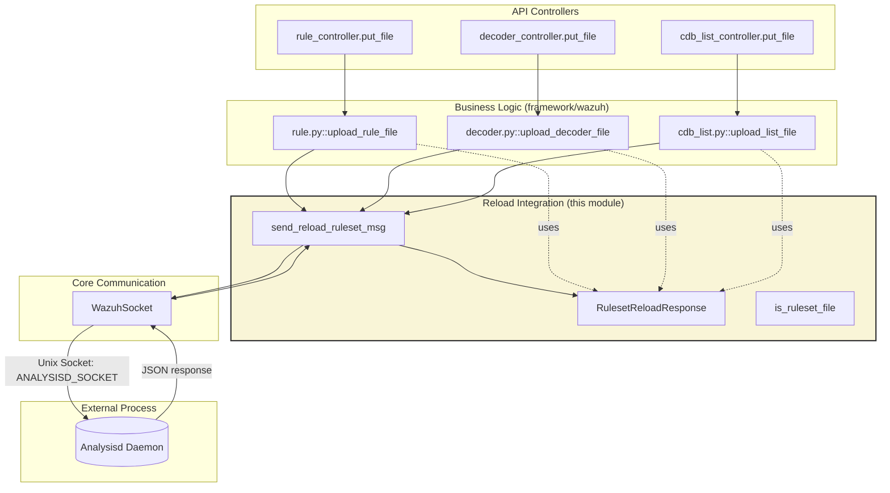
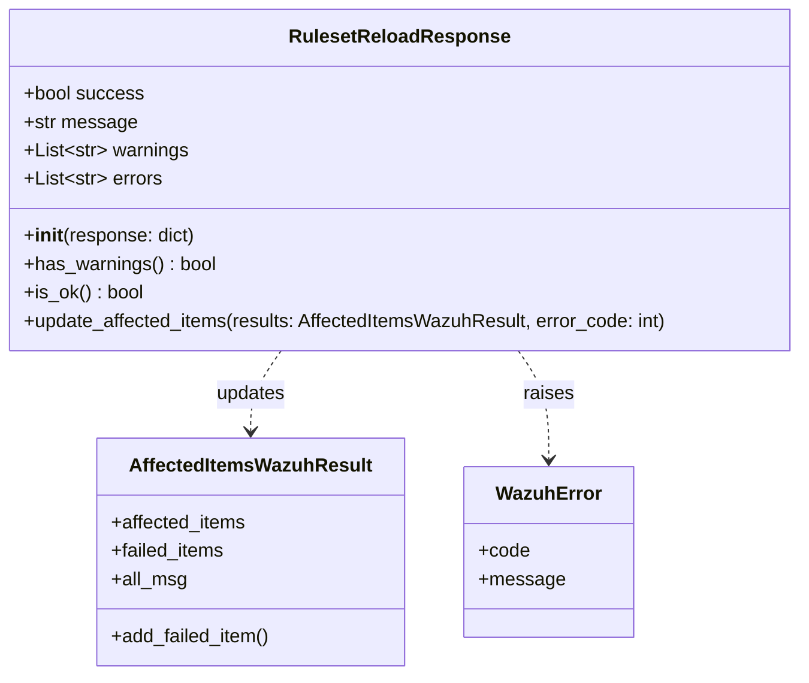
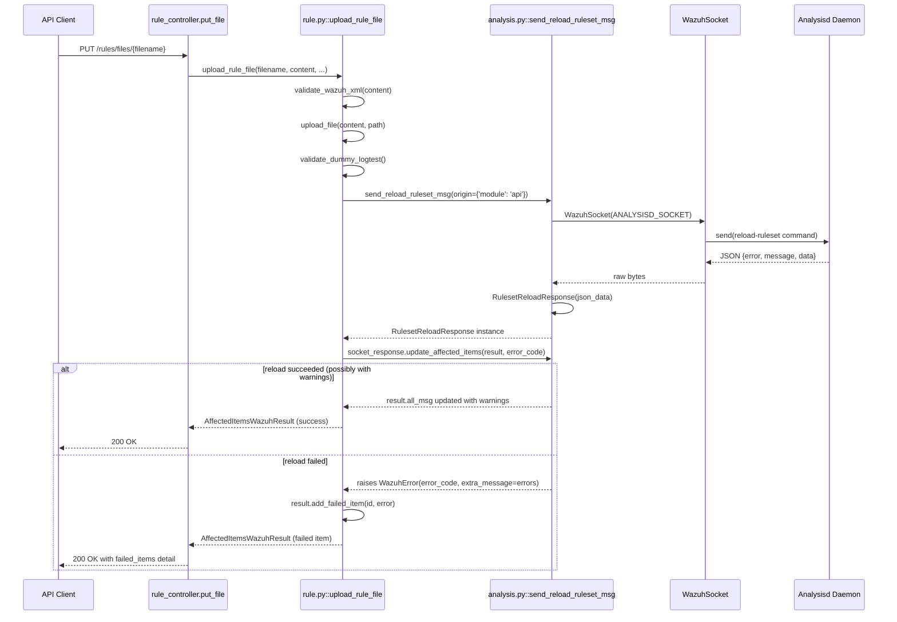
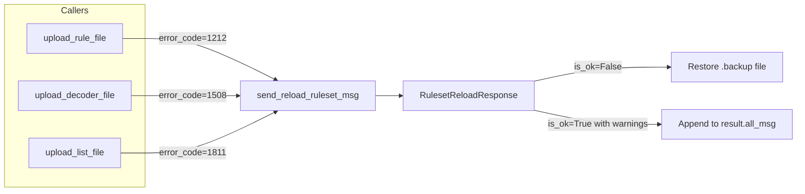
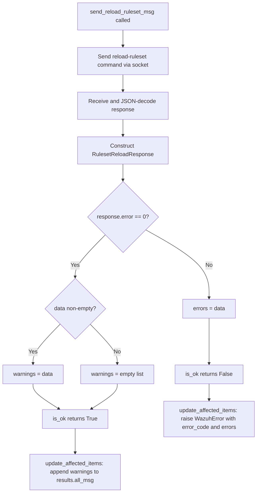

# Rule Module Details – Reload Integration

## Introduction

The **Reload Integration** sub-module is a small but critical piece of the Wazuh Rule Module. It is responsible for communicating with the **Analysisd** daemon whenever the ruleset (rules, decoders, or CDB lists) is modified through the API, so that the running analysis engine reloads its in-memory ruleset without requiring a full manager restart.

The entire sub-module lives in a single file, `framework/wazuh/core/analysis.py`, and exposes one primary abstraction, `RulesetReloadResponse`, plus the helper function `send_reload_ruleset_msg` that performs the actual socket communication. Although small in surface area, this component is invoked by every "upload" operation in the [Rule Module](rule_module_details_business_logic.md), the [Decoder Module](decoder_module.md), and the [CDB List Module](cdb_list_module.md), making it a shared integration point for hot-reloading the Wazuh ruleset.

This document describes:
- The purpose and responsibilities of the reload integration component
- Its internal architecture and data model
- How it fits into the broader rule/decoder/CDB-list upload workflows
- Sequence and error-handling flows
- Its dependencies on other parts of the system

## Purpose and Core Functionality

When a user uploads or overwrites a rule, decoder, or CDB list file via the Wazuh API, the change is written to disk, but the **Analysisd** daemon (the C process responsible for actually evaluating events against rules) keeps its ruleset loaded in memory. For the change to take effect immediately, Analysisd must be told to reload its ruleset.

The reload integration component solves this by:
1. Building a well-formed request message (`reload-ruleset` command) addressed to Analysisd.
2. Sending this message over the Analysisd Unix socket (`ANALYSISD_SOCKET`).
3. Parsing the JSON response into a strongly-typed `RulesetReloadResponse` object.
4. Translating the response (success, warnings, or errors) into the standard Wazuh API result object (`AffectedItemsWazuhResult`), raising a `WazuhError` when the reload fails.

It also provides a helper, `is_ruleset_file`, to determine whether a given file path belongs to one of the managed ruleset directories (`USER_LISTS_PATH`, `USER_RULES_PATH`, `USER_DECODERS_PATH`).

## Architecture Overview



### Key Components

| Component | Type | Responsibility |
|---|---|---|
| `RulesetReloadResponse` | Class | Parses and models the JSON response from Analysisd's `reload-ruleset` command |
| `send_reload_ruleset_msg` | Function | Builds and sends the reload request, returns a `RulesetReloadResponse` |
| `is_ruleset_file` | Function | Determines whether a file path belongs to the ruleset directories |
| `RELOAD_RULESET_COMMAND` | Constant | The literal socket command string `"reload-ruleset"` |

## `RulesetReloadResponse` Class Diagram



`RulesetReloadResponse` is constructed directly from the raw dictionary decoded from the Analysisd socket response:
- `error == 0` → `success = True`; any `data` returned is treated as **warnings**.
- `error != 0` → `success = False`; any `data` returned is treated as **errors**.

The `update_affected_items` method is the bridge to the standard Wazuh API result pattern (see [framework_core_utils](framework_core_utils.md) for `AffectedItemsWazuhResult` and `WazuhResult`): on success it appends any warnings to `results.all_msg`; on failure it raises a `WazuhError` with the given `error_code`, embedding the concatenated error messages as `extra_message`.

## Data Flow / Sequence Diagram

The following sequence illustrates a typical rule upload that triggers a ruleset reload (the same pattern applies to decoder and CDB list uploads):



## Message Protocol

`send_reload_ruleset_msg` builds the outgoing message using `create_wazuh_socket_message` (from [framework_core_communication](framework_core_communication.md)::`wazuh_socket.py`), specifying:
- `origin`: caller-supplied dictionary (typically `{'module': 'api'}`)
- `command`: the constant `RELOAD_RULESET_COMMAND = "reload-ruleset"`

The message is JSON-serialized, encoded, and sent over a newly opened `WazuhSocket` pointed at `common.ANALYSISD_SOCKET`. The socket is a length-prefixed Unix domain socket connection (see `WazuhSocket.send`/`receive` for the wire format: 4-byte little-endian length header followed by the payload).

```python
def send_reload_ruleset_msg(origin: dict[str, str]) -> RulesetReloadResponse:
    msg = create_wazuh_socket_message(origin=origin, command=RELOAD_RULESET_COMMAND)
    socket = WazuhSocket(common.ANALYSISD_SOCKET)
    socket.send(dumps(msg).encode())
    data = loads(socket.receive().decode())
    socket.close()
    return RulesetReloadResponse(data)
```

## Integration Points

This component is a shared dependency invoked from three "upload" operations across the ruleset-related modules:

| Caller | Module | Error Code Used |
|---|---|---|
| `rule.py::upload_rule_file` | [rule_module_details_business_logic](rule_module_details_business_logic.md) | `1212` |
| `decoder.py::upload_decoder_file` | [decoder_module](decoder_module.md) | `1508` |
| `cdb_list.py::upload_list_file` | [cdb_list_module](cdb_list_module.md) | `1811` |

In each case, the calling function:
1. Validates and writes the new file content to disk (with an automatic `.backup` file for overwrite safety).
2. Calls `send_reload_ruleset_msg(origin={'module': 'api'})`.
3. Calls `update_affected_items` on the returned `RulesetReloadResponse`, using a module-specific error code.
4. If the reload fails, the calling function's `except WazuhError` block restores the `.backup` file, ensuring the ruleset directory never ends up in a partially-migrated/inconsistent state.



## `is_ruleset_file` Helper

`is_ruleset_file(filename)` is a small utility used to determine whether an arbitrary file path (relative or absolute) resides under one of the three ruleset directories managed by the API:
- `common.USER_LISTS_PATH`
- `common.USER_RULES_PATH`
- `common.USER_DECODERS_PATH`

It normalizes the path (joining with `common.WAZUH_PATH` if relative, using [`find_wazuh_path`](framework_core_utils.md) indirectly through `common.py`) and uses `os.path.commonpath` to check containment. This is useful for other parts of the system (e.g., file-watchers or bulk-sync operations) that need to know whether a modified file should trigger a ruleset reload.

## Error Handling



Failure modes surfaced by this component include:
- **Socket connection errors**: raised by `WazuhSocket` itself (`WazuhInternalError` 1013/1121) if Analysisd's socket is missing or refuses connections — these propagate up unmodified since `send_reload_ruleset_msg` does not catch them.
- **Reload rejected by Analysisd**: surfaced as a `WazuhError` with the module-specific `error_code` (1212 / 1508 / 1811) and an `extra_message` containing the concatenated error strings from Analysisd's response.
- **Reload succeeded with warnings**: not treated as an error; warnings are merged into the `AffectedItemsWazuhResult.all_msg` field so API consumers can see non-fatal issues (e.g., deprecated rule syntax).

## Dependencies

- **[framework_core_communication](framework_core_communication.md)** — provides `WazuhSocket` (low-level Unix socket wrapper) and `create_wazuh_socket_message` used to build/send the reload request.
- **[framework_core_utils](framework_core_utils.md)** — provides `AffectedItemsWazuhResult` (the standard API result container) and exception types (`WazuhError`) used to report reload outcomes.
- **`framework/wazuh/core/common.py`** — supplies path constants (`WAZUH_PATH`, `USER_LISTS_PATH`, `USER_RULES_PATH`, `USER_DECODERS_PATH`, `ANALYSISD_SOCKET`) used both for socket addressing and for the `is_ruleset_file` check.

## Related Modules

- [rule_module_details_business_logic](rule_module_details_business_logic.md) — the core rule business logic that consumes this reload integration when uploading rule files.
- [rule_module_details_api_controller](rule_module_details_api_controller.md) — the API controller layer that triggers rule upload operations, indirectly invoking this reload integration.
- [decoder_module](decoder_module.md) — decoder upload/reload workflow, structurally identical to the rule upload flow.
- [cdb_list_module](cdb_list_module.md) — CDB list upload/reload workflow, structurally identical to the rule upload flow.
- [engine_module](engine_module.md) — parent grouping that also includes `RulesetReloadResponse` as part of the broader "Engine" abstraction (`Engine`, `get_engine_client`, `BaseModule`), reflecting that ruleset reload is conceptually part of the analysis engine's control-plane API.
- [manager_module](manager_module.md) — the manager module's `put_restart`/configuration validation endpoints represent a heavier-weight alternative to this lightweight hot-reload mechanism.

## Summary

The Reload Integration component is a minimal, focused adapter between the Wazuh Framework API layer and the Analysisd daemon's socket-based control interface. By encapsulating the reload request/response protocol in `RulesetReloadResponse` and `send_reload_ruleset_msg`, it allows all ruleset-mutating operations (rules, decoders, CDB lists) to share consistent reload semantics, error reporting, and rollback behavior — ensuring that any newly uploaded configuration takes effect immediately and safely, without requiring a full Wazuh manager restart.
