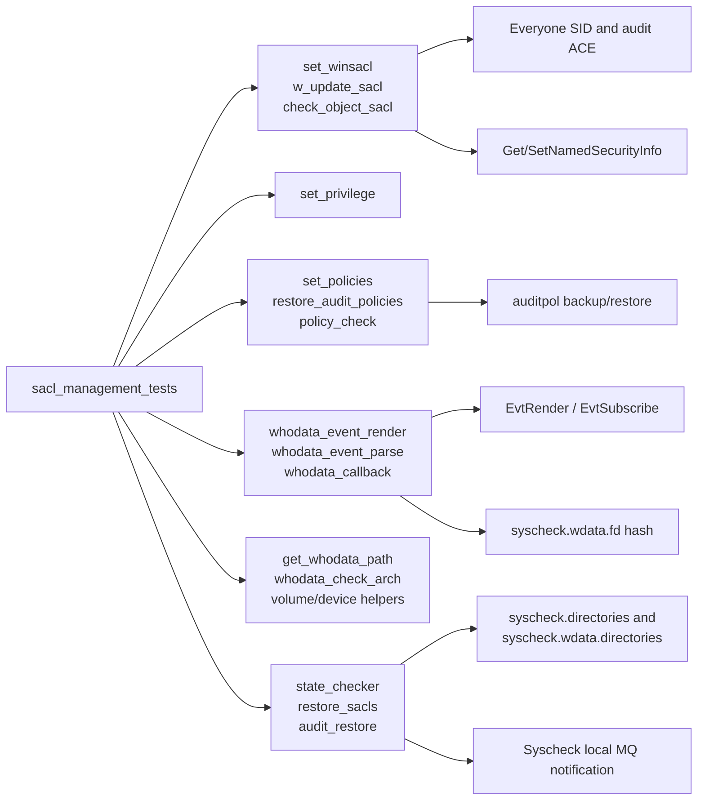
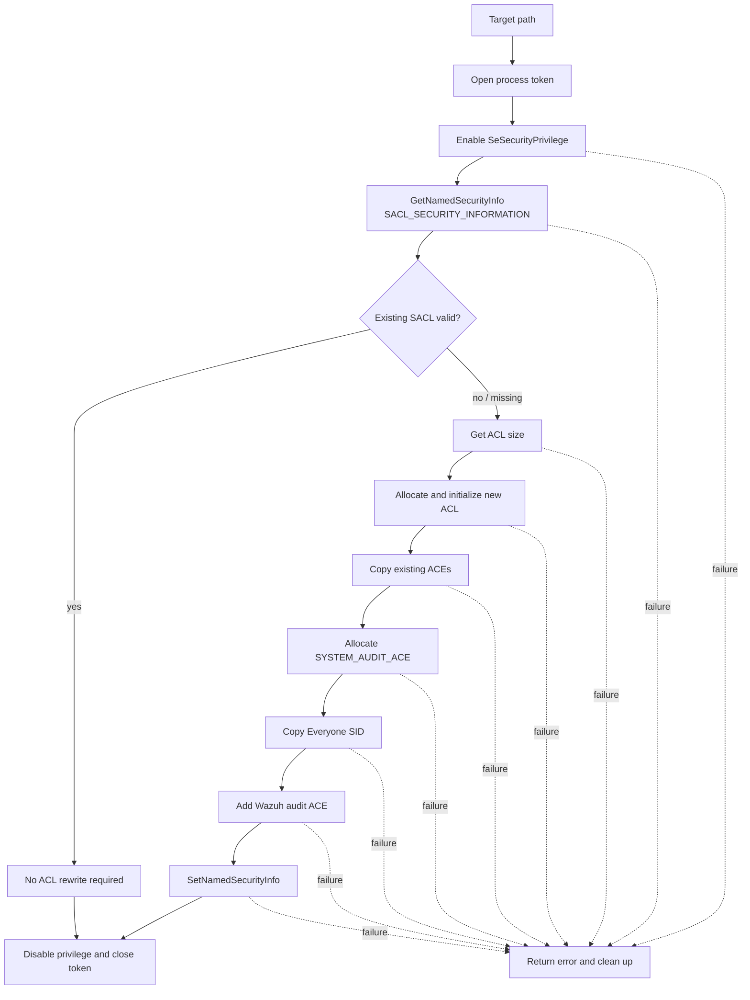
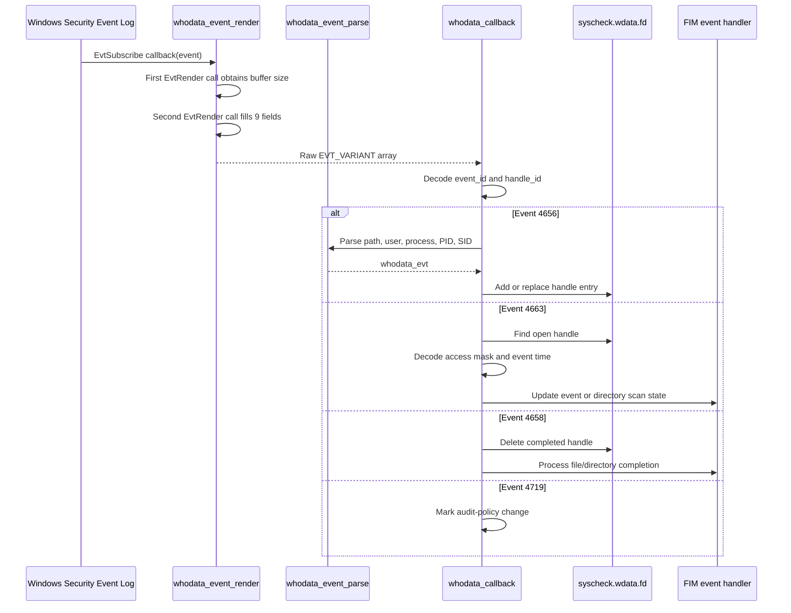
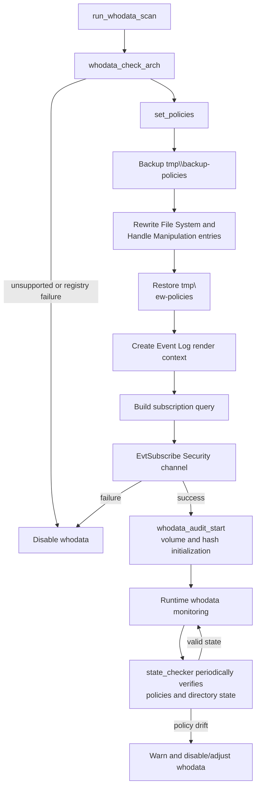
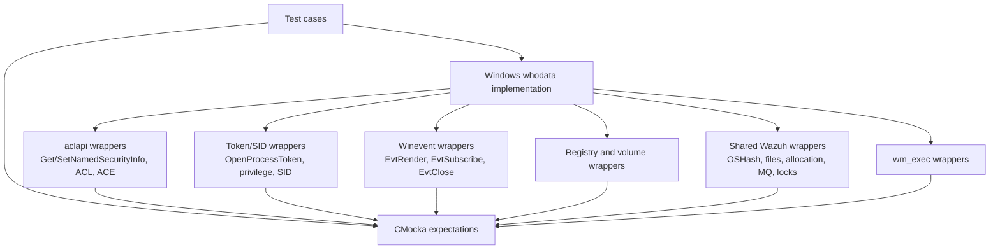

# `sacl_management_tests`

## Introduction

`sacl_management_tests` is the Windows-focused CMocka suite for Syscheck/FIM “whodata” security-audit control. It tests the native implementation in `src/syscheckd` through the translation unit `src/unit_tests/syscheckd/whodata/test_win_whodata.c`.

The suite verifies that Wazuh can prepare, validate, monitor, and restore Windows SACLs (system access control lists), configure the `SeSecurityPrivilege`, maintain Windows audit policies, subscribe to the Security Event Log, and correlate file-access events with FIM state. It also covers Windows path conversion, volume/device mapping, Event Log payload decoding, handler hash tables, state checking, and cleanup.

The tests are interaction-based: Windows APIs, file operations, message queues, hash tables, logging, and synchronization are wrapped and scripted. No live Windows ACL, audit policy, or Security Event Log is required for the unit tests.

For production FIM lifecycle and scan behavior, see [syscheckd_core](syscheckd_core.md), [syscheckd_file](syscheckd_file.md), and [fim_realtime_whodata_tests](fim_realtime_whodata_tests.md). For the Linux/audit implementation, see [syscheckd_whodata](syscheckd_whodata.md).

## Scope and placement

| Item | Description |
| --- | --- |
| Test source | `src/unit_tests/syscheckd/whodata/test_win_whodata.c` |
| Test framework | CMocka |
| Production boundary | Windows whodata/SACL implementation in Syscheckd |
| Main state | Global `syscheck`, especially `syscheck.wdata`, `syscheck.directories`, and directory status flags |
| Platform focus | Windows; `TEST_WINAGENT` controls selected Windows-agent behavior |
| Test runner | Three CMocka groups plus a general test group, invoked from `main()` |

The module is a child of `test_win_whodata` in the Syscheck FIM unit-test hierarchy. It complements, rather than duplicates, the broader Windows whodata tests documented in [test_win_whodata](test_win_whodata.md) when that document is available.

## Architecture

```mermaid
flowchart TB
    R[ CMocka runner\nmain() ] --> G1[General tests]
    R --> G2[whodata callback group]
    R --> G3[state checker group]
    R --> G4[directory cleanup group]

    G1 --> S[SACL and whodata functions under test]
    G2 --> C[whodata_callback]
    G3 --> SC[state_checker]
    G4 --> SC

    S --> SG[Global syscheck state\ndirectories, wdata hashes, flags]
    C --> SG
    SC --> SG

    S --> W[Wrapper seams]
    C --> W
    SC --> W
    W --> WIN[Windows APIs\nACL, SID, registry, Event Log, volumes]
    W --> OS[Shared APIs\nallocation, files, hashes, locks, logging, MQ]
    W --> CMD[wm_exec / auditpol commands]
```

The tests exercise real production control flow while replacing external effects at wrapper boundaries. Assertions cover return values, mutated structures, expected diagnostic messages, and the order/parameters of important API calls.

## Component relationships



### Main production-facing areas

| Area | Functions covered | Contract exercised |
| --- | --- | --- |
| SACL construction | `set_winsacl`, `w_update_sacl` | Preserve old ACEs, add the Wazuh audit ACE for Everyone, apply the new SACL, and report allocation/API failures. |
| Privilege handling | `set_privilege` | Resolve and enable/disable `SeSecurityPrivilege`; return failure when lookup or token adjustment fails. |
| SACL validation | `is_valid_sacl`, `check_object_sacl` | Recognize a missing, malformed, or valid ACE and distinguish retrieval/privilege failures from an invalid ACL. |
| Restoration | `restore_sacls`, `restore_audit_policies`, `audit_restore` | Remove the Wazuh ACE, restore saved audit policies, and clean up process/token handles. |
| Policy monitoring | `set_policies`, `policy_check`, `state_checker` | Backup and rewrite auditpol policy files, verify Object Access subcategories, and detect policy drift. |
| Event ingestion | `whodata_event_render`, field getters, `whodata_event_parse`, `whodata_callback` | Decode Event IDs 4656, 4663, 4658, and 4719; correlate handles; update FIM scans and handlers. |
| Windows path/platform support | `whodata_check_arch`, `get_whodata_path`, `replace_device_path`, `get_drive_names`, `get_volume_names` | Handle architecture-dependent event fields and translate NT device paths into drive/mount paths. |
| Runtime initialization | `run_whodata_scan`, `whodata_audit_start`, `set_subscription_query` | Initialize hashes and volume mappings, configure policy state, create the Event Log render context, and subscribe to Security events. |

## SACL management flow



The expected audit ACE uses inheritance and successful-access flags and the file-change access mask represented in the tests by `DELETE`, `FILE_WRITE_DATA`, `FILE_APPEND_DATA`, `WRITE_DAC`, and `FILE_WRITE_ATTRIBUTES`. The suite verifies both the resulting ACE fields and the cleanup path.

`set_winsacl` returns `0` for success and no-op-valid ACL handling, and `1` for construction or application failures. `check_object_sacl` returns `0` for a valid SACL, `1` for an invalid SACL, and `2` when token/security information cannot be obtained. `w_update_sacl` uses `0` for success and `OS_INVALID` for failures.

## Event ingestion and correlation



The field helper tests explicitly cover null pointers, invalid `EVT_VARIANT` types, and both 32-bit and 64-bit representations for handle and process identifiers. Event parsing converts Windows wide strings and SIDs to UTF-8 strings, rejects recycle-bin paths, and tolerates absent optional fields while preserving valid fields.

The callback tests cover:

- render failure, invalid event IDs, malformed fields, and missing handle records;
- new handle insertion, duplicate-handle replacement, and hash insertion/deletion failures;
- non-monitored paths, non-whodata directories, recursion limits, and scan-abort states;
- directory discovery, directory timestamps, new-file detection, and completed scans;
- file events, directory events, no-permission masks, and forwarding to `fim_whodata_event`.

## Audit-policy and startup flow



`set_policies` preserves the existing audit policy by backing it up, appending the required subcategories, and restoring a generated policy file. The tests verify file-open failures, backup removal failures, command failures after six attempts, and successful policy replacement. `restore_audit_policies` retries `auditpol /restore` in the same bounded manner.

`policy_check` uses the Object Access category GUID and the File System and Handle Manipulation subcategory GUIDs. It validates that auditing is enabled for the required subcategories. `state_checker` periodically checks this policy state and each configured directory, re-adds directories when possible, disables whodata when a SACL is invalid, and removes stale entries from `syscheck.wdata.directories`.

## Fixtures, groups, and isolation

The suite uses several fixtures to isolate global state:

- `test_group_setup` loads `../test_syscheck.conf`, initializes `syscheck`, sets deterministic wrapper behavior, and establishes the event-buffer size.
- `setup_whodata_callback_group` creates the directory list and directory hash used by callback tests.
- `setup_state_checker` creates a whodata directory, directory hash, and synthetic audit-policy structures.
- `setup_wdata_dirs_cleanup` focuses on timestamp-based stale-directory cleanup.
- `setup_restore_sacls` marks a directory with `WD_IGNORE_REST`, allowing restoration tests to select it.
- `setup_win_whodata_evt` allocates a `whodata_evt` for callback event-state assertions.
- Teardown functions free hashes, lists, event data, policy fixtures, device/drive arrays, and the complete `syscheck` configuration.

The test code expects lock wrappers around shared `syscheck` state. This is important because the production paths update directory status, FIM mode flags, and whodata hash tables while callback and state-checker paths may run concurrently.

## Dependency and wrapper model



Important wrapper families include `winevt_wrappers`, `ntsecapi_wrappers`, shared filesystem/file/allocation/hash/string wrappers, Syscheck configuration/database wrappers, `wm_exec_wrappers`, and C library wrappers. Tests assert both successful returns and exact error diagnostics, making the error behavior part of the tested contract.

## Test inventory by behavior

| Test section in `main()` | Representative scenarios |
| --- | --- |
| `set_winsacl` | Token opening, privilege failure, security descriptor failure, valid/no-op ACL, allocation, ACE copy, SID copy, application failure, success |
| `set_privilege` | Lookup failure, token adjustment failure, enable, disable |
| `w_update_sacl` | Everyone SID creation, token/security/ACL allocation failures, ACE copying, application, privilege cleanup |
| Architecture/path helpers | Registry failures, x86/AMD64/IA64/ARM64, wide-to-multibyte conversion, recycle-bin filtering, device-to-drive replacement |
| Volume helpers | First/next volume failures, malformed volume names, missing DOS devices, mounted-path discovery |
| Restoration and policy | SACL ACE deletion, policy backup/restore failures, audit-policy drift and recovery |
| Event decoding | Render sizing, property count, event ID, handle ID, access mask, path and actor parsing |
| `whodata_callback` | Event 4656/4663/4658/4719 branches, hash correlation, scan state transitions |
| `state_checker` | Missing files, valid/invalid SACLs, re-added directories, policy mismatch, stale-directory cleanup |
| Initialization/resource release | Hash creation, volume enumeration, Security channel subscription, Event Log and hash cleanup |

## Behavioral interpretation

The suite establishes several important invariants:

1. Privilege elevation is temporary. Every successful SACL operation attempts to remove `SeSecurityPrivilege` and closes the process/token handles.
2. Existing ACL entries are preserved when a new Wazuh audit ACE is built.
3. A malformed or changed SACL causes whodata monitoring to be withdrawn for the affected path and a Syscheck notification to be sent.
4. Event handles are the correlation key between open events and access/close events; duplicate handles are replaced safely or reported if deletion/reinsertion fails.
5. Directory scan state distinguishes pending, completed, and aborted work and prevents redundant scans.
6. Audit-policy failures are bounded by retry logic and never silently reported as success.
7. Stale temporary directory entries are removed while current entries remain in `syscheck.wdata.directories`.

## Related documentation

- [syscheckd_core](syscheckd_core.md) — daemon lifecycle, FIM scan engine, and shared Syscheck state.
- [syscheckd_file](syscheckd_file.md) — file-level FIM processing after whodata events are correlated.
- [fim_realtime_whodata_tests](fim_realtime_whodata_tests.md) — generic realtime and whodata event handling tests.
- [test_run_check](test_run_check.md) — runtime startup, realtime monitoring, and Windows whodata transition coverage.
- [test_infrastructure](test_infrastructure.md) — general CMocka/wrapper isolation patterns.
- [syscheckd_whodata](syscheckd_whodata.md) — Linux audit-based whodata architecture and its relationship to FIM.

## Limitations

These are unit tests, not Windows integration tests. They do not prove that a real Windows account has `SeSecurityPrivilege`, that `auditpol.exe` accepts a generated policy on every Windows version, that Event Log field layouts remain compatible with all supported OS releases, or that NT device paths resolve correctly on a live machine. Those concerns require platform integration coverage in addition to this deterministic wrapper suite.
