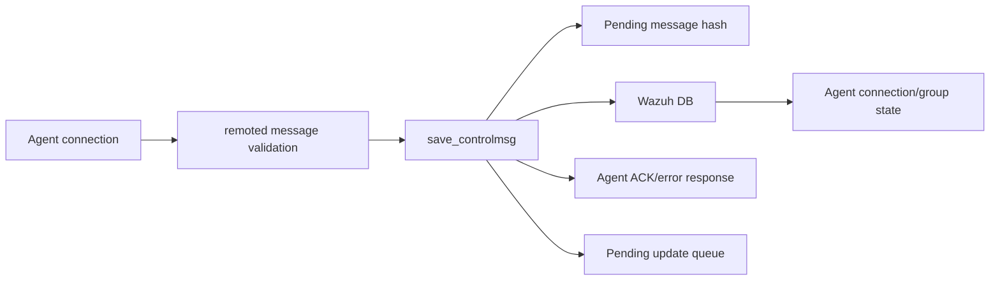
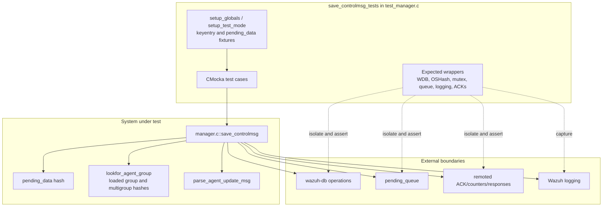
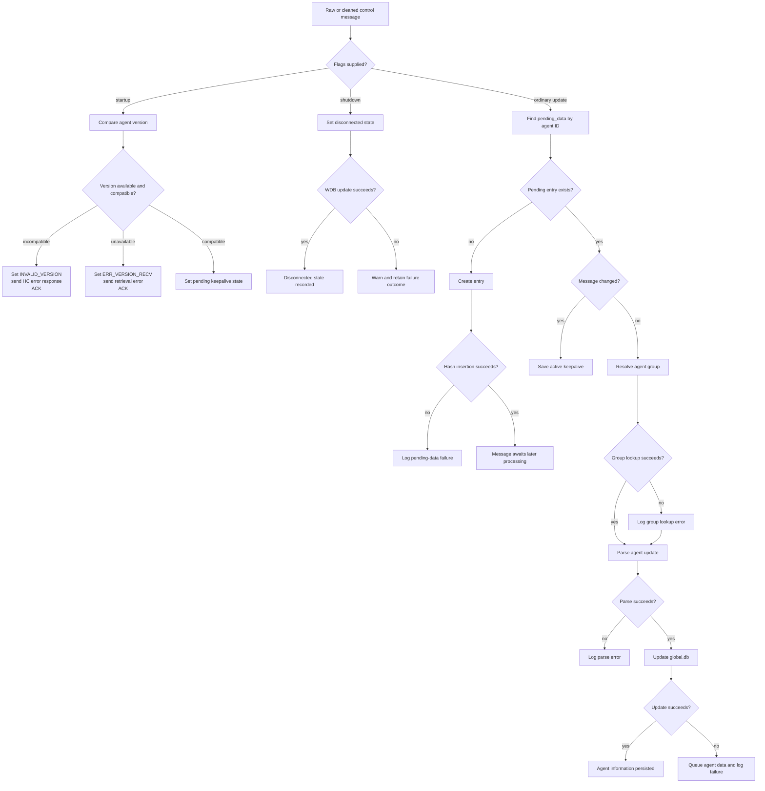
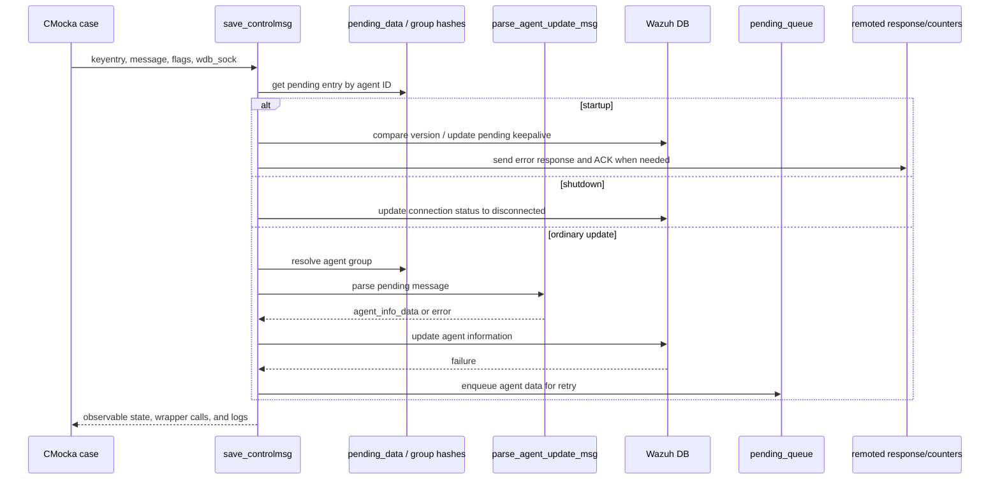

# `save_controlmsg_tests`

## Introduction

`save_controlmsg_tests` documents the CMocka tests for the remoted manager's `save_controlmsg` path. The suite verifies how agent control messages are persisted or translated into agent-state updates after an earlier validation stage classifies startup, shutdown, keepalive, and ordinary update messages.

The tests are implemented in `src/unit_tests/remoted/test_manager.c`. They include `src/remoted/manager.c` directly and replace external services with link-time wrappers, making the cases deterministic while preserving the manager's branching logic.

## Scope and role in the system

The module sits between the remoted control-message receiver and Wazuh DB:

`save_controlmsg` is not the wire-format parser. The neighboring validation tests establish that boundary: validation returns a cleaned message and startup/shutdown flags, then `save_controlmsg` performs persistence and state transitions. See [remoted](remoted.md) for the broader daemon architecture.

## Architecture

### Main collaborators

| Collaborator | Responsibility exercised by the suite |
|---|---|
| `keyentry` | Identifies the agent and supplies its ID, name, address, and peer metadata. |
| `pending_data_t` / `pending_data` | Holds a message awaiting processing and records whether the stored message changed. |
| `groups`, `multi_groups` | Resolve the agent's group before an ordinary update is applied. |
| `parse_agent_update_msg` | Converts the pending text into `agent_info_data`. |
| Wazuh DB wrappers | Persist version, keepalive, connection status, or agent information. |
| `pending_queue` | Receives agent information when the global DB update cannot be completed immediately. |
| Remoted wrappers | Track ACKs, send startup error responses, and expose observable behavior. |
| CMocka/link wrappers | Control return values and verify calls, arguments, locks, and error paths. |

## Data flow

## Component interaction

The direct inclusion of `manager.c` means the test calls the production function body. Calls outside that body are mocked and asserted rather than executed against a live daemon, database, filesystem, or queue.

## Process flows and tested behavior

### Startup processing

Startup messages carry an agent version. An incompatible version produces an error response and updates the agent status to `INVALID_VERSION`. If the version field cannot be retrieved, the function sends the retrieval error and attempts to set `ERR_VERSION_RECV`. A compatible version advances the agent to the pending connection state through the keepalive update.

The suite intentionally includes both WDB-success and WDB-failure outcomes. The failure cases verify warnings and ACK behavior without requiring a real Wazuh DB socket.

### Shutdown processing

Shutdown messages update the agent connection state to `AGENT_CS_DISCONNECTED`. One test verifies the successful WDB call; another forces WDB failure and verifies the warning path. The IPv6 fixture in the failure case also ensures the path does not depend on IPv4 address formatting.

### Ordinary update processing

For a pending entry, `changed` controls the next action:

- `changed == true`: the prior keepalive/message state is reconciled; failure to save the active keepalive is reported.
- `changed == false`: the message is associated with an agent group, parsed, and sent to Wazuh DB.
- If group lookup fails, processing logs the lookup error but the test confirms the subsequent parse/update failure behavior remains observable.
- If parsing succeeds but the DB update fails, the parsed `agent_info_data` is pushed to `pending_queue` for deferred processing.

For a new agent ID, the function creates a pending entry. A failed hash insertion is treated as an error and is tested with explicit mutex expectations.

## Test matrix

| Test | Scenario | Important assertions |
|---|---|---|
| `test_save_controlmsg_agent_invalid_version` | Startup with an incompatible version | `INVALID_VERSION`, startup error response, ACK. This case is present in the source registration although it is omitted from the supplied module-tree list. |
| `test_save_controlmsg_get_agent_version_fail` | Startup JSON has no version | Retrieval error response, `ERR_VERSION_RECV` attempt, warning on WDB failure, ACK. |
| `test_save_controlmsg_startup` | Compatible startup | Keepalive update to `AGENT_CS_PENDING`; warning when WDB rejects it. |
| `test_save_controlmsg_shutdown` | Normal shutdown | Connection status updated to `AGENT_CS_DISCONNECTED`. |
| `test_save_controlmsg_shutdown_wdb_fail` | Shutdown with WDB failure | Disconnected update attempted and failure warning emitted. |
| `test_save_controlmsg_could_not_add_pending_data` | New pending entry cannot be inserted | Hash insertion failure is logged while mutex lock/unlock is preserved. |
| `test_save_controlmsg_unable_to_save_last_keepalive` | Changed pending entry, active keepalive update fails | Active-state WDB failure warning. |
| `test_save_controlmsg_update_msg_error_parsing` | Changed=false entry, group absent, parser fails | Group lookup diagnostic and parser error. The module tree names this behavior `test_save_controlmsg_update_msg_lookfor_agent_group_fail`; the source function currently uses `...error_parsing`. |
| `test_save_controlmsg_update_msg_unable_to_update_information` | Parse succeeds, global DB update fails | Agent data is queued and update failure is logged. |
| `test_save_controlmsg_update_msg_lookfor_agent_group_fail` | Group lookup returns NULL, then DB update fails | Group lookup error plus deferred-update failure path. |

## Fixtures, isolation, and observability

The suite uses small, explicit fixtures rather than a running remoted instance:

1. `keyentry_init` creates an agent identity; each test releases it with `free_keyentry`.
2. Setup functions initialize or replace globals such as `agent_data_hash`, `pending_data`, and `test_mode`.
3. Hash and mutex wrappers verify synchronization around shared pending state.
4. WDB wrappers return success or failure values to select each branch.
5. Logging wrappers assert the diagnostic message for the failure under test.
6. Queue and remoted wrappers verify deferred work and response/ACK side effects.

This gives the tests two forms of coverage: return/branch behavior and interaction contracts. In particular, a test can pass only if it makes the expected external call with the expected agent ID, status string, message, or lock sequence.

## Relationship to neighboring documentation

The focused responsibilities are intentionally split across module documents:

- [remoted](remoted.md) — remoted manager, control-message reception, and daemon-level relationships.
- [wazuh_db](wazuh_db.md) — database-side persistence and status-update concepts.
- [shared_lib](shared_lib.md) — shared hash, queue, logging, and utility infrastructure used by the C implementation.
- [test_infrastructure](test_infrastructure.md) — common test and mocking infrastructure concepts.

These links are references rather than duplicated descriptions; update the related module document when a shared contract changes.

## Maintenance guidance

When changing `save_controlmsg`, update this document and the test matrix if any of the following changes:

- startup compatibility or error-response semantics;
- connection-status or keepalive status strings;
- pending-data ownership, locking, or retry behavior;
- agent-group lookup rules;
- parser/WDB/queue failure handling;
- ACK or remoted counter side effects.

New tests should continue to mock external boundaries and assert both the intended service call and the failure diagnostic. When a test name differs between generated module metadata and the source, preserve the source name in code-facing references and record the metadata alias as done above.
