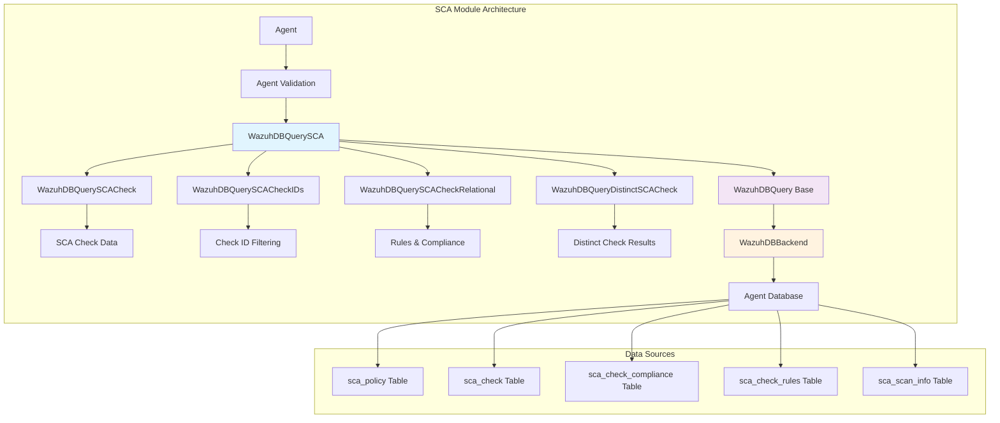
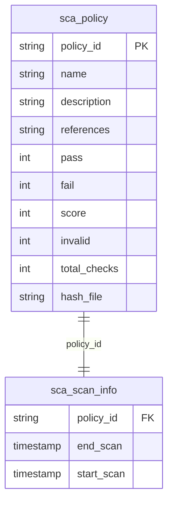
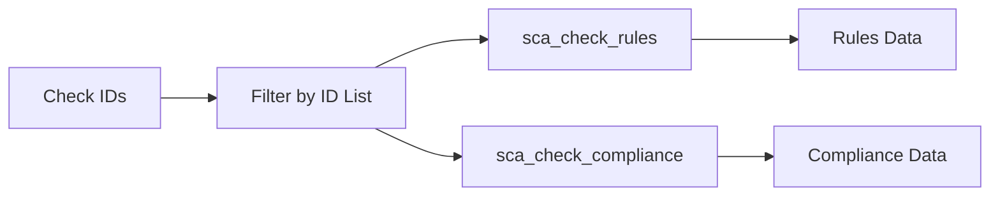
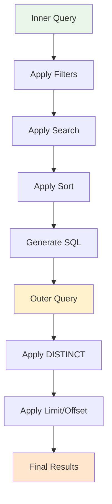
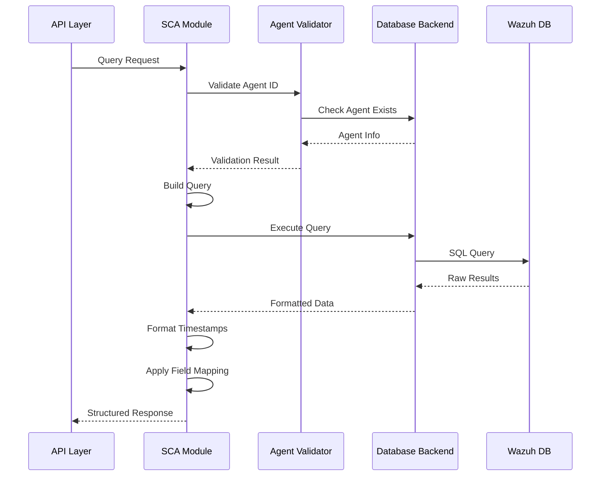
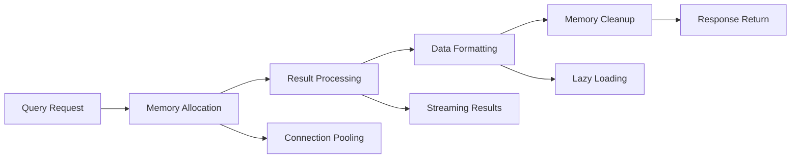

# SCA (Security Configuration Assessment) Module

## Overview

The Security Configuration Assessment (SCA) module is a critical component of the Wazuh security platform that provides comprehensive security configuration evaluation capabilities. This module enables automated assessment of system configurations against security benchmarks and compliance standards, helping organizations identify and remediate security misconfigurations.

The SCA module operates within the broader [Security Modules](security_modules.md) framework and integrates seamlessly with the [Core Framework](core_framework.md) to provide real-time security configuration monitoring and assessment.

## Architecture

The SCA module is built around a sophisticated database query system that provides flexible and efficient access to security configuration assessment data. The architecture follows a layered approach with specialized query classes for different types of SCA operations.



## Core Components

### WazuhDBQuerySCA

The base class for all SCA database queries, providing fundamental functionality for querying SCA policy information.

**Key Features:**
- **Policy Management**: Handles SCA policy data retrieval and filtering
- **Scan Information**: Integrates scan metadata with policy data
- **Date Formatting**: Automatically formats timestamp fields for API consumption
- **Agent Validation**: Ensures target agent exists before executing queries

**Database Schema Integration:**


### WazuhDBQuerySCACheck

Specialized query class for retrieving individual SCA check details with support for filtering by check IDs.

**Capabilities:**
- **Check Filtering**: Filter checks by specific IDs
- **Field Selection**: Granular control over returned fields
- **Validation**: Ensures only valid fields are selected
- **Sorting**: Configurable sorting by check attributes

### WazuhDBQuerySCACheckIDs

Optimized query class for retrieving SCA check IDs with complex filtering across multiple related tables.

**Features:**
- **Multi-table Joins**: Combines check, compliance, and rules data
- **Policy Filtering**: Filters checks by specific policy ID
- **Condition Handling**: Special handling for 'condition=all' queries
- **Distinct Results**: Returns unique check IDs only

### WazuhDBQuerySCACheckRelational

Handles retrieval of relational data (rules and compliance) associated with specific SCA checks.

**Supported Tables:**
- `sca_check_rules`: Rule definitions for checks
- `sca_check_compliance`: Compliance mappings for checks

**Query Pattern:**


### WazuhDBQueryDistinctSCACheck

Advanced query class that provides distinct SCA check results by combining data from multiple tables using a nested query approach.

**Architecture:**


## Data Flow

The SCA module follows a structured data flow pattern that ensures efficient and accurate security configuration assessment:



## Integration Points

### Core Framework Integration

The SCA module integrates deeply with the [Core Framework](core_framework.md) components:

- **WazuhDBQuery**: Inherits base database query functionality
- **WazuhDBBackend**: Utilizes database connection management
- **Agent**: Validates agent existence and retrieval

### Database Connectivity

Leverages the [Database Connectivity](database_connectivity.md) layer for:
- Connection pooling and management
- Query execution and result processing
- Transaction handling and error management

### API Framework Integration

Works seamlessly with the [API Framework](api_framework.md) to provide:
- RESTful endpoints for SCA data access
- Request validation and response formatting
- Authentication and authorization support

## Field Mappings

The SCA module maintains comprehensive field mappings between API and database representations:

### SCA Policy Fields
```python
DB_FIELDS = {
    'policy_id': 'policy_id',
    'name': 'name', 
    'description': 'description',
    'references': '`references`',
    'pass': 'pass',
    'fail': 'fail',
    'score': 'score',
    'invalid': 'invalid',
    'total_checks': 'total_checks',
    'hash_file': 'hash_file',
    'end_scan': 'end_scan',
    'start_scan': 'start_scan'
}
```

### SCA Check Fields
```python
SCA_CHECK_DB_FIELDS = {
    'policy_id': 'policy_id',
    'id': 'id',
    'title': 'title',
    'description': 'description',
    'rationale': 'rationale',
    'remediation': 'remediation',
    'file': 'file',
    'process': 'process',
    'directory': 'directory',
    'registry': 'registry',
    'command': 'command',
    'references': '`references`',
    'result': 'result',
    'reason': 'reason',
    'condition': 'condition'
}
```

## Query Patterns

### Basic SCA Policy Query
```python
# Retrieve SCA policies for an agent
query = WazuhDBQuerySCA(
    agent_id="001",
    offset=0,
    limit=50,
    sort={"fields": ["policy_id"], "order": "ASC"},
    select=["policy_id", "name", "score"]
)
results = query.run()
```

### SCA Check Filtering
```python
# Get specific SCA checks
query = WazuhDBQuerySCACheck(
    agent_id="001",
    select=["id", "title", "result"],
    sort={"fields": ["id"], "order": "ASC"},
    sca_checks_ids=[1, 2, 3, 4, 5]
)
results = query.run()
```

### Complex Check Query with Distinct Results
```python
# Get distinct checks with compliance and rules data
query = WazuhDBQueryDistinctSCACheck(
    agent_id="001",
    offset=0,
    limit=100,
    filters={"result": "failed"},
    policy_id="cis_debian",
    sort={"fields": ["id"], "order": "ASC"},
    select=["id", "title", "compliance.key", "rules.type"]
)
results = query.run()
```

## Performance Considerations

### Query Optimization

The SCA module implements several optimization strategies:

1. **Selective Field Loading**: Only requested fields are retrieved from the database
2. **Efficient Joins**: Optimized JOIN operations between related tables
3. **Index Utilization**: Leverages database indexes for common query patterns
4. **Result Caching**: Implements caching for frequently accessed data

### Memory Management



## Error Handling

The SCA module implements comprehensive error handling:

### Agent Validation Errors
- **WazuhError(2007)**: Agent database not found
- **WazuhResourceNotFound(1701)**: Agent does not exist

### Query Validation Errors
- **WazuhError(1724)**: Invalid select fields specified
- **WazuhError(1405)**: Database limit exceeded
- **WazuhError(1406)**: Invalid limit value

### Database Errors
- Connection failures are handled gracefully with automatic retry
- Transaction rollback on query failures
- Resource cleanup on connection termination

## Security Considerations

### Access Control

The SCA module integrates with the [RBAC Security](rbac_security.md) system to ensure:
- Agent-level access control
- Policy-based data filtering
- Audit trail for all queries

### Data Validation

All input parameters undergo strict validation:
- Agent ID format validation
- Field name validation against allowed fields
- Query parameter sanitization

## Usage Examples

### Retrieving SCA Policy Summary
```python
from wazuh.core.sca import WazuhDBQuerySCA

# Get SCA policy overview for agent
with WazuhDBQuerySCA(
    agent_id="001",
    offset=0,
    limit=10,
    select=["policy_id", "name", "pass", "fail", "score"]
) as query:
    policies = query.run()
    
for policy in policies['items']:
    print(f"Policy: {policy['name']}, Score: {policy['score']}")
```

### Analyzing Failed Checks
```python
from wazuh.core.sca import WazuhDBQueryDistinctSCACheck

# Find all failed checks for a specific policy
with WazuhDBQueryDistinctSCACheck(
    agent_id="001",
    offset=0,
    limit=50,
    filters={"result": "failed"},
    policy_id="cis_debian",
    select=["id", "title", "description", "remediation"]
) as query:
    failed_checks = query.run()
    
for check in failed_checks['items']:
    print(f"Failed Check: {check['title']}")
    print(f"Remediation: {check['remediation']}")
```

## Related Modules

- **[Core Framework](core_framework.md)**: Base infrastructure and utilities
- **[Database Connectivity](database_connectivity.md)**: Database connection management
- **[Agent Management](agent_management.md)**: Agent lifecycle and information
- **[API Framework](api_framework.md)**: RESTful API endpoints
- **[RBAC Security](rbac_security.md)**: Access control and authorization
- **[Security Modules](security_modules.md)**: Related security assessment modules

## Future Enhancements

The SCA module is continuously evolving with planned enhancements including:

1. **Real-time Assessment**: Live configuration monitoring capabilities
2. **Custom Policies**: Support for user-defined security policies
3. **Remediation Automation**: Automated fix deployment for failed checks
4. **Advanced Analytics**: Machine learning-based trend analysis
5. **Multi-agent Correlation**: Cross-agent configuration analysis

This comprehensive SCA module provides the foundation for robust security configuration assessment within the Wazuh platform, ensuring organizations can maintain strong security postures through continuous monitoring and assessment.