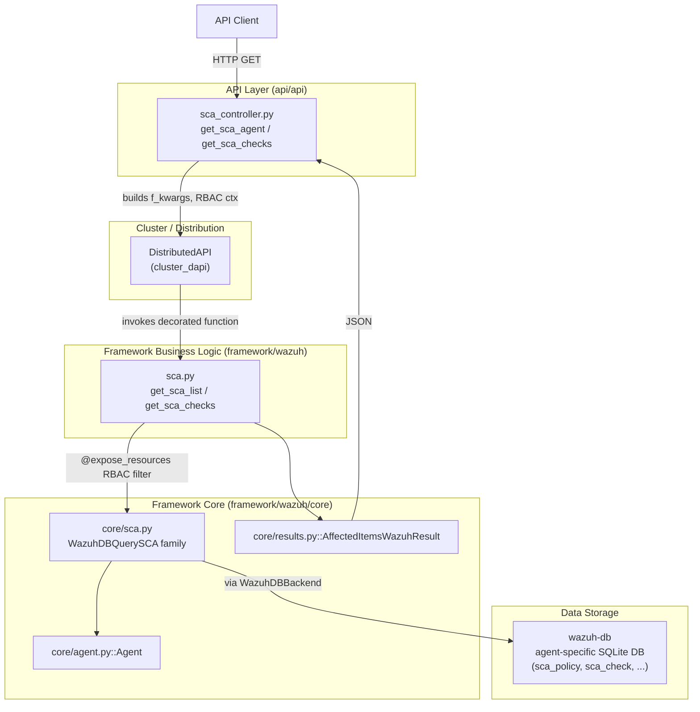
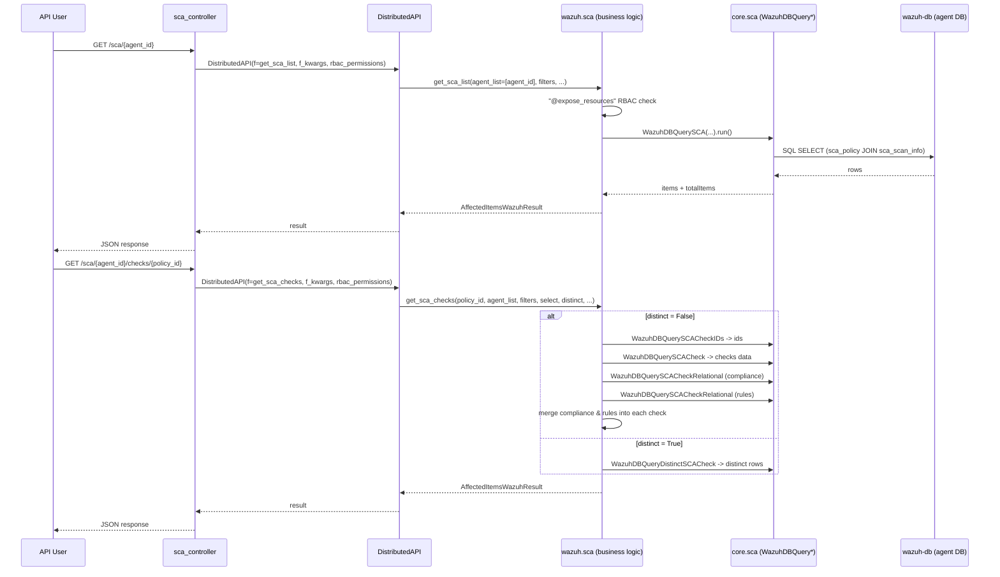

# SCA Module (Security Configuration Assessment)

## 1. Purpose

The **SCA module** exposes Wazuh's Security Configuration Assessment (SCA) data — the results of policy-based
hardening/compliance scans performed by agents (via the `wazuh-modules` SCA wodle, documented in
[Wazuh_Modules_Daemon_(C).md](Wazuh_Modules_Daemon_(C).md)) — through the Wazuh REST API and the Python
Framework layer.

SCA scans check a host's configuration against a set of policies (e.g. CIS benchmarks). Each policy is made up
of multiple *checks*, and each check can have an associated *result* (`passed`, `failed`, `not applicable`), a
*rationale*, *remediation* text, *rules* (the actual conditions evaluated) and *compliance* mappings (e.g. to
PCI-DSS or NIST controls). This module allows API consumers to:

- List the SCA **policies** that have been evaluated on a given agent, along with their aggregated pass/fail/score.
- List the individual **checks** of a policy, including their associated rules and compliance mappings.

The module is a fairly small, self-contained "vertical slice" of the broader Wazuh API/Framework architecture,
and it depends heavily on shared Framework infrastructure such as
[framework_core_utils.md](framework_core_utils.md) (`WazuhDBQuery`, `AffectedItemsWazuhResult`) and
[framework_core_communication.md](framework_core_communication.md) (`WazuhDBConnection`).

## 2. Architecture Overview

The module follows the standard three-layer pattern used across the Wazuh API/Framework codebase
(see [api_core_infrastructure.md](api_core_infrastructure.md) for the shared API scaffolding):

### Request flow

1. **`api/api/controllers/sca_controller.py`** receives the HTTP request (`GET /sca/{agent_id}` and
   `GET /sca/{agent_id}/checks/{policy_id}`), parses/validates query parameters (pagination, sorting, search,
   `select`, `q`, filters) and wraps the call in a `DistributedAPI` object so that it can be transparently
   routed to the correct cluster node (see [cluster_dapi.md](cluster_dapi.md)).
2. **`framework/wazuh/sca.py`** contains the actual business logic, decorated with `@expose_resources` from the
   RBAC subsystem (see [security_rbac_module.md](security_rbac_module.md)) to enforce that the requesting user
   is authorized to read SCA data for the given agent(s).
3. **`framework/wazuh/core/sca.py`** implements a family of `WazuhDBQuery` subclasses that build and execute the
   SQL queries against the agent's SCA tables in `wazuh-db` (`sca_policy`, `sca_scan_info`, `sca_check`,
   `sca_check_compliance`, `sca_check_rules`).
4. Results are wrapped into an `AffectedItemsWazuhResult` (from
   [framework_core_utils.md](framework_core_utils.md)) and serialized back to JSON by the controller.

## 3. Core Components

| Layer | File | Responsibility |
|---|---|---|
| API Controller | `api/api/controllers/sca_controller.py` | HTTP endpoint handlers `get_sca_agent`, `get_sca_checks` |
| Business Logic | `framework/wazuh/sca.py` | RBAC-protected functions `get_sca_list`, `get_sca_checks` |
| Core Data Access | `framework/wazuh/core/sca.py` | `WazuhDBQuerySCA`, `WazuhDBQuerySCACheck`, `WazuhDBQuerySCACheckIDs`, `WazuhDBQuerySCACheckRelational`, `WazuhDBQueryDistinctSCACheck` |

Because this module is small, it is documented in a single dedicated sub-module page rather than being split
further:

- **[sca_module_details.md](sca_module_details.md)** — Full breakdown of the API controller, business-logic
  functions, and the `WazuhDBQuery` subclasses used to assemble SCA policy and check data (including how
  checks are joined with rules/compliance tables and how the `distinct` query mode works).

## 4. Relationship to Other Modules

- **[agent_module.md](agent_module.md)** — SCA data is always scoped to a specific `agent_id`; the module reuses
  `wazuh.core.agent.Agent` / `get_agents_info` to validate that the agent exists.
- **[framework_core_utils.md](framework_core_utils.md)** — Provides the base `WazuhDBQuery` and `WazuhDBBackend`
  classes that `core/sca.py` extends, plus `AffectedItemsWazuhResult`/`WazuhResult` used to shape API responses.
- **[framework_core_communication.md](framework_core_communication.md)** — `WazuhDBBackend` ultimately talks to
  `wazuh-db` through `WazuhDBConnection` (see that module for the socket protocol details).
- **[security_rbac_module.md](security_rbac_module.md)** — The `@expose_resources` decorator used in
  `framework/wazuh/sca.py` enforces per-agent RBAC permissions (`sca:read`).
- **[cluster_dapi.md](cluster_dapi.md)** — The controller dispatches requests through `DistributedAPI`, enabling
  the query to be forwarded to the specific worker node that manages the target agent in a clustered deployment.
- **Data origin**: The SCA data itself is produced on the agent side by the `wm_sca` wodle
  (`src/wazuh_modules/wm_sca.c`), part of [Wazuh_Modules_Daemon_(C).md](Wazuh_Modules_Daemon_(C).md); this
  module (`sca_module`) only reads/exposes that data via the API, it does not run scans itself.

## 5. Typical Usage Flow

## 6. Notes on Design

- **Two query modes for checks**: `get_sca_checks` supports both a normal mode (fetch matching check IDs, then
  fetch full check rows plus related rules/compliance rows and merge them in Python) and a `distinct` mode
  (build a single inner query joining all three tables and apply `SELECT DISTINCT` directly in SQL). This
  optimizes for the common case (avoid a huge join returning duplicated rows) while still allowing accurate
  distinct-value queries when requested.
- **Field mapping tables**: `SCA_CHECK_DB_FIELDS`, `SCA_CHECK_COMPLIANCE_DB_FIELDS`, and
  `SCA_CHECK_RULES_DB_FIELDS` (all `MappingProxyType`, i.e. immutable) define the API-to-DB column name mapping
  and which fields belong to which underlying table, used to validate/split `select` parameters.
- **Agent DB isolation**: Since each agent has its own SQLite database file managed by `wazuh-db`
  (`WazuhDBBackend` checks for `<agent_id>.db` existence), all SCA queries are inherently per-agent.

## 7. Detailed Documentation

See **[sca_module_details.md](sca_module_details.md)** for a full component-by-component breakdown.
