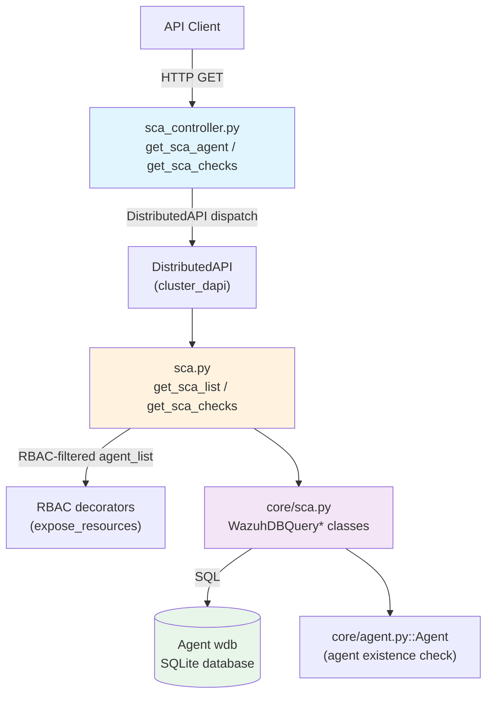
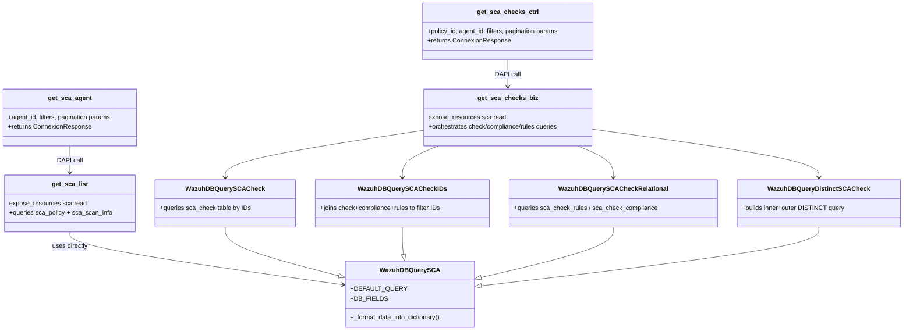
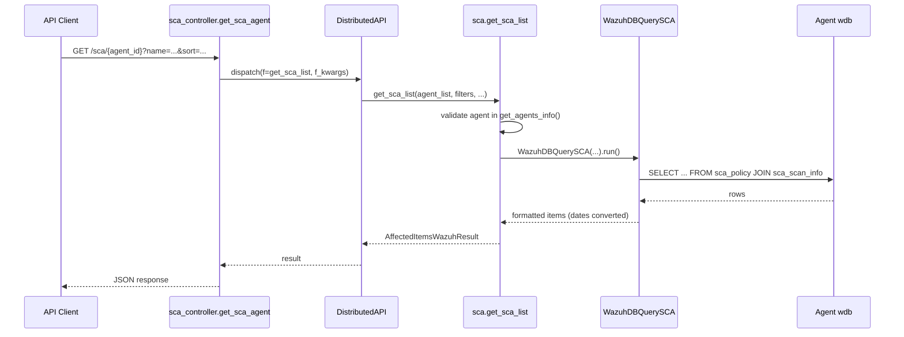
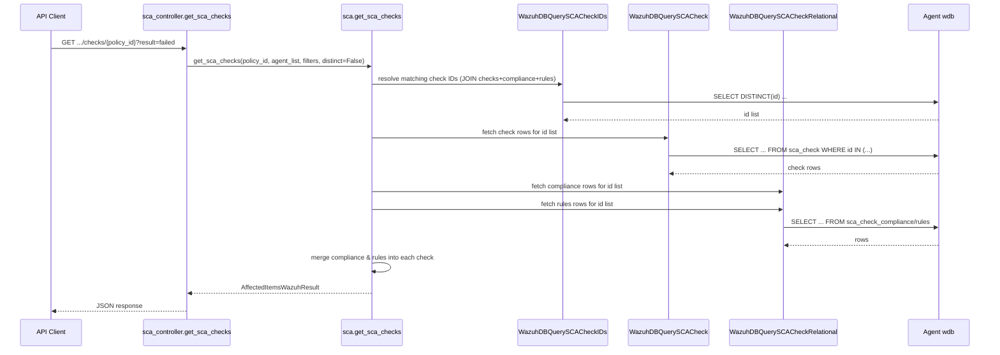

# SCA Module Details

## 1. Introduction & Purpose

The **SCA (Security Configuration Assessment) Module** exposes the results of Wazuh's Security
Configuration Assessment scans through the Wazuh API. SCA scans evaluate an agent's system
configuration against a set of security policies (CIS benchmarks and custom policies), reporting
which checks passed, failed, or were not applicable.

This module is the **API-facing layer** for SCA data. It does not perform the actual scanning
(that responsibility belongs to the `wm_sca` wodule running on the agent — see
[Wazuh_Modules_Daemon_(C)](Wazuh_Modules_Daemon_(C).md) and its `wm_sca.c`/`wm_sca.h` sources); instead,
it retrieves previously collected SCA results that the agent has synchronized into the agent-specific
SQLite database (`wdb`), and presents them through well-defined, filterable, paginated REST endpoints.

Typical use cases enabled by this module:
- List SCA policies evaluated for a given agent, along with pass/fail/score summary statistics.
- Retrieve detailed check-level results for a specific policy, including compliance mappings
  (e.g., CIS, PCI-DSS references) and applicable rules (file, command, registry, process checks).
- Filter, search, sort, and paginate through potentially large result sets efficiently at the
  database query level.

## 2. Architecture Overview

The module follows the standard Wazuh three-layer pattern also seen in other resource modules
(e.g., [rootcheck_module](rootcheck_module.md), [ciscat_module](ciscat_module.md),
[syscheck_module](syscheck_module.md)):

1. **API Controller Layer** — HTTP request handling, parameter parsing, and distribution of the
   request across the cluster via the Distributed API (DAPI).
2. **Business Logic Layer** — RBAC-protected framework functions that orchestrate DB queries and
   assemble the final result objects.
3. **Core DB Query Layer** — Specialized `WazuhDBQuery` subclasses that build and execute SQL
   queries against the per-agent `wdb` SQLite database, handling filtering, sorting, searching,
   and joining related tables (checks, compliance, rules).

### Component Relationships

## 3. Core Components

### 3.1 API Controller Layer — `api/api/controllers/sca_controller.py`

| Component | Responsibility |
|---|---|
| `get_sca_agent` | HTTP handler for listing SCA **policies** evaluated on a given agent, with filters on `name`, `description`, `references`, and generic query support (e.g., filtering by `pass`, `fail`, `score`). |
| `get_sca_checks` | HTTP handler for listing **checks** within a policy for an agent, exposing a rich set of filters (`title`, `description`, `rationale`, `remediation`, `command`, `reason`, `file`, `process`, `directory`, `registry`, `references`, `result`, `condition`). |

Both handlers follow the standard Wazuh controller pattern:
1. Collect filter parameters into a `filters` dict.
2. Build `f_kwargs` for the target framework function.
3. Wrap the call in a `DistributedAPI` object (`request_type='distributed_master'`) so it can be
   transparently routed to the correct cluster node — see
   [cluster_dapi](cluster_dapi.md) for the distribution mechanism.
4. Apply RBAC policies from the request context (`request.context['token_info']['rbac_policies']`).
5. Return a `ConnexionResponse` via the shared `json_response` helper.

This mirrors the pattern used across all resource controllers, such as those in
[rootcheck_module](rootcheck_module.md) and [ciscat_module](ciscat_module.md).

### 3.2 Business Logic Layer — `framework/wazuh/sca.py`

| Component | Responsibility |
|---|---|
| `get_sca_list` | RBAC-protected (`sca:read`) function that validates the agent exists (via `get_agents_info()`), then runs a `WazuhDBQuerySCA` to fetch policy-level summary rows, wrapping results in an `AffectedItemsWazuhResult`. |
| `get_sca_checks` | RBAC-protected (`sca:read`) function implementing a more complex two-mode workflow: **Non-distinct mode**: first resolves matching check **IDs** via `WazuhDBQuerySCACheckIDs` (applying filters/search/query/sort), then fetches check rows via `WazuhDBQuerySCACheck`, and finally enriches each check with **compliance** and **rules** data fetched via `WazuhDBQuerySCACheckRelational`. **Distinct mode** (`distinct=True`): delegates entirely to `WazuhDBQueryDistinctSCACheck`, which builds a single DISTINCT query joining all three tables. |

Both functions use the `@expose_resources` decorator from
[security_rbac_module](security_rbac_module.md) (`framework/wazuh/rbac/decorators.py`) to restrict
access based on `agent:id:{agent_list}` resource permissions, and rely on
`AffectedItemsWazuhResult`/`WazuhResult` from `framework/wazuh/core/results.py`
(see [framework_core_utils](framework_core_utils.md)) to standardize partial-failure reporting.

### 3.3 Core DB Query Layer — `framework/wazuh/core/sca.py`

This is the most intricate part of the module — it implements several cooperating
`WazuhDBQuery` subclasses (base class documented in [framework_core_utils](framework_core_utils.md)):

| Class | Purpose |
|---|---|
| `WazuhDBQuerySCA` | Base class for all SCA queries. Defines `DEFAULT_QUERY` (joining `sca_policy` and `sca_scan_info`) and `DEFAULT_QUERY_DISTINCT`. Verifies the agent exists via `core.agent.Agent`. Formats `end_scan`/`start_scan` timestamp fields into human-readable dates. Uses `WazuhDBBackend` (see [framework_core_communication](framework_core_communication.md)) to talk to the per-agent `wdb` database. |
| `WazuhDBQuerySCACheck` | Extends `WazuhDBQuerySCA` to query the `sca_check` table filtered by a pre-computed list of check IDs. Overrides `_parse_select_filter` to also allow selecting extra "virtual" fields belonging to compliance/rules tables. |
| `WazuhDBQuerySCACheckIDs` | Builds a `LEFT JOIN` across `sca_check`, `sca_check_compliance`, and `sca_check_rules` to resolve the set of check **IDs** matching the requested `policy_id`, filters, search, and query — this two-step ID resolution avoids duplicate rows caused by the join before final data is loaded per check. |
| `WazuhDBQuerySCACheckRelational` | Generic helper to fetch rows from either `sca_check_compliance` or `sca_check_rules`, filtered by a given list of check IDs. Used to enrich the final check list with compliance mappings and detection rules. |
| `WazuhDBQueryDistinctSCACheck` | Implements the `distinct=True` code path: constructs an **inner query** (with filters/search/sort/query already substituted) and wraps it in an outer `SELECT DISTINCT` query, returning unique combinations of the joined fields. |

Field-mapping constants (`SCA_CHECK_DB_FIELDS`, `SCA_CHECK_COMPLIANCE_DB_FIELDS`,
`SCA_CHECK_RULES_DB_FIELDS`) act as an API-to-DB translation layer, ensuring that only
whitelisted columns can be selected/sorted/filtered by API consumers — a defensive design
pattern shared with other `WazuhDBQuery` implementations across the codebase (e.g.
[syscheck_module](syscheck_module.md), [mitre_module](mitre_module.md)).

## 4. Data Flow

### 4.1 Listing SCA Policies (`GET /sca/{agent_id}`)

### 4.2 Listing SCA Checks (`GET /sca/{agent_id}/checks/{policy_id}`)

## 5. Integration Points & Related Modules

| Related Module | Relationship |
|---|---|
| [framework_core_utils](framework_core_utils.md) | Provides `WazuhDBQuery`, `WazuhDBBackend`, `AffectedItemsWazuhResult`/`WazuhResult` base classes used throughout this module. |
| [framework_core_communication](framework_core_communication.md) | Underlying `wdb` socket/HTTP communication layer that `WazuhDBBackend` relies on to reach the per-agent SQLite database. |
| [agent_module](agent_module.md) | `core.agent.Agent` and `get_agents_info()` are used to validate that the target agent exists before querying SCA data. |
| [security_rbac_module](security_rbac_module.md) | Supplies the `@expose_resources` decorator enforcing `sca:read` permissions scoped to `agent:id:{agent_list}`. |
| [cluster_dapi](cluster_dapi.md) | The `DistributedAPI` class used by the controllers to route requests to the correct cluster node holding the agent's data. |
| [api_core_infrastructure](api_core_infrastructure.md) | Shared API infrastructure (URI parsing, validators, logging, encoders) used indirectly by the controller layer. |
| [wazuh_db](wazuh_db.md) | The `wdb` daemon that owns and serves the underlying SQLite tables (`sca_policy`, `sca_scan_info`, `sca_check`, `sca_check_compliance`, `sca_check_rules`) queried by this module. |
| [wazuh_modules_core](wazuh_modules_core.md) (wm_sca) | The agent-side wodule (`wm_sca.c`/`wm_sca.h`) responsible for actually executing SCA scans and populating the `wdb` tables that this module reads from. |

## 6. Summary

The SCA module is a compact but well-layered example of the Wazuh API's read-path architecture for
agent-collected security data: a thin HTTP controller, an RBAC-guarded business-logic layer, and a
specialized set of `WazuhDBQuery` subclasses that carefully manage SQL joins, ID-based filtering, and
optional `DISTINCT` semantics to efficiently serve paginated, filterable views over potentially large
per-agent security assessment datasets.
