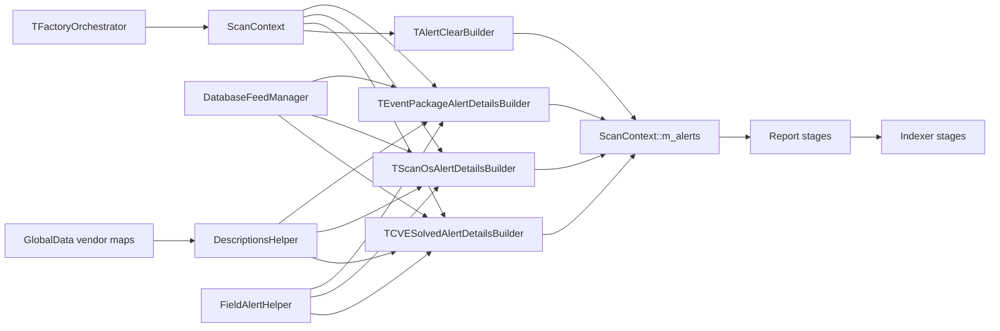
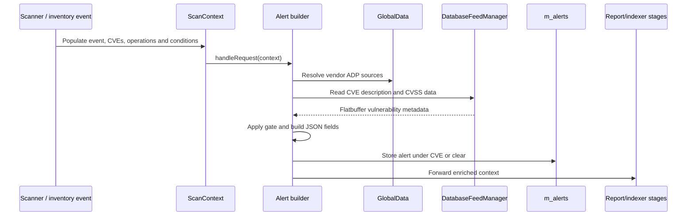
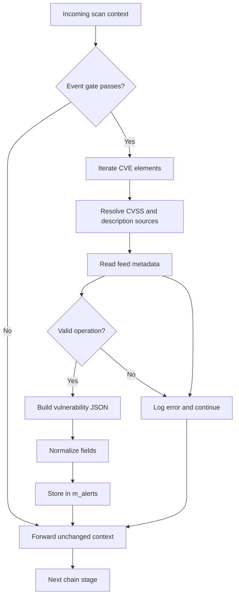

# scan_orchestrator_alert_builders

## Introduction

The `scan_orchestrator_alert_builders` module is the alert-construction layer of Wazuh's vulnerability-scanner scan orchestrator. It converts scan state and vulnerability-feed metadata into normalized JSON alert objects stored in `ScanContext::m_alerts`.

The module is implemented as chain-of-responsibility handlers. Each builder enriches the shared scan context and forwards it to the next handler. Inventory persistence, report dispatch, and indexing are handled by neighboring orchestrator modules.

Source directory: `src/wazuh_modules/vulnerability_scanner/src/scanOrchestrator/`

## Architecture overview

`TFactoryOrchestrator` selects the relevant builder chain by `ScannerType`: package insert/delete uses the package builder, hotfix insert uses the solved builder, OS scans use the OS builder, and integrity-clear scans use the clear builder.

The surrounding scanner lifecycle is documented in [vulnerability_scanner_facade.md](vulnerability_scanner_facade.md), while feed retrieval is covered by [database_feed_manager.md](database_feed_manager.md).

## Sub-modules

### Alert builder handlers

[scan_orchestrator_alert_builders_handlers.md](scan_orchestrator_alert_builders_handlers.md)

The handlers document has focused child pages:

- [scan_orchestrator_alert_builders_handlers_package_alerts.md](scan_orchestrator_alert_builders_handlers_package_alerts.md) — package CVE alerts from dbsync deltas.
- [scan_orchestrator_alert_builders_handlers_os_alerts.md](scan_orchestrator_alert_builders_handlers_os_alerts.md) — OS vulnerability alerts.
- [scan_orchestrator_alert_builders_handlers_solved_alerts.md](scan_orchestrator_alert_builders_handlers_solved_alerts.md) — CVEs solved by hotfix events.
- [scan_orchestrator_alert_builders_handlers_clear_alerts.md](scan_orchestrator_alert_builders_handlers_clear_alerts.md) — inventory-clear alerts.

| Handler | Gate | Subject | Output |
| --- | --- | --- | --- |
| `TEventPackageAlertDetailsBuilder` | `MessageType::Delta` | Installed package | Active or solved CVE alert |
| `TScanOsAlertDetailsBuilder` | Not the first scan | Operating system | Active or solved CVE alert |
| `TCVESolvedAlertDetailsBuilder` | `MessageType::Delta` | Hotfix result | Solved CVE alert |
| `TAlertClearBuilder` | Inventory is not empty | Package inventory state | Clear vulnerability alert |

### Alert metadata helpers

[scan_orchestrator_alert_builders_helpers.md](scan_orchestrator_alert_builders_helpers.md)

This document covers `CveDescription`, `DescriptionsHelper`, `FieldAlertHelper::fillEmptyOrNegative`, and the `WAZUH_CTI_CVES_URL` constant.

## Data flow

## Alert construction contract

Builders rely on upstream stages to populate `m_elements` with CVE operations (`INSERTED` or `DELETED`), optional `m_matchConditions`, package or OS identity fields, `m_vulnerabilitySource`, and the scan flags `m_isFirstScan` and `m_isInventoryEmpty`. Hotfix processing also supplies the hotfix identifier.

On success, an alert is inserted into `context->m_alerts`. CVSS scores are rounded, references are formed from the Wazuh CTI CVE URL, and empty or unusable metadata is normalized with placeholders.

## Process flow

Exceptions for an individual CVE are caught and logged, allowing other CVEs to be processed and the context to continue through the chain.

## Component relationships

- **Input:** scanner and inventory stages in the vulnerability-scanner orchestrator populate the shared `ScanContext` before these handlers run.
- **Metadata:** [database_feed_manager.md](database_feed_manager.md) and vendor configuration held by `GlobalData`.
- **Output:** report and indexer stages consume the enriched context after the alert-builder chain.
- **Shared pattern:** the generic chain utility supplies handler linking; these classes implement stage-specific `handleRequest` logic.

## Maintenance guidance

Preserve the forwarding call when changing a builder, keep baseline and delta gates aligned with scanner semantics, reuse `DescriptionsHelper` for feed fallback behavior, use `FieldAlertHelper` for normalized fields, and verify the corresponding chain in `factoryOrchestrator.hpp`.
