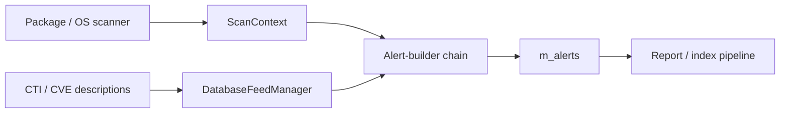
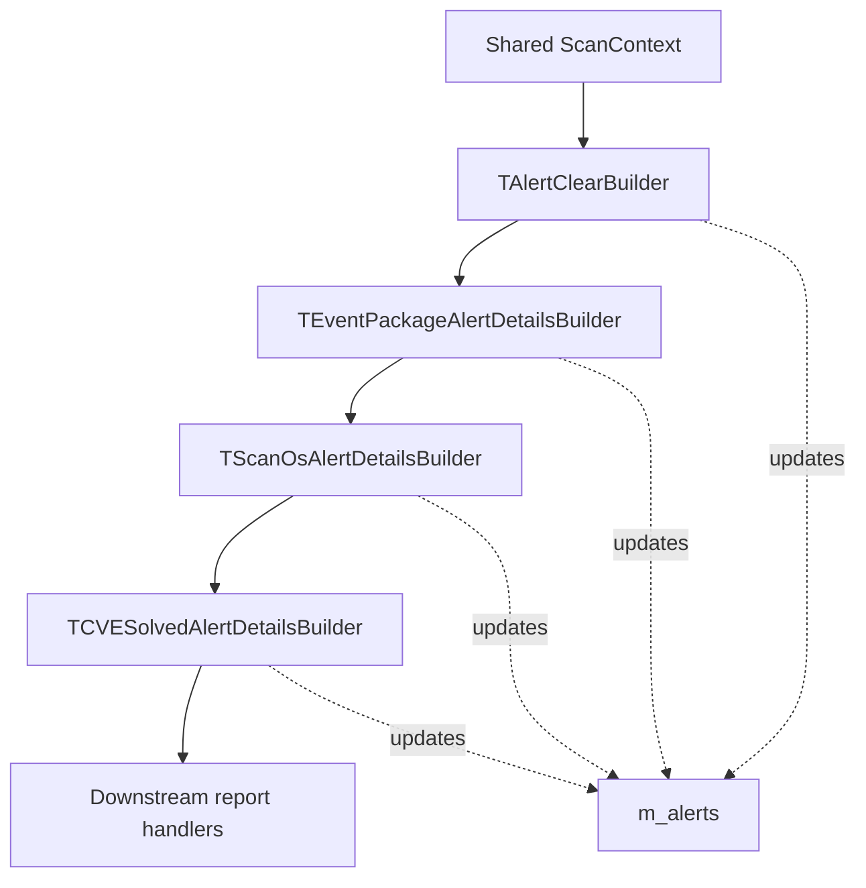
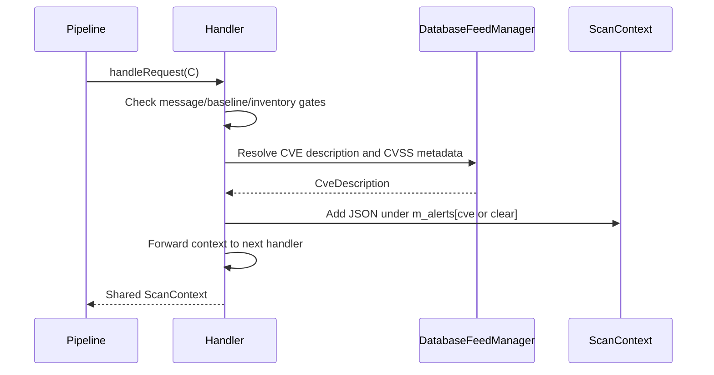

# Scan Orchestrator Alert Builders: Handlers

## Purpose

This module contains the alert-building handlers used by Wazuh's vulnerability-scanner scan orchestrator. Each handler receives a shared `std::shared_ptr<ScanContext>`, conditionally derives vulnerability alert details, stores JSON reports in `context->m_alerts`, and forwards the context to the next handler.

The implementation is header-only and templated so tests or alternate integrations can substitute the database-feed manager, scan context, and global-data types.

## Position in the vulnerability-scanner architecture

The handlers sit between vulnerability detection/inventory processing and report delivery. Scanner and inventory stages populate the scan context; these handlers translate CVE operations and feed metadata into normalized alert JSON; downstream reporting/indexing stages consume `m_alerts`.

## Handler chain

All four classes derive from `AbstractHandler<std::shared_ptr<TScanContext>>`. Their `handleRequest` methods perform local work and then call the base implementation, preserving chain order and allowing later handlers to run.

The exact runtime order is assembled by the orchestrator/factory; the diagram shows the shared responsibility pattern rather than asserting a fixed construction order.

## Sub-module documentation

- [Package alert handlers](scan_orchestrator_alert_builders_handlers_package_alerts.md) — package delta alerts, active/solved package states, CVSS vectors, and package conditions.
- [OS alert handlers](scan_orchestrator_alert_builders_handlers_os_alerts.md) — OS vulnerability alerts, baseline suppression, OS metadata, and operation handling.
- [Solved-alert handlers](scan_orchestrator_alert_builders_handlers_solved_alerts.md) — CVE-solved alert enrichment from hotfix and feed metadata.
- [Clear-alert handlers](scan_orchestrator_alert_builders_handlers_clear_alerts.md) — inventory-aware clear-alert generation and suppression rules.
- [Generated handler overview](scan_orchestrator_alert_builders_handlers_scan_orchestrator_alert_builders_handlers.md) — generated sub-module summary for the complete handler set.

## Responsibilities

| Handler | Trigger | Output |
|---|---|---|
| `TAlertClearBuilder` | Inventory is not empty | A `clear` report with status `Clear`; suppresses the report when `m_isInventoryEmpty` is true |
| `TEventPackageAlertDetailsBuilder` | Delta message with package element operation | Active or solved package CVE alert |
| `TScanOsAlertDetailsBuilder` | Non-baseline OS scan with inserted/deleted CVE element | Active or solved OS CVE alert |
| `TCVESolvedAlertDetailsBuilder` | Delta message containing solved CVE elements and a hotfix | Solved alert describing the hotfix resolution |

## Common processing model

Common alert fields include CVE identifier, CTI scanner reference, CVSS base score/version, publication/update timestamps, severity, classification, reference, and alert status. Missing or non-positive descriptive values are normalized through `FieldAlertHelper::fillEmptyOrNegative`; scores are rounded with the shared numeric utility.

## Input contracts and invariants

- `m_elements` is keyed by CVE and, for operation-based handlers, each element must provide an `operation` string of `INSERTED` or `DELETED`.
- `m_matchConditions` may add package-version condition text for `LessThanOrEqual`, `LessThan`, `DefaultStatus`, or `Equal`.
- Delta-only handlers intentionally ignore non-delta messages.
- The OS handler suppresses alerts during the first scan, which represents baseline creation.
- Alert construction errors are caught per CVE and logged; processing continues for other CVEs and the chain still advances.
- The database-feed manager is injected as a shared pointer and is used to resolve authoritative CVE descriptions.

## Integration notes

This module does not perform scanning, inventory synchronization, indexing, or transport itself. It is a transformation layer. Upstream components must populate the context fields consumed by the handlers, while downstream components must interpret the `vulnerability` JSON schema stored in `m_alerts`.

Related module areas include the vulnerability-scanner facade, database feed manager, version matcher, scanner stages, inventory operations, and report/index pipeline. Those components are intentionally referenced at module level rather than duplicated here.
