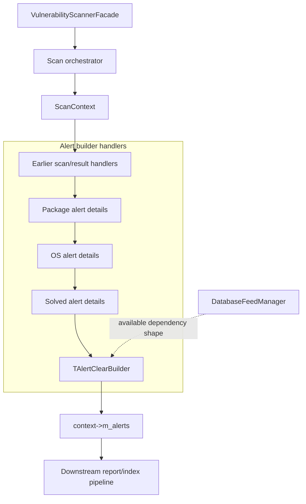
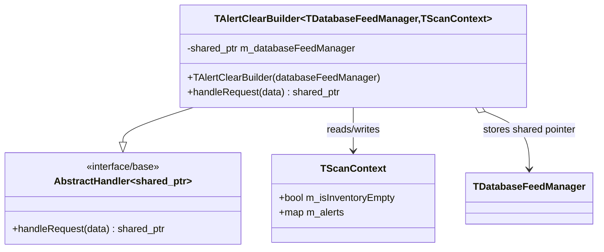
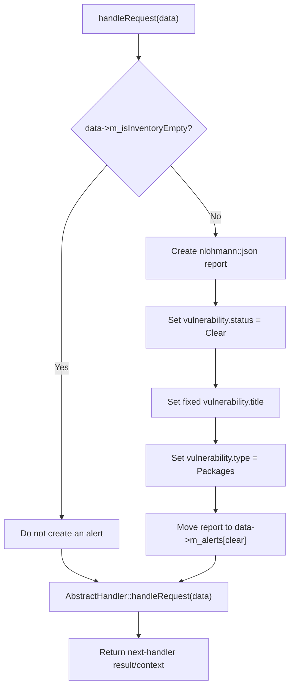
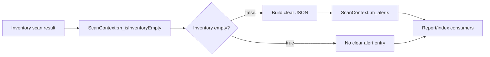
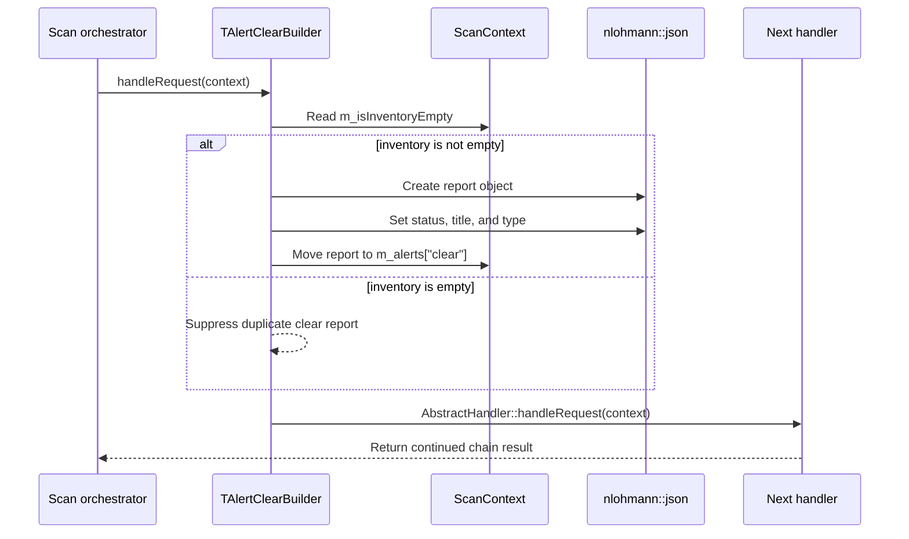

# Scan Orchestrator — Clear Alerts Handler

## Introduction

The **Clear Alerts Handler** is the final alert-building component in the vulnerability scanner’s alert-builder family. It creates a single clear-status vulnerability report when a scan has inventory available, allowing downstream reporting and indexing stages to communicate that package vulnerabilities are no longer present.

The implementation is the header-only template `TAlertClearBuilder` in `src/wazuh_modules/vulnerability_scanner/src/scanOrchestrator/alertClearBuilder.hpp`. It receives a shared scan context, conditionally writes `context->m_alerts["clear"]`, and delegates to the next handler in the Chain of Responsibility.

This document describes the clear-alert handler only. The sibling active package, OS, and solved-alert handlers are documented in [scan_orchestrator_alert_builders_handlers_package_alerts.md](scan_orchestrator_alert_builders_handlers_package_alerts.md), [scan_orchestrator_alert_builders_handlers_os_alerts.md](scan_orchestrator_alert_builders_handlers_os_alerts.md), and [scan_orchestrator_alert_builders_handlers_solved_alerts.md](scan_orchestrator_alert_builders_handlers_solved_alerts.md). Scanner lifecycle and ownership are covered by [vulnerability_scanner_facade.md](vulnerability_scanner_facade.md), and feed-manager responsibilities by [database_feed_manager.md](database_feed_manager.md).

## Module identity

| Item | Value |
|---|---|
| Module | `scan_orchestrator_alert_builders_handlers_clear_alerts` |
| Parent area | `scan_orchestrator_alert_builders_handlers` |
| Source | `src/wazuh_modules/vulnerability_scanner/src/scanOrchestrator/alertClearBuilder.hpp` |
| Primary type | `TAlertClearBuilder<TDatabaseFeedManager, TScanContext>` |
| Production alias | `AlertClearBuilder` |
| Design pattern | Chain of Responsibility |
| Input/output | `std::shared_ptr<TScanContext>`; the same context is returned |
| Output key | `context->m_alerts["clear"]` |

Although the class is parameterized with a database-feed-manager type, the current implementation does not read from `m_databaseFeedManager`. The member is retained as part of the common builder construction/dependency shape and allows the template to remain compatible with production and test wiring.

## Purpose and behavior

The handler’s purpose is to build the scanner’s clear event after the scan context has been populated with inventory state. Its behavior is intentionally small:

1. Inspect `data->m_isInventoryEmpty`.
2. If the inventory is not empty, build a JSON report.
3. Store that report under the fixed alert key `"clear"`.
4. Pass the context to the next handler.

The condition is deliberately positive: `m_isInventoryEmpty == false` produces the clear report. An empty inventory suppresses the report because syscollector emits an integrity-clear event on every scan when inventory is empty or disabled; generating another vulnerability clear alert in that case would duplicate or misrepresent the scan result.

## Position in the vulnerability scanner

The scanner facade owns the wider service lifecycle and connects event ingestion, feed management, scanning, indexing, and report delivery. The clear handler is a formatting stage within that pipeline; it does not scan packages, match CVEs, synchronize inventory, or send the report itself.



The exact chain assembly is outside this header. The diagram expresses the module-tree relationship and the handler’s role: it consumes an already prepared context and contributes a final clear entry before downstream processing.

## Template and dependencies

```cpp
template<typename TDatabaseFeedManager = DatabaseFeedManager,
         typename TScanContext = ScanContext>
class TAlertClearBuilder final
    : public AbstractHandler<std::shared_ptr<TScanContext>>
```

| Dependency | Relationship | Use in this implementation |
|---|---|---|
| `AbstractHandler<std::shared_ptr<TScanContext>>` | Base class | Provides the next-handler delegation through `handleRequest`. |
| `TScanContext` | Template input | Supplies `m_isInventoryEmpty` and `m_alerts`. |
| `TDatabaseFeedManager` | Shared dependency | Stored in `m_databaseFeedManager`; not queried by `handleRequest`. |
| `nlohmann::json` | Output representation | Builds the clear vulnerability report. |
| `chainOfResponsability.hpp` | Infrastructure header | Supplies the handler abstraction. |
| `databaseFeedManager.hpp` | Feed-manager type header | Supplies the default template type. |
| `scanContext.hpp` | Context type header | Supplies the default scan-context type. |

The constructor accepts `std::shared_ptr<TDatabaseFeedManager>&` and stores a copy in `m_databaseFeedManager`. This preserves shared ownership semantics and makes the class easy to instantiate with a mock feed manager in tests, even though clear-alert construction currently needs no feed data.



## Input contract

The handler relies on a minimal context contract:

| Context member | Required meaning |
|---|---|
| `m_isInventoryEmpty` | Whether the scan found no inventory. It must already be populated before this handler runs. |
| `m_alerts` | Mutable alert map into which the clear report is stored under `"clear"`. |

No message type, CVE element map, package metadata, feed description, or vulnerability source is read here. Those concerns belong to the other alert builders or earlier scan-orchestrator stages.

## Clear report schema

When inventory is available, the handler creates this logical structure:

```json
{
  "vulnerability": {
    "status": "Clear",
    "title": "There is no information of installed packages. Vulnerabilities cleared.",
    "type": "Packages"
  }
}
```

The object is moved into `data->m_alerts["clear"]`, so the alert map owns the resulting JSON value. The fixed key and fixed strings make this a control/reporting alert rather than a CVE-specific vulnerability finding.

| JSON path | Value |
|---|---|
| `vulnerability.status` | `Clear` |
| `vulnerability.title` | `There is no information of installed packages. Vulnerabilities cleared.` |
| `vulnerability.type` | `Packages` |
| `m_alerts` key | `clear` |

The title wording is inherited directly from the implementation. It describes the package-vulnerability state represented by the clear report; it does not identify a particular CVE.

## Processing flow



The base-handler call is unconditional. Both the suppressed-alert path and the generated-alert path continue through the chain.

## Data flow



The handler does not mutate the inventory flag. It treats that value as an upstream decision and only mutates the alert map when the flag indicates that a clear report is appropriate.

## Component interaction



There is no database-feed-manager call in this interaction. The stored dependency is structural, not part of the clear-report data path.

## Operational invariants

- A clear alert is generated only when `m_isInventoryEmpty` is false.
- An empty inventory produces no `"clear"` entry from this handler.
- The clear alert is keyed by the literal string `"clear"`, not by a CVE identifier.
- The report contains only package-level clear status, title, and type fields.
- The handler always delegates to the next handler.
- The handler does not send, index, persist, or otherwise publish the report directly.
- The handler does not modify `m_isInventoryEmpty`.
- If `m_alerts` already contains `"clear"`, assignment replaces that value.

## Maintenance guidance

When changing this handler, preserve the distinction between “inventory is available and vulnerabilities were cleared” and “inventory is empty or disabled.” The source comment explicitly identifies duplicate integrity-clear events as the reason for suppressing the latter case.

Changes to the report’s status, title, or type should be coordinated with downstream report consumers and the sibling alert builders. Changes to `m_isInventoryEmpty` population belong in the scan-context or inventory pipeline, not in this formatting handler. For broader scanner lifecycle changes, consult [vulnerability_scanner_facade.md](vulnerability_scanner_facade.md); for feed and vulnerability-data changes, consult [database_feed_manager.md](database_feed_manager.md).

## Source reference

- `src/wazuh_modules/vulnerability_scanner/src/scanOrchestrator/alertClearBuilder.hpp` — `TAlertClearBuilder`
