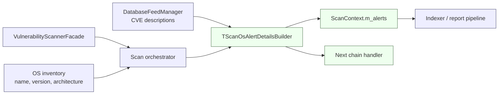
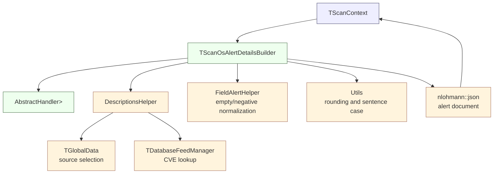
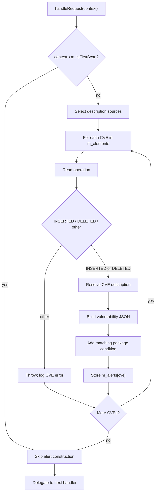
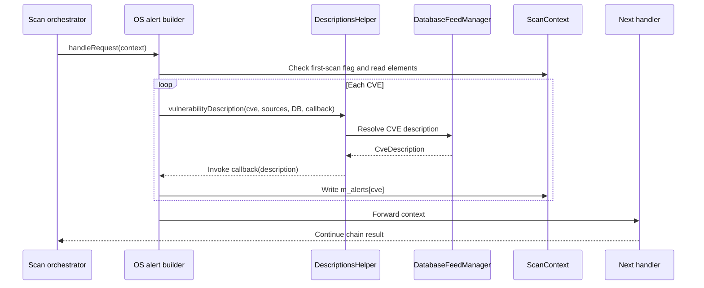

# Scan Orchestrator — OS Alert Details Builder

## Introduction

The **OS Alert Details Builder** is the operating-system vulnerability branch of Wazuh’s vulnerability-scanner alert-building chain. It receives a populated scan context, resolves CVE descriptions through the vulnerability feed, and creates normalized alert details for vulnerabilities affecting the scanned operating system.

The implementation is the header-only template `TScanOsAlertDetailsBuilder` in `src/wazuh_modules/vulnerability_scanner/src/scanOrchestrator/scanOsAlertDetailsBuilder.hpp`. It is an alert-detail formatter, not a vulnerability matcher: OS scanning, CVE matching, feed ingestion, indexing, and report delivery are owned by neighboring components. The broader alert-builder family is documented in [scan_orchestrator_alert_builders.md](scan_orchestrator_alert_builders.md); related package, solved, and clear-alert branches are documented in [scan_orchestrator_alert_builders_handlers_package_alerts.md](scan_orchestrator_alert_builders_handlers_package_alerts.md), [scan_orchestrator_alert_builders_handlers_solved_alerts.md](scan_orchestrator_alert_builders_handlers_solved_alerts.md), and [scan_orchestrator_alert_builders_handlers_clear_alerts.md](scan_orchestrator_alert_builders_handlers_clear_alerts.md).

## Module identity

| Item | Description |
|---|---|
| Module | `scan_orchestrator_alert_builders_handlers_os_alerts` |
| Parent | `scan_orchestrator_alert_builders_handlers` |
| Source | `src/wazuh_modules/vulnerability_scanner/src/scanOrchestrator/scanOsAlertDetailsBuilder.hpp` |
| Primary type | `TScanOsAlertDetailsBuilder<TDatabaseFeedManager, TScanContext, TGlobalData>` |
| Default alias | `ScanOsAlertDetailsBuilder` |
| Pattern | Chain of Responsibility |
| Input/output | `std::shared_ptr<TScanContext>`; the same context is returned |
| Main output | `context->m_alerts[cve]` |

## Position in the vulnerability scanner

The handler is constructed as part of the vulnerability scanner’s scan-orchestrator pipeline. Earlier stages populate the operating-system identity, matched CVEs, operations, and match conditions. This handler enriches those matches with feed metadata and hands the context to the next handler.

For lifecycle, feed ownership, subscriptions, and report delivery, see [vulnerability_scanner_facade.md](vulnerability_scanner_facade.md) and [database_feed_manager.md](database_feed_manager.md). Version parsing and comparison are handled separately by [version_matcher_dispatch.md](version_matcher_dispatch.md).

## Responsibilities

The handler has four central responsibilities:

1. **Suppress baseline alerts.** It performs no alert construction when `context->m_isFirstScan` is true. The first scan establishes a baseline rather than generating vulnerability events.
2. **Interpret matched OS changes.** Each entry in `context->m_elements` is expected to contain a CVE key and an `operation` value. `INSERTED` creates an active finding; `DELETED` creates a solved finding.
3. **Resolve and format CVE metadata.** `DescriptionsHelper::vulnerabilityDescription` retrieves a `CveDescription` from the configured feed manager and invokes a callback that builds the JSON document.
4. **Preserve pipeline composition.** The context is always passed to `AbstractHandler::handleRequest` after this handler’s work, including when it is a baseline scan or when an individual CVE fails to build.

## Architecture and dependencies

### Template parameters

The template parameters make the handler testable and adaptable without changing its algorithm:

| Parameter | Default | Role |
|---|---|---|
| `TDatabaseFeedManager` | `DatabaseFeedManager` | Supplies CVE descriptions through `DescriptionsHelper`. |
| `TScanContext` | `ScanContext` | Carries OS identity, matched elements, conditions, and output alerts. |
| `TGlobalData` | `GlobalData` | Selects the CVSS and description source set. |

The production alias `ScanOsAlertDetailsBuilder` uses all defaults. The constructor stores a shared pointer to the feed manager; the class does not own or mutate the scanner’s global lifecycle.

## Input contract

Before this handler runs, the scan context must contain:

- `m_isFirstScan`, used to decide whether alert generation is enabled.
- OS identity exposed by `osName()`, `osVersion()`, and `osArchitecture()`.
- `m_elements`, keyed by CVE, with an `operation` JSON field.
- `m_matchConditions`, optionally keyed by CVE, with a `MatchRuleCondition` and, where applicable, a comparison version.
- `m_vulnerabilitySource`, used to select description sources.

The documented operation values are `INSERTED` and `DELETED`. Any other value is treated as `Unknown` and causes that CVE to fail alert construction. The handler catches the resulting exception, logs it, and continues processing other CVEs.

## Processing flow

The description lookup is callback-based. This keeps feed access and description retrieval in `DescriptionsHelper` while keeping alert-shape decisions local to this handler. A lookup or formatting exception is isolated to the current CVE because the `try/catch` is inside the CVE loop.

## Alert document

For each successfully processed CVE, the builder writes a document below `vulnerability` and replaces any existing entry at `m_alerts[cve]`.

### Common fields

These fields are emitted for both inserted and deleted findings, subject to description values being available:

| JSON path | Source or value |
|---|---|
| `vulnerability.cve` | CVE key from `m_elements` |
| `vulnerability.enumeration` | `CVE` |
| `vulnerability.scanner.reference` | `WAZUH_CTI_CVES_URL + cve` |
| `vulnerability.package.source` | `OS` |
| `vulnerability.package.name` | `context->osName()` |
| `vulnerability.package.version` | `context->osVersion()` |
| `vulnerability.package.architecture` | `context->osArchitecture()` |
| `vulnerability.type` | `Packages` |
| `vulnerability.published` / `updated` | Feed publication/update dates |
| `vulnerability.reference` | Feed reference |
| `vulnerability.severity` | Sentence-cased and normalized severity |
| `vulnerability.classification` | Normalized classification |
| `vulnerability.score.base` / `version` | Rounded base score and CVSS version |

Empty or negative values are normalized through `FieldAlertHelper::fillEmptyOrNegative`. Numeric base scores are rounded to two decimal places through `Utils::floatToDoubleRound`.

### Inserted OS vulnerability

For `INSERTED`, the builder emits an active finding:

- `vulnerability.status`: `Active`
- `vulnerability.title`: `<CVE> affects <OS name>`
- `vulnerability.assigner`: feed assigner short name
- `vulnerability.cwe_reference`: feed CWE identifier
- `vulnerability.rationale`: CVE description
- `vulnerability.cvss.<cvss2|cvss3>.base_score`: rounded feed score, when a CVSS version exists
- `vulnerability.cvss.<cvss2|cvss3>.vector`: CVSS fields appropriate to version 2 or 3

For CVSS 2, the vector includes access complexity and authentication. For CVSS 3, it includes attack vector, privileges required, scope, and user interaction. Both versions include availability, confidentiality, and integrity impact.

### Deleted OS vulnerability

For `DELETED`, the builder emits a solved finding:

- `vulnerability.status`: `Solved`
- `vulnerability.title`: `<CVE> affecting <OS name> was solved`

The common CVE, OS package, feed, score, and reference fields are still populated from the resolved description. The deleted branch does not add the inserted branch’s assigner, CWE, or rationale fields.

## Match-condition formatting

If `m_matchConditions` contains the current CVE, its enum is converted into a human-readable package condition:

| Condition | Output |
|---|---|
| `LessThanOrEqual` | `Package less than or equal to <version>` |
| `LessThan` | `Package less than <version>` |
| `DefaultStatus` | `Package default status` |
| `Equal` | `Package equal to <version>` |

The result is stored at `vulnerability.package.condition`. Missing conditions are valid and simply omit this field. Unknown enum values are debug-logged and do not prevent the rest of the alert from being stored.

## Component interaction

The builder does not directly invoke the indexer or report socket. Those consumers operate later in the scan-orchestrator pipeline; see the [vulnerability scanner facade](vulnerability_scanner_facade.md) for the system-level path.

## Error handling and operational notes

- A first scan intentionally produces no OS vulnerability alerts.
- A malformed or unsupported operation is logged as an error for the affected CVE, while processing continues for other entries.
- Description lookup failures are also isolated per CVE by the local exception handler.
- The handler forwards the context after processing, so a failure in one alert does not terminate the chain.
- The implementation assumes required JSON fields such as `operation` exist. Missing fields can throw during `elementData.at("operation")`; that exception is handled by the same per-CVE catch block.
- The feed manager pointer must remain valid for the lifetime of the handler and its request processing.

## Maintenance guidance

When changing this handler, preserve these invariants:

1. Keep baseline suppression before iterating over `m_elements`.
2. Keep alert construction isolated per CVE so one bad feed record cannot discard the complete scan result.
3. Keep the `AbstractHandler` delegation at the end of `handleRequest`.
4. Keep OS-specific identity in the package fields while leaving package-vulnerability formatting to the sibling package handler.
5. Update consumers and sibling documentation if alert field names or Active/Solved semantics change.

The header includes shared helpers such as `chainOfResponsability.hpp`, `databaseFeedManager.hpp`, `descriptionsHelper.hpp`, `fieldAlertHelper.hpp`, numeric utilities, and `scanContext.hpp`; detailed ownership of those services belongs to their respective modules rather than this handler.
