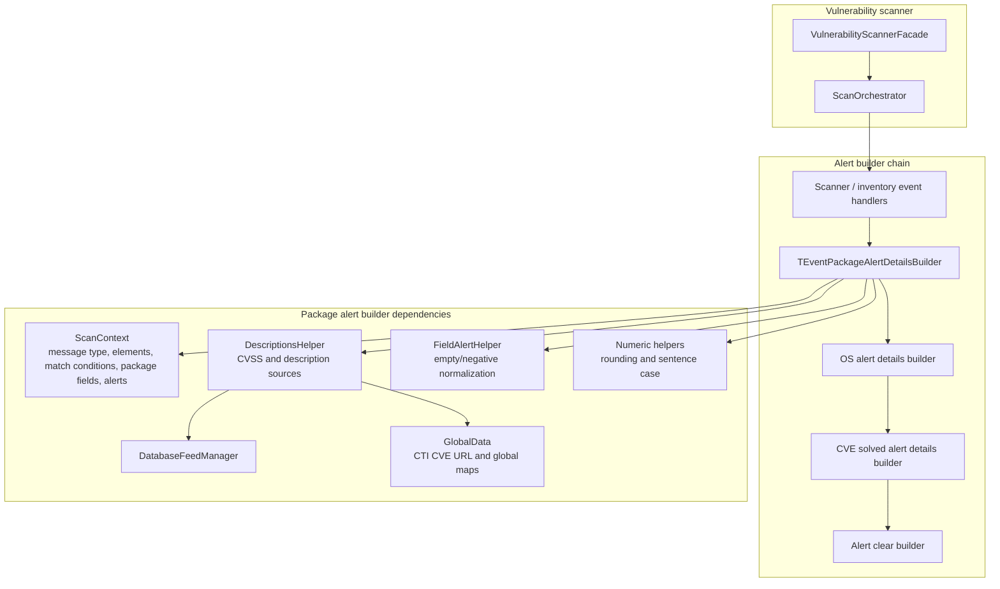
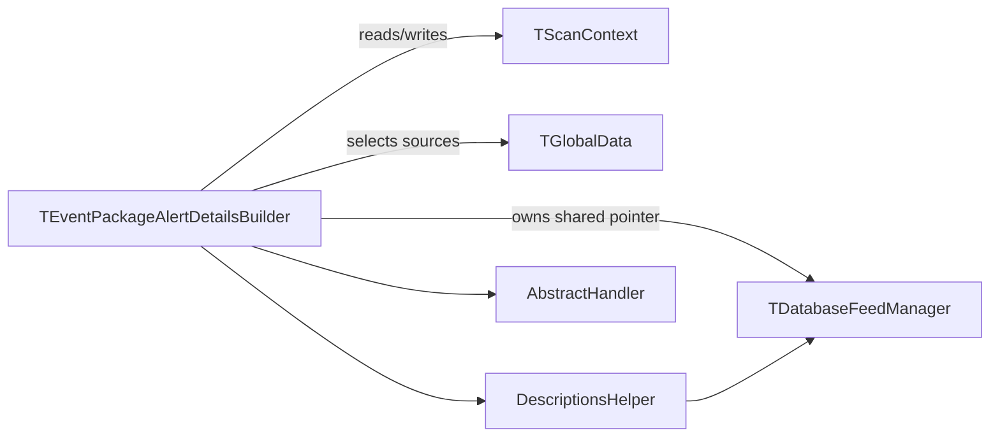
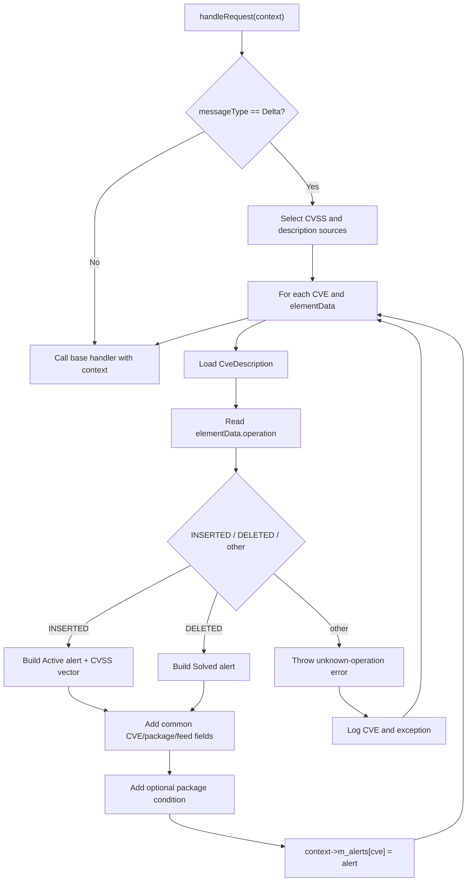
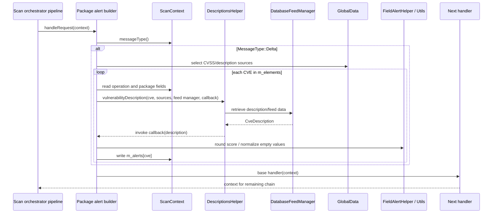

# Scan Orchestrator — Package Alert Details Builder

## Introduction

The **Package Alert Details Builder** is the package-vulnerability branch of the Wazuh vulnerability scanner's scan-orchestrator alert-building chain. It converts a package inventory delta plus vulnerability-feed metadata into a normalized alert document for one or more CVEs.

The component is implemented by the header-only template `TEventPackageAlertDetailsBuilder` in `src/wazuh_modules/vulnerability_scanner/src/scanOrchestrator/eventPackageAlertDetailsBuilder.hpp`. It handles real-time database-sync deltas only. Insertions produce **Active** package vulnerability alerts; deletions produce **Solved** alerts. The builder enriches each alert with CVSS, package, publication, severity, classification, and reference information, then passes the context to the next handler.

This page focuses on the package-alert handler. The surrounding alert-builder family is documented in [scan_orchestrator_alert_builders.md](scan_orchestrator_alert_builders.md), while the sibling OS, solved-alert, and clear-alert handlers are covered by [scan_orchestrator_alert_builders_handlers_os_alerts.md](scan_orchestrator_alert_builders_handlers_os_alerts.md), [scan_orchestrator_alert_builders_handlers_solved_alerts.md](scan_orchestrator_alert_builders_handlers_solved_alerts.md), and [scan_orchestrator_alert_builders_handlers_clear_alerts.md](scan_orchestrator_alert_builders_handlers_clear_alerts.md).

## Module location and role

| Item | Value |
|---|---|
| Module | `scan_orchestrator_alert_builders_handlers_package_alerts` |
| Parent module | `scan_orchestrator_alert_builders_handlers` |
| Source | `src/wazuh_modules/vulnerability_scanner/src/scanOrchestrator/eventPackageAlertDetailsBuilder.hpp` |
| Primary type | `TEventPackageAlertDetailsBuilder<TDatabaseFeedManager, TScanContext, TGlobalData>` |
| Default alias | `EventPackageAlertDetailsBuilder` |
| Design pattern | Chain of Responsibility handler |
| Input | `std::shared_ptr<TScanContext>` |
| Output | The same context, with entries added to `context->m_alerts` |

The handler is deliberately a builder rather than a scanner. Package/CVE matching and context population occur earlier in the scan-orchestrator pipeline. This class consumes the resulting CVE elements, retrieves human-readable vulnerability details, and shapes the alert payload.

## Responsibilities

The builder performs five related jobs:

1. **Gate by message type.** It does work only when `context->messageType()` is `MessageType::Delta`.
2. **Resolve CVE descriptions.** For every CVE in `context->m_elements`, it asks `DescriptionsHelper::vulnerabilityDescription` to obtain a `CveDescription` from the configured database feed manager and global vulnerability sources.
3. **Interpret the delta operation.** The `operation` field is mapped from `INSERTED` to `ElementOperation::Insert`, `DELETED` to `ElementOperation::Delete`, and any other value to `Unknown`.
4. **Build the alert document.** It creates an alert under `context->m_alerts[cve]`, using the operation to select Active or Solved semantics.
5. **Continue the chain.** Whether the message is a delta or not, it invokes the base handler with the context so subsequent handlers can process it.

## Architecture



The chain is assembled by the broader scan-orchestrator factory/pipeline. This file defines the package-specific handler only; it does not define chain construction, inventory synchronization, or index/report delivery. See [scan_orchestrator_pipeline.md](scan_orchestrator_pipeline.md) for pipeline orchestration and [vulnerability_scanner_facade.md](vulnerability_scanner_facade.md) for process-level ownership.

## Template and dependency model

`TEventPackageAlertDetailsBuilder` is parameterized to support production implementations and test doubles:

```cpp
template<typename TDatabaseFeedManager = DatabaseFeedManager,
         typename TScanContext = ScanContext,
         typename TGlobalData = GlobalData>
class TEventPackageAlertDetailsBuilder final
    : public AbstractHandler<std::shared_ptr<TScanContext>>
```

The constructor receives a shared pointer to the database feed manager and stores it as `m_databaseFeedManager`. `TGlobalData` is used when selecting CVSS/description sources and when resolving the CTI CVE reference. The base `AbstractHandler` supplies chain continuation.



## Input contract: `ScanContext`

For a package delta, the implementation expects the context to provide:

| Context member/API | Use in this handler |
|---|---|
| `messageType()` | Determines whether the handler runs; only `MessageType::Delta` is processed. |
| `m_vulnerabilitySource` | Selects vulnerability description/CVSS sources. |
| `m_elements` | Map of CVE identifier to delta data; each element must contain string field `operation`. |
| `m_matchConditions` | Optional CVE-to-condition map used to render package version conditions. |
| `packageSource()` | Populates `vulnerability.package.source`. |
| `packageName()` | Used in the alert title and package metadata. |
| `packageArchitecture()` | Populates package architecture. |
| `packageVersion()` | Populates package version. |
| `m_alerts` | Destination map keyed by CVE. |

The source comment also identifies the expected match conditions as `LessThanOrEqual`, `LessThan`, `DefaultStatus`, and `Equal`. Missing or malformed element data is isolated per CVE by the exception handler; it is logged and does not prevent later CVEs or later chain handlers from running.

## Processing flow



### Description lookup

For each CVE, the handler calls `DescriptionsHelper::vulnerabilityDescription` with:

- the CVE identifier;
- sources from `cvssAndDescriptionSources<TGlobalData>(context->m_vulnerabilitySource)`;
- the stored database feed manager;
- a callback receiving `const CveDescription&`.

The callback contains all alert-shaping logic. Consequently, a missing feed description, malformed operation, or another exception is handled at the CVE boundary and logged as `Error building event details for CVE`.

## Alert document model

Every successfully built alert receives the common fields below:

```text
vulnerability.cve
vulnerability.enumeration = "CVE"
vulnerability.scanner.reference = WAZUH_CTI_CVES_URL + cve
vulnerability.package.architecture
vulnerability.package.name
vulnerability.package.source
vulnerability.package.version
vulnerability.published
vulnerability.updated
vulnerability.reference
vulnerability.severity
vulnerability.classification
vulnerability.score.base
vulnerability.score.version
vulnerability.type = "Packages"
```

The values come from the context and `CveDescription`. Empty or negative values for severity, classification, and score fields are passed through `FieldAlertHelper::fillEmptyOrNegative`; the base score is rounded to two decimal places with `Utils::floatToDoubleRound`. Severity is also converted to sentence case.

### Inserted package: Active alert

For `INSERTED`, the builder sets:

```text
vulnerability.status = "Active"
vulnerability.title = "<CVE> affects <package name>"
vulnerability.assigner
vulnerability.cwe_reference
vulnerability.rationale
```

If a CVSS version is present, it creates `vulnerability.cvss.cvss2` or `vulnerability.cvss.cvss3`, depending on the first character of `description.scoreVersion` after the `cvss` prefix. The common impact fields are always included. CVSS 2 adds `access_complexity` and `authentication`; CVSS 3 adds `attack_vector`, `privileges_required`, `scope`, and `user_interaction`. The rounded base score is stored at `vulnerability.cvss.<version>.base_score`.

### Deleted package: Solved alert

For `DELETED`, the builder sets:

```text
vulnerability.status = "Solved"
vulnerability.title = "<CVE> affecting <package name> was solved"
```

The implementation still appends common CVE, package, feed, score, and reference fields. It does not build the inserted-event CVSS vector or Active-only assigner/CWE/rationale fields in the deletion branch.

## Match-condition rendering

When `m_matchConditions` contains the current CVE, the condition is translated into a human-readable package constraint:

| Match rule | Generated value |
|---|---|
| `LessThanOrEqual` | `Package less than or equal to <version>` |
| `LessThan` | `Package less than <version>` |
| `DefaultStatus` | `Package default status` |
| `Equal` | `Package equal to <version>` |

Unknown conditions are not written; the handler emits a debug log. If there is no condition entry for the CVE, `vulnerability.package.condition` is omitted.

## Component interaction



The database feed manager is read through `DescriptionsHelper`; the package builder does not directly define feed storage or CVE parsing. Likewise, the resulting `m_alerts` map is consumed by later pipeline/index/report components, not emitted by this class itself.

## Error handling and edge cases

- **Non-delta messages:** no package alert is created, but chain processing continues.
- **Unknown operation:** an exception is raised for that CVE and logged. The context is not populated for that CVE.
- **Missing description/feed data:** exceptions from the description lookup are logged per CVE.
- **Empty CVSS version:** CVSS vector fields are skipped, while common score fields are still normalized and written.
- **Unknown match condition:** the condition field is skipped and a debug message is emitted.
- **Multiple CVEs:** each CVE is processed independently; one failure does not abort the outer loop.
- **Existing alert key:** assignment to `m_alerts[cve]` replaces the value for that CVE.

## Relationship to neighboring modules

The package handler participates in a larger vulnerability-scanner architecture:

- [scan_orchestrator_alert_builders.md](scan_orchestrator_alert_builders.md) — common alert-builder family and shared helpers.
- [scan_orchestrator_alert_builders_handlers_os_alerts.md](scan_orchestrator_alert_builders_handlers_os_alerts.md) — OS vulnerability alert branch.
- [scan_orchestrator_alert_builders_handlers_solved_alerts.md](scan_orchestrator_alert_builders_handlers_solved_alerts.md) — solved-CVE alert details branch.
- [scan_orchestrator_alert_builders_handlers_clear_alerts.md](scan_orchestrator_alert_builders_handlers_clear_alerts.md) — alert-clear branch.
- [scan_orchestrator_alert_builders_helpers.md](scan_orchestrator_alert_builders_helpers.md) — `DescriptionsHelper`, `CveDescription`, and field normalization helpers.
- [scan_orchestrator_scanners.md](scan_orchestrator_scanners.md) — package/OS scanning and match context creation.
- [database_feed_manager.md](database_feed_manager.md) — vulnerability-feed access and description data.
- [version_matcher.md](version_matcher.md) — package-version comparison strategies used upstream.
- [vulnerability_scanner_facade.md](vulnerability_scanner_facade.md) — lifecycle and system integration boundary.

These links keep this page centered on alert construction instead of duplicating scanner matching, feed management, pipeline assembly, and delivery behavior.

## Maintenance notes

When changing this handler, preserve the following contracts:

1. Keep Delta gating so full scans are not treated as real-time package events.
2. Keep `m_alerts` keyed by CVE and retain the common package/CVE fields expected by downstream index/report code.
3. Update both Active and Solved title/status paths when changing package identity formatting.
4. Add CVSS-version-specific fields only under the corresponding `cvss2` or `cvss3` object.
5. Preserve per-CVE exception isolation and chain continuation.
6. Keep score rounding and empty/negative normalization consistent with the shared helpers.

