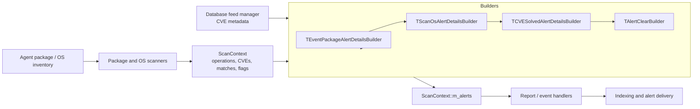
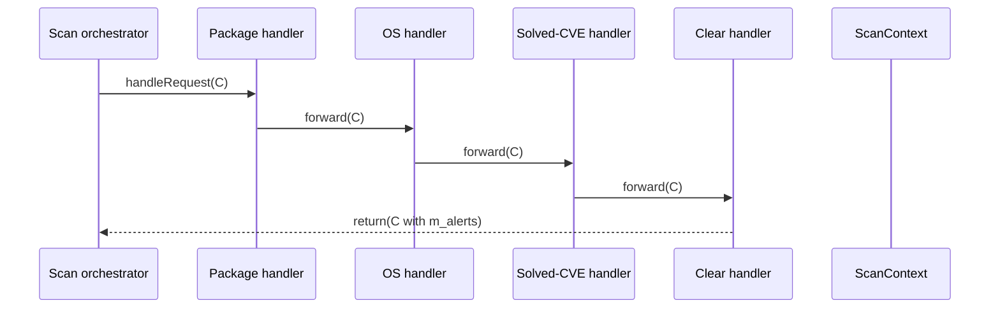
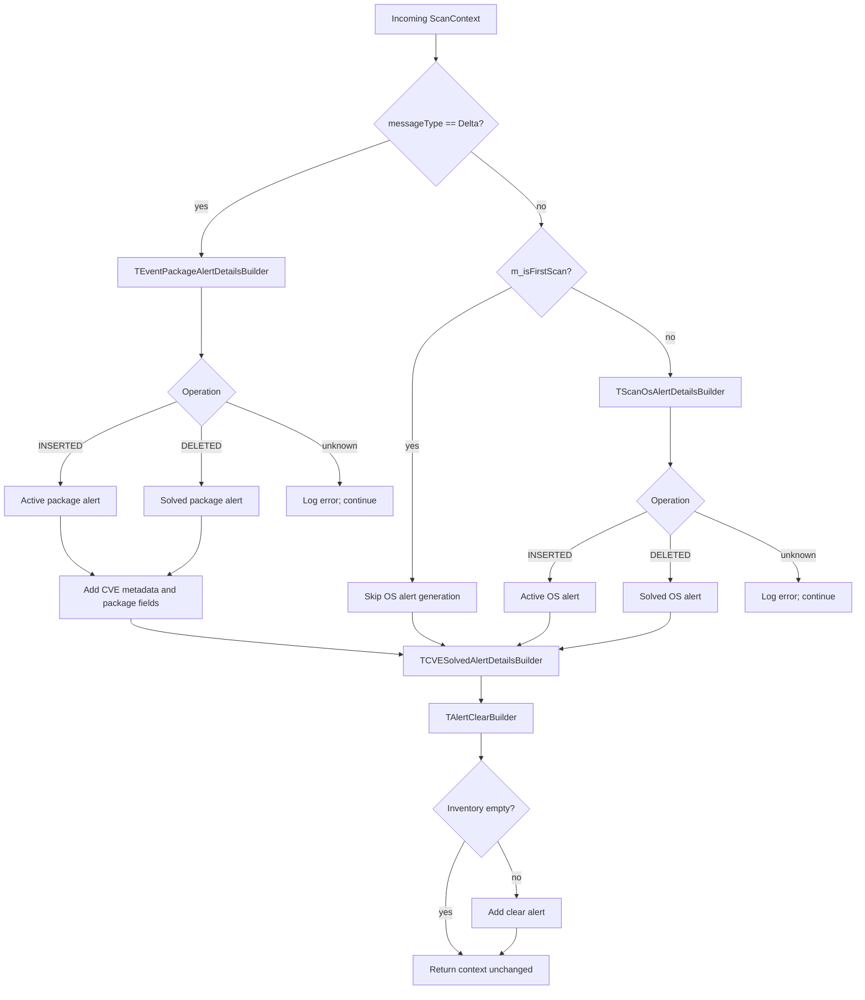
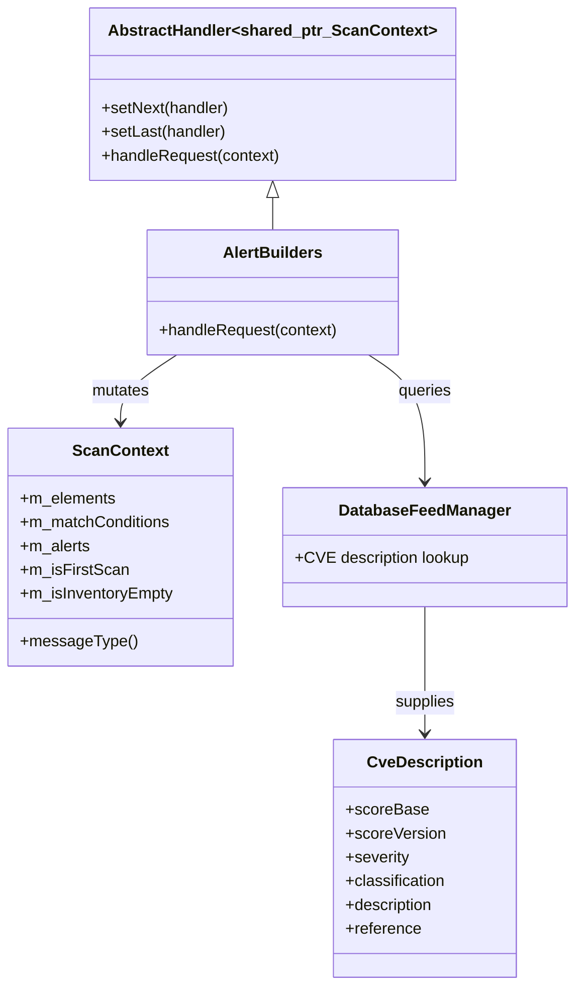

# Scan Orchestrator Alert Builders and Handlers

## Purpose

This module contains the alert-building handlers used by Wazuh’s vulnerability-scanner scan orchestrator. The handlers consume a shared scan context, obtain CVE metadata from the database feed manager, construct normalized vulnerability JSON, store it in `ScanContext::m_alerts`, and pass the context to the next handler in a Chain of Responsibility.

The module covers four alert cases:

- active or solved package vulnerability events;
- active or solved operating-system vulnerability events;
- solved CVEs reported by delta/inventory events;
- a package-inventory clear alert when the inventory is not empty.

The implementation is header-only and template-based, allowing tests or alternate integrations to inject compatible database-feed-manager and scan-context types.

## Position in the vulnerability-scanner architecture

The builders sit after scanning and matching have populated the scan context and before downstream reporting/indexing sends generated alerts to Wazuh’s event pipeline.

## Shared handler contract

Every builder derives from `AbstractHandler<std::shared_ptr<ScanContext>>`. Its `handleRequest` method receives a mutable shared context, conditionally adds or updates alert JSON, calls the base implementation, and forwards the context to the next handler.

Important context inputs are `m_elements` (CVE-keyed delta data), `m_matchConditions` (package-version rules), `m_vulnerabilitySource`, `m_isFirstScan`, `m_isInventoryEmpty`, package/OS identity accessors, and the output map `m_alerts`.

CVE metadata is represented by `CveDescription`, which supplies CVSS data, CWE, severity, classification, dates, references, and rationale. Empty or unusable scalar fields are normalized through `FieldAlertHelper::fillEmptyOrNegative`; scores are rounded before insertion.

## Handler documentation

| Handler | Responsibility | Detailed documentation |
|---|---|---|
| `TEventPackageAlertDetailsBuilder` | Builds active and solved package alerts for delta events, including package identity, CVSS vectors, and match conditions. | [Package alert builder](scan_orchestrator_alert_builders_handlers_package_alerts.md) |
| `TScanOsAlertDetailsBuilder` | Builds active and solved OS alerts from inventory changes, while skipping the first/baseline scan. | [OS alert builder](scan_orchestrator_alert_builders_handlers_os_alerts.md) |
| `TCVESolvedAlertDetailsBuilder` | Builds solved-CVE alerts for delta events where a hotfix resolves one or more packages. | [Solved-CVE alert builder](scan_orchestrator_alert_builders_handlers_solved_alerts.md) |
| `TAlertClearBuilder` | Emits a `Clear` packages alert when inventory exists; suppresses it for an empty inventory. | [Clear alert builder](scan_orchestrator_alert_builders_handlers_clear_alerts.md) |

## Alert-generation flow

Exceptions raised while looking up or rendering a CVE are caught per CVE. The handler logs the failure and continues processing other CVEs, preserving partial results.

## JSON conventions

Generated alerts use the `vulnerability` object and commonly include status (`Active`, `Solved`, or `Clear`), a context-specific title, CVE and CTI references, publication/update dates, severity, classification, base score/version, package or OS identity, and `type: "Packages"`.

The clear alert is keyed by `clear`, while CVE alerts are keyed by their CVE identifier. CVSS vectors are emitted only when feed data provides a score version. Match conditions are rendered as human-readable package conditions.

## Dependencies and extension points

Template parameters make the builders straightforward to unit-test: provide a fake feed manager and a compatible context, then assert the resulting `m_alerts` and chain forwarding behavior. Replacements must preserve the context fields and accessors used by the relevant handler.

## Operational considerations

- Package and solved-CVE handlers intentionally limit some work to delta messages.
- OS alerts are suppressed for the first scan so baseline creation does not generate noise.
- Empty feed fields are represented consistently instead of being silently omitted.
- Unknown inventory operations and feed lookup failures are logged per CVE.
- The clear alert is suppressed when inventory is empty because other inventory/integrity events already represent that state.
