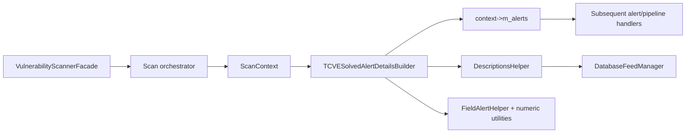
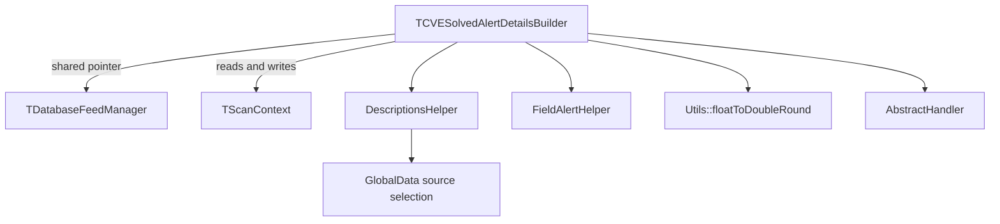
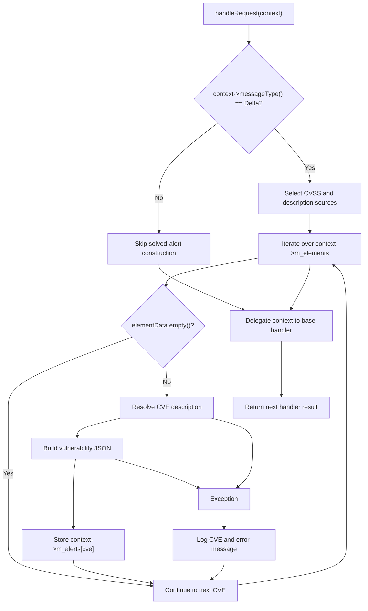
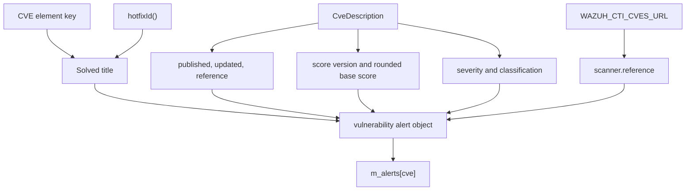
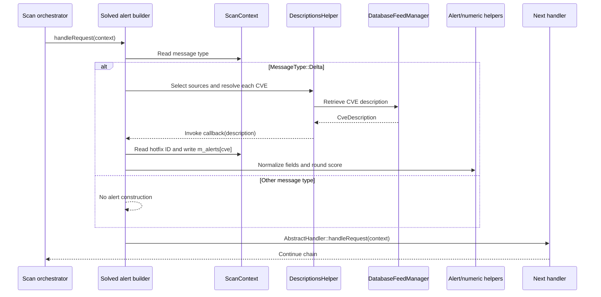

# Scan Orchestrator — Solved Alert Details Builder

## Introduction

The **Solved Alert Details Builder** creates vulnerability alerts that describe a CVE resolved by a hotfix. It is one handler in the Wazuh vulnerability scanner’s scan-orchestrator alert-building chain.

The implementation is the header-only template `TCVESolvedAlertDetailsBuilder` in `src/wazuh_modules/vulnerability_scanner/src/scanOrchestrator/cveSolvedAlertDetailsBuilder.hpp`. It processes only real-time database-sync delta contexts, looks up CVE metadata through the vulnerability feed manager, builds a normalized `Solved` alert, and forwards the context to the next chain handler.

This page documents the solved-alert branch only. The sibling package and OS alert handlers are documented in [scan_orchestrator_alert_builders_handlers_package_alerts.md](scan_orchestrator_alert_builders_handlers_package_alerts.md) and [scan_orchestrator_alert_builders_handlers_os_alerts.md](scan_orchestrator_alert_builders_handlers_os_alerts.md). Process ownership and service lifecycle are covered by [vulnerability_scanner_facade.md](vulnerability_scanner_facade.md), while feed lookup ownership is covered by [database_feed_manager.md](database_feed_manager.md).

## Module identity

| Item | Value |
|---|---|
| Module | `scan_orchestrator_alert_builders_handlers_solved_alerts` |
| Parent area | `scan_orchestrator_alert_builders_handlers` |
| Source | `src/wazuh_modules/vulnerability_scanner/src/scanOrchestrator/cveSolvedAlertDetailsBuilder.hpp` |
| Primary type | `TCVESolvedAlertDetailsBuilder<TDatabaseFeedManager, TScanContext>` |
| Production alias | `CVESolvedAlertDetailsBuilder` |
| Pattern | Chain of Responsibility |
| Input/output | `std::shared_ptr<TScanContext>`; the same context is returned |
| Output | An entry in `context->m_alerts` for each eligible CVE |

## Role in the scanner

The broader scanner facade owns and connects the feed manager, scan orchestrator, event pipeline, indexer, and report delivery. This handler is a formatting stage inside that flow; it does not perform package scanning, vulnerability matching, feed synchronization, indexing, or report transmission. See [vulnerability_scanner_facade.md](vulnerability_scanner_facade.md) for those system-level responsibilities.



The handler is complementary to the active package and OS alert builders: those components describe vulnerability findings produced by their respective scan branches, while this component describes a resolved CVE based on a hotfix. Their detailed behavior is documented in the linked sibling pages.

## Template and dependencies

```cpp
template<typename TDatabaseFeedManager = DatabaseFeedManager,
         typename TScanContext = ScanContext>
class TCVESolvedAlertDetailsBuilder final
    : public AbstractHandler<std::shared_ptr<TScanContext>>
```

The template parameters support production implementations and test doubles:

| Parameter | Purpose |
|---|---|
| `TDatabaseFeedManager` | Supplies CVE description data through `DescriptionsHelper`. |
| `TScanContext` | Carries message type, vulnerability source, CVE elements, hotfix ID, and output alerts. |

The constructor stores the supplied `std::shared_ptr<TDatabaseFeedManager>` in `m_databaseFeedManager`. The builder does not create or own the feed manager’s wider lifecycle.



`GlobalData` is used through `DescriptionsHelper::cvssAndDescriptionSources<GlobalData>` to select the CVSS and description sources for the context’s vulnerability source. `FieldAlertHelper` normalizes empty or negative values, and the numeric utility rounds scores.

## Input contract

The implementation reads the following context APIs or members:

| Context value | Use |
|---|---|
| `messageType()` | The handler runs only for `MessageType::Delta`. |
| `m_vulnerabilitySource` | Selects the CVE description and CVSS source set. |
| `m_elements` | Map of CVE identifiers to delta data. Empty element data is skipped. |
| `hotfixId()` | Identifies the remediation in the generated alert title. |
| `m_alerts` | Destination map keyed by CVE. |

The source does not inspect an operation field in the delta. Solved-alert generation is selected by the message type and the presence of non-empty CVE element data. The exact shape of the element payload is therefore established by earlier scan-orchestrator stages, not by this builder.

## Processing flow



For every non-empty CVE entry, the handler invokes:

```text
DescriptionsHelper::vulnerabilityDescription(
    cve,
    descriptionSources,
    m_databaseFeedManager,
    callback)
```

The callback receives a `CveDescription` and performs the alert construction. Exceptions are caught inside the per-CVE loop. A failure for one CVE is logged and does not prevent subsequent CVEs from being processed.

## Alert construction

The generated document is assigned to `context->m_alerts[cve]`. The builder sets the following fields:

| JSON path | Value or source |
|---|---|
| `vulnerability.title` | `<CVE> affecting one or many packages was solved by <hotfixId>` |
| `vulnerability.package.name` | `one or many packages` |
| `vulnerability.status` | `Solved` |
| `vulnerability.cve` | Current CVE map key |
| `vulnerability.scanner.reference` | `WAZUH_CTI_CVES_URL + cve` |
| `vulnerability.enumeration` | `CVE` |
| `vulnerability.published` | `CveDescription::datePublished` |
| `vulnerability.updated` | `CveDescription::dateUpdated` |
| `vulnerability.reference` | `CveDescription::reference` |
| `vulnerability.type` | `Packages` |
| `vulnerability.severity` | Sentence-cased severity, normalized when empty/negative |
| `vulnerability.classification` | Classification, normalized when empty/negative |
| `vulnerability.score.base` | Rounded base score, normalized when empty/negative |
| `vulnerability.score.version` | CVSS score version, normalized when empty/negative |

### CVSS details

If `description.scoreVersion` is not empty, the handler derives a nested score key from its first character:

```text
scoreVersion = "cvss" + description.scoreVersion.substr(0, 1)
```

It then stores the rounded base score at:

```text
vulnerability.cvss.<scoreVersion>.base_score
```

For example, a score version beginning with `3` is placed under `vulnerability.cvss.cvss3.base_score`. The builder does not construct a CVSS vector here; it records the feed’s base score and the general score metadata used by the solved event.



## Component interaction



The base-handler call is unconditional. This preserves chain composition for non-delta messages and for contexts where this builder produced no alert.

## Error handling and invariants

- Only `MessageType::Delta` contexts produce solved alerts.
- Empty `elementData` entries are ignored.
- Feed lookup and JSON-building failures are caught per CVE and logged with the CVE identifier and exception message.
- The handler continues iterating after an error.
- The context is always passed to the next handler after local processing.
- `m_alerts` is keyed by CVE, so a later assignment for the same CVE replaces the existing JSON value.
- The hotfix identifier is part of the title, making the remediation event distinguishable from an active vulnerability alert.
- Empty or negative severity, classification, and score values are normalized through `FieldAlertHelper::fillEmptyOrNegative`.
- Base scores are rounded to two decimal places through `Utils::floatToDoubleRound`.

## Maintenance guidance

When modifying this handler:

1. Preserve the delta-only gate; non-real-time messages should not create solved alerts.
2. Keep the exception boundary inside the CVE loop so one bad feed record does not discard the complete delta batch.
3. Preserve the final `AbstractHandler::handleRequest` delegation.
4. Keep the title and `Solved` status aligned with downstream alert consumers.
5. Coordinate changes to feed lookup or global source selection with [database_feed_manager.md](database_feed_manager.md).
6. If alert schema changes, review the sibling package and OS handlers for consistent field semantics.

## Source reference

The complete implementation is in [cveSolvedAlertDetailsBuilder.hpp](src/wazuh_modules/vulnerability_scanner/src/scanOrchestrator/cveSolvedAlertDetailsBuilder.hpp).
