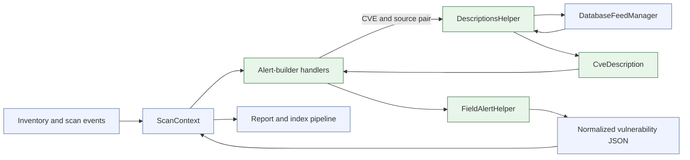
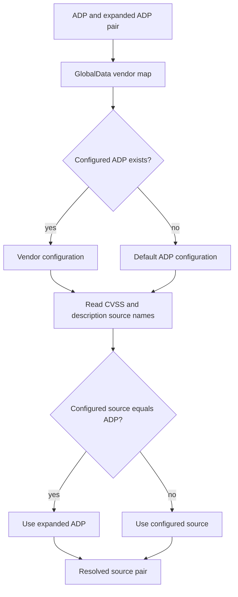
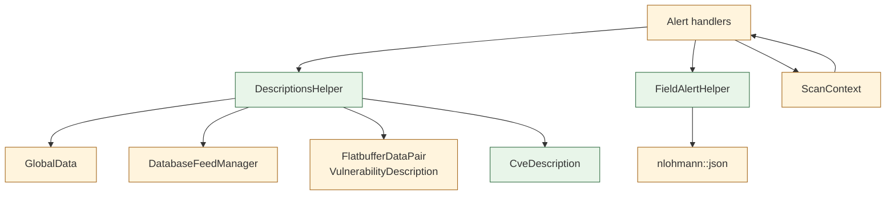
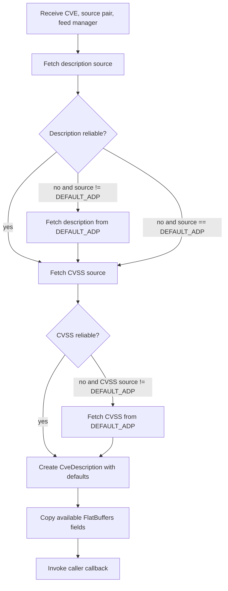
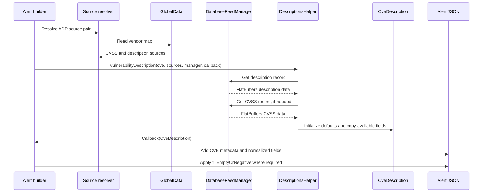

# Scan Orchestrator Alert Builders: Helpers

## Introduction

The **scan-orchestrator alert-builder helpers** provide the shared data and formatting support used when Wazuh vulnerability findings are converted into alert JSON. The module contains two header-only utilities:

- `FieldAlertHelper::fillEmptyOrNegative`, which normalizes empty strings and unusable numeric values before they are emitted in an alert.
- `CveDescription` and `DescriptionsHelper`, which model CVE metadata and retrieve reliable description/CVSS data from the configured vulnerability feed sources.

These helpers do not scan agents, match package versions, index results, or send reports. Those responsibilities remain with the scanner pipeline and alert handlers documented in [scan_orchestrator_alert_builders_handlers.md](scan_orchestrator_alert_builders_handlers.md), and with the wider scanner lifecycle documented in [vulnerability_scanner_facade.md](vulnerability_scanner_facade.md).

## Module identity

| Item | Description |
|---|---|
| Module | `scan_orchestrator_alert_builders_helpers` |
| Parent | `scan_orchestrator_alert_builders` |
| Sources | `fieldAlertHelper.hpp`, `descriptionsHelper.hpp` |
| Main namespace/type | `FieldAlertHelper`, `CveDescription`, `DescriptionsHelper` |
| Implementation style | Header-only templates and value object |
| Main consumers | Package, OS, solved, and clear alert handlers |

## Role in the vulnerability-scanner architecture

Alert handlers receive a populated `ScanContext`, ask `DescriptionsHelper` for CVE metadata, and use `FieldAlertHelper` while constructing normalized JSON. The resulting alert remains owned by the context and is later consumed by report/index stages.



The feed manager’s ownership, FlatBuffers data access, and content update lifecycle are documented in [database_feed_manager.md](database_feed_manager.md). The handler-specific alert schemas and chain behavior are documented in [scan_orchestrator_alert_builders_handlers.md](scan_orchestrator_alert_builders_handlers.md) and its package, OS, solved, and clear subdocuments.

## Components

### `FieldAlertHelper::fillEmptyOrNegative`

File: `src/wazuh_modules/vulnerability_scanner/src/scanOrchestrator/fieldAlertHelper.hpp`

`fillEmptyOrNegative` is a compile-time-dispatched function template returning `nlohmann::json`. It accepts string-like or arithmetic values and produces an alert-safe placeholder when the value is unusable.

| Input category | Normalization | Otherwise |
|---|---|---|
| Empty `std::string` / `std::string_view` | `"-"` | Original string |
| Floating-point value with absolute value below `1e-9` | `-1.0` | Original value |
| Integral value below zero | `-1` | Original value, including zero |
| Unsupported type | Compile-time assertion | Not accepted |

The function forwards non-placeholder values, allowing callers to preserve the original value category where possible. Its `constexpr if` branches are selected at compile time, so unsupported types are rejected during compilation rather than through a runtime type switch. The header’s documentation describes the policy as “zero/negative”; the implementation specifically treats floating-point values near zero and integral values below zero, while integral zero is preserved.

The shared CTI URL constant is also declared in this header:

```text
WAZUH_CTI_CVES_URL = https://cti.wazuh.com/vulnerabilities/cves/
```

Alert handlers use this base URL when constructing the scanner reference for a CVE; the handlers themselves own the complete alert shape.

### `CveDescription`

File: `src/wazuh_modules/vulnerability_scanner/src/scanOrchestrator/descriptionsHelper.hpp`

`CveDescription` is a lightweight aggregate containing the description and CVSS fields needed by alert builders. Most fields are `std::string_view`, while `scoreBase` is a `float`. Defaults deliberately represent missing feed data:

- strings default to an empty view;
- timestamps default to `0000-01-01T00:00:00Z`;
- the base score defaults to `0.0f`.

The fields cover CVSS access and impact metrics, assigner/CWE metadata, publication and update dates, human-readable description and reference, severity/classification, score version, and the feed `offset`. The aggregate does not own copied strings; its views refer to the underlying feed data while the callback consumes the result.

### `DescriptionsHelper::cvssAndDescriptionSources`

This helper resolves the vendor-specific source pair used for a CVE. It reads the ADP description map from `GlobalData::instance().vendorMaps()` and selects the configured CVSS and description sources. If the requested ADP is not configured, the default ADP configuration is used. When a configured source points back to the ADP itself, the expanded ADP is substituted.



### `DescriptionsHelper::vulnerabilityDescription`

This templated function retrieves the two feed records needed to build a `CveDescription`: one for descriptive metadata and one for CVSS metrics. The database feed manager is injected as a shared pointer, and results are delivered through a callback so the caller can build its alert within the lookup operation.

## Dependency relationships



The helpers are intentionally independent of the scanner’s lifecycle and transport components. They do not directly depend on the indexer, router, inventory harvester, or version matcher. See [version_matcher_dispatch.md](version_matcher_dispatch.md) for version comparison responsibilities and [vulnerability_scanner_facade.md](vulnerability_scanner_facade.md) for component wiring.

## CVE retrieval and fallback flow

`vulnerabilityDescription` applies reliability checks independently to description and CVSS data.



The reliability rules are:

- description data is unreliable when absent or when its description is exactly `"not defined"`;
- CVSS data is unreliable when absent, when `scoreBase() < 0.01f`, or when severity is empty;
- the default ADP is used as a fallback when the selected source is not already the default;
- when CVSS and description sources are identical, one retrieved record is reused for both roles;
- missing individual fields do not abort the operation: only non-empty feed strings overwrite the aggregate defaults.

## Data flow into an alert



The callback boundary keeps feed retrieval separate from alert formatting. For example, package and OS handlers decide whether an alert is active or solved and which package/OS fields to add; the helper only supplies normalized CVE metadata. See [scan_orchestrator_alert_builders_handlers_package_alerts.md](scan_orchestrator_alert_builders_handlers_package_alerts.md) and [scan_orchestrator_alert_builders_handlers_os_alerts.md](scan_orchestrator_alert_builders_handlers_os_alerts.md) for those consumers.

## Operational considerations

- **Lifetime:** `CveDescription` contains non-owning views. The callback should consume or serialize the object while the underlying FlatBuffers/feed data remains valid.
- **Missing data:** callers should expect empty strings, default timestamps, and a zero score when the feed cannot provide a field. Alert handlers commonly normalize these values before output.
- **Fallback logging:** failed retrievals and unreliable records are logged at debug level; fallback failure does not throw by itself.
- **Type safety:** `fillEmptyOrNegative` is intended for strings and arithmetic values only. Passing a different type is a compile-time error.
- **No direct transport:** report delivery, indexing, inventory synchronization, and scanner lifecycle are outside this module.

## References

- [Scan Orchestrator Alert Builders: Handlers](scan_orchestrator_alert_builders_handlers.md)
- [Package alert handlers](scan_orchestrator_alert_builders_handlers_package_alerts.md)
- [OS alert handlers](scan_orchestrator_alert_builders_handlers_os_alerts.md)
- [Solved alert handlers](scan_orchestrator_alert_builders_handlers_solved_alerts.md)
- [Clear alert handlers](scan_orchestrator_alert_builders_handlers_clear_alerts.md)
- [Database Feed Manager](database_feed_manager.md)
- [Vulnerability Scanner Facade](vulnerability_scanner_facade.md)
- [Version matcher dispatch](version_matcher_dispatch.md)
