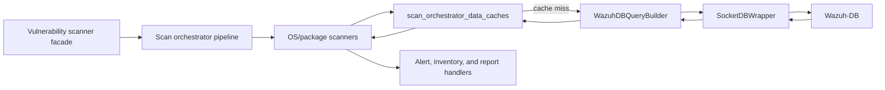
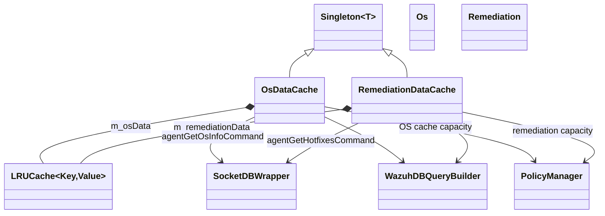
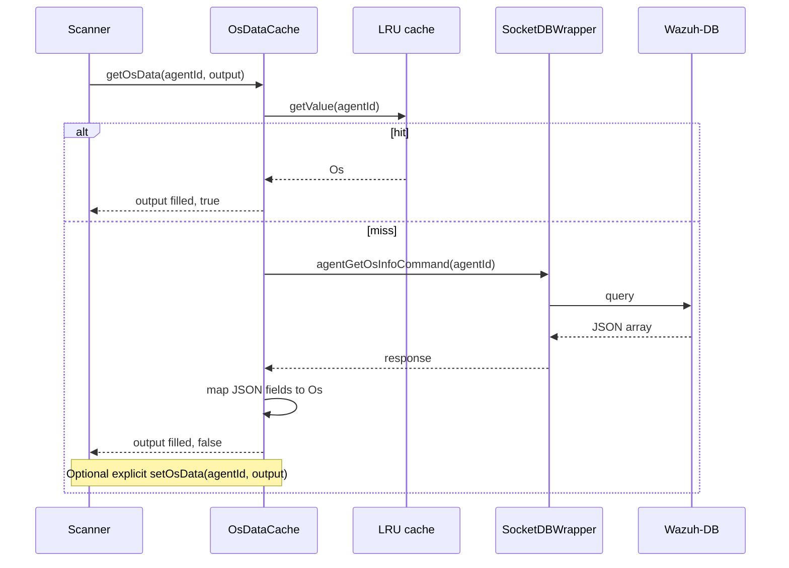
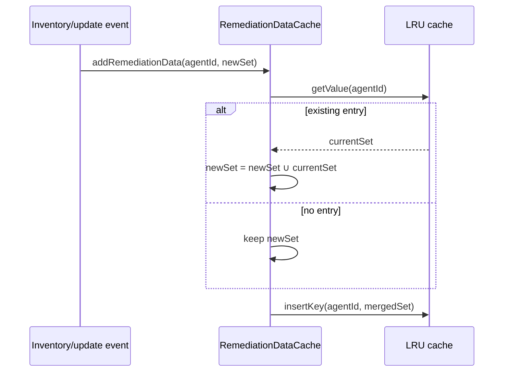
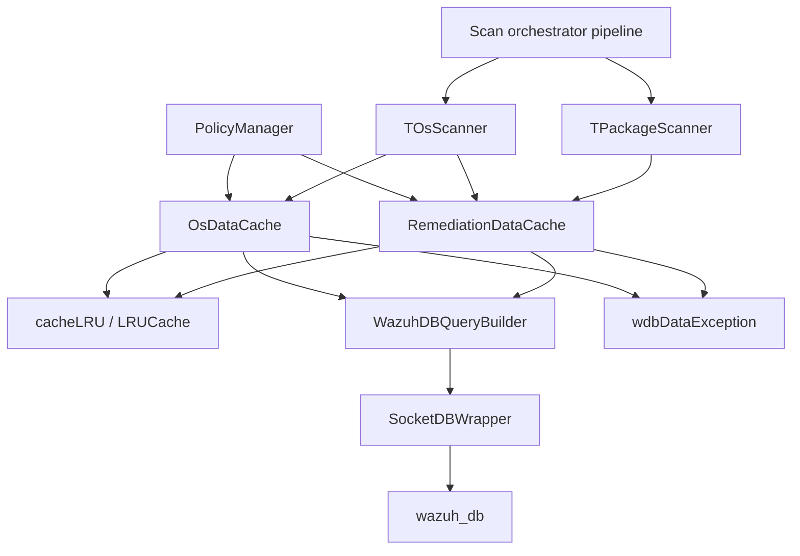

# `scan_orchestrator_data_caches`

## Introduction

The `scan_orchestrator_data_caches` module provides bounded, thread-safe in-memory caches for agent data needed during vulnerability scanning. It contains two independent singleton caches:

- `OsDataCache`, which stores normalized operating-system metadata by agent ID.
- `RemediationDataCache`, which stores installed Windows hotfixes by agent ID.

On a cache miss, both components query Wazuh-DB through `SocketDBWrapper`. The resulting data is converted from JSON into small domain structures used by the scan-orchestrator scanners. The caches reduce repeated database socket queries while keeping memory usage bounded through LRU eviction.

The module is part of the vulnerability-scanner subsystem described in [scan_orchestrator_scanners](scan_orchestrator_scanners.md). Scanner matching, feed lookup, and result reporting remain in the neighboring scanner and pipeline modules.

## Position in the system



The facade owns the scanner lifecycle and event integration; see [vulnerability_scanner_facade](vulnerability_scanner_facade.md). Feed content and vulnerability candidates are owned by [database_feed_manager](database_feed_manager.md), not by these caches. The persistence endpoint is the Wazuh-DB daemon documented in [wazuh_db](wazuh_db.md), accessed through the database socket wrapper described in [socket_networking_db_wrapper](socket_networking_db_wrapper.md).

## Architecture



Each cache is a class template so tests or specialized builds can inject an alternative socket database wrapper. The default template argument is `SocketDBWrapper`. The cache classes are final and expose only the operations needed by scanner code; the underlying LRU implementation and database transport are reused infrastructure.

## Data structures

### `Os`

`Os` is a value object containing the agent’s host, platform, operating-system, and kernel information. Its fields are populated from the first object returned by the Wazuh-DB OS-information query:

| `Os` field | Wazuh-DB JSON field | Meaning |
|---|---|---|
| `hostName` | `hostname` | Agent hostname |
| `architecture` | `architecture` | CPU/system architecture |
| `name` | `os_name` | OS name |
| `codeName` | `os_codename` | Distribution codename |
| `majorVersion` | `os_major` | Major OS version |
| `minorVersion` | `os_minor` | Minor OS version |
| `patch` | `os_patch` | Patch version |
| `build` | `os_build` | Build identifier |
| `platform` | `os_platform` | Platform identifier |
| `version` | `os_version` | Complete OS version |
| `release` | `os_release` | OS release string |
| `displayVersion` | `os_display_version` | Human-readable version |
| `sysName` | `sysname` | Kernel system name |
| `kernelVersion` | `version` | Kernel version |
| `kernelRelease` | `release` | Kernel release |
| `cpeName` | — | Reserved for a CPE built by scanner logic |

Missing JSON properties default to an empty string. `cpeName` is deliberately not read from Wazuh-DB; the source comment states that the scanner must construct it.

### `Remediation`

`Remediation` contains an `unordered_set<std::string>` named `hotfixes`. Each value is the identifier of an installed hotfix. A set removes duplicates both within a Wazuh-DB response and when new data is merged into an existing cache entry.

## `OsDataCache`

### Responsibilities and state

`OsDataCache` owns:

- `m_osData`, an `LRUCache<std::string, Os>` keyed by agent ID;
- `m_mutex`, protecting all cache access;
- a capacity obtained from `PolicyManager::instance().getOsdataLRUSize()`.

It inherits from `Singleton<OsDataCache<>>`, allowing scanner components to use one process-wide cache instance.

### Read path

`getOsData(agentId, osData)` first locks the cache and attempts an LRU lookup. On a hit it copies the cached `Os` into the caller-provided object and returns `true`.

On a miss, it builds `agentGetOsInfoCommand(agentId)`, sends the query through `TSocketDBWrapper::instance().query(...)`, parses the first JSON result, fills an `Os`, assigns it to the output parameter, and returns `false`.

An important behavior is that a miss result is **not inserted automatically**. The caller or a higher-level scan path must call `setOsData()` when it wants the fetched value retained. This makes cache population explicit and permits callers to control when a newly fetched OS identity becomes reusable.



### Write path

`setOsData(agentId, osData)` locks the cache and calls `insertKey`. Inserting a new value updates the LRU ordering; if the configured capacity is exceeded, the underlying `LRUCache` evicts its least-recently-used entry.

### Error behavior

- A `SocketDbWrapperException` is translated into `WdbDataException` with the agent ID attached.
- Any other exception becomes a `std::runtime_error` describing the agent and original reason.
- An empty Wazuh-DB response raises `WdbDataException("Empty OS data from Wazuh-DB.", agentId)`.

## `RemediationDataCache`

### Responsibilities and state

`RemediationDataCache` owns:

- `m_remediationData`, an `LRUCache<std::string, Remediation>` keyed by agent ID;
- `m_mutex`, protecting reads, writes, and merges;
- a capacity obtained from `PolicyManager::instance().getRemediationLRUSize()`.

It also inherits from `Singleton<RemediationDataCache<>>` and is used primarily by Windows vulnerability scanning to determine whether a finding is solved by an installed hotfix. The scanner-side use is covered in [complete_scan_orchestrator_scanners_os](complete_scan_orchestrator_scanners_os.md).

### Read path

`getRemediationData(agentId)` checks the LRU first. A hit returns the stored set directly. On a miss it builds `agentGetHotfixesCommand(agentId)` and queries Wazuh-DB.

The response is treated as a collection: every object containing a `hotfix` property contributes that value to the set. An empty response is valid and represents an agent with no installed hotfixes; it returns an empty `Remediation` and is not cached. Non-empty results are inserted into the LRU before being returned.

```mermaid
flowchart TD
    A[getRemediationData(agentId)] --> B{LRU hit?}
    B -- yes --> C[Return cached hotfix set]
    B -- no --> D[Build agentGetHotfixesCommand]
    D --> E[Query Wazuh-DB]
    E --> F{Response empty?}
    F -- yes --> G[Return empty Remediation]
    F -- no --> H[Collect hotfix values into unordered_set]
    H --> I[Insert non-empty result into LRU]
    I --> J[Return Remediation]
```

### Incremental merge path

`addRemediationData(agentId, newRemediationData)` is intended for newly received or incrementally discovered hotfix information. Under the mutex it looks up the existing entry, inserts all existing hotfixes into the new set, and stores the merged value. Therefore, the operation is additive and does not discard previously known hotfixes.



### Error behavior

The Wazuh-DB error policy matches `OsDataCache`:

- `SocketDbWrapperException` becomes `WdbDataException` with the agent ID.
- Other exceptions become an agent-specific `std::runtime_error`.
- Empty hotfix results are normal and do not raise an exception.

## Concurrency and consistency

Both classes serialize cache operations with `std::scoped_lock`. The lock is held only around LRU access or mutation; the Wazuh-DB query occurs outside the cache lock. This avoids blocking other agents’ cache operations during socket I/O.

The resulting consistency model is deliberately lightweight:

- concurrent misses can issue duplicate Wazuh-DB queries because there is no per-agent single-flight mechanism;
- `OsDataCache` uses explicit write-back after a miss;
- `RemediationDataCache` writes non-empty query results automatically;
- `addRemediationData` merges rather than replaces hotfix sets;
- LRU eviction can remove any cached agent data, after which the next request re-queries Wazuh-DB.

The cache values are snapshots. They do not subscribe directly to inventory events or invalidate entries themselves; event-driven refresh and scanner orchestration are owned by neighboring modules.

## Dependency relationships



The direct scanner dependency is intentionally narrow: cache classes provide agent-scoped data, while scanners decide how OS values, CPEs, versions, and hotfixes affect vulnerability candidates. See [scan_orchestrator_scanners](scan_orchestrator_scanners.md) for those matching rules and [version_matcher](version_matcher.md) for version comparison implementations.

## Operational considerations

- Cache sizes are policy-driven, so deployments should tune `PolicyManager` values according to agent count and memory constraints.
- OS data may be stale until explicitly refreshed and written with `setOsData()`.
- Empty remediation data is not retained, so agents without hotfixes may cause repeated Wazuh-DB queries until a non-empty set is available.
- Hotfix sets grow monotonically when updated through `addRemediationData`; eviction is the only built-in way to discard old entries.
- Database failures are surfaced to callers rather than silently converted to empty data. Callers should preserve the distinction between “no hotfixes” and “could not query Wazuh-DB.”

## Source map

| Component | Source | Role |
|---|---|---|
| `Os` / `OsDataCache` | `src/wazuh_modules/vulnerability_scanner/src/scanOrchestrator/osDataCache.hpp` | OS value model, Wazuh-DB lookup, LRU storage |
| `Remediation` / `RemediationDataCache` | `src/wazuh_modules/vulnerability_scanner/src/scanOrchestrator/remediationDataCache.hpp` | Hotfix value model, lookup, merge, LRU storage |
| Scanner consumers | `src/wazuh_modules/vulnerability_scanner/src/scanOrchestrator/osScanner.hpp`, `packageScanner.hpp` | Vulnerability candidate evaluation and remediation filtering |
| Query construction | `src/shared_modules/utils/wazuhDBQueryBuilder.hpp` | Builds agent OS and hotfix commands |
| Database transport | `src/shared_modules/utils/socketDBWrapper.hpp` | Sends queries to Wazuh-DB |

