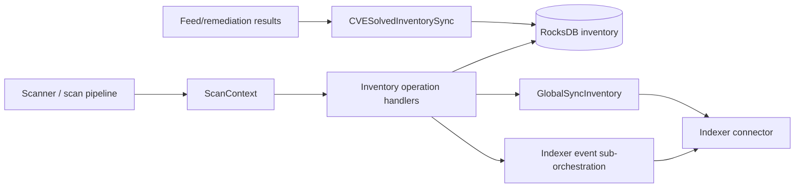
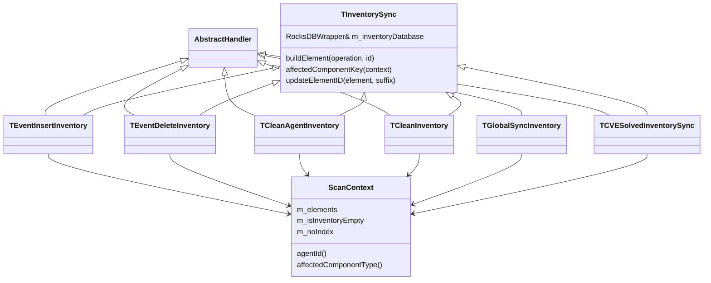
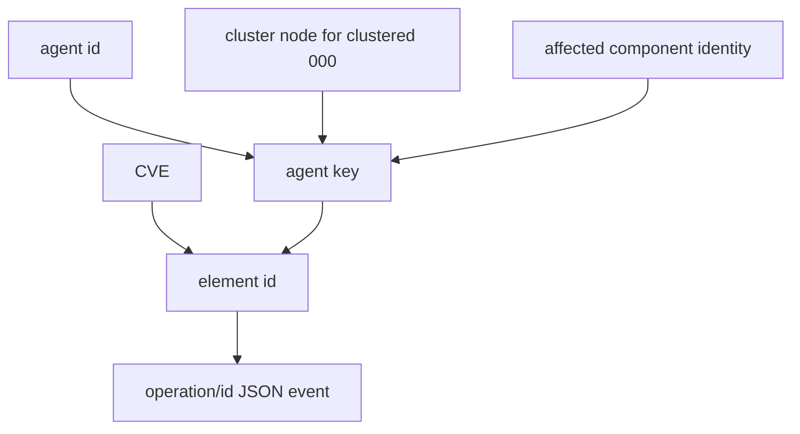
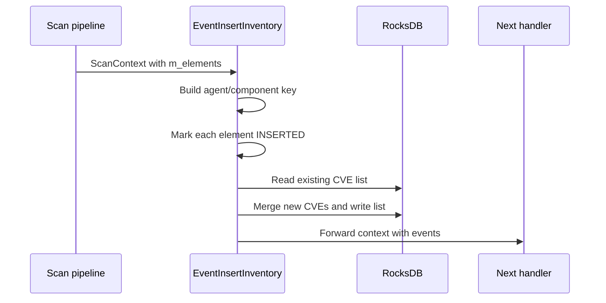
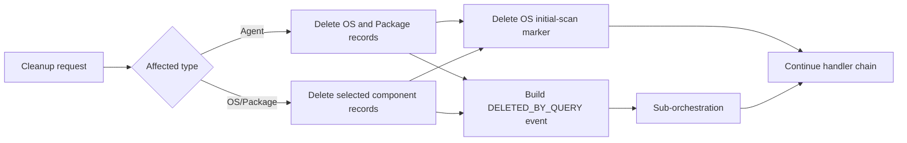

# Scan Orchestrator Inventory Operations

## Purpose

`scan_orchestrator_inventory_ops` is the inventory-state boundary of Wazuh's vulnerability-scanner scan orchestrator. It maintains the RocksDB inventory of operating-system and package vulnerability associations, turns changes into indexer events, removes stale inventory, and requests agent-level index synchronization.

The module is composed of chain-of-responsibility handlers. Each handler receives a shared `ScanContext`, performs one inventory operation, and forwards the context to the next handler.

## Position in the system

The module sits between vulnerability-scanner workflows and two persistence/output systems:

The surrounding vulnerability scanner owns feed ingestion and vulnerability matching; this module owns the durable inventory representation and synchronization side effects. The adjacent scanner and alert-builder documentation should be consulted for those responsibilities.

## Architecture

## Inventory data model and keys

`TInventorySync` initializes three RocksDB columns:

| Column | Meaning |
|---|---|
| `os` | Per-agent OS identity mapped to a comma-separated CVE list |
| `package` | Per-agent package identity mapped to a comma-separated CVE list |
| `os_initial_scan` | Marker/data for the initial OS scan |

Agent keys are normally prefixed with `<agent-id>_`. For clustered manager agent `000`, the node name is prepended: `<cluster-node>_000_`. An affected-component suffix is then appended: OS uses OS identity, packages use package item ID, and hotfixes use hotfix ID. Individual indexer element IDs extend the inventory key with `_<cve>`.

## Handler responsibilities

Detailed component documentation is split across the generated submodule references below. The supplemental consolidated reference is [scan_orchestrator_inventory_ops_details.md](scan_orchestrator_inventory_ops_details.md).

- [Shared inventory synchronization](scan_orchestrator_inventory_ops_inventory_sync_core.md)
- [Inventory mutation handlers](scan_orchestrator_inventory_ops_inventory_mutation_handlers.md)
- [Inventory cleanup handlers](scan_orchestrator_inventory_ops_inventory_cleanup_handlers.md)
- [Global inventory synchronization](scan_orchestrator_inventory_ops_inventory_global_sync.md)
- [Solved-CVE inventory synchronization](scan_orchestrator_inventory_ops_inventory_cve_solved_sync.md)
- [Generated submodule overview](scan_orchestrator_inventory_ops_scan_orchestrator_inventory_ops.md)

| Handler | Responsibility |
|---|---|
| `TInventorySync` | Shared columns, key derivation, and `{operation,id}` event construction. |
| `TEventInsertInventory` | Adds newly observed CVEs to an agent/component list and emits `INSERTED` element descriptions. |
| `TEventDeleteInventory` | Removes one agent/component inventory record and emits `DELETED` descriptions for each CVE. |
| `TCleanAgentInventory` | Clears all or one component type for one agent; emits a `DELETED_BY_QUERY` event and clears initial-scan data when appropriate. |
| `TCleanInventory` | Clears OS/package inventory for every agent and emits per-element `DELETED` events. |
| `TGlobalSyncInventory` | Calls the indexer connector's `sync()` for the affected agent key. |
| `TCVESolvedInventorySync` | Removes CVEs remediated by a hotfix and emits deletion events while retaining unrelated CVEs. |

## Typical flows

### Package or OS insertion

### Agent/component cleanup

### Solved CVE processing

`TCVESolvedInventorySync` scans package records for the agent, removes matching CVEs, deletes empty records, or rewrites reduced CVE lists. It appends a `DELETED` event for each removed `<inventory-key>_<cve>` element.

## Integration and invariants

- All handlers use the same `ScanContext` and can be composed in different chains.
- RocksDB stores compact comma-separated CVE lists; indexer events carry one element ID per CVE.
- Cleanup operations must produce corresponding indexer deletion events to avoid stale vulnerability documents.
- Clustered agent `000` key construction must remain consistent across insert, delete, cleanup, and global sync operations.
- `m_noIndex` is copied into cleanup sub-contexts so callers can suppress indexing consistently.
- The shared inventory constructor creates missing columns, making handlers safe to initialize against a new database.

## Source files

All implementation files are under `src/wazuh_modules/vulnerability_scanner/src/scanOrchestrator/`:

`inventorySync.hpp`, `eventInsertInventory.hpp`, `eventDeleteInventory.hpp`, `cleanAgentInventory.hpp`, `cleanInventory.hpp`, `globalSyncInventory.hpp`, and `cveSolvedInventorySync.hpp`.
