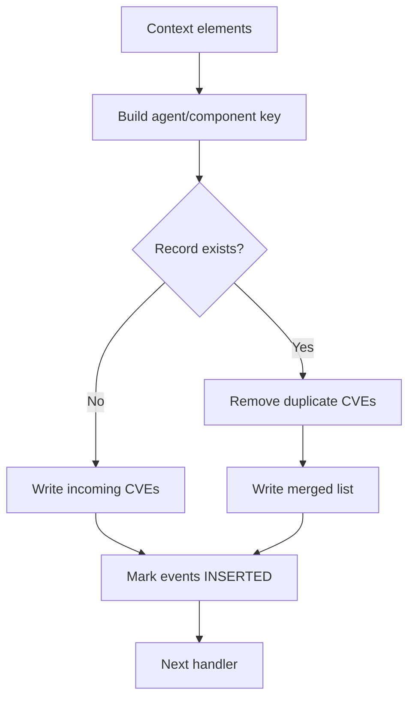
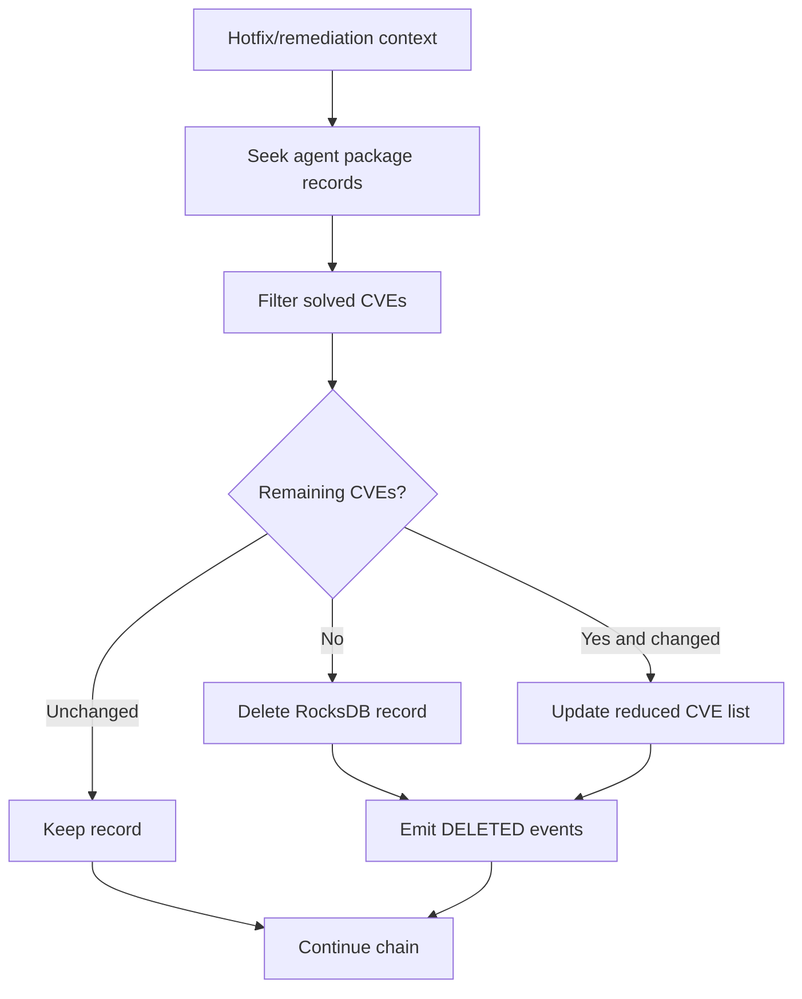

# Scan Orchestrator Inventory Operations — Detailed Components

## Shared base: `TInventorySync`

`TInventorySync` owns the reference to `Utils::RocksDBWrapper` and establishes the inventory schema. The `os` and `package` columns contain agent/component keys whose values are comma-separated CVE identifiers; `os_initial_scan` is a separate column for initial-scan state.

`buildElement()` standardizes indexer payloads as `{ "operation": ..., "id": ... }`. `affectedComponentKey()` selects the OS name, package item ID, or hotfix ID from `ScanContext`. `appendAffectedComponentKey()` builds the longer persistence key, including OS version where applicable. `updateElementID()` appends a suffix to an existing event ID.

## Insert: `TEventInsertInventory`

The handler builds the agent/component key and converts every context element into an `INSERTED` event. It reads the existing CVE list from the selected `os` or `package` column, filters duplicates, and writes the merged list. If no record exists, it creates one from the incoming CVEs. The context is then forwarded.

## Delete one record: `TEventDeleteInventory`

This handler resolves one agent/component record, creates a `DELETED` event for each CVE in the record, deletes the record from RocksDB, and forwards the context. It is used for OS removal or package-level inventory removal.

## Clear one agent: `TCleanAgentInventory`

`TCleanAgentInventory` supports agent-wide cleanup and component-specific cleanup. For an `Agent` request it deletes both OS and package records; for OS or package requests it deletes only that column's records. It sets `m_isInventoryEmpty`, removes OS initial-scan data for OS/Agent cleanup, and invokes a supplied sub-orchestration with a `DELETED_BY_QUERY` event. This lets the indexer remove all matching documents efficiently.

## Clear all agents: `TCleanInventory`

The handler iterates the OS and package columns using RocksDB `deleteAll`. For every key/value pair it expands the comma-separated CVE list into unique element IDs and invokes the sub-orchestration with `DELETED` events. It then clears the `os_initial_scan` column. The incoming context is only used to propagate flags such as `m_noIndex` into generated sub-contexts.

## Global synchronization: `TGlobalSyncInventory`

`TGlobalSyncInventory` does not mutate RocksDB. It derives the agent key, including the clustered-manager prefix for agent `000`, and calls `IndexerConnector::sync(key)`. It then continues the handler chain. This is the final or synchronization-specific bridge from local inventory state to the indexer.

## Solved CVEs: `TCVESolvedInventorySync`

This handler processes remediation contexts containing CVEs solved by a hotfix. It searches package inventory records for the agent, removes each matching CVE, and emits a `DELETED` event with the package-record key plus CVE. Empty records are deleted; partially changed records are rewritten with the remaining CVEs.

## Composition model

All concrete handlers implement `handleRequest(std::shared_ptr<TScanContext>)`. The base `AbstractHandler` owns continuation behavior; handlers perform local work and call the base implementation with the moved context. Cleanup handlers additionally own a sub-orchestration used to publish bulk or per-element changes.

## Maintenance notes

- Keep key construction identical across all handlers; a mismatch creates orphaned RocksDB data or stale indexer documents.
- Preserve duplicate suppression during insertion.
- When deleting or remediating inventory, emit events before/alongside database mutation so downstream index synchronization has the affected IDs.
- Any new affected component type must update the component-key logic and its RocksDB column mapping together.
