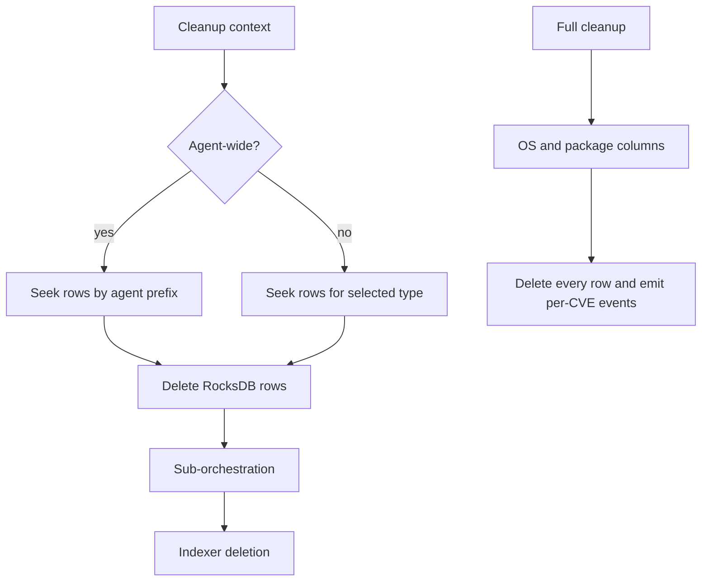

# Inventory Cleanup Handlers

## Scope

`TCleanAgentInventory` and `TCleanInventory` remove persisted vulnerability inventory and invoke a supplied sub-orchestration to publish deletion events.

## Agent/component cleanup

`TCleanAgentInventory` scans rows by agent prefix. For `Agent`, it removes OS and package rows; for a specific affected type, it removes only that column’s rows. It emits `DELETED_BY_QUERY` for whole-agent cleanup, sets `m_isInventoryEmpty`, and removes OS initial-scan state for agent/OS cleanup.

## Full cleanup

`TCleanInventory` iterates the OS and package columns, deletes every matching row, and emits one `DELETED` event per CVE using the unique row/CVE key. It then clears `os_initial_scan`.

The sub-orchestration is an injected handler, keeping persistence cleanup separate from index publication.

## Source files

- `src/wazuh_modules/vulnerability_scanner/src/scanOrchestrator/cleanAgentInventory.hpp`
- `src/wazuh_modules/vulnerability_scanner/src/scanOrchestrator/cleanInventory.hpp`
