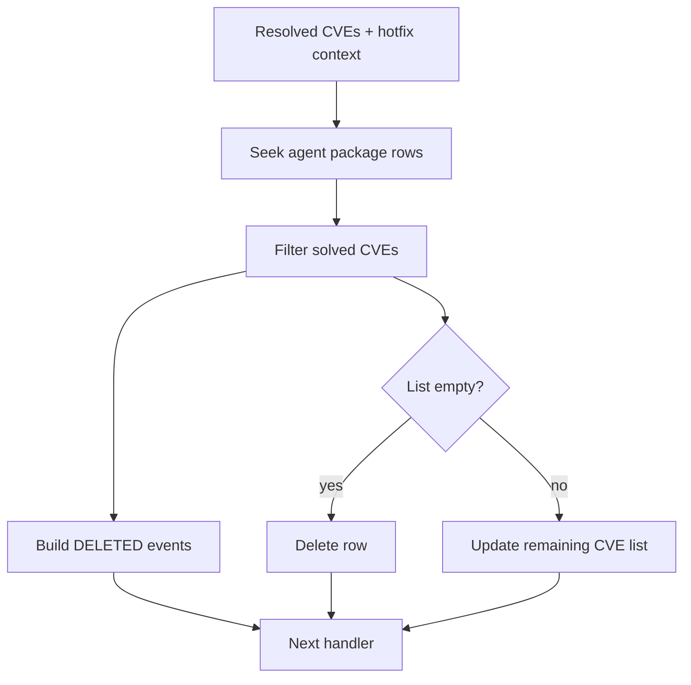

# Solved-CVE Inventory Synchronization

## Scope

`TCVESolvedInventorySync` synchronizes package inventory after a hotfix or other remediation solves one or more CVEs.

## Algorithm

1. Seek package inventory rows for the agent.
2. Split each row’s comma-separated CVE list.
3. Remove CVEs present in the incoming context.
4. Append a `DELETED` event for every removed CVE, using the row/CVE key.
5. Delete the row if empty, otherwise rewrite the reduced list.
6. Forward the context to the next handler.

Only the package column is inspected because solved vulnerability records are represented by package inventory entries. The handler logs the remediation relationship using the hotfix ID from the context.

## Source

`src/wazuh_modules/vulnerability_scanner/src/scanOrchestrator/cveSolvedInventorySync.hpp`
