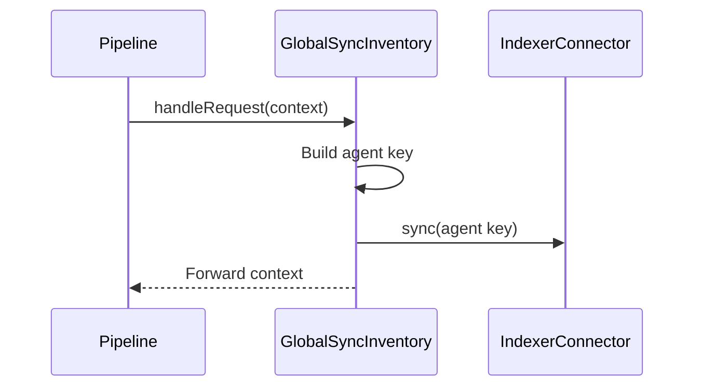

# Global Inventory Synchronization

`TGlobalSyncInventory<TIndexerConnector, TScanContext>` is a thin chain handler around the injected indexer connector. It derives the agent key, including the cluster-node prefix for clustered manager agent `000`, then calls `m_indexerConnector->sync(key)`.

The handler does not read or mutate RocksDB. It is intended to run after local inventory operations when the indexer must reconcile an agent’s complete inventory.

## Source

`src/wazuh_modules/vulnerability_scanner/src/scanOrchestrator/globalSyncInventory.hpp`
