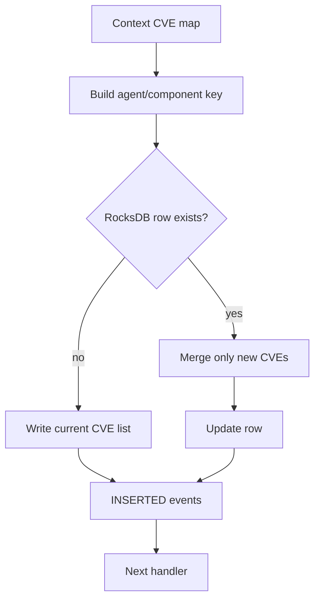

# Inventory Mutation Handlers

## Scope

This page covers `TEventInsertInventory` and `TEventDeleteInventory`. Both are chain-of-responsibility handlers and inherit the shared RocksDB/key behavior from `TInventorySync`.

## Insert/update: `TEventInsertInventory`

The handler creates an agent/component key, converts every context element into an `INSERTED` event whose ID includes the CVE, and merges CVEs into the component row. Existing CVEs are retained; duplicate CVEs are not appended. A missing row is created from the current CVE set.

## Delete: `TEventDeleteInventory`

The handler reads the component row, creates one `DELETED` event for each stored CVE, deletes the row, and forwards the context. Missing rows are treated as a no-op.

## Storage behavior

Rows use comma-separated CVE identifiers. JSON is used for downstream event signaling, while RocksDB remains the source of the current inventory list.

## Source files

- `src/wazuh_modules/vulnerability_scanner/src/scanOrchestrator/eventInsertInventory.hpp`
- `src/wazuh_modules/vulnerability_scanner/src/scanOrchestrator/eventDeleteInventory.hpp`
