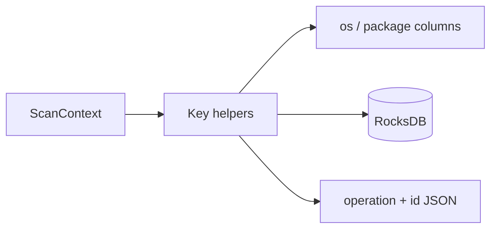

# Shared Inventory Synchronization

## Scope

`TInventorySync<TScanContext>` is the shared base for inventory mutation and cleanup handlers. It owns a reference to `Utils::RocksDBWrapper` and centralizes storage initialization, key construction, and event formatting.

## Responsibilities

- Ensures the `os`, `package`, and `os_initial_scan` columns exist during construction.
- Builds compact operation events with `operation` and `id` fields.
- Resolves the component identifier from `ScanContext`: OS name, package item ID, or hotfix ID.
- Builds an affected-component suffix using OS name/version, package ID, or hotfix ID.
- Provides `updateElementID()` for appending a suffix to an existing event ID.

Invalid contexts or component types throw `std::runtime_error`; callers therefore need to establish the affected component before entering the chain.

## Key conventions

The shared component key is used by insert, delete, cleanup, and solved-CVE handlers. Clustered manager agent `000` receives a `<cluster-node>_` prefix. CVE event IDs append `_<cve>` to the component key.

## Source

`src/wazuh_modules/vulnerability_scanner/src/scanOrchestrator/inventorySync.hpp`
