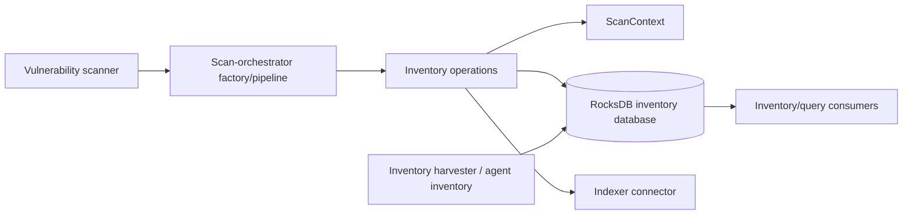
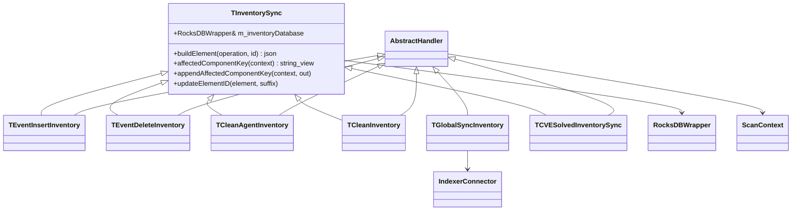
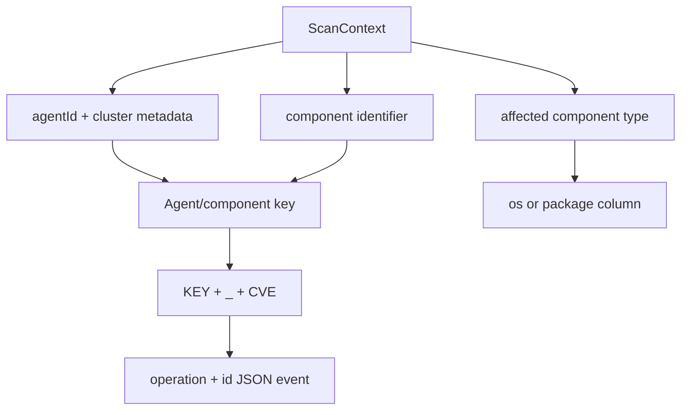

# Scan Orchestrator Inventory Operations

## Purpose

`scan_orchestrator_inventory_ops` contains the inventory side effects used by Wazuh’s vulnerability-scanner scan orchestration. Its handlers maintain a RocksDB-backed mapping from agent/component keys to CVE identifiers, convert inventory changes into `INSERTED`, `DELETED`, or `DELETED_BY_QUERY` events, and pass the scan context through a chain-of-responsibility pipeline.

The module is deliberately operational: vulnerability matching and alert construction belong to neighboring scan-orchestrator modules. This module persists the resulting inventory state and requests index synchronization.

## Position in the system



The module is a child of `vulnerability_scanner_module` in the wider `Advanced_Security_Modules_(C++_Inventory_&_Vulnerability)` tree. It shares `ScanContext`, the common chain handler, RocksDB wrappers, and the indexer connector with the surrounding scanner pipeline.

## Architecture

All event handlers receive `std::shared_ptr<TScanContext>`. Most handlers update `m_elements` with inventory events and then call the base handler, allowing the next pipeline stage to publish or process those events.



## Sub-modules

| Area | Responsibility | Documentation |
|---|---|---|
| Shared synchronization | Creates inventory columns and defines agent/component key conventions. | [Shared inventory synchronization](scan_orchestrator_inventory_ops_inventory_sync_core.md) |
| Mutation handlers | Adds or removes CVE lists for one agent and affected component. | [Inventory mutation handlers](scan_orchestrator_inventory_ops_inventory_mutation_handlers.md) |
| Cleanup handlers | Clears one agent, one component class, or the complete inventory and emits deletion work. | [Inventory cleanup handlers](scan_orchestrator_inventory_ops_inventory_cleanup_handlers.md) |
| Global synchronization | Requests an indexer synchronization for an agent key. | [Global inventory synchronization](scan_orchestrator_inventory_ops_inventory_global_sync.md) |
| Solved-CVE synchronization | Removes CVEs remediated by a hotfix and emits deletion events. | [Solved-CVE inventory synchronization](scan_orchestrator_inventory_ops_inventory_cve_solved_sync.md) |

## Data and key model

The constructor ensures RocksDB columns named `os`, `package`, and `os_initial_scan`. For an ordinary agent, a component key is assembled as:

```text
<agent-id>_<affected-component-key>
```

For clustered manager-agent `000`, the cluster node name is prefixed. Individual CVE event IDs extend that key with `_<cve>`. OS keys use the OS name/version context; package and hotfix keys use their item identifiers.



## Main flows

### Insert/update

`TEventInsertInventory` builds the agent/component key, updates each element ID with its CVE-specific key, then merges new CVEs with the existing comma-separated list in the component column. It leaves existing CVEs intact and forwards the context.

### Delete

`TEventDeleteInventory` reads the component’s CVE list, creates one deletion event per CVE, removes the component row, and forwards the context. If no row exists, it produces no deletion events.

### Cleanup

Agent cleanup scans rows by agent prefix and deletes them; full cleanup iterates both OS and package columns. Cleanup handlers invoke a sub-orchestration with deletion events so the indexer can remove corresponding documents. OS and agent cleanup also remove the `os_initial_scan` marker.

### Remediated CVEs

`TCVESolvedInventorySync` searches package inventory rows for CVEs listed in the current context, removes matching identifiers, deletes empty rows, updates partially reduced rows, and records deletion events for the resolved CVEs.

### Global index synchronization

`TGlobalSyncInventory` derives the agent key and calls the injected indexer connector’s `sync()` operation. It does not mutate RocksDB itself.

## Design and maintenance notes

- The classes are templates so tests and alternate orchestration contexts/connectors can be injected without changing the workflow.
- RocksDB columns store compact comma-separated CVE lists; event payloads use JSON only for downstream operations.
- The handlers assume a valid scan context and valid affected-component type. Invalid types are rejected by the shared key helpers.
- Cleanup is intentionally coupled to a sub-orchestration: deleting local rows without publishing deletion events would leave stale indexer documents.
- `TInventorySync` is the single place to update key and column conventions; changes there affect every mutation and cleanup handler.

## Related modules

- [Vulnerability scanner facade](vulnerability_scanner_facade.md) — module lifecycle and public integration boundary.
- [Alert builders](scan_orchestrator_alert_builders.md) — neighboring handlers that turn scan outcomes into alert details.
- [Solved-alert handlers](scan_orchestrator_alert_builders_handlers_solved_alerts.md) — downstream alert handling for remediated vulnerabilities.
