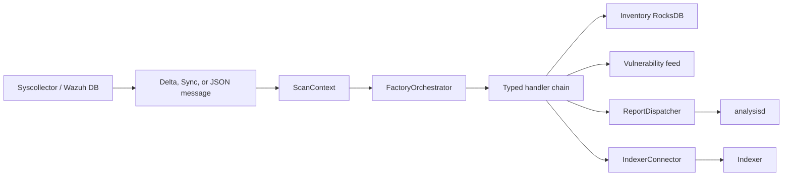
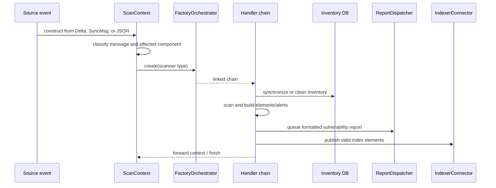

# Scan Orchestrator Pipeline

The scan orchestrator is the vulnerability-scanner’s workflow composition layer. It converts syscollector and Wazuh DB events into a typed `ScanContext`, selects a chain of responsibility for the event, updates vulnerability inventory, builds alerts, and publishes reports to analysisd and the indexer.

## Position in the system

The module is part of the broader [vulnerability scanner facade](vulnerability_scanner_facade.md), alongside the [database feed manager](database_feed_manager.md), [inventory harvester](inventory_harvester_module.md), [scanners](scan_orchestrator_scanners.md), [inventory operations](scan_orchestrator_inventory_ops.md), [alert builders](scan_orchestrator_alert_builders.md), [data caches](scan_orchestrator_data_caches.md), and [version matcher](version_matcher.md).

## Architecture

The module has three logical areas:

| Area | Responsibility | Documentation |
|---|---|---|
| Context and contracts | Normalizes message variants, identifies affected components, exposes inventory/alert state, and caches OS/hotfix metadata. | [Context and data contracts](scan_orchestrator_pipeline_scan_context.md) |
| Runtime handlers | Performs DB selection, hotfix expansion, report dispatch, and result publication. | [Runtime handlers](scan_orchestrator_pipeline_handlers.md) |
| Factory and assembly | Maps scanner types to concrete chains and injects shared services. | [Factory and pipeline assembly](scan_orchestrator_pipeline_factory.md) |

## End-to-end processing

## Key design properties

- A single context type makes FlatBuffers events and JSON control actions consumable by the same handler interface.
- Chains are assembled per event type, so cleanup, rescan, package, OS, hotfix, and integrity workflows can have different stages.
- Dependencies are injected through constructors and template parameters, which supports isolated unit testing.
- Inventory synchronization and alert publication are separate stages; indexing can be suppressed with the context’s `no-index` flag.
- Report and index publication are downstream side effects. Invalid individual payloads are logged while the chain continues where the handler permits it.

## Workflow catalog

See the factory documentation for complete chains. At a high level:

- Package insertion scans the package, updates inventory, builds package alerts, reports them, and indexes results.
- Package deletion removes inventory and emits solved/clear-related package results.
- OS events scan and synchronize OS inventory, build OS alerts, report them, and index results.
- Hotfix insertion resolves feed relationships and publishes array-shaped solved results.
- Integrity clears and cleanup actions remove stale inventory and may emit clear alerts.
- Rescans compose cleanup, agent selection, and reusable package/OS subchains.

## Documentation maintenance

1. Keep this overview limited to system role, relationships, diagrams, and links; update detailed behavior in the linked sub-module files when source headers change.
