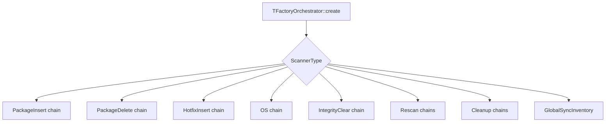
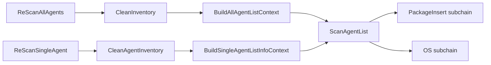

# Scan Orchestrator Pipeline: Factory and Pipeline Assembly

`TFactoryOrchestrator` in `factoryOrchestrator.hpp` is the composition root for vulnerability-scanner workflows. Its `create()` method maps a `ScannerType` to a linked chain of responsibility and injects shared database, feed, indexer, and reporting services.

## Construction model

`setLast()` appends a handler to the chain. The returned object is the first handler, while each subsequent handler receives the same shared `ScanContext` and forwards it. The factory is heavily templated so unit tests can replace every scanner, builder, connector, and context implementation.



## Chains by scanner type

### Package insert

```text
PackageScanner
  -> EventInsertInventory
  -> EventDetailsBuilder
  -> EventPackageAlertDetailsBuilder
  -> EventSendReport
  -> ResultIndexer
```

### Package delete

```text
EventDeleteInventory
  -> EventPackageAlertDetailsBuilder
  -> EventSendReport
  -> ResultIndexer
```

### Hotfix insert

```text
HotfixInsert
  -> CVESolvedInventorySync
  -> CVESolvedAlertDetailsBuilder
  -> EventSendReport
  -> ArrayResultIndexer
```

### Operating-system processing

```text
OsScanner
  -> ScanInventorySync(ResultIndexer)
  -> EventDetailsBuilder
  -> ScanOsAlertDetailsBuilder
  -> EventSendReport
  -> ResultIndexer
```

The nested `ResultIndexer` in `ScanInventorySync` allows inventory synchronization to publish its own results before alert construction completes.

### Integrity and cleanup

| Type | Chain |
|---|---|
| `IntegrityClear` | `CleanAgentInventory -> AlertClearBuilder -> ClearSendReport` |
| `CleanupAllAgentData` | `CleanInventory` |
| `CleanupSingleAgentData` | `CleanAgentInventory` |
| `GlobalSyncInventory` | `GlobalSyncInventory` |

### Rescans

Full rescans first clean all local inventory, build the complete agent list, then run package and OS chains through `ScanAgentList`. Single-agent rescans clean one agent, query agent metadata with `BuildSingleAgentListInfoContext`, then reuse the same package and OS subchains.



## Integration boundaries

- `DatabaseFeedManager` supplies vulnerability and remediation relationships. See [database feed manager](database_feed_manager.md).
- Inventory changes use the inventory-operation handlers documented in [inventory operations](scan_orchestrator_inventory_ops.md).
- Package and OS detection are delegated to [scanners](scan_orchestrator_scanners.md).
- Alert payload construction is delegated to [alert builders](scan_orchestrator_alert_builders.md).
- Publication uses the shared [indexer connector](indexer_connector.md) and report dispatcher.

An unsupported scanner type throws `std::runtime_error("Invalid scanner type")`; `HotfixDelete` currently has no chain and therefore returns an empty orchestration pointer.
