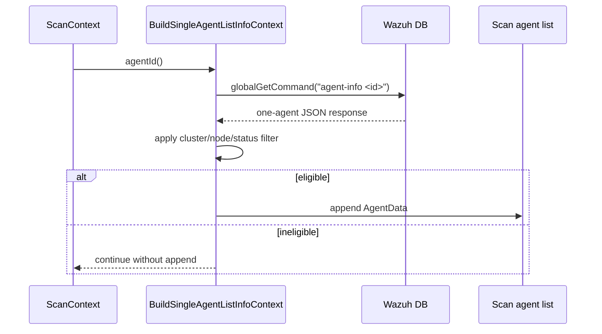
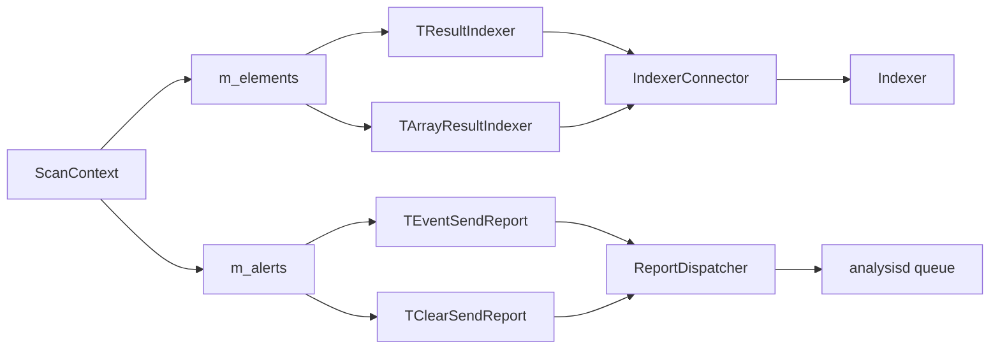

# Scan Orchestrator Pipeline: Runtime Handlers

The pipeline handlers implement the processing stages assembled by the factory. Each handler derives from `AbstractHandler<std::shared_ptr<TScanContext>>`, performs one operation, and forwards the context to the next handler through `handleRequest()`.

## Handler responsibilities

| Component | Responsibility | Main dependency |
|---|---|---|
| `TBuildSingleAgentListInfoContext` | Queries Wazuh DB for one agent and adds it to a rescan list when cluster/node/connection rules allow it. | `SocketDBWrapper`, `WazuhDBQueryBuilder` |
| `THotfixInsert` | Resolves vulnerabilities associated with an inserted hotfix and creates array result slots. | `DatabaseFeedManager`, remediation data |
| `TEventSendReport` | Serializes alert objects and queues vulnerability reports for analysisd. | `ReportDispatcher` |
| `TClearSendReport` | Publishes clear-alert payloads and logs cleanup scope. | `ReportDispatcher` |
| `TResultIndexer` | Adds `no-index` metadata and publishes valid `{operation,id}` elements. | `IndexerConnector` |
| `TArrayResultIndexer` | Publishes each element of array-valued results after validating `{operation,id}`. | `IndexerConnector` |

## Single-agent selection

`TBuildSingleAgentListInfoContext` sends a global `agent-info <id>` query. The returned agent is added when the manager is not clustered, or when its Wazuh cluster node matches the current node and its connection status is `active`. Versions are normalized by removing the `Wazuh ` prefix. Malformed responses and database failures become explicit exceptions.



## Hotfix processing

`THotfixInsert` exits without forwarding when there is no hotfix or no associated vulnerability. Otherwise it extracts CVE IDs from feed keys of the form `<hotfix>:<cve>` and initializes an array under each CVE in `m_elements`. The following inventory-sync and alert-builder stages populate those arrays.

## Reports and indexing

Both report handlers use the same wire envelope:

```text
LOCALFILE_MQ:[<agent-id>] (<agent-name>) <agent-ip>->vulnerability-detector:<json>
```

Reports are queued asynchronously. Per-item failures are logged and do not prevent other alert entries from being attempted.

`TResultIndexer` handles object-valued elements and adds `no-index` before publication. `TArrayResultIndexer` handles array-valued elements and does not add that field itself; array producers are expected to provide the required index metadata. Both reject payloads without `operation` or `id`.



## Related modules

- [Alert builders](scan_orchestrator_alert_builders.md)
- [Inventory operations](scan_orchestrator_inventory_ops.md)
- [Database feed manager](database_feed_manager.md)
- [Indexer connector](indexer_connector.md)
