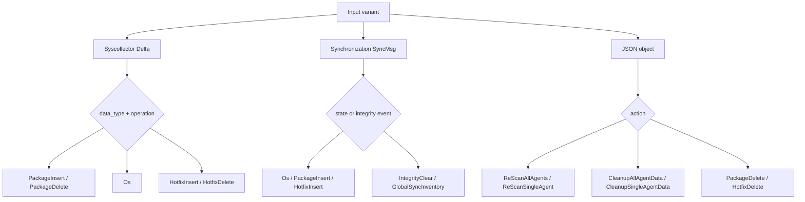

# Scan Orchestrator Pipeline: Context and Data Contracts

The context layer normalizes the inputs consumed by the vulnerability-scanner pipeline. It accepts FlatBuffers syscollector deltas, synchronization messages, or JSON control messages and exposes a common set of getters and mutable work collections to downstream handlers.

## Core components

### `TScanContext`

Defined in `src/wazuh_modules/vulnerability_scanner/src/scanOrchestrator/scanContext.hpp`, `TScanContext` is a templated, final context object. The default alias is `ScanContext`.

Its template parameters allow tests or alternate deployments to substitute the OS cache, global-data provider, and remediation cache:

```text
TScanContext<TOsDataCache, TGlobalData, TRemediationDataCache>
```

The context stores the original message as a `std::variant` and classifies it into `MessageType`, `ScannerType`, and `AffectedComponentType`.

### Message classification



Delta messages are interpreted from syscollector dbsync providers. Sync messages represent inventory state or integrity operations. JSON objects are control events and must contain a recognized `action`; unknown formats and actions throw `std::runtime_error`.

Recognized JSON actions include `reboot`, `cleanup`, `scanAgent`, `upgradeAgentDB`, `deletePackage`, `deleteHotfix`, and `deleteAgent`. The `no-index` property is copied into the context and later propagated to indexer payloads.

## Normalized data access

`extractData()` dispatches getter logic according to the active message type. Package getters expose name, version, vendor, installation time, location, architecture, groups, description, size, priority, multiarch, source, format, and item ID. Agent getters expose ID, name, IP, and version. OS and hotfix getters expose normalized inventory details.

Agent IDs are padded to three characters and cached. Agent ID `000` resolves its name from the manager name in global data. OS information is cached through `OsDataCache`; hotfix insert events also update `RemediationDataCache`.

## OS CPE construction

`buildCPEName()` maps the detected OS name/platform to a configured CPE template from `GlobalData`. Template variables such as `$(VERSION)`, `$(RELEASE)`, and major/minor variants are substituted, then the result is lower-cased. Unsupported operating systems produce an empty CPE.

## Mutable pipeline state

Handlers communicate through these public context members:

| Member | Purpose |
|---|---|
| `m_elements` | Inventory/indexing elements keyed by vulnerability or entity ID. |
| `m_alerts` | Alert payloads waiting for analysisd publication. |
| `m_matchConditions` | Version or rule conditions associated with matched data. |
| `m_cnaDetectionSource` | Detection-source metadata for CVEs. |
| `m_agents` | Agents selected for a full or single-agent rescan. |
| `m_agentsWithIncompletedScan` | Agents whose rescan could not complete. |
| `m_isInventoryEmpty` | Tracks inventory state around integrity clears. |
| `m_isFirstScan` | Marks first-scan behavior. |
| `m_noIndex` | Suppresses or annotates index publication. |

## Related modules

- [OS and remediation caches](scan_orchestrator_data_caches.md)
- [Scanners](scan_orchestrator_scanners.md)
- [Inventory operations](scan_orchestrator_inventory_ops.md)
- [Version matching](version_matcher.md)
